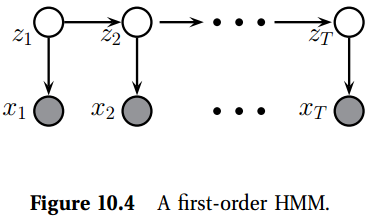

[toc]

# 10 Directed graphical models (Bayes nets)

## 10.1 Introduction

> 我基本上知道用简单的方式处理复杂系统的两个原则: 第一个是模块化的原则，第二个是抽象的原则。我是机器学习中的计算概率的辩护者，因为我相信概率论以深刻而有趣的方式(即通过分解(factorization)和平均(averaging))来实现这两个原则。在我看来，尽可能充分地利用这两种机制是机器学习的前进方向。  — Michael Jordan, 1997 (quoted in (Frey 1998)).

假设我们观测了多个相关变量，类似文本中的单词，图像中的像素，或是微数列中的基因。那我们怎么样可以紧凑的展示联合分布$p(\mathbf{x}\vert\boldsymbol{\theta})$呢？我们如何利用这个分布在合理的计算时间内推断出一组给定的变量？以及我们应该如何以一个合理数量的数据来学习分布的参数呢？这些问题是概率性建模、推理以及学习的核心，并组成了本章的核心。

## 10.1.1 Chain rule(链式规则)

通过概率的chain rule，我们总是可以将联合概率表示为如下，使用变量的任意顺序：
$$
p(x_{1:V}) = p(x_1)p(x_2\vert x_1)p(x_3\vert x_2, x_1)p(x_4\vert x_3, x_2, x_1)\cdots p(x_V \vert x_{1:V-1})        \tag{10.1}
$$
其中$V$是变量的数目，符号$1:V$表示集合$\{1, 2, \cdots, V\}$，且出于简化，我们丢弃了固定参数$\boldsymbol{\theta}$的条件。这个表达式的问题是随着$t$变大，表达条件分布$p(x_t\vert\mathbf{x}_{1:t-1})$将会变的越来越复杂。

例如，假设所有的变量有$K$个状态。我们可以将$p(x_1)$表示为一个有$O(K)$个数量的表，表示一个离散分布(实际上是由K-1个参数，因为加和为1的约束，但是我们假化为$O(K)$)。类似的，我们可以将$p(x_2\vert x_1)$表示为有$O(K^2)$个的表，写为$p(x_2=j\vert x_1=i)=T_{ij}$；我们说$T$是一个随机矩阵，因为其满足约束对于所有的行i有$\sum_j T_{ij}=1$，所有的元素$0\leq T_{ij} \leq 1$。类似的，我们可以将$p(x_3\vert x_1, x_2)$表示为一个有$O(K^3)$个数的表。这些可以称为**条件概率表(conditional probability table/CPTs)**。我们看到模型中有$O(K^V)$。我们需要大量的数据来学习这些参数。

一种解决方案是用更节省的条件概率分布或CPD(如多项式logistic回归)替换每个CPT，例如$p(x_t=k\vert \mathbf{x}_{1:t-1})=\mathcal{S}(\mathbf{W}_{t}\mathbf{x}_{1:t-1})_k$。参数的总数目现在只是$O(K^2V^2)$，使其为一个紧凑的密度模型。如果我们做的是计算一个完全观测向量$\mathbf{x}_{1:T}$的概率。例如，我们可以使这个模型来的定义一个类条件密度，$p(\mathbf{x}\vert y=c)$，然后做一个生成分类器。但是，由于每个变量都依赖于前面的所有变量，因此该模型不适用于其他类型的预测任务。所以我们需要另一种方法。

### 10.1.2 条件依赖(Conditional independence)

有效地表示大型联合分布的关键是对条件独立性(**CI**)做出一些假设。回忆2.2.4中，当且仅当条件联合可以写为条件边缘的一个乘积时，给定$Z$，$X,Y$是条件独立的，记为$X\perp Y\vert Z$，也就是
$$
X\perp Y\vert Z \Leftrightarrow p(X,Y\vert Z) = p(X\vert Z)p(Y\vert Z)  \tag{10.2}
$$
让我们看一下我是这个可能有用。假设，我们假设$x_{t+1}\perp \mathbf{x}_{1:t-1}\vert x_t$，或是“给定当前，未来是与过去的历史是独立不相关的”。这称为**一阶马科夫假设(first order Markov assumption)**。使用这个假设，加上链式规则，我们可以将联合分布写为如下
$$
p(\mathbf{x}_{1:V}) = p(x_1)\prod_{t=1}^V p(x_t\vert x_{t-1})       \tag{10.3}
$$
这个可以用状态的初始化分布$p(x_1=i)$，加上一个状态转移矩阵$p(x_t=j\vert x_{t-1}=i)$来描述。

### 10.1.3 图模型(Graphical models)

尽管一阶Markov假设对于在1维序列上定义分布是很有用的，但是我们如何定义2维图像、3维音频或是任意变量集合上的分布呢？这就是图形模型的用武之地。

**Graphical Model(GM)**是一种通过进行CI假设来表示联合分布的方法。具体而言，图中的节点表示随机变量，(缺少)边表示CI假设。(实际上，这些模型的更好称呼是“独立图(independence diagrams)”，但是术语“图形模型”已经根深蒂固。)有几种图形模型，取决于图形是有向图，无向图还是有向和无向图的某种组合。在本章中，我们仅研究有向图。我们将在第19章中考虑无向图。

### 10.1.4 图术语(Graph terminology)

继续之前，我们需要定义一些基本的术语。

一个图$G=\{\mathcal{V, E}\}$由nodes或是vertices的集合$\mathcal{V}=\{1, \cdots, V\}$，以及一个边的集合$\mathcal{E}=\{(s, t):s, t, \in\mathcal{V}\}$组成。我们可以用它的邻接矩阵来表示图，其中我们用$G(s,t)=1$来代表$(s,t)\in\mathcal{E}$，也就是如果边$s\rightarrow t$位于图中。如果当且仅当$G(s, t)=1$时$G(t,s)=1$，我们说图是无向的，要不然是有向的。我们通常假设$G(s,s)=0$，代表此处没有自环。

下面是我们将要使用的一些术语:
- **Parent** 对于一个有向图，结点的父母是指反馈至其的所有结点集合:$\text{pa}(s)\triangleq \{t:G(t,s)=1\}$

### 10.1.5 有向图模型(Directed graphical models)

一个**有向图或DGM**，是一个图为一个DAG的GM。这些更常用的名字是**贝叶斯网络(Bayesian networks)**。但是，贝叶斯网络本质上没有“贝叶斯”：它们只是定义概率分布的一种方式。这些模型称为**信念网络(belief network)**。术语"belief"指主观信念。再一次，关于DGM代表的概率分布的种类没有内在的主观性。最后，这些模型有时称为**因果网络(casual network)**，因为有向箭头有时被解释为代表因果关系。但是，DGM没有内在的因果关系。(关于因果关系的DGM的讨论，请参见第26.6.1节。)由于这些原因，我们使用较为中性(但不太迷人)的DGM术语。

DAG的关键特性是可以对节点进行排序，以使父级先于子级。这称为拓扑排序，可以从任何DAG构造。给定这样的顺序，我们将**有序的马尔可夫属性(ordered Markov property)**定义为以下假设：节点仅取决于其直接父级，而不依赖于该顺序中的所有前任节点；也就是
$$
x_s\perp \mathbf{x}_{\text{pred}(s)\diagdown\text{pa}(s)}\vert \mathbf{x}_{\text{pa}(s)}        \tag{10.4}
$$
其中$\text{pa}(s)$是节点$s$的父节点，$\text{pred}(s)$是顺序上节点$s$的前辈。这是一阶马尔科夫性质从链式到普通DAGs的一个自然推广。

> (a)将一个朴实贝叶斯分类器表示为一个DGM。假设存在$D=4$个特征。共享点是可观测的，未共享点是隐藏的。(b)$D = 4$特征的树增强朴素贝叶斯分类器。通常，树形拓扑可以根据$y$的值而变化。

例如，图10.1(a)中的DAG编码了如下联合分布，
$$
\begin{aligned}
    p(\mathbf{x}_{1:5}) &= p(x_1)p(x_2\vert x_1)p(x_3\vert x_1, \not{x_2})p(x_4\vert \not{x_1}, x_2, x_3)p(x_5\vert \not{x_1}, \not{x_2}, x_3, \not{x_4})       \\
    &= p(x_1)p(x_2\vert x_1)p(x_3 \vert x_1) p(x_4\vert x_2, x_3)p(x_5\vert x_3)
\end{aligned}
$$
总之，我们有
$$
p(\mathbf{v}_{1:V}\vert G) = \prod_{t=1}^V p(x_t\vert\mathbf{x}_{\text{pa}(t)})     \tag{10.7}
$$
其中每项$p(x_t\vert\mathbf{x}_{\text{pa}(t)})$是一个CPD。我们将分布写为$p(\mathbf{x}\vert G)$来强调，仅当DAG中编码的CI假设$G$正确时，此方程式才成立。然而，我们通常出于简化将这个显式的将这个条件丢弃。如果每个点有$O(F)$个父类与$K$个状态，模型中的参数个数是$O(VF^K)$.

## 10.2 Examples

### 10.2.1 朴素贝叶斯分类器(Naive Bayes classifiers)

在3.5节中，我们介绍了朴素贝叶斯分类器。假设给定类标签特征是条件独立的。这个解释在图10.2(a)中给出了解释。这允许我们将联合分布写为如下形式：
$$
p(y\vert\mathbf{x}) = p(y)\prod_{j=1}^{D}p(x_i\vert y)  \tag{10.8}
$$
朴素贝叶斯假设过去朴素，因为其假设特征是条件独立的。捕获特征之间相似性的一种方法是使用一个图模型。尤其，如果模型时一棵树，方法称为一个**tree-augmented naive Bayes classifier**模型。在图10.2(b)中进行了解释。使用树的理由与使用一个泛型图的理由相反，因为其是two-fold。首先，使用Chow-Liu算法是很容易找到 最优树结构的，在26.3节中会解释。其次，很容易处理一个树结构模型中的缺失特征，在20.2节中进行了解释。

### 10.2.2 Markov and hidden Markov models

图10.3(a)中将一个一阶马尔科夫模型解释一个DAG。当然，假设历史$x_{t-1}$捕获了我们知道的关于整个历史的所有信息$\mathbf{x}_{1:t-2}$，这个假设是过于强的假设。我们可以稍微放松一下，添加有点从$x_{t-2}$到$x_{t}$的依赖；这称为二阶马尔科夫链，在图10.3(b)中有所解释。对于的联合分布为如下
$$
p(\mathbf{x}_{1:T}) = p(x_1, x_2)p(x_3\vert x_1, x_2)p(x_4\vert x_2, x_3) \cdots = p(x_1, x_2)\prod_{t=3}^T p(x_t\vert x_{t-1}, x_{t-2})        \tag{10.9}
$$
我们可以以类似的方式创建一个高阶马尔科夫模型。在17.2节中有关于Markov模型的详细讨论。

不幸的是，如果观测值之间有足够长的依赖，即使二阶马尔科夫假设也是不够的。我们无法构建更高阶的模型了，因为参数的数量会爆炸。**另一个方法是假设有一个潜在的隐过程**，可以被建模为一个一阶马尔科夫链，但是数据是该过程的噪声观测。这个结果称为一个**隐马尔科夫模型/HMM(hidden markov model)**，在图10.4中进行了解释。这里$z_t$称为一个在"时刻"$t$的**隐变量**，$x_t$是观测变量。(我们将"时间"用引号引起来，因为这些模型可以应用于任何种类的**序列数(sequential data)**，例如基因组学或语言，其中$t$代表位置而不是时间)。$\text{CPD}-p(z_t\vert z_{t-1})$是**转移模型/transition model**，CPD $p(\mathbf{x}_t\vert z_t)$是**观测模型/observation model**。

<!-- $h_0$ | $h_1$ | $h_2$  -->

隐变量通常表示感兴趣的量，例如某人当前正在说的单词的标识。观测变量时可测量的，例如声波波形。我们期望做的是估计给定数据的隐状态，也就是计算$p(z_t\vert\mathbf{x}_{1:t}, \boldsymbol{\theta})$。称为**状态估计/state estimation**，是另一种形式的**概率推断/probabilistic inference**。

### 10.2.3 Medical diagnosis

### 10.2.5 Directed Gaussian graphical models *

考虑一个DGM，其中所有的变量时实值的，所有的PCDs有如下形式：
$$
p(x_t\vert \mathbf{x}_{\text{pa}(t)}) = \mathcal{N}(x_t\vert \mu_t + \mathbf{w}_t^T \mathbf{x}_{\text{pa}(t)}, \sigma^2_t)  \tag{10.14}
$$
这个称为一个**线性高斯**CPD。正如我们如下显示的，将所有这样的CPDs相乘得到的是一个很大的联合高斯分布，形式为$p(\mathbf{x})=\mathcal{N}(\mathbf{x}\vert \boldsymbol{\mu}, \mathbf{\Sigma})$，称为一个有向GGM，或是一个**高斯贝叶斯网络/Gaussian Bayes net**。

我们现在解释如何从CPD参数推导出$\boldsymbol{\mu}$与$\mathbf{\Sigma}$。出于方便，我们将重写CPDs重写为如下形式：
$$
x_t = \mu_t + \sum_{s\in\text{pa}(t)} w_{ts}(x_s-\mu_s) + \sigma_t z_t  \tag{10.15}
$$
其中$z_t\sim \mathcal{N}(0, 1)$，$\sigma_t$是给定其父母后$x_t$的条件标准差，$w_{ts}$是$s\rightarrow t$边的强度，$\mu_t$是局部均值。

很容易看到全局均值是局部均值$\boldsymbol{\mu}=(\mu_1, \cdots, \mu_D)$的串联(concatentation)。我现在推导全局协方差$\mathbf{\Sigma}$。令$\mathbf{\Sigma}\triangleq\text{diag}(\boldsymbol{\sigma)}$是一个包含标准差的对角阵。我们将方程10.15重写为矩阵向量的形式：
$$
\mathbf{x}-\boldsymbol{\mu} = \mathbf{W}(\mathbf{x}-\boldsymbol{\mu})+\mathbf{Sz}   \tag{10.16}
$$
令$\mathbf{e}$是噪声向量
$$
\mathbf{e}\triangleq \mathbf{Sz}    \tag{10.17}
$$
我们可以重新安排为
$$
\mathbf{e} = \mathbf{(I-W)}(\mathbf{x}-\boldsymbol{\mu})    \tag{10.18}
$$

因为$\mathbf{W}$是一个下三角阵(因为在拓扑排序中，如果$t>s$有$w_{ts}=0$)，我们有$\mathbf{I-W}$是下三角阵，对角线上全是1。因此
$$
\begin{pmatrix}
    e_1 \\
    e_2 \\
    \vdots \\
    e_d
\end{pmatrix} = \begin{pmatrix}
    1 & \\
    -w_{21} & 1 \\
    -w_{32} & -w_{31} & 1 \\
    \vdots & \vdots & \vdots & \ddots & \\
    -w_{d1} & -w_{d2} & \cdots & -w_{d, d-1} & 1
\end{pmatrix} \begin{pmatrix}
    x_1 - \mu_1 \\
    x_2 - \mu_2 \\
    \vdots \\
    x_2-\mu_d 
\end{pmatrix}       \tag{10.19}
$$
因为$\mathbf{I-W}$总是可逆的，我们可以写为
$$
\mathbf{x}-\boldsymbol{\mu} = (\mathbf{I-W})^{-1} \mathbf{e} \triangleq \mathbf{Ue} = \mathbf{USz}      \tag{10.20}
$$
其中我们定义$\mathbf{U}=\mathbf{(I-W)}^{-1}$。那么，回归权重对应一个$\mathbf{\Sigma}$的Cholesky分解，
$$
\begin{aligned}
    \mathbf{\Sigma} &= \text{cov}[\mathbf{x}] = \text{cov}[\mathbf{x}-\boldsymbol{\mu}] \\
    &= \text{cov}[\mathbf{USz}] = \mathbf{Us}\text{cov}[\mathbf{z}] \mathbf{SU}^T = \mathbf{US}^2\mathbf{U}^T
\end{aligned}
$$

## 10.3 推理(Inference)

图模型提供了一种紧凑的方式来定义联合概率分布。给定一个联合分布，我们可以做什么呢？对于这样一个联合分布主要使用是执行**概率推断**。这个称为从已知量(known quantities)来估计未知量(unknown quantities)的任务。例如，在10.2.2节，我们介绍了HMMs，目标之一是从观测(如语音信号)来估计隐状态(也就是单词)。在第10.2.4节中，我们讨论了遗传联系分析，并说目标之一是估计在各种DAG下数据的似然，其中不同的致病基因位置的假设对应不同的DAG。

通常，我们可以提出如下推断问题。假设我们有一个联合分布(joint distribution)为$p(\mathbf{x}_{1:V}\vert\boldsymbol{\theta})$的相关随机变量的集合。在本节中，我假设模型参数$\boldsymbol{\theta}$是已知的。我们讨论如何学习参数。我们将向量分割为**可见变量($\mathbf{x}_{v}$)**(这是可观测的)与**隐变量$\mathbf{x}_h$**(这是不可观测的)。推理是指在给定已知参数的情况下计算未知参数的后验分布：
$$
p(\mathbf{x}_h\vert\mathbf{x}_v,\boldsymbol{\theta}) = \frac{p(\mathbf{x}_h, \mathbf{x}_v\vert\boldsymbol{\theta})}{p(\mathbf{x}_v\vert\boldsymbol{\theta})} = \frac{p(\mathbf{x}_h, \mathbf{x}_v\vert\boldsymbol{\theta})}{\sum_{\mathbf{x}^{\prime}_{h}}p(\mathbf{x}_h^{\prime}, \mathbf{x}_v\vert\boldsymbol{\theta})}   \tag{10.23}
$$
本质上，我们通过将可见变量限制为其观测值$\mathbf{x}_v$来对数据进行调节，然后归一化，即从$p(\mathbf{x}_h,\mathbf{x}_v)$到$p(\mathbf{x}_h\vert\mathbf{x}_v)$。归一化常数$p(\mathbf{x}_v\vert\boldsymbol{\theta})$是数据的似然，也称为**证据的概率/probability of the evidence**。

有时，我们只对一些隐变量感兴趣。所以我们将隐变量分割为**查询变量$\mathbf{x}_q$**，其值是我们希望知道的；以及剩余的**多余变量$\mathbf{x}_n$**，这是我们不感兴趣的。我们可以通过边缘累赘的变量来计算我们感兴趣的变量：
$$
p(\mathbf{x}_q\vert\mathbf{x}_v,\boldsymbol{\theta}) = \sum_{\mathbf{x}_n}p(\mathbf{x}_q,\mathbf{x}_n\vert\boldsymbol{\theta})  \tag{10.24}
$$
在4.3.1节中，我们看到了如何以$O(V^3)$的时间来为一个多元高斯执行所有的这些运算，其中$V$是变量的数目。如果我们有离散的随机变量，每个变量都有K个状态，该怎么办？如果将联合分布表示为多维表，则我们始终可以精确地执行这些操作，但这将花费$O(KV)$时间。在20章，我们将说明如何在$O(VK^{w+1})$利用GM编码的因式分解来执行这些操作，其中$w$是称为图的树宽的量。该量测量了图多像树。如果图是一棵树，我们有$w=1$，所以对于这些模型，推理的时间是线性关于结点数量的。

<!-- ## 10.4 学习(Learning) -->

在图模型文献中，通常会区分推理(inference)与学习(learning)。推理意味着计算$p(\mathbf{x}_h\vert\mathbf{x}_v, \boldsymbol{\theta})$，其中$v$是可见节点，$h$是隐节点，$\boldsymbol{\theta}$是模型的参数，假设参数是已知的。学习通常意味着计算给定数据后参数的MAP估计:
$$
\hat{\boldsymbol{\theta}} = \argmax_{\boldsymbol{\theta}} \sum_{i=1}^N\log p(\mathbf{x}_{i,v}\vert\boldsymbol{\theta}) + \log p(\boldsymbol{\theta})    \tag{10.25}
$$
其中$\mathbf{x}_{i,v}$是在情况$i$下的可见变量。如果我们有一个均匀先验$p(\boldsymbol{\theta})\propto 1$，像往常一样，这个问题会降级为一个MLE。

如果我们采用一个贝叶斯观点，参数属于未知变量，应该是被推理的。那么对于一个贝叶斯，推理与学习是没有区别的。事实上，我们可以只是在图中将参数作为结点添加进去，条件为$\mathcal{D}$，然后推断所有节点的值(我们将在下面对此进行更详细的讨论。)

在这种观点中，隐藏变量和参数之间的主要区别在于，隐藏变量的数量随着训练数据量的增加而增加(因为每个观察到的数据情况通常有一组隐藏变量)，而参数的数量通常是固定的(至少在参数模型中)。这意味着我们必须整合出隐藏的变量，以避免过拟合，但我们可以摆脱参数的点估计技术，这是数量较少。

### 10.4.1 Plate notation

当从数据推理参数时，我们通常假设数据是独立同分布的，我可以使用一个图模型来清晰的表示这些假设， 如图10.7(a)。