[toc]

# Chap11 混合模型与EM算法(Mixtures Models and EM algorithms)

## 11.1 隐变量模型(Laten variable model)

10章中，我们解释了如果使用图模型来的定义高维度的联合概率分布。基本思想是在图中添加一条边来建模两个变量之间的相关性。

另一种方法是假设观测变量之间是相关的，因为它们来自一个隐藏的共同“原因”。建模隐变量的模型称为**隐变量模型或LVMs**。正如我们本章中看到的，这种模型比没有隐变量的模型更难拟合。然而，这种模型有两个优势。第一个是LVMs通常比在直接在可见空间内表达相关性的模型含有更少的参数。如果图11.1所示。如果所有节点是二进制的，所有CPD是表格形式，则左侧的模型有17个参数，而右侧模型含有59个自由参数。

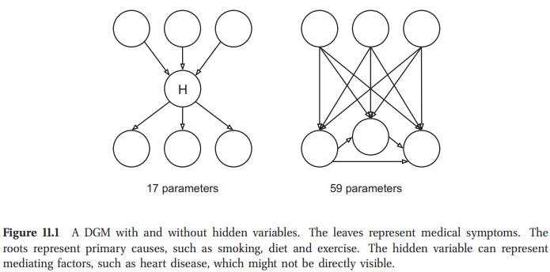

第二，LVM中的**隐变量**为可以作为一个**bottleneck**，计算数据的压缩形式。**这组成了无监督学习的基础**。图11.2解释一些泛型的LVM结构，可以用于这个目的。一般有$L$个隐变量$z_{i1},\cdots,z_{iL}$，$D$个可见变量$x_{i1},\cdots,x_{iD}$，通常$D \gggtr L$。如果我们有$L\gt 1$，这里有**许多隐因子贡献于每个观测**，所以存在多对多的映射。如果$L = 1$，我们只有一个隐变量；这种情况下，通常$z_{i}$是离散的，我们有一对多的映射。也可以有多对一的映射，代表**每个观测变量有不同的竞争因子或起因**；这种模型组成了**概率矩阵分解**的基础，如在27.6.2节锁讨论的。最终，我们有一个1对1的映射，可以表示为$\mathbf{z}_i\rightarrow\mathbf{x}_i$。通过允许$\mathbf{z}_i$及/或$\mathbf{x}_i$是向量值，这个表示可以包含其他表示。依赖于似然$p(\mathbf{x}_i|\mathbf{z}_i)$以及先验$p(\mathbf{z}_i)$的形式，我们可以产生大量不同的模型。
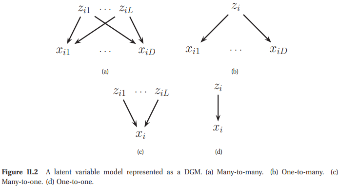
> 一个表示为DGM的隐变量模型。(a)多对多; (b)一对多; (c)多对一; (d)一对一。

## 11.2 混合模型(Mixture models)

LVM最简单的形式是当$z_i\in\{1,\cdots K\}$，表示了一个离散隐状态。我们将为这个使用一个离散先验$p(z_i)=\text{Cat}(\boldsymbol{\pi})$。对于似然，我们使用$p(\mathbf{x}_i|z_i=k)=p_k(\mathbf{x}_{i})$，其中$p_k$是观察的第$k$个**基础分布**；这个可以是任何类型。总体模型是一个混合模型，因为我们将$K$个基础分布混合在一起如下：
$$
p(\mathbf{x}_i|\boldsymbol{\theta})=\sum_{i=1}^K\pi_{k}p_{k}(\mathbf{x}_{i}|\boldsymbol{\theta})    \tag{11.1}
$$
这是$p_k$的凸组合，我们取的是加权和，其中混合权重为$\pi_k$满足$0\leq\pi_k\leq1$且$\sum_{k=1}^{K}\pi_{k}=1$。我们给一些例子如下。

$p(\mathbf{x}_i\vert\mathbf{z}_i)$ | $p(\mathbf{z}_i)$ | Name | Section
-- | -- | -- | -- | --
MVN | Discrete | Mixture of Gaussians | 11.2.1
Prod. Discrete | Discrete | Mixture of multinomials | 11.2.2
Prod. Gaussian | Prod. Gaussian | Factor analysis/ probabilistic PCA | 12.1.5
Prod. Gaussian | Prod. Laplace | Probabilistic ICA/ sparse coding | 12.6
Prod. Discrete | Prod. Gaussian | Multinomial PCA | 27.2.3
Prod. Discrete | Dirichlet | Latent | Dirichlet allocation | 27.3
Prod. Noisy-OR | Prod. Bernoulli | BN20/ QMR | 10.2.3
Prod. Bernoulli | Prod. Bernoulli | Sigmoid belief net | 27.7

### 11.2.1 高斯混合(Mixtures of Guassians)

使用最广泛的模型是**高斯混合**(mixture of Gaussians-MOG)，也称为高斯混合模型(GMM)。此模型中，混合中的每个基分布是一个均值为$\boldsymbol{\mu}_k$协方差矩阵为$\boldsymbol{\Sigma}_k$的多元高斯。模型的形式为
$$
p(\mathbf{x}_i|\boldsymbol{\theta}) = \sum_{k=1}^{K}\pi_k \mathcal{N}(\mathbf{x}_i|\boldsymbol{\mu}_k, \boldsymbol{\Sigma}_k)     \tag{11.2}
$$
图11.3显示了2维空间中3个高斯模型的混合。每个混合成分由一个椭圆等高线的不同集合。**给定一个充分大数量的混合成分，一个GMM可以用来近似定义在$\mathbb{R}^D$上的任意密度。**

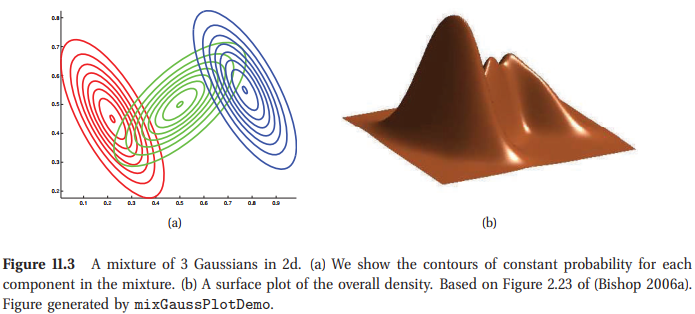
> 二维数据中的高斯混合模型，(a)我们现实了混合中每个成分的常概率的等高线。(b)总体密度的平面图。

### 11.2.2 多努利(multinoullis)的混合

我们可以使用混合模型来定义许多类型数据的密度模型。例如，假设数据由$D$维位向量(bit vectors)组成。这种情况下，近似类条件密度是一个Bernoullis的积
$$
p(\mathbf{x}_i|z_i=k,\boldsymbol{\theta}) =\prod_{j=1}^{D} \text{Ber}(x_{ij}|\mu_{jk}) = \prod_{j=1}^{D}\mu_{jk}^{x_{ij}}(1-\mu_{jk})^{1-x_{ij}}        \tag{11.3}
$$
其中$\mu_{jk}$是位$j$在聚类$k$上开启的概率。

隐变量没有任何意义，为了使模型功能更强，我们会简单的引入隐变量。例如，可以证明混合模型的均值与方差给定为
$$
\begin{aligned}
    \mathbb{E}[\mathbf{x}] &= \sum_k\pi_k\boldsymbol{\mu}_k \\
    \text{cov}[\mathbf{x}] &=\sum_{k}\pi_{k}[\mathbf{\Sigma}_k + \boldsymbol{\mu}_k\boldsymbol{\mu}_k^T]-\mathbb{E}[\mathbf{x}]\mathbb{E}[\mathbf{x}]^T
\end{aligned}     \tag{11.4-11.5}
$$
其中$\mathbf{\Sigma}_k=\text{diag}(\mu_{jk}(1-\mu_{jk}))$。所以尽管成分分布是被因子分解的，但联合分布不是。那么**混合分布可以捕获变量之间的相关性**，不像单个伯努利积模型(a single product-of-Bernoullis model)。

### 11.2.3 使用混合模型进行聚类(Using mixture models for clustering)

混合模型主要有两个应用。第一个是将其作为**黑盒密度模型(black-box density model)**$，p(\mathbf{x}_i)$。这个模型对于很多任务都是非常有用的，例如**数据压缩(data compression)，异常值检测(outlier detecttion)，创建生成分类器(creating generative classifiers)**，其中我们通过一个混合密度建模每个类条件密度$p(\mathbf{x}|y=c)$。

混合模型的第二个且更常用的应用是将其用于**聚类**。我们将在第25章中讨论这个话题，但是基本思想很简单。我们首先拟合混合模型，然后计算$p(z_i=k|\mathbf{x}_i,\boldsymbol{\theta})$，这代表了点$i$属于聚类$k$的后验概率。这称为聚类$k$对点$i$的**责任(responsibility)**，可以使用**贝叶斯准则(Bayes rule)** 来计算
$$
r_{ik}\triangleq p(z_i=k|\mathbf{x}_i,\boldsymbol{\theta})=\frac{p(z_i=k|\boldsymbol{\theta})p(\mathbf{x}_i|z_i=k,\boldsymbol{\theta})}{\sum_{k^{\prime}=1}^{N}p(z_i=k^{\prime}|\boldsymbol{\theta})p(\mathbf{x}_i|z_i=k^{\prime},\boldsymbol{\theta})}
\tag{11.6}
$$
这个过程是 **软聚类/soft clustering**，与使用生成分类器时执行的计算相同。两种模型的差异仅在训练时出现:在混合情况中，我们永远观测不到$z_i$，然而一个生成分类器，我们是可以观测到$y_{i}$的(扮演了$z_i$的角色)。

我们可以用$1-\max_k r_{ik}$代表聚类分配中的不确定量。假设这个很小，使用MAP估计来计算一个**硬聚类**是合理的，给定为
$$
z_i^*=\argmax_{k}r_{ik}=\argmax_{k}\log p(\mathbf{x}_i|z_i=k,\boldsymbol{\theta}) + \log p(\mathbf{z}_i=k|\boldsymbol{\theta}) \tag{11.7}
$$
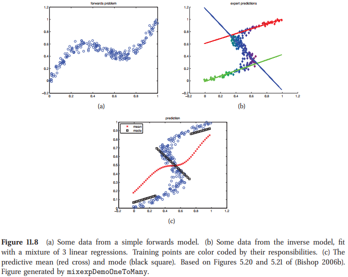
图1.8中解释了一个使用GMM的硬聚类，其中我们代表了人们身高体重的聚类。颜色代表硬赋予。注意到，所使用的标签(颜色)的标识无关紧要；我们可以自由的重命名所有的集群，而不会影响数据的分区；这称为**标签切换/label switching**。

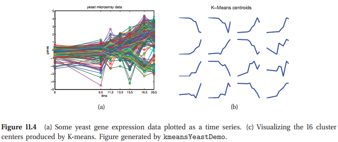

另一个例子如图11.4。这里数据向量$\mathbf{x}_{i}\in\mathbb{R}^7$代表不同基因在不同时间点的表达水平。我们使用一个GMM来进行聚类。我们看到几种不同类型的基因，例如那些表达水平随时间单调上升的以及那些表达水平随时间单调下降的，以及那些具有更复杂表达水平的基因。我们将序列聚类为16种。例如，我们可以用**原型/prototype**或**质心/centroid**来表示每个簇。如图11.4(b)所示。

这里从之前聚类的问题看出，我们首先是给出了若干幅手写数字图片，希望系统最终能够使得0-9分为十类，但是从上图我们看出有很多误分类的情况，比如有有两个9被分到了不同的类别中，以及1和0也是一样的情况，所以这个聚类的效果并不是很好。产生这样的误分类的主要原因有如下几种：

- 该模型非常简单，没有捕捉到数字的相关视觉特征。例如，每个像素都是独立处理的，没有形状或笔触的概念。
- 因为手写字体有很多的书写习惯，所以可能我们需要更多的类别，K可能要很大，但是很大的K又不能将这些看上去有些区别但是实际是一个数字的字体分到一起，这样就达不到我们的目的，所以其实很难做。（这么看，这个方法做手写识别还是太不靠谱了）
- 似然函数是非凸的，可能收敛不到全局最优解。

### 11.2.4 专家混合(Mixture of experts)
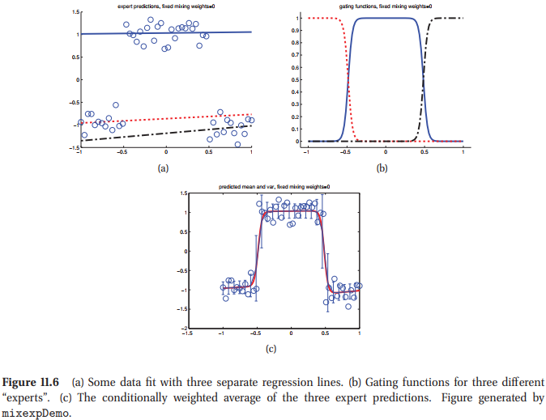
> (a)拟合三个不同回归线的一些数据;(b)三个不同"专家"的门控函数;(c)三个专家预测的条件权重的平均。

在14.7.3节中，我们讲述了如何在**生成分类器**的背景下使用混合模型。我们也可以使用它们来创建用于分类与回归的**判别模型**。例如，考虑图11.6(a)中的数据。因为它们看起来像3个不同的线性回归，每个使用一个不同的输入空间。我们通过允许用混合权重可以建模该模型，且**混合密度是输入相关的**：
$$
\begin{aligned}
    p(y_i|\mathbf{x}_i,z_i=k,\boldsymbol{\theta})&=\mathcal{N}(y_i|\mathbf{w}^T_k\mathbf{x}_i,\sigma^2) \\
    p(z_i|\mathbf{x}_i,\boldsymbol{\theta}) &= \text{Cat}(z_i|\mathcal{S}(\mathbf{V}^T\mathbf{x}_i)) 
\end{aligned} \tag{11.8-9} 
$$
看图11.7(a)的DGM。

这个模型称为**专家混合(mixture of experts)**或MoE。思想是每个子模型可以被认为是输入空间内一个特定区域的"专家"。函数$p(z_{i}=k|\mathbf{x}_i,\boldsymbol{\theta})$称为一个**门控函数/gating function**，决定使用哪个专家，这依赖于输入值。例如，图11.6(b)显示了如何"刻画"一维输入空间，图11.6(a)显示了每个专家的单独预测(这种情况下，专家只是线性回归模型)，图11.6(c)显示了模型的总体预测
$$
p(y_i|\mathbf{x}_i,\boldsymbol{\theta})=\sum_{k}p(z_i=k|\mathbf{x}_i,\boldsymbol{\theta})p(y_i|\mathbf{x}_i,z_i=k,\boldsymbol{\theta})  \tag{11.10}
$$
我们将在11.4.3节中讨论如何拟合这个模型。

需要清楚的是，我们可以为专家插入任何模型。例如，我们可以使用**神经网络**来表示门控函数以及专家。得到模型称为个**混合密度网络/mixed density model**。这样的模型训练起来更慢，但是比混合专家更加灵活。

也可以让每个专家成为专家的混合。这得到一个模型，称为**专家的层次混合**。图11.7(b)是一个DGM，16.2.6节中将会进一步讨论。

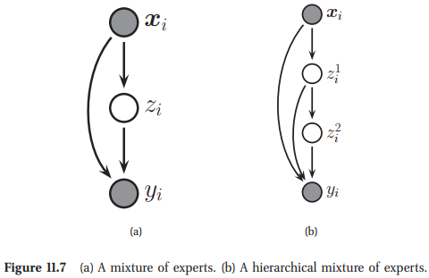

#### 11.2.4.1 用于反问题(Application to inverse problem)

混合专家模型在求解**逆问题**时很有效。这些问题是我们必须要反转多对一映射时的问题。一个典型的例子是在机器人中，其中终端影响器$\mathbf{y}$的定位是由motor$\mathbf{x}$的联合角度唯一确定的。然而，对于任意给定的位置$\mathbf{y}$，存在许多联合$\mathbf{x}$的设定可以产生这个。那么逆映射$\mathbf{x}=f^{-1}(\mathbf{y})$不是唯一的。另一个例子是从视频中对人进行运动学跟踪（Bo等人，2008），由于自遮挡等原因，从图像外观到姿势的映射不是唯一的。

## 11.3 混合模型的参数估计(Parameter estimation of mixture models)

我们已经看到给定观测值后如何计算在隐变量的后验，但是假设参数为已知的。本节中，我们讨论如何学习参数。

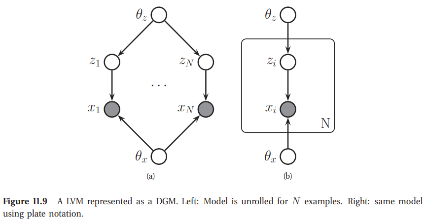

在10.4.2节中，我们显示了当我们有完全数据以及一个因子分解的先验，那么参数之上的后验也是可因子分解的，使计算更简单。不幸的是，如果我们有**隐变量/缺失值**，这就不再成立了。可以从图11.9中看到原因。如果$z_i$是可以观测到的，通过d-分割，我们看到$\boldsymbol{\theta}_z \perp \boldsymbol{z}_x | \mathcal{D}$，因此后验是可因子化的。但是在因为一个LVM中，$z_i$是隐藏的，参数不再是独立的，且后验不再可因子分解的，使得计算更难。这也使得MAP与ML估计更加复杂化。

### 11.3.1 不可识别性(Unidentifiablity)

对于LVM，计算$p(\boldsymbol{\theta}|\mathcal{D})$的主要问题是后验可能有多模式。为了看一下为什么，考虑一个GMM。如果$z_i$是全部可以观测到的，参数会有一个单模态的后验
$$
p(\boldsymbol{\theta}|\mathcal{D}) = \text{Dir}(\boldsymbol{\pi}\vert\mathcal{D})\prod_{k=1}^{K}\text{NIW}(\boldsymbol{\mu}_k, \mathbf{\Sigma}_k|\mathcal{D})    \tag{11.11}
$$
因此，我们可以轻易的找到全局最优MAP估计(因此为全局最优MLE)。

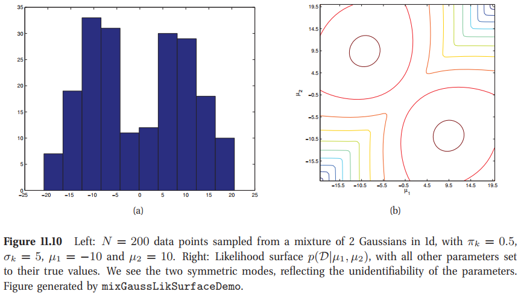

但是，现在假设$z_i$是隐藏的。这种情况下，对每个可能的“填充”$z_i$的方式，我们得到一个不同的单模态似然。然后，当我们在$z_i$上边缘化时，我们得到$p(\boldsymbol{\theta}|\mathcal{D})$的多模态后验。这些模型对应于聚类的不同标签。解释如图11.10(b)，我们画出了$K=2$的2维GMM的似然函数$p(\mathcal{D}|\mu_1,\mu_2)$，数据如图11.10(a)中所显示。我们看到有双峰，一个对应$\mu_1=-10,\mu_2=10$的情况，另一个对应$\mu_1=10,\mu_2=-10$的情况。我们说参数是**不可识别**，因为这里没有一个唯一的MLE。因此，这里没有一个唯一的MAP估计，因此后验必定是多模态的。在参数后验中有多少模态的问题是一个很难回答的问题。有$K!$个可能的标签，但是一些峰值可能是可以合并的。尽管如此，这里也有一个指数，**因此为GMM寻找一个最优MLE是一个NP-hard问题**。

不可识别性会引起Beyasian推理的一个问题。例如，假设我们从后验$\boldsymbol{\theta}^{(s)}\sim p(\mathbf{\theta}|\mathcal{D})$做一些采样，然后取平均值，并尝试近似后验均值$\bar{\boldsymbol{\theta}}=\frac{1}{S}\sum_{s=1}^{S}\boldsymbol{\theta}^{(s)}$(这种类型的蒙特卡洛方法在第24章中会详细解释)。如果采样来自不同的modes，平均是没有意义的。然而，注意到平均后验的预测分布$p(\mathbf{x})\approx \frac{1}{S}\sum_{s=1}^{S}p(\mathbf{x}|\boldsymbol{\theta}^{(s)})$是合理的，因为似然函数对参数来自哪个模态是不变的。

针对不可识别模型已经提出大量的解。这些解依赖于模型的细节，以及使用的推断算法。例如，使用MCMC处理混合模型中的不可识别性。

我们本章采用的方法将会更简单：我们只计算单个局部模型，也就是我们执行**近似MAP估计**。(我们说“近似”是因为寻找一个全局最优MLE，因此至少对混合模型，MAP估计是NP-hard问题)。这是目前为止最常用的方法，因为它简单。这也是一个合理的近似，至少如果采样规模足够大。为了看一下为什么考虑图11.9(a)。我们看到有$N$个潜在变量，每个变量都“看到”一个数据点。但是，只有两个潜在参数，每个参数都可以看到N个数据点。因此参数的后验不确定度通常比潜在变量的后验不确定度小得多。这解释了计算$p(z_i|\mathbf{x}_i,\hat{\boldsymbol{\theta}})$常用策略的合理性，但是给计算$p(\boldsymbol{\theta}|\mathcal{D})$带来了困扰。在5.6节中，我们将研究层次贝叶斯模型，本质上是将结构位于参数之上。在这种模型中，对于建模$p(\boldsymbol{\theta})|\mathcal{D}$是很重要的，因此蚕食可以在它们之间发送信息。如果我们使用点估计，这将是不可能的。

### 11.3.2 计算一个非凸MAP估计(Computing a MAP estimate is non-convex)

在前面的部分中，我们颇有启发性地认为，似然函数具有多种模式，因此很难找到MAP或ML估计。在本节中，我们将通过更多的代数方式显示此结果，从而使你对该问题有更多的了解。我们的描述是部分基于(Rennie2004)。

考虑一个LVM的对数似然
$$
\log p(\mathcal{D}|\boldsymbol{\theta})=\sum_{i}\log \left[\sum_{\mathbf{z}_i}p(\mathbf{x}_i,\mathbf{z}_i\vert\boldsymbol{\theta})\right]       \tag{11.12}
$$
不幸的是，这个目标函数很难最大化。因为我们无法将对数推入总和内。这排除了某些代数简化，但并不能证明问题很难解决。

选择假设联合概率分布为$p(\mathbf{z}_i,\mathbf{x}_i|\boldsymbol{\theta})$是一个指数家族，意味着可以写为如下形式
$$
p(\mathbf{z},\mathbf{x}|\boldsymbol{\theta}) = \frac{1}{Z(\boldsymbol{\theta})}\exp\left[\boldsymbol{\theta}^T\boldsymbol{\phi}(\mathbf{x},\mathbf{z})\right]       \tag{11.13}
$$
其中$\boldsymbol{\phi}(\mathbf{z},\mathbf{x})$是充分统计，且$Z(\boldsymbol{\theta})$是归一化常数。可以证明(练习9.2)，MVN属于指数族，到目前为止我们遇到的几乎所有分布都包括指数分布，包括Dirichlet，多项式，Gamma，Wishart等。进一步的，混合指数家族也属于指数家族。提供了可以观测的混合指示变量。

有了这些假设。**完全数据的对数似然**可以表达为如下
$$
\ell_c(\boldsymbol{\theta}) = \sum_i\log p(\mathbf{x}_i,\mathbf{z}_i|\boldsymbol{\theta}) = \boldsymbol{\theta}^T\left(\sum_i\phi(\mathbf{x}_i,\mathbf{z}_i)  \right)-NZ(\boldsymbol{\theta})       \tag{11.14}
$$
第一项是关于$\mathbf{\theta}$线性的。可以证明$Z(\boldsymbol{\theta})$是一个凸函数，因此总体目标函数是凸的，有唯一的最大值。

选择考虑当我们有丢失数据时会发什么。观测数据的对数似然为
$$
\ell_c(\boldsymbol{\theta}) = \sum_i\log p(\mathbf{x}_i,\mathbf{z}_i|\boldsymbol{\theta}) = \sum_i\log \left[ \sum_{\mathbf{z}_i}e^{\boldsymbol{\theta}^T\boldsymbol{\phi}(\mathbf{z}_i,\mathbf{x}_i)} \right] - NZ(\boldsymbol{\theta}) \tag{11.15}
$$
可以证明指数和对数函数是凸的，且我们知道$Z(\boldsymbol{\theta})$是凸的。然而，**一般情况下两个凸函数相减不是凸的**。所以目标函数既不是凸的也不是凹的，有局部最优。

非凸函数的缺点是通常很难找到它们的全局最优解。大多数优化函数只寻找局部最优点；它们寻找到哪个局部最优点依赖于它们起始在哪里。这里有一些算法，例如模拟退火或是基因算法，宣称可以寻找到全局最优解，但是这只是在一些不切实际的假设之下(例如，如果允许它们“无限缓慢地”冷却， 或允许运行“无限长”)。实际中，我们将运行一个局部优化器，可能是使用**多随机初始值**来提升寻找到更好的局部最优解。当然，仔细小心的初始化也是有很多帮助的。

已经提出一个拟合高斯混合模型的凸方法。**思想是给每个数据点赋予一个聚类**，然后使用一个$\ell_1$类型的惩罚项来从中选择，而不是尝试使用优化聚类中心的位置。这本质上是一个在稀疏核logistics回归中使用的非监督版本的方法，我们将在14.3.2节中讨论。然而，注意到，$\ell_1$类型的惩罚项尽管是凸的，但不一定是最好的提升稀疏性的方法，将在13章中讨论。事实上，我们将看到，一些最好的提升稀疏性的方法是使用非凸方法，并使用EM方法来优化它们。这个故事的寓意是：**不要惧怕非凸性**。

## 11.4 EM算法(EM algorithm)

对于机器学习与统计学中的许多模型，当我们可以观测到所有相关随机变量的值时，也就是我们有完全数据，计算ML与MAP参数估计是很好实现的。如果我们丢失部分数据且/或有隐变量，那么计算ML/MAP估计变得很难。

其中一种方法是使用一个泛型的基于梯度的优化器来寻找**NegativeLogLikelihood-NLL**的局部最小值，给定为
$$
\text{NLL}(\boldsymbol{\theta}) \triangleq -\frac{1}{N}p(\mathcal{D}|\boldsymbol{\theta})       \tag{11.16}
$$
然而，我们通常需要强加一些约束条件，例如协方差矩阵必须是正定的，混合权重之和必须为一等等，这些都是很有技巧的。在这种情况下，通常一个更简单的方法是使用一种称为**期望最大化-ExpectationMaximization(EM)**。这是一种简单地迭代算法，通常在每步是闭形更新的。更进一步，算法自动强迫需要的约束。

EM利用以下事实:如果完全观察到数据，则ML/MAP估计将易于计算。尤其EM是一个迭代算法，在E/M步之间切换，E步在给定参数下推断缺失值，然后M步给定填充的数据来进行参数优化。我们给出的细节如下，跟随几个例子。我们将一个更加理论的讨论结束，将算法放在一个更大的背景下。

### 11.4.1 基本思想(Basic idea)

令$\mathbf{x}_i$是情况$i$下可见的或是可观测的变量，令$\mathbf{z}_i$是隐变量或是缺失值。目标是**最大化观测数据**的最大似然函数
$$
\ell(\boldsymbol{\theta}) = \sum_{i=1}^{N}\log p(\mathbf{x}_i|\boldsymbol{\theta})=\sum_{i=1}^{N}\log\left[\sum_{\mathbf{z}_i}p(\mathbf{x}_i,\mathbf{z}_i|\boldsymbol{\theta})\right]   \tag{11.17}
$$
不幸的是，这个是很难优化的，因为对数不能插入到和之中。

EM解决方法如下。定义完全数据对数似然为
$$
\ell(\boldsymbol{\theta}) \triangleq \sum_{i=1}^{N}\log p(\mathbf{x}_i,\mathbf{z}_i\vert\boldsymbol{\theta})
\tag{11.18}
$$
这个是无法计算的，因为$\mathbf{z}_i$是未知的。因此我们来定义**期望补全数据**的对数似然函数为
$$
Q(\boldsymbol{\theta},\boldsymbol{\theta}^{t-1}) = \mathbb{E}\left[\ell_c(\boldsymbol{\theta})|\mathcal{D},\boldsymbol{\theta}^{t-1}\right] \tag{11.19}
$$
其中$t$是当前迭代数。$Q$称为辅助函数。期望是相对旧的参数$\boldsymbol{\theta}^{t-1}$来计算的，观测数据为$\mathcal{D}$。**E步**的目标是计算$Q(\boldsymbol{\theta},\boldsymbol{\theta}^{t-1})$，或更确切地说，计算MLE所依赖的项；这些已知为**期望充分统计(expected sufficient statistics/ESS)**。在**M步**，我们相对$\boldsymbol{\theta}$优化$Q$函数：
$$
\boldsymbol{\theta}^{t}=\argmax_{\boldsymbol{\theta}}Q(\boldsymbol{\theta},\boldsymbol{\theta}^{t-1})    \tag{11.20}
$$
为了执行MAP估计，我们修改如下M步：
$$
\boldsymbol{\theta}^{t}=\argmax_{\boldsymbol{\theta}}Q(\boldsymbol{\theta},\boldsymbol{\theta}^{t-1}) + \log p(\boldsymbol{\theta})   \tag{11.21}
$$
E步保持不变。

在11.4.7节中，我们证明EM算法单调增加观测数据的对数似然(如果做MAP估计，加上对数先验))，或是保持不变。所以，如果目标函数下降了，在代码或是数学公式中肯定有一个bug。

### 11.4.2 EM for GMMs

本节中，我们讨论如何使用EM来拟合一个高斯混合。拟合其他类型的混合模型，需要一个直接修改。我们假设混合成分$K$是已知的。

#### 11.4.2.1 辅助函数(Auxiliary function)

期望完全数据的对数似然给定为
$$
\begin{aligned}
    Q(\boldsymbol{\theta},\boldsymbol{\theta}^{(t-1)}) & \triangleq \mathbb{E}(\sum_i\log p(\mathbf{x}_i, z_i|\boldsymbol{\theta})) \\
    & = \sum_i\mathbb{E}\left[\log\left[\prod_{k=1}^{K} (\pi_{k}p(\mathbf{x}_i|\boldsymbol{\theta}_k) )^{\mathbb{I}(z_i=k)} \right] \right] \\
    & = \sum_i\sum_k\mathbb{E}[\mathbb{I}(z_i=k)]\log[\pi_{k}p(\mathbf{x}_i|\boldsymbol{\theta}_k)] \\
    & = \sum_i\sum_k p(z_i=k|\mathbf{x}_i,\boldsymbol{\theta}^{t-1})\log[\pi_{k}p(\mathbf{x}_i|\boldsymbol{\theta}_k)] \\
    &=\sum_i\sum_k r_{ik}\log\pi_k + \sum_i\sum_k r_{ik}\log p(\mathbf{x}_i|\boldsymbol{\theta}_k) \tag{11.22-11.26}
\end{aligned}
$$
其中$r_{ik}\triangleq p(z_i=k|\mathbf{x}_i,\boldsymbol{\theta}^{t-1})$是数据点$i$对聚类$k$的**责任(responsibility)**。这是在E步计算的，描述如下。

#### 11.4.2.2 E步(E step)

E步有如下简单形式，对于任何的混合模型都是一样的
$$
r_{ik} = \frac{\pi_k p(\mathbf{x}|\boldsymbol{\theta}^{(t-1)}_k)}{\sum_{k^{\prime}}\pi_{k^{\prime}} p(\mathbf{x}|\boldsymbol{\theta}^{(t-1)}_{k^{\prime}})}      \tag{11.27}
$$

#### 11.4.2.2 M步(M step)

在M步，我们计算$Q$相对$\boldsymbol{\pi}$与$\boldsymbol{\theta}_k$的值。对于$\boldsymbol{\pi}$，明显的有
$$
\pi_k = \frac{1}{N}\sum_i r_{ik}=\frac{r_{k}}{N} \tag{11.28}
$$
其中$r_{k}=\sum_i r_{ik}$是赋给聚类$k$的点的权重数。

为了得出$\boldsymbol{\mu}_k$与$\boldsymbol{\Sigma}_k$项的M步，我们寻找依赖于$\boldsymbol{\mu}_k$与$\boldsymbol{\Sigma}_k$的部分$Q$。我们看到结果是
$$
\begin{aligned}
    \ell(\boldsymbol{\mu}_k, \mathbf{\Sigma}_k) &= \sum_k\sum_i r_{ik}\log p(\mathbf{x}_i|\boldsymbol{\theta}_k) \\
    &=-\frac{1}{2}\sum_i r_{ik}[\log\vert\mathbf{\Sigma}_k\vert + (\mathbf{x}_i-\boldsymbol{\mu}_k)^T\Sigma_{k}^{-1}(\mathbf{x}_i-\boldsymbol{\mu}_k)]      \tag{11.30}
\end{aligned}
$$
这只是一个计算MVN模型MLE的标准形式的加权版本。可以看出来，新的参数估计是
$$
\begin{aligned}
    \boldsymbol{\mu}_k &= \frac{\sum_i r_{ik}\mathbf{x}_i}{r_{k}} \\
    \mathbf{\Sigma}_k &= \frac{\sum_i r_{ik}(\mathbf{x}_i-\boldsymbol{\mu}_k)(\mathbf{x}_i-\boldsymbol{\mu}_k)^T}{r_{k}}=\frac{\sum_i r_{ik}\mathbf{x}_i\mathbf{x}_i^T}{r_k}-\boldsymbol{\mu}_k\boldsymbol{\mu}_k^T \tag{11.31-11.32}
\end{aligned}
$$
这个方程直觉上很有意义：聚类$k$的均值就是所有赋值到聚类$k$的点的加权平均，协方差与加权经验散点矩阵成正比。

计算了新的估计以后，我们设定$\boldsymbol{\theta}^t=(\pi_k,\mu_k,\mathbf{\Sigma}_k)$。

#### 11.4.2.5 K-均值算法(K-means algorithm)

GMM模型的EM算法的一个非常流行的变体是**K-means**算法。考虑一个GMM，我们假设$\mathbf{\Sigma}_k=\sigma^2\mathbf{I}_D$是固定的，且$\pi_k=1/K$是固定的。=，因此只需要估计聚类中心$\boldsymbol{\mu}_k$即可。现在考虑如下在E步的后验计算中delta函数近似：
$$
p(z_i=k|\mathbf{x}_i,\boldsymbol{\theta}) \approx \mathbb{I}(k=z_i^*)       \tag{11.34}
$$
其中$z_i^*=\argmax_k p(z_i=k|\mathbf{x}_i,\boldsymbol{\theta})$。这有时称为**硬EM**，因为我们为聚类的点做了硬约束。因此我们为每个聚类假设一个相等的球面协方差矩阵，对$\mathbf{x}_i$最合适的聚类可以通过寻找最近邻的原型得到
$$
z_i^*=\argmin_k \Vert \mathbf{x}_i-\boldsymbol{\mu}_k\Vert_2^2 \tag{11.35}
$$
因此在E步，我们必须在N个点与K个聚类之间找到一个欧式距离，消耗时间为$O(NKD)$。然而，这个可以通过各种技术来加速，例如应用三角不等式来避免一些冗余的计算。给定硬聚类赋值，在M步通过计算所有点的均值来更新每个聚类中心
$$
\boldsymbol{\mu}_k = \frac{1}{N_k}\sum_{1:z_i = k}\mathbf{x}_i  \tag{11.36}
$$

#### 11.4.2.6 矢量量化(Vector quantization)

因为K-means算法不是一个合适的EM算法，它不是最大化似然。相反的，其可以被解释为一个近似最小化损失函数的贪婪算法，与数据压缩有关。

假设我们想对某些实值向量$\mathbf{x}_i\in\mathbb{R}^D$执行损失压缩。一个非常简单地方法是向量量化。基本思想是将每个实值变量$\mathbf{x}_i$用一个离散符号替代$z_i\in\{1,\cdots,K\}$，这是K个原型密码本的索引，$\boldsymbol{\mu}_k\in\mathbb{R}^D$。每个数据向量都使用最相似原型的索引进行编码，其中相似性是根据欧氏距离来衡量的
$$
\text{encode}(\mathbf{x}_i) = \argmin_k \Vert\mathbf{x}_i -\boldsymbol{\mu}_k \Vert^2 \tag{11.37}
$$
我们定义一个成本函数来测量码本的质量，计算**重构错误**或是扭曲：
$$
J(\boldsymbol{\mu}|K,\mathbf{X})\triangleq \frac{1}{N}\sum_{i=1}^{N}\Vert \mathbf{x}_i-\text{decode}(\text{encode}(\mathbf{x}_i))\Vert^2=\frac{1}{N}\sum_{i=1}^{N}\Vert\mathbf{x}_i-\boldsymbol{\mu}_{z_i}\Vert^2 \tag{11.38}
$$
其中$\text{decode}(k) = \boldsymbol{\mu}_k$。K-means算法可以看做是一种简单地迭代算法来最小化这个目标。

#### 11.4.2.7 Initialization and avoiding local minimas

K-means与EM都需要初始化。通常会随机挑选$K$个数据点，让这些点作为初始的聚类中心。或是，我们可以顺序的挑选中心，

#### 11.4.2.8 MAP estimation

一般情况下，MLE可能会过拟合。过拟合问题在GMMs中尤为严重。为了理解这个问题，出于简化假设$\mathbf{\Sigma}_k=\sigma_k^2\mathbf{I}$，且$K=2$。通过将一个中心$\boldsymbol{\mu}_2$赋予给一个数据点$\mathbf{x}_1$，可能得到一个无限的似然，从那时起，第一项对可能性的贡献如下
$$
\mathcal{N}(\mathbf{x}_1|\boldsymbol{\mu}_2,\sigma_2^2{I})=\frac{1}{\sqrt{2\pi\sigma^2_2}}e^0\tag{11.39}
$$
因此，我们可以通过令$\sigma_2\rightarrow0$使得该项趋于无穷大，如果图11.3(a)。我们称这个为“方差塌陷问题”。

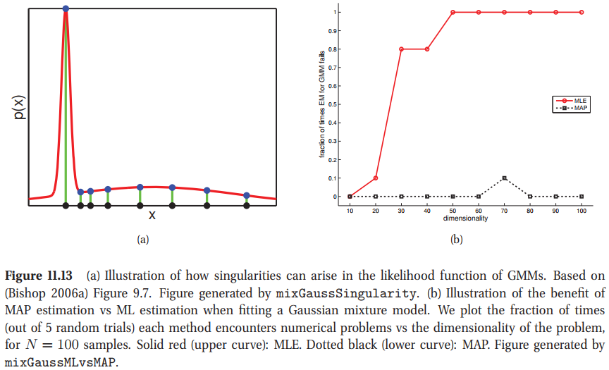
> (a)解释了GMMs中似然函数中奇异点的出现。(b)解释了

对这种问题一个简单地方案是执行MAP估计。新的辅助函数为期望的完全数据的对数似然插入对数先验
$$
Q^{\prime}(\boldsymbol{\theta},\boldsymbol{\theta}^{old}) = \left[ \sum_i\sum_k r_{ik}\log\pi_{ik}+\sum_i\sum_k r_{ik}\log(\mathbf{x}_i|\boldsymbol{\theta}_k) \right] + \log p(\boldsymbol{\pi}) + \sum_k\log p(\boldsymbol{\pi}_k)\tag{11.40}
$$
注意到E步保持不变，但是M步需要被修改。

对于混合权重的先验，很自然的是使用一个Dirichlet先验$\boldsymbol{\pi}\sim\text{Dir}(\boldsymbol{\alpha})$，因为这个是与类别分布共轭的。MAP估计给定为
$$
\pi_k=\frac{r_k+\alpha_k-1}{N+\sum_k\alpha_k-K}     \tag{11.41}
$$
如果使用一个均匀先验，$\alpha_k=1$，降级为方程11.28。

类条件密度$p(\boldsymbol{\theta}_k)$的参数的先验依赖于类条件密度的形式。我们讨论GMMs的情况，将Bernoullis的混合的MAP估计留到练习11.3。

出于简化，我们考虑形式为
$$
p(\boldsymbol{\mu}_k, \mathbf{\Sigma}_k) =\text{NIW}(\boldsymbol{\mu}_k, \mathbf{\Sigma}_k|\mathbf{{m}}_0, \kappa_0, \nu_0, \mathbf{{S}}_0) \tag{11.42}
$$
的共轭先验。根据4.6.3节，我们可以得到MAP估计为
$$
\begin{aligned}
    \hat{\boldsymbol{\mu}}_k &=\frac{r_k\bar{\mathbf{x}}_k+\kappa_0\mathbf{m}_0}{r_k+\kappa_0} \\
    \bar{\mathbf{x}}_0&\triangleq \frac{\sum_i r_{ik}\mathbf{x}_i}{r_k} \\
    \hat{\mathbf{\Sigma}}_k&=\frac{\mathbf{S}_0+\mathbf{S}_k+\frac{\kappa_0r_k}{\kappa_0+r_k}(\bar{\mathbf{x}}_k-\mathbf{m}_0)(\bar{\mathbf{x}}_k-\mathbf{m}_0)^T}{\nu_0+r_k+D+2}\\
    \mathbf{S}_k&\triangleq \sum_i r_{ik}(\mathbf{x}_i - \bar{\mathbf{x}}_k)(\mathbf{x}_i - \bar{\mathbf{x}}_k)^T   \tag{11.44-11.47}
\end{aligned}
$$
我们现在解释GMMs背景下使用MAP估计的而不是ML估计的优势。我们使用$\text{ML}$或$\text{MAP}$估计将$\text{EM}$应用于$D$维的某些合成数据。如果存在涉及奇异矩阵的数值问题，我们认为该试验是“失败”。对于每个维度，我们进行5次随机试验。对于实验的结果，如果11.13(b)所解释的，$N=100$。我们看到，只要$D$变得相当大，$\text{ML}$估计就会崩溃并燃烧，而$\text{MAP}$估计永远不会遇到数值问题。

当使用$\text{MAP}$估计时，我们需要指定具体的超参数。这里我们提到一些简单的启发式方法来设置它们。我们设置$\kappa_0=0$，所以$\boldsymbol{\mu}_k$是不规范的，因为数值问题值来自有$\mathbf{\Sigma}_k$。这种情况下，简化为$\hat{\boldsymbol{\mu}}_k = \bar{\mathbf{x}}_k$与$\hat{\mathbf{\Sigma}}_k = \frac{\mathbf{S}_0+\mathbf{S}_k}{\nu_0+r_k+D+2}$看起来不太吓人。

我们现在讨论如何设置$\mathbf{S}_0$。一种可能性是使用
$$
\mathbf{S}_0 = \frac{1}{K^{1/D}}\text{diag}(s_1^2,\cdots,s_D^2)\tag{11.48}
$$
其中$s_j=(1/N)\sum_{i=1}^N(x_{ij}-\bar{x}_j)^2$是$j$维的池化方差。(使用$K^{1/D}$项的原因是得到的每个椭圆的体积是$\vert\mathbf{S}_0\vert=\frac{1}{K}\vert\text{diag}(s_1^2,\cdots,s_D^2)\vert$。)参数$\nu_0$控制了我们对先验信息的信任强度。我们可以使用最弱的先验$\nu_0=D+2$，仍然是恰当的，这是一个常用的选择。

### 11.4.3 混合专家的EM(EM for mixture of experts)

我们可以直接的用EM算法来拟合一个专家混合模型。预期的完整数据记录可能性由下式给出：
$$
\begin{aligned}
  Q(\boldsymbol{\theta}, \boldsymbol{\theta}^{old}) &= \sum_{i=1}^N\sum_{k=1}^Kr_{ik}\log\left[\pi_{ik}\mathcal{N}(y_i\vert \mathbf{w}_k^T\mathbf{x}_i,\sigma_k^2)  \right] \\
  \pi_{i,k} &\triangleq \mathcal{S}(\mathbf{V}^T\mathbf{x}_i)_k  \\
  r_{ik} &\propto \pi_{ik}^{old}\mathcal{N}(y_i\vert \mathbf{x}_i^T\mathbf{w}_{k}^{old}, (\sigma_k^{old})^2)    
\end{aligned}     \tag{11.49-11.51}
$$
E步与标准的混合模型完全一样，处理我我们在计算$r_{ik}$时，将$\pi_k$替换为了$\pi_{i,k}$。

在M步，我们需要相对$\mathbf{w}_k, \sigma_k^2, \mathbf{V}$最大化$Q(\boldsymbol{\theta}, \boldsymbol{\theta}^{old})$。对于模型$k$的回归参数，目标形式为
$$
Q(\boldsymbol{\theta}, \boldsymbol{\theta}^{old}) = \sum_{i=1}^N r_{ik} \left\{ -\frac{1}{\sigma_k^2}(y_i-\mathbf{w}_k^T\mathbf{x}_i)  \right\}
$$
我们将这个看作一个加权最小二乘问题，其直觉意义是:如果$r_{ik}$很小，那么在估计参数$k$的参数时，数据点i将会被降低权重。从8.3.4节中，我们可以立即将MLE记为
$$
\mathbf{w}_k = (\mathbf{X}^T\mathbf{R}_k\mathbf{X})^{-1}\mathbf{X}^T\mathbf{R}_k\mathbf{y}    \tag{11.53}
$$
其中$\mathbf{R}_k=\text{diag}(r_{:,k})$。方差的MLE给定为
$$
\sigma_k^2 = \frac{\sum_{i=1}^Nr_{ik}(y_i-\mathbf{w}^T_k\mathbf{x}_i)^2}{\sum_{i=1}^N r_{ik}} \tag{11.54}
$$
我们将无条件混合权重$\boldsymbol{\pi}$替代为了门控参数$\mathbf{V}$的估计。目标的形式为
$$
\ell(\mathbf{V}) = \sum_i\sum_k r_{ik}\log\pi_{i,k}         \tag{11.55}
$$    
我们将其看作multinomial logistic回归的对数似然，区别是将1到C的硬编码$\mathbf{y}_i$替换为了1到$K$的软编码$\mathbf{r}_i$。那么，我们可以通过软目标labels拟合一个logistic回归来估计$\mathbf{V}$。

### 11.4.4 EM for DGMs with hidden variables

我们可以将EM算法推广到混合专家来计算任意一个DGM的MLE或MAP估计。我们将使用基于梯度的计算方法，但是更简单的方法是使用EM方法：在E步我们只要估计隐变量，在M步我们将会使用这些填充值来计算MLE。我们给定细节如下。

出于展示的简化，我们将会假设所有的CPDs是表格。基于10.4.2节中的我们将每个CPT写作如下:
$$
p(x_{it}\vert \mathbf{x}_{i, \text{pa}(t)}, \boldsymbol{\theta}_t) = \prod_{c=1}^{K_{\text{pa}(t)}}\prod_{k=1}^{K_t}\theta^{\mathbb{I}(x_{it}=i, \mathbf{x}_{i, \text{pa}(t)}=c)}_{tck}
$$
完全数据的对数似然给定为
$$
\log p(\mathcal{D}\vert\boldsymbol{\theta}) = \sum_{t=1}^V\sum_{c=1}^{K_{\text{pa}(t)}}\sum_{k=1}^{K_t}N_{tck}\log \theta_{tck}   \tag{11.57}
$$
其中$N_{tck}=\sum_{i=1}^N\mathbb{I}(x_{it}=i, \mathbf{x}_{i, \text{pa}(t)}=c)$是经验计数。因此，期望完全数据的对数似然形式为
$$
\mathbb{E}[\log p(\mathcal{D}\vert \boldsymbol{\theta})] = \sum_{t}\sum_{c}\sum_{k}\bar{N}_{tck}\log\theta_{tck}    \tag{11.58}
$$
其中
$$
\bar{N}_{tck} = \sum_{i=1}^N  \mathbb{E}[\mathbb{I}(x_{it}=i, \mathbf{x}_{i, \text{pa}(t)}=c)]=\sum_i p(x_{it}=k, \mathbf{x}_{i,\text{pa}(t)}=c\vert\mathcal{D}_i)    \tag{11.59}
$$

## 11.5 隐变量模型的模型选择

### 11.5.1 概率模型的模型选择

5.3节中的最优Bayesian方法是挑选最大边缘似然，$K^*=\argmax_k p(\mathcal{D}|K)$。

这里主要有两个问题。一个是计算LVMs的边缘似然确实很难。实际中，可以使用简单的近似BIC。另外我们可以使用交叉验证似然作为一个业绩测量，但是这样很慢，因为需要拟合F次模型，而F是CV折数。

第二个问题是需要搜索潜在的大量模型。通常的方法是对$K$的所有候选值执行穷举搜索。但是，有时我们可以将模型设置为最大规模，然后依靠贝叶斯Occam剃刀的功能来“杀死”不需要的组件。当我们讨论**变分贝叶斯**时，将在第21.6.1.6节中显示一个示例。

另一种方法是在模型空间中执行随机抽样。传统的方法，例如(Green 1998，2003； Lunn等，2009)，是基于**可逆跳MCMC**的，并使用出生移动来提议新的中心，而死亡移动来杀死旧的中心。但是，这可能很慢并且难以实现。一种更简单的方法是使用**Dirichlet过程混合模型**，该模型可以使用**Gibbs采样**进行拟合，但仍然允许无限制数量的混合成分；有关详细信息，请参见第25.2节。

也许令人惊讶的是，这些基于采样的方法可能比分别评估每个K的质量的简单方法要快。原因是为每个K拟合模型通常很慢。 相比之下，采样方法通常可以快速确定K的某个特定值很差，因此不需要在后验的那部分浪费时间。

### 11.5.2 非概率模型的模型选择(Model selection for non-probabilistic methods)

如果我们不适用概率模型呢？例如，我们如何选择K-means算法的K？因为这个不是对应的一个概率模型，这里没有似然，上述描述的模型一个都不能用。

对似然的一个明显的近似就是重构误差。使用模型复杂的K，将一个数据集合$\mathcal{D}$的平方重构误差定义为
$$
E(\mathcal{D},K) = \frac{1}{\mathcal{D}}\sum_{i\in\mathcal{D}}\Vert \mathbf{x}_i-\hat{\mathbf{x}}_i\Vert^2  \tag{11.95}
$$
这种情况的K-means算法，重构给定为$\bar{\mathbf{x}}_i=\boldsymbol{\mu}_{z_i}$，其中$z_i=\argmin_k\Vert\mathbf{x}_i-\boldsymbol{\mu}_i\Vert^2_2$。

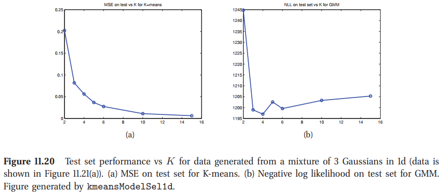
图11.20(a)画出了K-means在测试集上的重构误差。我们看到随着模型复杂度增加，误差下降。当我们向K-means添加越来越多的质心时，我们可以让空间越来越密集，如果11.21(b)。因此，随着K增加，任何给定的测试集向量更可能精确寻找到展示它的很近的原型，然后降低重构误差。然然，如果我们使用一个概率模型GMM，画出负对数似然函数，我们得到测试集上常用的U型曲线。

在监督学习中，我们通常可以使用交叉验证在不同复杂度的非概率模型间选择，但是非监督学习不是这样的。尽管这不是一个新颖的发现，但它可能并未得到应有的广泛赞赏。 实际上，它是支持概率模型的更引人注目的论据之一。

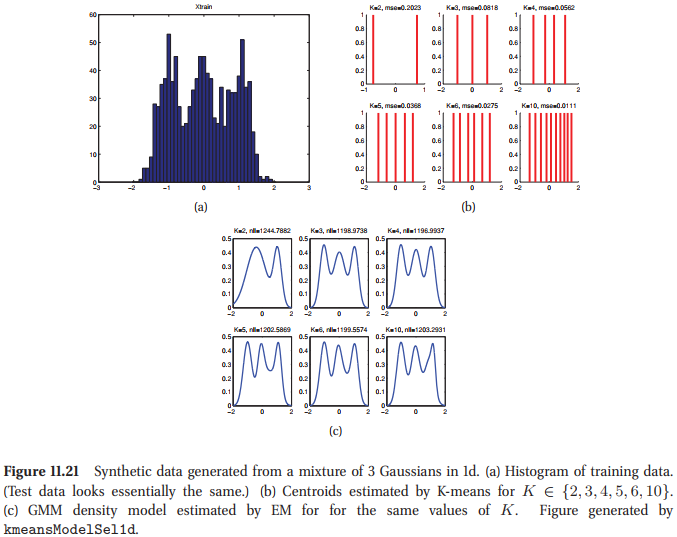

鉴于交叉验证不起作用，并且假设一个人不愿意使用概率模型(出于某些奇怪的原因...)，如何选择$K$？最常见的方法是在训练集上绘制相对于$K$的重构误差，并尝试识别曲线中的拐点或扭结。这个想法是，对于$K \lt K_∗$，其中$K_*$是聚类的“真实”数目，由于我们将不应该分组的事物分开，因此误差函数的下降率将很高。但是，对于$K \gt K_∗$，我们将“自然”簇分开，这并不能将误差减少太多。

可以通过使用**缺口统计**来自动进行这种扭结查找过程(Tibshirani等，2001)。然而，如图11.20（a）所示，识别这种纠结可能很困难，因为损失函数通常会逐渐下降。第12.3.2.1节介绍了另一种“发现问题”的方法。

## 11.6 拟合有缺失数据的模型(Fitting models with missing data)

假设我们希望通过最大似然拟合一个联合密度模型，但是因为有缺失值，在我们的矩阵中有一个"洞"。更正式的描述，如果可以观察到数据情况$i$的成分$k$，令$O_{ij}=1$，要不然$O_{ij}=0$。令$\mathbf{X}_v = \{x_{ij}:O_{ij}=1\}$为可见数据，$\mathbf{X}_h = \{x_{ij}:O_{ij}=0\}$为缺失数据或是隐层数据。我们的目标是计算
$$
\hat{\boldsymbol{\theta}} = \argmax_{\boldsymbol{\theta}} p(\mathbf{X}_v | \boldsymbol{\theta},\mathbf{O})  \tag{11.96}
$$
在随机缺失的假设下，我们有
$$
p(\mathbf{X}_v|\boldsymbol{\theta},\mathbf{O}) = \prod_{i=1}^{N}p(\mathbf{x}_{iv}|\boldsymbol{\theta})  \tag{11.97}
$$
其中$\mathbf{x}_{iv}$是从$i$行创建的一个向量，索引为集合$\{j:O_{ij}=1\}$。因此，对数似然的形式为
$$
\log p(\mathbf{X}_v|\boldsymbol{\theta}) = \sum_i \log p(\mathbf{x}_{iv}|\boldsymbol{\theta})    \tag{11.98}
$$
其中
$$
p(\mathbf{x}_{iv}|\boldsymbol{\theta}) = \sum_{\mathbf{x}_{ih}} p(\mathbf{x}_{iv},\mathbf{x}_{ih}|\boldsymbol{\theta})  \tag{11.99}
$$
且$\mathbf{x}_{ih}$是对情况$i$的隐变量的向量。带入其中
$$
\log p(\mathbf{X}_v|\boldsymbol{\theta}) = \sum_i \log \left[ \sum_{\mathbf{x}_{ih}} p(\mathbf{x}_{iv},\mathbf{x}_{ih} |\boldsymbol{\theta}) \right]    \tag{11.100}
$$
不幸的是，这个目标函数是很难最大化的。因为，我们不能把对数插入到和之中。然而，我们可以使用EM算法来计算局部最优解。

### 11.6.1 有缺失值得MVN的MLE的EM(EM for the MLE of an MVN with missing data)

假设我们想通过最大似然来拟合一个MVN，但是我们有缺失值。我们可以使用EM来寻找目标函数的一个局部最大值。

#### 11.6.1.1 Getting started

为了使算法开始，我们可以基于完全观察到的数据矩阵行来计算MLE。如果没有这样的行，我们可以使用一些特殊的插补程序，然后计算初始MLE。

#### 11.6.1.2 E步

一旦有了$\boldsymbol{\theta}^{t-1}$，我们可以计算在迭代$t$的期望完全数据的对数似然：
$$
\begin{aligned}
    Q(\boldsymbol{\theta},\boldsymbol{\theta}^{t-1}) &= \mathbb{E}\left[ \sum_{i=1}^{N}\log\mathcal{N}(\mathbf{x}_i|\boldsymbol{\mu},\mathbf{\Sigma})|\mathcal{D},\boldsymbol{\theta}^{t-1} \right] \\
    &=-\frac{N}{2}\log\vert 2\pi\mathbf{\Sigma}\vert - \frac{1}{2}\sum_i\mathbb{E}[(\mathbf{x}_i - \boldsymbol{\theta})^T\Sigma^{-1}(\mathbf{x}_i-\boldsymbol{\mu})] \\
    &=-\frac{N}{2}\log\vert 2\pi\mathbf{\Sigma}\vert - \frac{1}{2}\text{tr}\left( \mathbf{\Sigma}^{-1}\sum_i \mathbb{E}[(\mathbf{x}_i - \boldsymbol{\mu})(\mathbf{x}_i - \boldsymbol{\mu})^T ] \right)      \tag{11.101-11.104} \\
    &=-\frac{N}{2}\log\vert\mathbf{\Sigma}\vert - \frac{ND}{2}\log(2\pi) - \frac{1}{2}\text{tr} \left(\mathbf{\Sigma}^{-1}\mathbb{E}[\mathbf{S}(\boldsymbol{\mu})] \right)
\end{aligned}
$$
其中
$$\mathbb{E}[\mathbf{S}(\boldsymbol{\mu})] \triangleq \sum_i \left( \mathbb{E}[\mathbf{x}_i\mathbf{x}_i^T]+\boldsymbol{\mu}\boldsymbol{\mu}^T-2\boldsymbol{\mu}\mathbb{E}[\mathbf{x}_i]^T \right)   \tag{11.105}
$$
出于简化我们期望放弃对$\mathcal{D}, \boldsymbol{\theta}^{t-1}$的期望条。我们看到我们希望计算$\sum_i\mathbb{E}[\mathbf{x}_i]$以及$\sum_i\mathbb{E}[\mathbf{x}_i\mathbf{x}_i^T]$；这些是期望充分统计。

为了计算这些量，我们使用来自4.3.1节的结果。具体的，考虑情况$i$，其中成分$i$是可观测，成分$h$是不可观测的。我们有
$$
\begin{aligned}
    \mathbf{x}_{ih}|\mathbf{x}_{iv},\boldsymbol{\theta} &\sim \mathcal{N}(\mathbf{m}_i, \mathbf{V}_i) \\
    \mathbf{m}_i &\triangleq \boldsymbol{\mu}_h + \mathbf{\Sigma}_{hv}\mathbf{\Sigma}_{vv}^{-1}(\mathbf{x}_{iv}-\boldsymbol{\mu}_v) \\
    \mathbf{V}_i &\triangleq \mathbf{\Sigma}_{hh}-\mathbf{\Sigma}_{hv}\mathbf{\Sigma}_{vv}^{-1}\mathbf{\Sigma}_{vh}
\end{aligned}
$$
因此，期望充分统计为
$$
\mathbb{E}[\mathbf{x}_i] = (\mathbb{E}[\mathbf{x}_{ih}];\mathbf{x}_{iv}) = (\mathbf{m}_i;\mathbf{x}_{iv})   \tag{11.109}
$$
其中我们假设不可观测变量来自观测变量。

为了计算$\mathbb{E}[\mathbf{x}_{i}\mathbf{x}_i^T]$，我们使用协方差$\text{cov}[\mathbf{x}] = \mathbb{E}[\mathbf{x}\mathbf{x}^T] - \mathbb{E}[\mathbf{x}]\mathbb{E}[\mathbf{x}^T]$。因此，
$$
\begin{aligned}
    \mathbb{E}[\mathbf{x}_i\mathbf{x}_i^T] &=\mathbb{E}\left[
    \begin{pmatrix}
        \mathbf{x}_{ih} \\
        \mathbf{x}_{iv} 
    \end{pmatrix}(\mathbf{x}_{ih}^T \quad \mathbf{x}_{iv}^T)\right] = \begin{pmatrix}
        \mathbb{E}[\mathbf{x}_{ih}\mathbf{x}_{ih}^T] & \mathbb{E}[\mathbf{x}_{ih}]\mathbf{x}_{iv}^T \\
        \mathbf{x}_{iv}\mathbb{E}[\mathbf{x}_{ih}^T] & \mathbf{x}_{iv}\mathbf{x}_{iv}^T)
    \end{pmatrix} \\
    \mathbb{E}[\mathbf{x}_{ih}\mathbf{x}_{ih}^T]&=\mathbb{E}[\mathbf{x}_{ih}]\mathbb{E}[\mathbf{x}_{ih}]^T+\mathbf{V}_i \tag{11.111}
\end{aligned}
$$

#### 11.6.1.3 M步

通过求解$\nabla Q(\boldsymbol{\theta}, \boldsymbol{\theta}^{(t-1)})=\mathbf{0}$，我们可以看到M步等效于将这些ESS插进常用的MLE方程来得到
$$
\begin{aligned}
    \boldsymbol{\mu}^{t} &= \frac{1}{N}\sum_{i}\mathbb{E}[\mathbf{x}_i] \\
    \mathbf{\Sigma}^{t} &= \frac{1}{N}\sum_{i}\mathbb{E}[\mathbf{x}_i\mathbf{x}_i^T] - \boldsymbol{\mu}^t(\boldsymbol{\mu}^t)^T
\end{aligned}
$$
然后，我们看到EM不是等效于简单的将变量用它们的期望来替代然后应用标准的MLE公式；这将忽略后验方差以及将导致不正确的估计。相反，我们必须计算出足够统计量的期望值，并将其插入MLE的通常公式中。
