<!-- TOC -->

- [13. Sparse Linear Models](#13-sparse-linear-models)
  - [13.1 引言(Introduction)](#131-引言introduction)
  - [13.2 Bayesian variable selection](#132-bayesian-variable-selection)
    - [13.2.1 The spike and slab model](#1321-the-spike-and-slab-model)
    - [13.2.2 From the Bernoulli-Gaussian model to $\ell_0$ regulation](#1322-from-the-bernoulli-gaussian-model-to-ell_0-regulation)
    - [13.2.3 算法](#1323-算法)
      - [13.2.3.1 Greedy search](#13231-greedy-search)
      - [13.2.3.2 Stochastic search](#13232-stochastic-search)
      - [13.2.3.3 EM and variational inference*](#13233-em-and-variational-inference)
  - [13.3 $\ell_1$正则化: 基础](#133-ell_1正则化-基础)
    - [13.3.1 Why does $\ell_1$ regularization yield sparse solutions?](#1331-why-does-ell_1-regularization-yield-sparse-solutions)
    - [13.3.2 Optimality conditions for lasso](#1332-optimality-conditions-for-lasso)
    - [13.3.3 Comparison of least squares, lasso, ridge and subset selection](#1333-comparison-of-least-squares-lasso-ridge-and-subset-selection)
    - [13.3.5 Model selection](#1335-model-selection)
    - [13.3.6 Bayesian inference for linear models with Laplace priors](#1336-bayesian-inference-for-linear-models-with-laplace-priors)
  - [13.4 $\ell_1$ regularization: algorithms](#134-ell_1-regularization-algorithms)
    - [13.4.1 Coordinate descent](#1341-coordinate-descent)
    - [13.4.2 LARS and other homotopy methods](#1342-lars-and-other-homotopy-methods)
    - [13.4.3 Proximal and gradient projection methods](#1343-proximal-and-gradient-projection-methods)
      - [13.4.3.1 Proximal operators](#13431-proximal-operators)
      - [13.4.3.2 Proximal gradient method](#13432-proximal-gradient-method)
      - [13.4.3.3 Nesterov’s method](#13433-nesterovs-method)
    - [13.4.4 EM for lasso](#1344-em-for-lasso)
      - [13.4.4.1 Why EM?](#13441-why-em)
      - [13.4.4.2 The objective function](#13442-the-objective-function)
      - [13.4.4.3 The E step](#13443-the-e-step)
  - [13.6 Non-convex regularizes](#136-non-convex-regularizes)
    - [13.6.1 Bridge regression](#1361-bridge-regression)
    - [13.6.2 Hierarchical adaptive lasso](#1362-hierarchical-adaptive-lasso)
  - [13.8 Sparse coding*](#138-sparse-coding)
    - [13.8.1 Learning a sparse coding dictionary(学习一个编码字典)](#1381-learning-a-sparse-coding-dictionary学习一个编码字典)

<!-- /TOC -->

# 13. Sparse Linear Models

## 13.1 引言(Introduction)

我们在第3.5.4节中介绍了特征选择的主题，其中讨论了用于查找与输出具有较高互信息的输入变量的方法。这种方法的问题在于它基于近视策略，一次只能查看一个变量。如果存在交互作用，这可能会失败。例如，如果`y = xor(x1，x2)`，则`x1`和`x2`都不能单独预测响应，但它们可以完美地预测响应。举一个真实的例子，考虑遗传关联研究：有时两个基因本身可能无害，但是当两个基因一起出现时，它们会导致隐性疾病（Balding 2006）

本章，我们将重点介绍如何使用基于模型的方法一次选择变量集。如果模型是一个广义线性模型，形式为$p(y\vert \mathbf{x}) = p(y\vert f(\mathbf{w}^T\mathbf{x})$，链接函数为$f$，那么我们可以通过使得权重向量$\mathbf{w}$为稀疏来执行特征选择，也就是向量中大量为0。

有一些应用中特征选择/稀疏很重要：
- 在许多问题中，有比训练案例N更多的维度。对应的设计矩阵又短又肥，而不是高瘦。这称为小N大D问题。随着我们开发更多的高通量测量设备，这种情况变得越来越普遍。例如，对于基因微阵列，通常测量$D\sim 10000$个基因的表达水平，而仅获得$N\sim100$个这样的例子。我们可能希望找到可以准确预测响(例如细胞生长速率)的最小特征集，以防止过度拟合，降低构建诊断设备的成本或帮助对问题进行科学洞察 。 
- 在第14章， 我们将使用以训练例子为中心的基函数，有$\boldsymbol{\phi}(\mathbf{x}) = [\kappa(\mathbf{x,x}_{1})], \cdots, \kappa(\mathbf{x, x}_N)]$，其中$\kappa$是核函数。得到的设计矩阵的尺寸为$N\times N$。这种背景下的特征选择等效于选择训练样例的一个子集，可以降低过拟合以及计算成本。称为稀疏核机。
- 在信号过程中，通常用小波基函数来表示信号(图像、语音等等)。为了节省时间与空间，根据少量此类基函数，找到信号的稀疏表示很有用。这使我们能够通过少量测量来估计信号，以及压缩信号。

注意到特征选择以及稀疏主题是目前机器学习/统计方面最火热的领域。本章中，我们只用有限空间给出主要结果的一部分观点。

## 13.2 Bayesian variable selection

提出变量选择问题的自然方法如下。如果特征$j$是“相关的”，令$\gamma_j = 1$，否则$\gamma_j = 0$。我们的目标是计算模型的后验
$$
p(\gamma\vert\mathcal{D}) = \frac{e^{-f(\gamma)}}{\sum_{\gamma^{\prime}}e^{-f(\gamma^{\prime})}}      \tag{13.1}
$$
其中$f(\gamma)$是成本函数：
$$
f(\gamma) \triangleq -[\log p(\mathcal{D}\vert\gamma) + \log p(\gamma)]   \tag{13.2}
$$

例如，假设我们从一个$D=10$维线性回归模型中生成$N=20$个采样，$y_i\sim\mathcal{N}(\mathbf{w}^T\mathbf{x}_i, \sigma^2)$，其中$\mathbf{w}$中$K=5$元素是非零的。尤其是，我们使用$\mathbf{w}=(0.00, -1.67, 0.13, 0.00, 0.00, 1.19, 0.00, −0.04, 0.33, 0.00)$且$\sigma^2=1$。我们枚举所有$2^10=1024$个模型，为每个计算$p(\gamma\vert\mathcal{D})$。我们以**格雷码**顺序对模型进行排序，以确保连续的向量相差恰好1位。

得到的位模式的集合在图13.1(a)中。每个模型的成本显示在图13.1(b)中。我们看到这个目标函数是极端"bumpy"。如果我们解释模型上的后验$p(\gamma\vert\mathcal{D})$，结果是很容易解释的。在图13.1(c)中有显示。前8个模型如下。
真实的模型是$\{2,3,6,8,9\}$。然而，与特征3与8相关的系数是很小的(相对$\sigma^2$)，所以这些变量是很难删除的。给定足够的数据，方法可以覆盖真实的模型(假设数据来自一个线性模型)，但是对于有限的数据集，通常有足够的后验不确定性。

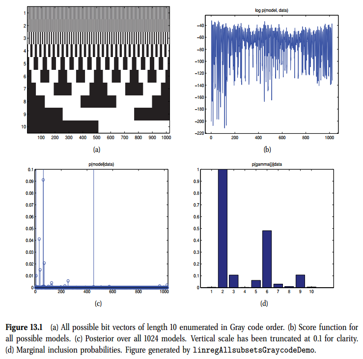

在大量模型基础上解释后验是很难的，所以我们寻找大量的**概括性统计(summary statistics)**。一个自然的方式是后验模式，或MAP估计
$$
\hat{\gamma}=\argmax p(\gamma\vert\mathcal{D}) = \argmin f(\gamma)  \tag{13.3}
$$
但是，mode通常不能代表全部的后验质量(请参见第5.2.1.3节)。 更好的总结是中位数模型（Barbieri和Berger 2004； Carvahlo和Lawrence 2007），使用 
$$
\hat{\gamma} = \{j:p(\gamma_j=1\vert\mathcal{D})\gt0.5\}    \tag{13.4}
$$
這需要計算後驗邊緣包容概率$p(\gamma_j=1\vert\mathcal{D})$。這在圖13.1(b)中有顯示。我們看到模型有信心包含变量2和6。如果我们將決策閾值降低到0.1，我们也会同时添加3和9。然而，如果想捕獲變量8，我們需要引入兩個錯誤正數(5與7)。在錯誤正數與錯誤負數之間的權衡在5.7.2.1中有更詳細的描述。

上述例子解釋變量選擇的黃金標準：問題足夠小，以至於我們可以精確計算完全後驗。当然，在维数较大的情况下，变量选择最有用。因为有$2^D$个可能的模型，一般不可能计算完全的后验，即使发现了概括，例如MAP估计或是边缘包容概率，也是不可处理的。因此，我们将在本章中的大部分时间集中在算法加速上。但在此之前，我们将解释如何计算上述例子的$p(\gamma\vert\mathcal{D})$。

### 13.2.1 The spike and slab model

后验给定为
$$
p(\gamma\vert\mathcal{D}) \propto p(\gamma)p(\mathcal{D}\vert\gamma)    \tag{13.5}
$$
我们首先考虑先验，然后考虑似然。

在位向量上通常使用如下先验
$$
p(\gamma) = \prod_{j=1}^{D}\text{Ber}(\gamma_j\vert \pi_0) = \pi_0^{\lVert\gamma \rVert_0}(1-\pi_0)^{D-\lVert\gamma \rVert_0}
$$
其中$\pi_0$是一个特征相关的概率，且$\lVert\gamma \rVert_0=\sum_{j=1}^D\gamma_j$是$\ell_0$伪范数，这是向量中非零元素的个数。出于后面模型的对比方便，我们将其写作
$$
\begin{aligned}
  \log p(\gamma\vert\pi_0) &= \lVert\gamma\rVert_0 \log\pi_0 + (D-\lVert\gamma\rVert_0)\log (1-\pi_0) \\
  & = \lVert\gamma\rVert_0 (\log\pi_0 - \log (1-\pi_0)) + \text{const} \\
  &=  -\gamma \lVert\gamma\rVert_0 + \text{const} 
\end{aligned}   \tag{13.7-13.9}
$$

其中$\gamma=\log\frac{1-\pi_0}{\pi_0}$控制模型的稀疏程度。

我们希望似然写为如下
$$
p(\mathcal{D}\vert\gamma) = p(\mathbf{y\vert X},\gamma) = \int\int p(\mathbf{y\vert X, w},\gamma) p (\mathbf{w}\vert\gamma, \sigma^2) p(\sigma^2) d\mathbf{w}d\sigma^2    \tag{13.10}
$$
出于符号的简化，我们假设响应是中心化的(也就是$\bar{y}=0$)，所以我们可以忽略任何的偏移项$\mu$。

我们现在讨论先验$p(\mathbf{w\vert\gamma, \sigma^2})$。如果$\gamma_j=0$，特征$j$是不相关的，所以期望$w_i=0$。如果$\gamma_j=1$，我们期望$w_i\not=0$。如果我们标准化输入，一个合理的先验是$\mathcal{N}(0, \sigma^2\sigma_w^2)$，其中$\sigma_w^2$控制与相关变量的系数是多大。我们可以将先验总结为如下
$$
p(w_j\vert\sigma^2,\gamma_j)= \begin{cases}
  \delta_0(w_j) \qquad \qquad\;\;  \text{if}\gamma_j=0\\
  \mathcal{N}(w_j\vert0, \sigma^2\sigma_w^2)    \quad \text{if}\gamma_j=1
\end{cases}
$$
第一项是原始值的一个“尖峰”。随着$\sigma_w^2\rightarrow\infty$，分布$p(w_j\vert\gamma_j=1)$接近一个均匀分布，可以被看作一个常数身高的一个平板。因此这个被称为spike&slab模型。

我们从模型中丢弃$w_j=0$的系数$w_j$，因为在先验条件下它们被限制为零。 因此方程13.10变为如下形式
$$
p(\mathcal{D}\vert\gamma) = p(\mathbf{y\vert X},\gamma) =  \int\int 
 \mathcal{N} (\mathbf{y\vert X_{\gamma}, w_{\gamma}}, \sigma^2\mathbf{I}_N) 
 \mathcal{N} (\mathbf{w}_{\gamma}\vert \mathbf{0}_{D_{\gamma}}, \sigma^2\sigma_w^2 \mathbf{I}_{D_{\gamma}}) 
 p(\sigma^2) d\mathbf{w}_{\gamma}d\sigma^2    \tag{13.10}
$$
其中$D_{\gamma}=\lVert\gamma\rVert_0$是$\gamma$中的非零元素的数量。下面，我们将通过为每个正定矩阵$\mathbf{\Sigma}_{\gamma}$定义一个形式为$p(\mathbf{w}\vert \gamma, \sigma^2) =  \mathcal{N}(\mathbf{w}_{\gamma}\vert\mathbf{0}_{D_{\gamma}},\sigma^2\mathbf{\Sigma}_{\gamma})$对此进行概括。

给定这些先验，我们可以计算边缘似然。如果噪声方差是已知的，我们可以将边缘似然描述为如下
$$
\begin{aligned}
  p(\mathcal{D}\vert\gamma,\sigma^2) & = \int\mathcal{N}(\mathbf{y\vert X}_{\gamma}\mathbf{w}_{\gamma},\sigma^2\mathbf{I})\mathcal{N}(\mathbf{w}_{\gamma}\vert\mathbf{0}, \sigma^2\mathbf{\Sigma}_{\gamma}) - \mathcal{N}(\mathbf{y\vert0,C}_{\gamma}) \\
  \mathbf{C}_{\gamma} &\triangleq \sigma^2\mathbf{X}_{\gamma}\mathbf{\Sigma}_{\gamma}\mathbf{X}_{\gamma}^T + \sigma^2\mathbf{I}_N
\end{aligned}
$$
如果噪声未知，我们可以赋予一个先验，并对其积分。通常使用$p(\sigma^2) = \text{IG}(\sigma^2\vert a_{\sigma},b_{\sigma})$。如果我们使用$a=b=0$，我们recover Jeffrey的先验$p(\sigma^2) \propto \sigma^{-2}$。当我们积分噪声时，我们获得如下边缘似然更加复杂的表达式
$$
\begin{aligned}
  p(\mathcal{D}\vert\gamma) & = \int \int p(\mathbf{y}\vert\gamma,\mathbf{w}_{\gamma},\sigma^2)p(\mathbf{w}_{\gamma}\vert \gamma,\sigma^2)p(\sigma^2)d\mathbf{w}_{\gamma}d\sigma^2 \\
  & \propto \lvert \mathbf{X}_{\gamma}^T\mathbf{x}_{\gamma}+\mathbf{\Sigma}_{\gamma}^{-1}\rvert^{-\frac{1}{2}} \lvert \mathbf{\Sigma}_{\gamma} \rvert^{-\frac{1}{2}} (2b_{\sigma}+S(\gamma))^{-(2a_{\sigma}+N-1)/2}
\end{aligned}
$$
其中$S(\gamma)$是RSS:
$$
S(\gamma) \triangleq \mathbf{y}^T\mathbf{y} - \mathbf{y}^T\mathbf{X}_{\gamma}(\mathbf{X}_{\gamma}^T\mathbf{X}_{\gamma}+\mathbf{\Sigma}_{\gamma}^{-1})^{-1}\mathbf{X}_{\gamma}^T\mathbf{y}   \tag{13.17}
$$

当边缘似然无法以闭形计算时(例如，如果我们使用logistics回归或一个非线性模型)，我们可以使用BIC近似，形式是
$$
\log p(\mathcal{D}\vert \gamma) \approx \log p(\mathbf{y}\vert\mathbf{X},\hat{\mathbf{w}}_{\gamma},\sigma^2) - \frac{\lVert\gamma\rVert_0}{2}\log N   \tag{13.18}
$$
其中$\hat{\mathbf{w}}$是基于$\mathbf{X}_{\gamma^{\prime}}$的ML或MAP估计，$\lVert\gamma\rVert_0$是模型的“自由度”。加上对数先验，总体目标变为
$$
\log p(\gamma\vert\mathcal{D}) \approx \log p(\mathbf{y}\vert \mathbf{X},\hat{\mathbf{w}}_{\gamma}, \hat{\sigma}^2) - \frac{\lVert\gamma\rVert_0}{2} \log N - \lambda\lVert\gamma\rVert_{0} + \text{const}  \tag{13.19}
$$
这里有两个复杂的惩罚：一个来自对边缘似然的BIC近似，另一个来自$p(\gamma)$的先验。很明显，这些可以合并到总体的复杂性参数，将其记为$\lambda$。

### 13.2.2 From the Bernoulli-Gaussian model to $\ell_0$ regulation

另一个模型有时使用如下
$$
\begin{aligned}
  y_i\vert \mathbf{x}_i, \mathbf{w}, \gamma, \sigma^2 &\sim \mathcal{N}(\sum_j \gamma_jw_jx_{ij},\sigma^2) \\
  \gamma_j & \sim \text{Ber}(\pi_0) \\
  w_i  &\sim \mathcal{N}(0, \sigma^2_w)
\end{aligned}
$$
在信号处理的文献中，这个称为**Bernoulli-Gaussian**模型，而我们将其称为**binary mask**模型，因为可以将变量$\gamma_j$变量看作“掩盖”权重$w_j$。

不像spike&slab模型，我们不会积分不相关系数。另外，二项mask模型形式为$\gamma_j\rightarrow \mathbf{y}\leftarrow w_j$，而spike&slab模型的形式为$\gamma_j\rightarrow w_j \rightarrow \mathbf{y}$。在二元掩码模型中，乘积$\gamma_jw_j$只能从似然中识别。

这个模型一个有趣的是可以用来推导出在(非贝叶斯)子集选择文献中广泛使用的目标函数。首先，注意到联合先验为
$$
p(\gamma, \mathbf{w}) \propto \mathcal{N}(\mathbf{w\vert0}, \sigma^2_w\mathbf{I}) \pi_0^{\lvert\gamma\rVert_0}(1-\pi_0)^{D-\lVert\gamma\rVert_0}    \tag{13.23}
$$
因此，所当未归一化的负对数后验形式为
$$
\begin{aligned}
  f(\boldsymbol{\gamma}, \mathbf{w})  \triangleq &-2\sigma^2\log p(\gamma, \mathbf{w,y\vert X}) = \lVert \mathbf{y-X}(\gamma.*\mathbf{w})\rVert^2 \\
  &+\frac{\sigma^2}{\sigma^2_w}\lVert\mathbf{w}\rVert^2 + \lambda\lVert\gamma\rVert_0+\text{const}
\end{aligned}
$$
其中
$$
\lambda \triangleq 2\sigma^2\log \frac{1-\pi_0}{\pi_0}
$$
我们可以根据$\gamma$中零与非零项的索引，将$\mathbf{w}$分为子向量$\mathbf{w}_{-\gamma}$与$\mathbf{w}_{\gamma}$，。因为$\mathbf{X}(\boldsymbol{\gamma}.*\mathbf{w})=\mathbf{X}_{\gamma}\mathbf{w}_{\gamma}$,我们只需设置为$\mathbf{w}_{-\gamma}=\mathbf{0}$。

现在考虑$\sigma_w^2\rightarrow\infin$的情况，所以我们不能正则化非零权重(因此没有来自边缘似然或是其BIC近似的复杂性惩罚)。这种情况下，目标函数变为
$$
 f(\boldsymbol{\gamma}, \mathbf{w}) = \lVert \mathbf{y-X}_{\boldsymbol{\gamma}}\mathbf{w}_{\boldsymbol{\gamma}}\rVert_2^2 + \lambda\lVert\gamma\rVert_0   \tag{13.26}
$$
这类似于上述的BIC目标。

不再是跟踪位向量$\boldsymbol{\gamma}$，我们可以定义$\mathbf{w}$支持相关向量的集合，或是非零项。我们可以将上述方程重写为
$$
f(\mathbf{w}) = \lVert\mathbf{y-Xw}\rVert_2^2 + \lambda\lVert w\rVert_0 \tag{13.27}
$$
这称为$\ell_0$正则化，。我们将离散优化问题($\gamma\in\{0,1\}^D$)转化为一个连续优化($\mathbf{w}\in\mathbb{R}^n$)；然而$\ell_0$伪范数使得目标函数更加平滑，然而这仍然很难优化。

### 13.2.3 算法

有$2^D$个模型，我们无法找到所有的完全后验，或是找到全局最优模型。相反的，我们不得不求助于一种形式的启发。我们将讨论的所有方法涉及到模型空间的搜索，以及在每个点计算成本$f(\gamma)$。这需要在每步拟合模型(也就是计算$\argmax p(\mathcal{D}\vert \mathbf{w})$)或计算其边缘似然(也就是计算$\int p(\mathcal{D}\vert\mathbf{w})p(\mathbf{w})d\mathbf{w}$)。这有时称为**wrapper方法**，因为我们围绕通用的模型拟合过程包装了对于最优模型的搜索。

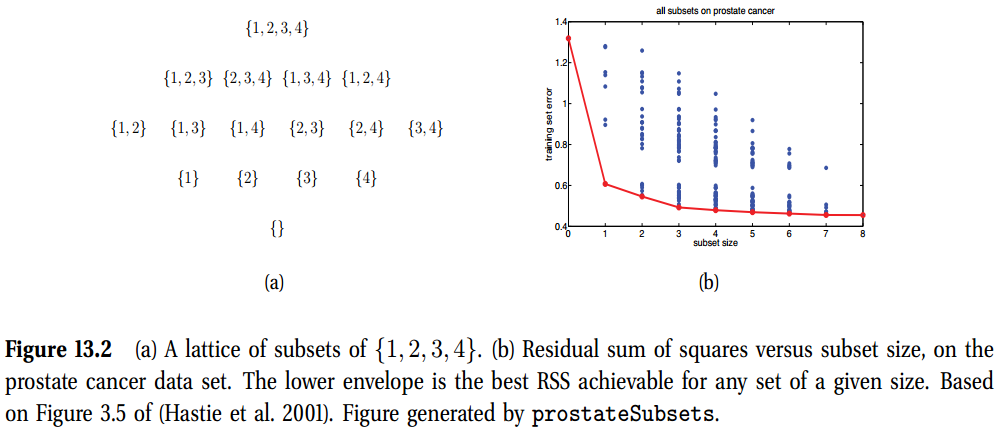

为了使包装方法有效，非常重要的是,在给定先前模型$\gamma$的得分，可以快速对一些新模型$\gamma^{\prime}$的得分函数。只要我们可以有效的更新计算$f(\gamma)$所需的充分统计，我们就可以完成此操作。提供的$\gamma^{\prime}$不同于$\gamma$一个位(对应于添加或移除一个单向量)，提供的$f(\gamma)$只通过$\mathbf{X}_{\gamma}$依赖于数据。这种情况下，我们可以使用秩1矩阵更新/降低来从$\mathbf{X}_{\gamma}^T\mathbf{X}_{\gamma}$有效计算$\mathbf{X}_{\gamma^{\prime}}^T\mathbf{X}_{\gamma^{\prime}}$。这些更新通常应用于$\mathbf{X}$的QR分解。

#### 13.2.3.1 Greedy search

假设我们想找到MAP模型。如果我们使用13.27中的$\ell_0$正则化目标函数，我们可以利用最小二乘性质来推导出各种贪婪前向搜索方法，一些我们总结如下。对于进一步的细节如下：
- **Single best replacement** 最简单的方法是使用贪婪爬山，其中在每一步中，我们将当前模型的邻域定义为所有模型，而不是通过翻转单个$\gamma$位(即对于每个变量，如果当前不存在)可以达到的所有模型。 在模型中，我们考虑添加它，如果它当前在模型中，则考虑删除它。 
- **Orthogonal least squares** 如果设置$\lambda=0$，就不存在复杂性惩罚了，就没有理由指向删除步了。这种情况下，SBR算法等效于正交最小二乘，这等效于贪婪前向选择。这种算法中，我们以空集合开始，每步添加最佳特征。误差将随$\lVert\gamma\rVert_0$单调下降，如图13.2(b)中所示。我们可以通过求解如下
  $$
  j^{*} = \argmin_{j\notin\boldsymbol{\gamma}_t}\min_{\mathbf{w}}\lVert \mathbf{y}-(\mathbf{X}_{\boldsymbol{\gamma}_t \cup j}) \mathbf{w} \rVert^2
  $$
  挑选下一个最优特征$j^{\prime}$添加到当前集合$\boldsymbol{\gamma}_t$。我们然后通过设置$\boldsymbol{\gamma}^{t+1} = \boldsymbol{\gamma}^{(t)}\cup \{j^*\}$。为了选择在步t要添加的下一个特征，我们需要求解t步$D-D_t$个最小二乘问题，其中$D_t=\lvert\boldsymbol{\gamma}_t\rvert$是当前活动集的基数。已经选择了添加的最佳特征，我们需要求解一个附加的最小二乘问题来求解$\mathbf{w}_{t+1}$。
- **Orthogonal matching pursuits** 正交最小二乘有时是代价昂贵的。一个简化是将当前权重解冻为当前值，然后通过求解如下来挑选下一个特征
  $$
  j^{*} = \argmin_{j\notin\boldsymbol{\gamma}_t}\min_{\beta}\lVert \mathbf{y-Xw}_t-\beta\mathbf{x}_{:,j} \rVert^2
  $$
  内部优化是很容易求解的：简单的设$\beta = \mathbf{x}^T_{:,j}\mathbf{r}_t/\lVert\mathbf{x}_{:,j}\rVert^2$，其中$\mathbf{r}_t=\mathbf{y-Xw}_t$是当前的残差向量。如果列是单位范数，我们有
  $$
  j^* = \argmax \mathbf{x}_{:,j}^T\mathbf{r}_t
  $$
  我们只是寻找与当前残差相关性最高的列。我们然后更新活动集合，使用$\mathbf{X}_{\gamma_{t+1}}$来计算新的最小二乘估计。这个方法称为正交matching pursuits或OMP。每次迭代只需要计算一个最小二乘，比正交最小二乘更快一点，但是不够精确。

#### 13.2.3.2 Stochastic search

如果我们想近似后验，而不只是计算一个mode(也就是，因为我们要计算边际包含概率)，一个选择是计算MCMC。标准方法是使用Metropolis Hastings，提案分布仅翻转单个位。这允许我们给定$p(\gamma\vert\mathcal{D})$有效计算$p(\gamma^{\prime}\vert\mathcal{D})$。一个状态的概率是通过计数随机访问该状态的次数来估计。有关此类方法的综述，请参见(O’Hara和Sillanpaa，2009)；有关进化MCMC的最新方法，请参见(Bottolo和Richardson，2010)。 

然而，在一个离散状态空间中。MCMC不是必须有效的，因为我们可以直接使用$p(\gamma,\mathcal{D})=\exp(-f(\boldsymbol{\gamma}))$计算一个状态的概率；因此没有必要再次访问一个状态。一个更有效的替代是使用一些随机搜索算法，生成一个高分方法的集合$\mathcal{S}$，然后使用如下近似
$$
p(\boldsymbol{\gamma}\vert\mathcal{D}) \approx \frac{e^{-f(\gamma)}}{\sum_{\gamma^{\prime}\in\mathcal{S}} e^{-f(\gamma^{\prime})}}    \tag{13.31}
$$

#### 13.2.3.3 EM and variational inference*

将EM应用于 spike and slab模型具有以下形式$\gamma_j\rightarrow w_j \rightarrow \mathbf{y}$。我们可以在E步计算$p(\gamma_j = 1\vert w_j)$，在M步计算最优的$\mathbf{w}$。然而这个步起作用，因为当我们计算$p(\gamma_j = 1\vert w_j)$时，我们是在对比一个delta函数$\delta_0(w_j)$与一个高斯pdf$\mathcal{N}(w_j\vert 0, \sigma_w^2)$。我们可以将delta函数换成一个窄高斯，那么E步等于在两种可能的高斯模型下对$w_j$进行分类。但是，这可能会遭受严重的局部极小值。

另一个可能是将EM应用到Bernoulli-高斯模型，形式为$\gamma_j\rightarrow w_j \leftarrow \mathbf{y}$。在这种情况下，后验$p(\boldsymbol{\gamma}\vert\mathcal{D},\mathbf{w})$是难以计算的，因为所有的位都由于解释而变得相关。但是，可以得出以下形式的平均场近似值$\prod_{j}q(\gamma_j)q(w_j)$。

## 13.3 $\ell_1$正则化: 基础

当我们有许多变量时，是很难通过计算找到$p(\gamma\vert\mathcal{D})$的的后验众数的。尽管贪婪算法有效，当然它们会陷入局部最优。

部分问题是因为变量$\gamma_j$是离散的$\gamma_j\in\{0,1\}$。在最优化社区，通常通过用连续变量替换离散变量来放松这种形式的硬约束。我们可以通过替换spike-and-slab风格的的先验来做到这一点，该先验将$w_j=0$的事件分配了有限的概率质量，并通过在原点附近放置大量概率密度来“鼓励”$w_j=0$的连续先验，例如作为零均值拉普拉斯分布。这个首先在7.4节中鲁邦线性回归的背景下介绍的。我们利用了Laplace分布有肥尾的事实。这里我们利用其在$\mu=0$附近有一个尖峰的事实。更精确的，考虑一个先验
$$
p(\mathbf{w}\vert\lambda) = \prod_{j=1}^D \text{Lap}(w_j\vert0,1/\lambda)\propto\prod_{j=1}^D e^{-\lambda\lvert w_j\rvert}  \tag{13.32}
$$

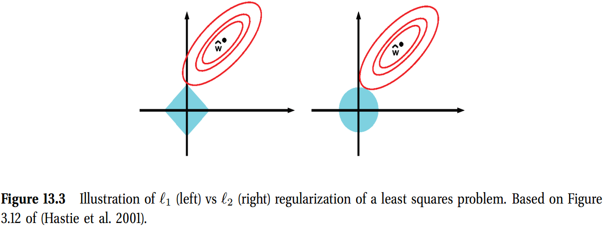

我们在偏离项上使用一个均匀分布，$p(w_0)\propto1$。我们执行有这个先验的MAP估计。惩罚的负对数似然的形式为
$$
f(\mathbf{w}) = -\log p(\mathcal{D}\vert\mathbf{w})-\log p(\mathbf{w}\vert \lambda) = \text{NLL}(\mathbf{w}) + \lambda \lVert \mathbf{w} \rVert_1   \tag{13.33}
$$
其中$\lVert\mathbf{w}\rVert_1=\sum_{j=1}^D\lvert w_j\rvert$是$\mathbf{w}$的$\ell_1$范数。对于足够大的$\lambda$，估计$\hat{\mathbf{w}}$将是稀疏的，原因解释如下。确实，这个可以被看作是一个对非凸$\ell_0$目标的凸近似
$$
\argmin_{\mathbf{w}}  \text{NULL}(\mathbf{w}) + \lambda\lVert\mathbf{w}\rVert_0 \tag{13.34}
$$
在线性回归的情况下，$\ell_1$的目标变为
$$
\begin{aligned}
  f(\mathbf{w}) &= \sum_{i=1}^N -\frac{1}{2\sigma^2}\left( y_i- (w_0 + \mathbf{w}^T\mathbf{w}_i )  \right) +\lambda \lVert\mathbf{w}\rVert_1 \\
  &= \text{RSS}(\mathbf{w}) + \lambda^{\prime}\lVert\mathbf{w}\rVert_1
\end{aligned}
$$
其中$\lambda^{\prime}=2\lambda\sigma^2$。该方法称为**基向追踪去噪**或**BPDN**。通常，给参数赋予一个零均值Laplace先验，执行MAP估计称为$\ell_1$**正则化**。将凸或非凸NLL项组合起来。

### 13.3.1 Why does $\ell_1$ regularization yield sparse solutions?

我们现在解释为什么$\ell_1$正则化会产生稀疏解，然而$\ell_2$正则化不会。我们现在关注线性回归的情况，尽管相同的参数对于logistics回归以及其他GLMs都类似。

目标函数为如下非平滑目标函数
$$
\min_{\mathbf{w}}\quad \text{RSS}(\mathbf{w}) + \lambda\lVert\mathbf{w}\rVert_1  \tag{13.37}
$$
我们可以将其重写一个约束但平滑的目标函数(有线性约束的二次型函数)
$$
\min_{\mathbf{w}}\;\text{RSS}(\mathbf{w})  \qquad \text{s.t.} \lVert\mathbf{w}\rVert_1 \leqslant B    \tag{13.38}
$$
其中$B$是权重$\ell_1$范数的上界：一个很小的B对应于一个很大的惩罚$\lambda$，相反亦成立。方程13.38称为lasso，代表了"least absolute shrinkage and selection operator"。

类似的，我们可以写岭回归如下
$$
\min_{\mathbf{w}}\quad \text{RSS}(\mathbf{w}) + \lambda\lVert\mathbf{w}\rVert_2^2  \tag{13.39}
$$
或是一个有边界的约束形式
$$
\min_{\mathbf{w}}\;\text{RSS}(\mathbf{w})  \qquad \text{s.t.} \lVert\mathbf{w}\rVert_2^2  \leqslant B    \tag{13.38}
$$
在图13.3中，我们画出了RSS目标的轮廓，以及$\ell_1$与$\ell_2$的约束面。根据约束优化理论，我们知道最优解出现在**目标函数的最低层集**与约束表面相交的点(假设约束处于活动状态)。几何上应该清楚，随着我们放松约束B，可以使$\ell_1$球**变大**直到其遇到目标函数；球的角比椭圆的一侧更可能与椭圆相交，尤其是在高尺寸的情况下，因为角更“伸出”。角对应于稀疏解，它们位于坐标轴上。相比之下，当我们长出$\ell_2$球时，它可以在任何点与物镜相交；没有“角落”，所以没有稀疏性。

为了进一步了解这个，注意到，有岭回归，一个稀疏解,如$\mathbf{w}=(1,0)$,的先验成本与一个稠密解$\mathbf{w}=(1/\sqrt{2}, 1/\sqrt{2})$的成本是一样的，只要其有相同的$\ell_2$
$$
\lVert (1,0)\rVert_2 = \lVert (1/\sqrt{2}, 1/\sqrt{2}) \rVert_2 = 1
$$
然而，对于lasso，设置为$\mathbf{w}=(1,0)$比设置为$\mathbf{w}=(1/\sqrt{2}, 1/\sqrt{2})$更便宜，因为
$$
\lVert (1,0)\rVert_1 = 1 \lt \lVert (1/\sqrt{2}, 1/\sqrt{2}) \rVert_1 = \sqrt{2}
$$

### 13.3.2 Optimality conditions for lasso

lasso目标函数的形式为
$$
f(\boldsymbol{\theta}) = \text{RSS}(\boldsymbol{\theta}) + \lambda\lVert\mathbf{w}\rVert_1    \tag{13.43}
$$

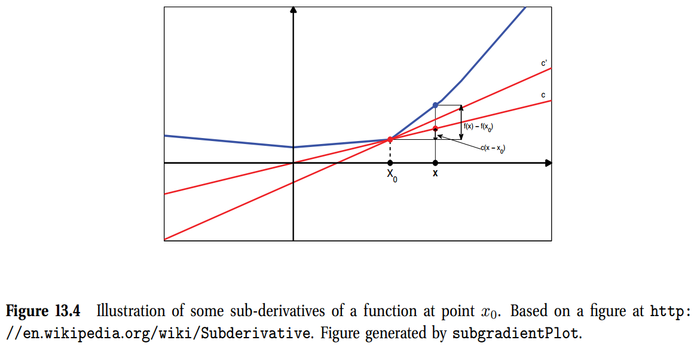

不幸的是，$\lVert\mathbf{w}\rVert_1$项在$w_j=0$处不可微。这是一个**非平滑**优化的问题的例子。

为了处理非平滑问题，我们需要扩展一个导数的概念。我们定义一个函数$f:\mathcal{I}\rightarrow\mathbb{R}$在点$\theta_0$处的子导数或子梯度是一个标量$g$使得
$$
f(\theta) - f(\theta_0) \geqslant g(\theta - \theta_0), \forall \theta \in \mathcal{I}    \tag{13.44}
$$
其中$\mathcal{I}$是包含$\theta_0$的区间。图13.4中有解释。我们定义子导数的集合是区间$[a, b]$，其中$a,b$是单边极限
$$
a = \lim_{\theta\rightarrow\theta_0^-}\frac{f(\theta)-f(\theta_0)}{\theta - \theta_0}, \;  b = \lim_{\theta\rightarrow\theta_0^+}\frac{f(\theta)-f(\theta_0)}{\theta - \theta_0}  \tag{13.46}
$$
所有子导数的集合$[a, b]$称为函数$f$在点$\theta_0$处的次微分，记为$\partial f(\theta)\vert_{\theta_0}$。例如，在绝对值函数$f(\theta)=\vert\theta\vert$的情况下，子导数给定为
$$
\partial f(\theta) = \begin{cases}
  \{-1\}  &\text{if}\; \theta < 0\\
  [-1, 1] &\text{if}\; \theta = 0 \\
  \{+1\} &\text{if}\; \theta > 0
\end{cases}
$$
如果函数处处可微，那么$\partial f(\theta) = \{ \frac{df(\theta)}{d\theta} \}$。类似于标准积分的结果，我可以证明当且仅当$0\in\partial f(\theta)\vert\hat{\theta}$时点$\hat{\theta}$是函数$f$的局部最小值。

我们将这些概念应用到lasso问题。我们首先忽略非平滑惩罚项。可以证明：
$$
\begin{aligned}
  \frac{\partial}{\partial w_j} \text{RSS}(\mathbf{w}) &= a_jw_j - c_j \\
  a_j &= 2\sum_{i=1}^n x_{ij}^2 \\
  c_j &= 2\sum_{i=1}^n x_{ij} (y_i - \mathbf{w}_{-j}^T\mathbf{x}_{i, -j})
\end{aligned}
$$
其中$\mathbf{w}_{-j}$是没有成分$j$的$\mathbf{w}$，对于$\mathbf{x}_{i, -j}$也类似。我们看到$c_j$是第$j$个特征$\mathbf{x}_{:,j}$与其他特征的残差($\mathbf{r}_{-j} = \mathbf{y-X}_{:,-j}\mathbf{w}_{-j}$)之间的相关性。因此，$c_j$的大小表示特征$j$与预测$\mathbf{y}$的相关性(相对于其他特征和当前参数)。

添加惩罚项，我们发现子导数给定为
$$
\begin{aligned}
  \partial_{w_j}f(\mathbf{w}) &= (a_jw_j-c_j) + \lambda\partial_{w_j}\Vert\mathbf{w}\Vert_1 \\
  &= \begin{cases}
    \{a_jw_j-c_j-\lambda\}  &\text{if}\; w_j < 0\\
    [-c_j-\lambda, -c_j+\lambda] &\text{if}\; w_j = 0 \\
    \{a_jw_j-c_j+\lambda\} &\text{if}\; w_j > 0
  \end{cases}
\end{aligned}
$$
可以写成更加紧凑的形式
$$
\mathbf{X}^T\mathbf{Xw-y}_j\in \begin{cases}
    \{-\lambda\}  &\text{if}\; w_j < 0\\
    [-\lambda, \lambda] &\text{if}\; w_j = 0 \\
    \{\lambda\} &\text{if}\; w_j > 0
\end{cases}
$$

依赖于$c_j$的值，$\partial_{w_j}f(\mathbf{w})=0$在3个不同的$w_j$值有解，如下：
1. 如果$c_j\lt-\lambda$，所以特征与残差强负相关，那么子梯度在处$\hat{w}_j=\frac{c_j+\lambda}{a_j}<0$为0。
2. 如果$c_j\in[-\lambda,\lambda]$，所以特征在特征弱相关，那么子梯度在$\hat{w}_j=0$处为0。
3. 如果$c_j\gt\lambda$，所以特征与残差强正相关，那么子梯度在处$\hat{w}_j=\frac{c_j+\lambda}{a_j}>0$为0。

总结下来就是
$$
\hat{w}_j(c_j) = \begin{cases}
  (c_j+\lambda)/a_j & \text{if}\; c_j \lt -\lambda \\
  0 & \text{if}\; c_j \in  [-\lambda, \lambda] \\
  (c_j-\lambda)/a_j & \text{if} \; c_j \gt \lambda
\end{cases}
$$
可以将其写为如下：
$$
\hat{w}_j = \text{soft}(\frac{c_j}{a_j}; \frac{\lambda}{a_j})
$$
其中
$$
\text{soft}(a;\delta) \triangleq \text{sign}(a)(\vert a\vert-\delta)_+
$$
这称为软阈值。在图13.5(a)中有所解释，我们画出了$\hat{w}_j$与$c_j$。虚线是直线$w_j=c_j/a_j$对应于最小二乘拟合。实线代表了正则化估计$\hat{w}_j(c_j)$，上下偏移了$\lambda$，除了当$-\lambda\leq c_j\leq \lambda$，此时设置为$w_j=0$。

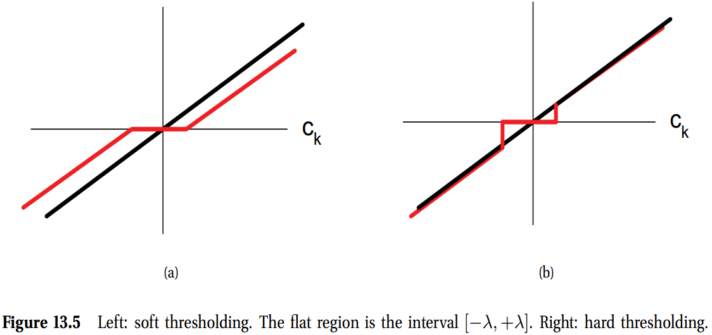

相反的，在图13.5(b)中，我们解释了**硬阈值**。当$-\lambda\leq c_j\leq \lambda$时设置$w_j=0$，但是在区间外不会shrink$w_j$的值。软阈值线的斜率与对角线不一致，这意味着即使大系数也会向零收缩；因此，**lasso是一个有偏估计**。这是不可取的，因为如果似然性表明(通过$c_j$)系数$w_j$应该很大，我们不想缩小它。我们将在第13.6.2节中更详细地讨论这个问题。

现在我们终于可以理解为什么Tibshirani在(Tibshirani 1996)中发明了术语“lasso”：它代表“最小绝对选择和收缩算子”，因为它选择了变量的子集，并通过惩罚绝对值来收缩所有系数。如果$\lambda=0$，我们得到OLS解。如果$\lambda \geq \lambda_{max}$，我们得到$\hat{\mathbf{w}}=\mathbf{0}$，我们有
$$
\lambda_{max} = \Vert\mathbf{X}^T\mathbf{y}\Vert_{\infin}=\max_j\vert\mathbf{y}^T\mathbf{x}_{:,j}\vert    \tag{13.57}
$$
该解的求解使用了一个事实，如果对于所有的$j$，如果$(\mathbf{X}^T\mathbf{y})_j\in[-\lambda,\lambda]$，$\mathbf{0}$是最优解。一般，对于一个$\ell_1$正则化目标函数的一个最大惩罚是
$$
\lambda_{max} = \max_j \lvert\nabla_j NLL(\mathbf{0})\rvert   \tag{13.58}
$$

### 13.3.3 Comparison of least squares, lasso, ridge and subset selection

可以通过对比$\ell_1$正则化与最小二乘、$\ell_2$以及$\ell_0$正则化最小二乘，进一步了解$\ell_1$正则化。出于简化，假设$\mathbf{X}$的所有特征是正交化的，所以$\mathbf{X}^T\mathbf{X}=\mathbf{I}$。这种情况下，RSS给定为
$$
\begin{aligned}
  \text{RSS}(\mathbf{w}) &= \lVert\mathbf{y-Xw}\rVert^2 = \mathbf{y}^T\mathbf{y} + \mathbf{w}^T\mathbf{X}^T\mathbf{Xw} - 2\mathbf{w}^T\mathbf{X}^T\mathbf{y} \\
  &= \text{const} + \sum_kw_k^w - 2\sum_k\sum_i w_kx_{ik}y_i
\end{aligned}
$$
所以我们可以将其分解为数项之和。因此，我们可以将MAP和ML估计值写下来，如下所示：
- **MLS** OLS解给定为
  $$
  \hat{w}^{OLS}_k = \mathbf{x}_{:k}^T\mathbf{y}
  $$
  其中$\mathbf{x}_{:k}$是$\mathbf{X}$的第k列。这与于方程13.60基本一致。我们看到$\hat{w}_k^{OLS}$是特征$k$到响应向量的正交映射。
- **Ridge** 岭估计给定为
  $$
  \hat{w}_k^{ridge}=\frac{\hat{w}_k^{OLS}}{1+\lambda}
  $$
- **Lasso**
- 
- **Subset selection**

### 13.3.5 Model selection

使用$\ell_1$正则化来估计相关变量集是很有诱惑力的。在某些情况下，我们可以恢复生成数据的参数向量$\mathbf{w}*$的真实稀疏模式。一种能在$N\rightarrow\infin$极限下恢复真实模型的方法称为**模型选择一致**。关于哪些方法具有这种属性以及何时具有这种属性的详细信息超出了本书的范围；有关详细信息，请参见(Buhlmann and van de Geer 2011)。

### 13.3.6 Bayesian inference for linear models with Laplace priors

我们之前关注了稀疏线性模型的MAP估计。也可以执行贝叶斯推理。然而，后验均值以及中位数，以及来自后验的采样不是稀疏的；只有模型是稀疏的。这是5.2.1节中讨论的现象的另一个例子，在这里我们说过，MAP估计通常与后验概率的大部分不典型。

赞成使用后验均值的另一个论点来自公式5.108，该方程式表明，如果我们想最小化平方预测误差，则最好采用后验均值而不是后验众数。(Schniter et al。2008)在实验上显示，而(Elad and Yavnch 2009)从理论上显示，使用后验均值和尖峰-平板的先验结果比使用后验模式和Laplace先验的预测结果更好，尽管 计算成本略高。

## 13.4 $\ell_1$ regularization: algorithms

本节中，我们将介绍一些可以用来求解$\ell_1$正则化估计问题的算法。我们关注lasso问题，其中有一个二次型损失。然而，大多数算法，可以扩展到更加通用的设置，例如logistics回归。请注意，机器学习的这一领域正在迅速发展，因此，在阅读本章时，以下方法可能不是最新技术。

### 13.4.1 Coordinate descent

有时，很难同时优化所有的变量，但是可以对其进行单独优化。尤其，我们可以固定其余参数求解第j个系数
$$
w_j^* = \argmax_z f(\mathbf{w}+z\mathbf{e}_j) - f(\mathbf{w}) \tag{13.65}
$$
其中$\mathbf{e}_j$是第$j$个单位向量。我们既可以确定性地遍历坐标，也可以随机采样，也可以选择更新梯度最陡的坐标。

如果可以解析地解决每个一维优化问题，则坐标下降法尤其有吸引力。例如，lasso的**射击(shotting)** 算法（Fu 1998； Wu and Lange 2008）使用公式13.54在给定所有其他系数的情况下计算$w_j$的最佳值。有关伪代码，请参见算法7（有关Matlab代码，请参见LassoShooting）。

参见(Yaun et al.2010)，将这种方法扩展到logistics回归案例。最终的算法是他们进行实验比较时最快的方法，该方法涉及使用大型稀疏特征向量(代表单词袋bags of words)对文档进行分类。其他类型的数据(例如，密集特征和/或回归问题)可能需要使用不同的算法。

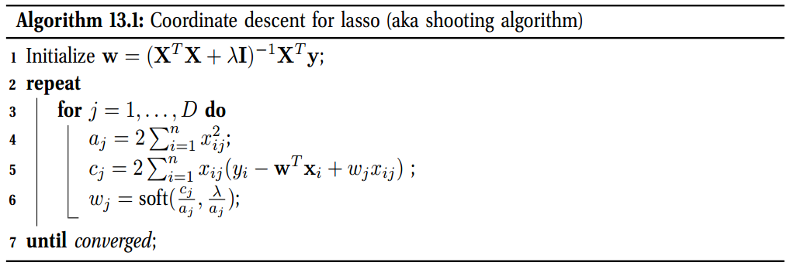

### 13.4.2 LARS and other homotopy methods

**坐标下降**的问题在于它一次仅更新一个变量，因此收敛速度会很慢。**活动集(Active set)** 方法一次更新许多变量。不幸的是，它们更加复杂，因为需要确定哪些变量被约束为零，哪些变量可以自由更新。

活动集方法通常一次只能添加或删除几个变量，因此，如果它们距离解决方案太远，它们可能会花费很长时间。但是它们非常适合于从空集开始为不同的$λ$值生成一组解，即生成正则化路径。这些算法利用了一个事实，即如果$λ_k≈λ_{k-1}$可以从$\hat{\mathbf{w}}(\lambda_{k-1})$快速计算$\hat{\mathbf{w}}(\lambda_{k})$;这被称为热启动。实际上，即使我们只希望针对单个值$λ$的解称为$λ_∗$，使用热启动来计算从$λ_{max}$到$λ_∗$的一组解有时在计算上也会更高效；这称为连续方法或同伦方法。这通常比直接在$\lambda_∗$处“冷启动”要快得多； 如果$λ_∗$小，则尤其如此。

机器学习中的同伦方法最著名的例子也许是LARS算法，它代表“least angle regression and shrinkage”(类似的算法是在Osborne等人2000b中独立发明）。这样可以有效地为$\lambda$的所有可能值计算$\hat{\mathbf{w}}(\lambda)$。

LARS的工作原理如下。它以较大的$λ$值开始，因此仅选择与响应向量$\mathbf{y}$最相关的变量。然后减小$λ$直到找到与第一个变量与残差相关性(在幅度上)相同的第二个变量，其中步骤k的残差定义为$rk = \mathbf{y-X}_{:,F_k}\mathbf{w}_k$，其中$F_k$是当前有效集（参见公式13.50）。值得注意的是，可以通过使用几何自变量（因此称为“最小角度”）来解析地求解$λ$的这一新值。这使算法可以快速“跳到”活动集更改的规则化路径上的下一个点。 重复此操作，直到添加了所有变量。

如果我们希望解的序列与lasso的正则化路径相对应，则必须允许从活动集中删除变量。如果我们不允许变量删除，我们会得到一个称为LAR的稍微不同的算法，该算法往往更快。特别是，LAR的时间成本与单个普通最小二乘拟合相同，即$O(ND \min(N，D))$，如果$N> D$，则为$O(ND^2)$；如果$D> N$，则为$O(N^2D)$。与贪婪的前向选择非常相似，一种称为**最小二乘boosting**的方法（请参见第16.4.6节）。

已经尝试扩展LARS算法，以计算$\ell_1$正则化GLM的完整正则化路径，例如logistics回归。通常，不能解析地求解$λ$的临界值。相反，标准方法是从$\lambda_{max}$开始，然后缓慢减小$\lambda$，随着我们的前进跟踪解；这称为**连续方法**或**同伦方法**。这些方法利用了以下事实：如果$\lambda_k≈\lambda_{k-1}$，我们可以从$\hat{\mathbf{w}}(λ_{k-1})$快速计算$\hat{\mathbf{w}}(λ_{k})$。这被称为**热启动**。即使我们不希望使用完整路径，该方法通常也比直接“冷启动”所需的λ值要快得多（如果λ很小，则尤其如此）。

### 13.4.3 Proximal and gradient projection methods

在本节中，我们考虑一些适用于非常大的问题的方法，在这些问题中，同伦方法变得太慢了。这些方法也将很容易扩展到除$\ell_1$以外的其他类型的正则化器，我们将在后面看到。本节中的介绍基于（Vandenberghe 2011; Yang et al.2010）

考虑一个形式如下的凸目标
$$
f(\boldsymbol{\theta}) = L(\boldsymbol{\theta}) + R(\boldsymbol{\theta})  \tag{13.66}
$$
其中$L(\boldsymbol{\theta})$(代表损失)是凸的与可微的，且$R(\boldsymbol{\theta})$(代表了正则器)是凸的但不是必须可微的。例如，$L(\boldsymbol{\theta})=\text{RSS}(\boldsymbol{\theta})$与$R(\boldsymbol{\theta})=\lambda\lVert \boldsymbol{\theta}\rVert_1$对应于BPDN问题。另一个例子是，lasso问题可以描述为$L(\boldsymbol{\theta})=\text{RSS}(\boldsymbol{\theta})$与$R(\boldsymbol{\theta})=I_C(\boldsymbol{\theta})$,其中$C=\{\boldsymbol{\theta}: \lVert \boldsymbol{\theta}\rVert_1\leq B\}$，且$I_C(\boldsymbol{\theta})$是一个凸集$C$的指示函数，定义如下：
$$
I_C(\boldsymbol{\theta}) \triangleq \begin{cases}
  0 & \boldsymbol{\theta}\in C \\
  +\infin & \text{otherwise}
\end{cases}  \tag{13.67}
$$

某些情况下，很容易优化方程13.66中国的形式。例如，假设$L(\boldsymbol{\theta})=\text{RSS}(\boldsymbol{\theta})$，设计矩阵为$\mathbf{X=I}$。然后，目标变为$f(\boldsymbol{\theta})=R(\boldsymbol{\theta})+ \frac{1}{2}\lVert\boldsymbol{\theta}-\mathbf{y}\rVert_2^2$。该方程的最小值给定为$\text{prox}_R(\mathbf{y})$，这是凸函数$R$的近端算子，定义为
$$
\text{porx}_R(\mathbf{y}) = \argmin_{\mathbf{z}}\left( R(\mathbf{z})  + \frac{1}{2}\lVert \mathbf{z-y}\rVert_2^2 \right)  \tag{13.68}
$$

直观地，我们返回的点使$R$最小，但也接近(接近)$\mathbf{y}$。通常，我们将在迭代优化器中使用此运算符，在这种情况下，我们希望保持与之前的迭代相似。这种情况下，我们使用
$$
\text{porx}_R(\boldsymbol{\theta}_k) = \argmin_{\mathbf{z}}\left( R(\mathbf{z})  + \frac{1}{2}\lVert \mathbf{z}-\boldsymbol{\theta}_k\rVert_2^2 \right)  \tag{13.69}
$$

关键问题是：如何有效地为不同的调节器$R$计算近端算子，以及如何将该技术扩展到更一般的损失函数$L$?我们在下面讨论这些问题。

#### 13.4.3.1 Proximal operators

如果$R(\boldsymbol{\theta}) = \lambda\lVert\boldsymbol{\theta}\rVert_1$，近端算子给定为逐成分的软阈值：
$$
\text{porx}_R(\boldsymbol{\theta}) = \text{soft}(\boldsymbol{\theta},\lambda) \tag{13.70}
$$
。如果$R(\boldsymbol{\theta}) = \lambda\lVert\boldsymbol{\theta}\rVert_0$，近端算子给定为逐成分的硬阈值：
$$
\text{porx}_R(\boldsymbol{\theta}) = \text{hard}(\boldsymbol{\theta},\sqrt{2\lambda}) \tag{13.71}
$$
其中$\text{hard}(u,a)\triangleq u\mathbb{I}(\lvert u\rvert>a)$。

如果$R(\boldsymbol{\theta}) = I_C(\boldsymbol{\theta})$，近端算子给定为到集合$C$的映射：
$$
\text{prox}_R(\boldsymbol{\theta})=\argmax_{\mathbf{z}\in C}\lVert\mathbf{z}-\boldsymbol{\theta}\rVert_2^2 = \text{proj}_C(\boldsymbol{\theta}) \tag{13.72}
$$
对于一些凸集，是很容易计算映射算子的。例如，为了映射到由箱型约束$C=\{\boldsymbol{\theta}:\ell_j\leq\theta_j\leq u_j\}$定义的矩形集合，我们可以使用
$$
\text{proj}_C(\boldsymbol{\theta})_j = \begin{cases}
  \ell_j & \theta_j\leq \ell_j\\
  \theta_j & \ell_j \leq \theta_j \leq u_j\\
  u_j & \theta_j \geq u_j
\end{cases}
$$
为了映射到欧式包中$C=\{\boldsymbol{\theta} : \lVert\boldsymbol{\theta}\rVert_2 \leq 1\}$，我们使用
$$
\text{proj}_C(\boldsymbol{\theta})_j = \begin{cases}
    \frac{\boldsymbol{\theta}}{\lVert\boldsymbol{\theta}\rVert_2} & \lVert\boldsymbol{\theta}\rVert_2 \gt 1 \\
    \boldsymbol{\theta} & \lVert\boldsymbol{\theta}\rVert_2 \leq  1
\end{cases}
$$
为了映射到1范数包$C=\{\boldsymbol{\theta} : \lVert\boldsymbol{\theta}\rVert_1 \leq 1\}$，我们可以使用
$$
\text{proj}_C(\boldsymbol{\theta}) = \text{soft}(\boldsymbol{\theta}, \lambda) \tag{13.75}
$$
其中如果$\lVert\boldsymbol{\theta}\rVert_1 \leq 1$, $\lambda=0$，要不然$\lambda$是方程
$$
\sum_{j=1}^D \max(\lvert\theta\rvert-\lambda,0)=1\tag{13.76}
$$
的解。

#### 13.4.3.2 Proximal gradient method

现在我们讨论如何在梯度下降例程中使用近端运算符。 基本思想是最小化以$\boldsymbol{\theta}_k$为中心的损失函数的简单二次逼近:
$$
\boldsymbol{\theta}_{k+1} = \argmax_{\mathbf{z}} R(\mathbf{z}) + L(\boldsymbol{\theta}_k) + \mathbf{g}_k^T(\mathbf{z}-\boldsymbol{\theta}_k) + \frac{1}{2t_k}\lVert\mathbf{z}-\boldsymbol{\theta}\rVert_2^2 \tag{13.77}   
$$
其中$\mathbf{g}_k = \nabla L(\boldsymbol{\theta}_k)$是损失的梯度，$t_k$是常数，最后一项来自损失的Hessian的简单近似，形式为$\nabla^2 L(\boldsymbol{\theta}_k)\approx \frac{1}{t_k}\mathbf{I}$。

丢弃与$\mathbf{z}$不相关的项，乘以$t_k$，可以重写为如下
$$
\begin{aligned}
  \boldsymbol{\theta}_{k+1} &= \argmin_{\mathbf{z}}\left[ t_k R(\mathbf{z}) + \frac{1}{2}\lVert\mathbf{z-u}_k\rVert_2^2  \right] = \text{prox}_{t_{k}} R(\mathbf{u}_k) \\
  \mathbf{u}_k &= \boldsymbol{\theta}_k - t_k\mathbf{g}_k \\
  \mathbf{g}_k &= \nabla L(\boldsymbol{\theta}_k)
\end{aligned}
$$
如果$R(\boldsymbol{\theta})=0$，这等效于梯度下降。如果$R(\boldsymbol{\theta})=I_C(\boldsymbol{\theta})$，方法等效于**映射梯度下降**，在图13.11。如果$R(\boldsymbol{\theta}) = \lambda\lVert\boldsymbol{\theta}\rVert_1$，方法称为迭代软阈值。

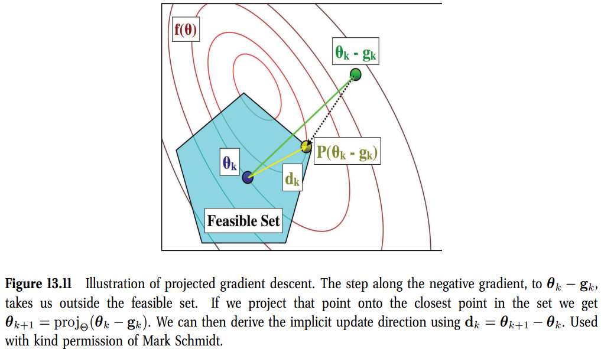

有几种方式来挑选$t_k$，或等效于$\alpha_k=1/t_k$。给定$\alpha_k\mathbf{I}$是一个对Hessian$\nabla^2L$的一个近似，我们需要在最小二乘下
$$
\alpha_k (\boldsymbol{\theta}_k - \boldsymbol{\theta}_{k-1}) \approx \mathbf{g}_k - \mathbf{g}_{k-1}    \tag{13.81}
$$
因此，
$$
\alpha_k = \argmin_{\alpha}\lVert \alpha(\boldsymbol{\theta}_k - \boldsymbol{\theta}_{k-1}) - (\mathbf{g}_k - \mathbf{g} _{k-1})  \rVert_2^2 = \frac{(\boldsymbol{\theta}_k - \boldsymbol{\theta}_{k-1})^T  (\mathbf{g}_k - \mathbf{g} _{k-1}) }{(\boldsymbol{\theta}_k - \boldsymbol{\theta}_{k-1})^T(\boldsymbol{\theta}_k - \boldsymbol{\theta}_{k-1})}      \tag{13.82}
$$
这称为Barzilai-Borwein(BB)或谱步长。这个步长可以用于任何一种梯度方法，无论是否是proximal。这不会导致目标的单调下降，但是相对比标准线搜索技术会更快。

当我们将BB步长与迭代软阈值技术(对于$R(\boldsymbol{\theta})=\lambda(\lVert\boldsymbol{\theta}\rVert_1)$)，加上一个逐渐下降$\lambda$的连续方法，我们得到一个对于BPDN问题更加方法，称为SpaRSAP算法，代表了““sparse reconstruction by separable approximation”。

#### 13.4.3.3 Nesterov’s method

可以通过围绕除最近参数值以外的其他点展开二次逼近来获得近端梯度下降的更快版本。特别是考虑指向更新
$$
\begin{aligned}
  \boldsymbol{\theta}_{k+1} &= \text{prox}_{t_kR}(\boldsymbol{\phi}_k-t_k\mathbf{g}_k)  \\
  \mathbf{g}_k &= \nabla L(\boldsymbol{\phi}_k)  \\
  \boldsymbol{\phi}_k &= \boldsymbol{\theta}_k + \frac{k-1}{k+2}(\boldsymbol{\theta}_k - \boldsymbol{\theta}_{k-1})
\end{aligned}   \tag{13.83-13.85}
$$
该算法称为**Nesterov方法**。有多种方式来设置$t_k$；一般使用直线搜索。

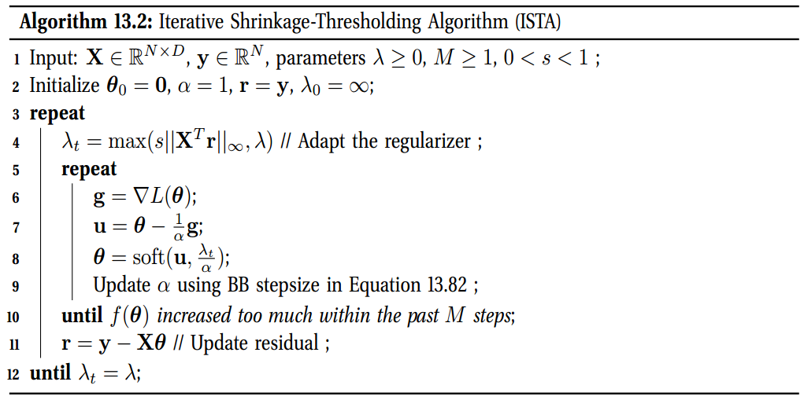

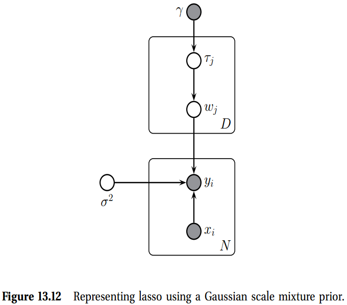

当这个方法与迭代软阈值技术(对于$R(\boldsymbol{\theta})=\lambda(\lVert\boldsymbol{\theta}\rVert_1)$)，加上一个逐渐下降$\lambda$的连续方法，我们得到一个更快方法，称为**fast iterative shrinkage thesholding algorithm**或**FISTA**。

### 13.4.4 EM for lasso

本节中，我们将解释如何使用EM求解lasso问题，第一眼，可能看起来奇怪，因为这里没有别的隐变量。关键视角是我们可以将Laplace分布看作一个高斯比例混合(Gaussian Scale Mixture)，公式如下
$$
\text{Lap}(w_j\vert 0, 1/\gamma) = \frac{\gamma}{2} e^{-\gamma\lvert w_j\rvert} = \int \mathcal{N}(w_j\vert 0,\tau_j^2) \text{Ga}(\tau_j^2\vert 1, \frac{\gamma^2}{2})d\tau_j^2     \tag{13.86}
$$
那么，Laplace是一个GSM，其中方差的混合分布是指数分布，$\text{Expon}(\tau^2_j\vert 1, \frac{\tau^2}{2})$。使用这个分解，我们将lasso模型展示为图13.12。对应的联合分布形式为
$$
\begin{aligned}
  p(\mathbf{y,x},\boldsymbol{\tau},\sigma^2\vert \mathbf{X}) =& \mathcal{N}(\mathbf{y\vert Xw}, \sigma^2\mathbf{I}_N)\mathcal{N}(\mathbf{w\vert 0, D}_{\tau})  \\
  & \text{IG}(\sigma^2\vert a_{\sigma}, b_{\sigma})\left[\prod_{j}\text{Ga}(\tau_j^2 \vert 1,\gamma^2/2 )  \right]
\end{aligned}
$$
其中$\mathbf{D}_{\tau}=\text{diag}(\tau_j^2)$，且出于符号简化，我们假设$\mathbf{X}$是标准化的，且$\mathbf{y}$是中心化的。扩展，我们得到
$$
\begin{aligned}
  p(\mathbf{y,x},\boldsymbol{\tau},\sigma^2\vert \mathbf{X}) \propto& (\sigma^2)^{-N/2} \exp\left(-\frac{1}{2\sigma^2}\lVert \mathbf{y-Wx} \rVert_2^2\right)\lvert\mathbf{D}_{\tau}\rvert^{-\frac{1}{2}} \\
  &\exp
\end{aligned}
$$
下面我们描述如何将EM算法应用到图13.12中的模型。简而言之，在E步，我们推理$\tau_j^2$与$\sigma^2$，在M步我们估计$\mathbf{w}$。得到的估计$\hat{\mathbf{w}}$与lasso估计器一样的。

#### 13.4.4.1 Why EM?

#### 13.4.4.2 The objective function

从方程13.88中得到，完整的数据惩罚对数似然为
$$
\ell_c(\mathbf{w}) = -\frac{1}{2\sigma^2}\lVert \mathbf{y-Xw} \rVert_2^2 - \frac{1}{2}\mathbf{w}^T\mathbf{\Lambda w} + \text{const}    \tag{13.89}
$$
其中$\mathbf{\Lambda}=\text{diag}(\frac{1}{\tau_j^2})$ 是$\mathbf{w}$的精确矩阵。

#### 13.4.4.3 The E step

关键是计算$\mathbb{E}\left[\frac{1}{\tau_j^2}\vert w_j\right]$。我们可以直接推导出。另外，我可以得到完全后验，给定为如下：
$$
p(1/\tau_j^2\vert \mathbf{w},\mathcal{D}) = \text{InverseGaussian}\left( \sqrt{\frac{\gamma^2}{w_j^2}},\gamma^2 \right)   \tag{13.90}
$$
(注意到，**InverseGaussian**也称为Wald分布。)因此，
$$
\mathbb{E}\left[\frac{1}{\tau_j^2}\vert w_j\right] = \frac{\gamma}{\lvert w_j\rvert}  
\tag{13.91}
$$
令$\bar{\mathbf{\Lambda}}=\text{diag}(\mathbb{E}[1/\tau_1^2], \cdots, \mathbb{E}[1/\tau_D^2])$代表了E步的结果。

我们也需要推理$\sigma^2$。很容易证明后验是
$$
p(\sigma^2\vert\mathcal{D},\mathbf{w}) = \text{IG}(a_{\sigma} + (N)/2, b_{\sigma}+\frac{1}{2}(\mathbf{y-X\hat{w}})^T(\mathbf{y-X\hat{w}})) = \text{IG}(a_N, b_N)
$$

## 13.6 Non-convex regularizes

尽管Laplace先验导致一个凸优化问题，从统计学的角度来看，这个先验不是很理想。主要有两个问题。首先，它没有将足够的概率质量置于0附近，因此不能充分抑制噪声。其次，它没有将足够大的概率质量放在大值上，因此会导致相关系数的缩小，与“信号”相对应(如图13.5(a)所示：我们看到大系数的1个估计值明显较小 超过他们的ML估计值，这种现象称为偏见。)

这两个问题都可以通过使用更灵活的先验来解决，这些先验在0处具有较大的尖峰，并且尾部较重。即使我们再也找不到全局最优值，但无论是在预测精度还是在检测相关变量方面，这些非凸方法通常都优于1正则化（Fan和Li 2001； Schniter等人2008）。我们在下面给出一些例子。

### 13.6.1 Bridge regression
$\ell_1$正则化的一个自然推广称为岭回归，形式为
$$
\hat{\mathbf{w}} = \text{NLL}(\mathbf{w}) + \lambda\sum_{j}\lvert w_j\rvert^b 
$$
对于$b\geq 0$。这个对应于一个MAP估计，使用一个**指数幂分布(exponential power distribution)** 给定为
$$
\text{ExpPower}(w\vert\mu, a,b) \triangleq\frac{b}{2a\Tau(1+1/b)}\exp\left( -\frac{\lvert x-\mu\rvert^b}{a } \right)    \tag{13.132}
$$

如果$b=2$，我们得到高斯分布($a=\sigma\sqrt{2}$)，对应于岭回归；如果我们设置$b=1$，我们得到Laplace分布，对应于lasso；如果我们设置$b=0$，我们得到$\ell_0$回归，等效于最优子集选择。不幸的，对于$b<1$目标函数不是凸的，对于$b>1$不是促进稀疏的。所以$\ell_1$范数是对$\ell_0$范数的最紧的凸近似。

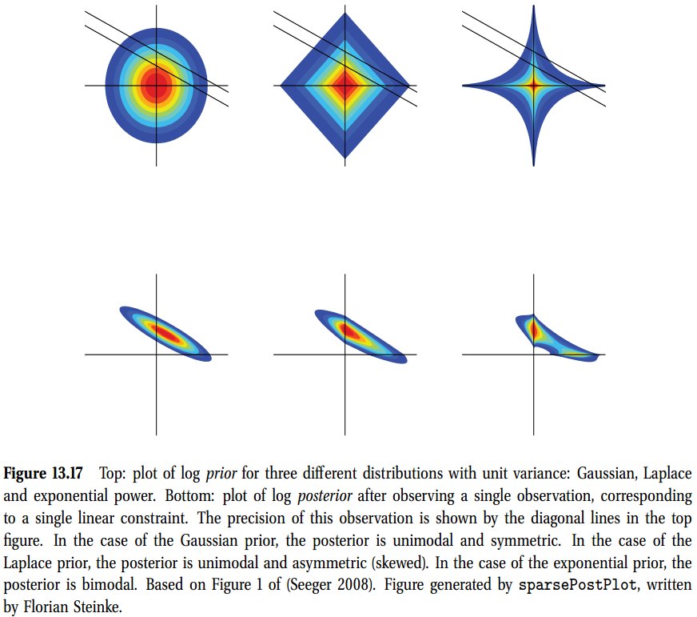

改变$b$的影响在图13.17中有所解释，其中我们画了$b=2,b=1$以及$b=0.4$的先验；我们假设$p(\mathbf{w})=p(w_1)p(w_2)$。我们也画了观测到单个变量后的后验$(\mathbf{x},y)$,，其中强加了一个线性约束$y=\mathbf{x}^T\mathbf{x}$，确定的容忍度由单个观测噪声所控制。

### 13.6.2 Hierarchical adaptive lasso

lasso的一个主要问题就是导致有偏估计。这是因为需要使用一个很大的$\lambda$值来刷掉不相关的参数，但是这会导致相关参数过度惩罚。如果我们可以将不同的惩罚参数与每个参数相关联会更好。当然，通过交叉验证来调整D参数是完全不可行的，但这对贝叶斯算法没有问题：我们简单的使每个$\tau_j^2$有其自己的单独的调整参数$\gamma_j$，现在将其看作一个来自共轭先验$\gamma_j\sim\text{IG}(a,b)$的随机变量。完全的模型为
$$
\begin{aligned}
  \gamma_j &\sim \text{IG}(a, b) \\
  \tau_j^2\vert \gamma_j &\sim \text{Ga}(1, \gamma_j^2/2) \\
  w_j \vert \tau_j^2 &\sim \mathcal{N}(0, \tau_j^2)
\end{aligned}
$$
看图13.18(a)。这个称为**阶层自适应lasso(HAL)**。

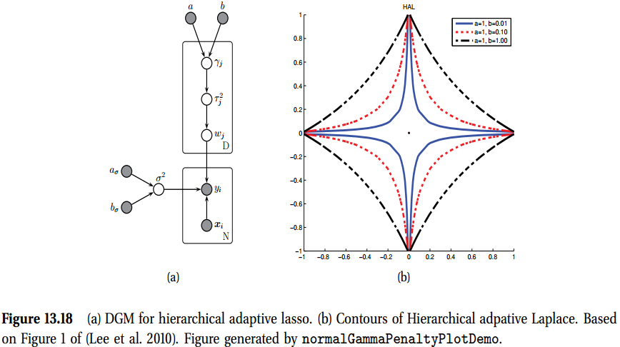

## 13.8 Sparse coding*

目前为止，我们主要集中在监督学习的稀疏先验。本节中，我们讨论在无监督学习中如何使用它们。

在12.6节中，我们讨论了ICA，有点类似与PCA，唯一不用的是对隐因子$\mathbf{z}_i$使用了一个非高斯先验。如果我们使非高斯先验成为稀疏提升，例如一个Laplace分布，我们将每个观测向量$\mathbf{x}_i$近似为基向量($\mathbf{W}$的列)的稀疏组合；注意稀疏模式从一个数据案例变化到另一个数据案例。如果我们将约束放松到$\mathbf{W}$是正交的，我们得到一个**稀疏编码**。这种背景下，我们称因子载矩矩阵$\mathbf{W}$为一个**字典**；每列称为一个原子。考虑到稀疏表示，$L\gt D$是常见的，在这种情况下，我们称该表示为**不完全表示**。

在稀疏编码中，字典可以固定的或是可学习的。如果是固定的，通常使用一个小波或是DCT基，因为许多自然信号可以通过少量这样的基函数来近似。然而，也是可以学习字典的，通过最大化似然
$$
\log p(\mathcal{D}\vert\mathbf{W}) = \sum_{i=1}^N \log \int_{\mathbf{z}_i}\mathcal{N}(\mathbf{x}_i\vert\mathbf{W}\mathbf{z}_i, \sigma^2\mathbf{I})p(\mathbf{z}_i)d\mathbf{z}_i      \tag{13.174}
$$
下面，我们讨论如何优化，以及几个有趣的应用。

不要将**稀疏PCA**与稀疏编码混淆；稀疏PCA在回归权重$\mathbf{W}$上放置了一个稀疏促进先验，稀疏编码中，我们在隐因子$\mathbf{z}_i$上放置一个稀疏促进先验。当然，两个技术可以组合起来；我们称之为**稀疏矩阵分解**，尽管这项不是标准的。表13.3中有总结。

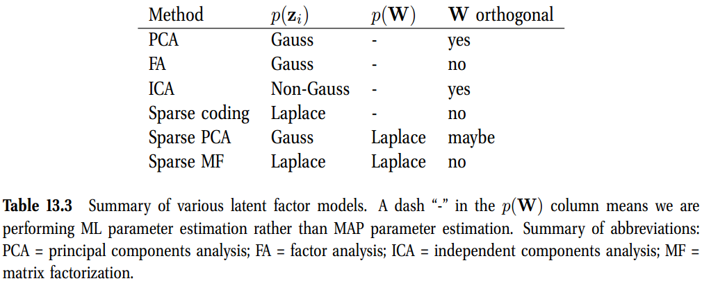

### 13.8.1 Learning a sparse coding dictionary(学习一个编码字典)

因为方程13.174有一个需要最大化的硬目标函数，通常做出如下近似
$$
\log p(\mathcal{D}\vert\mathbf{W}) \approx \sum_{i=1}^N \max_{\mathbf{z}_i}\left[ \log \mathcal{N}(\mathbf{x}_i \vert \mathbf{Wz}_i,\sigma^2\mathbf{I}) + \log p(\mathbf{z}_i)   \right]      \tag{13.175}
$$
如果$p(\mathbf{z}_i)$是Laplace，我们可以将NLL重写为
$$
\text{NLL}(\mathbf{W, Z}) = \sum_{i=1}^N \frac{1}{2} \lVert\mathbf{x}_i-\mathbf{Wz}_i\rVert_2^2 + \lambda \lVert  \mathbf{z}_i\rVert_1    \tag{13.176}
$$

为了防止$\mathbf{W}$变的任意大，通常使其列的$\ell_2$范数小于等于1。我们将约束的限制集定义为
$$
\mathcal{C} = \{\mathbf{W}\in\mathbb{R}^{D\times L} \quad \text{s.t.}\quad \mathbf{w}_j^T\mathbf{w}_j \leq 1\}      \tag{13.177}
$$
然后我们想求解$\min_{\mathbf{W}\in\mathcal{C},\mathbf{Z}\in\mathbb{R}^{N\times L}}\text{NLL}(\mathbf{W,Z})$。对于一个固定的$\mathbf{z}_i$，在$\mathbf{W}$上的优化是一个简单的最小二乘问题。对于一个固定的字典$\mathbf{W}$，$\mathbf{Z}$上优化问题等效于lasso问题，对于这种问题存在很多快速方法。这表明存在一个明显的迭代优化方案，其中我们在优化$\mathbf{W}$和$\mathbf{Z}$之间进行选择。(Mumford 1994)称这种方法为**分析-合成循环**，其中估计基础$\mathbf{W}$是分析阶段，估计系数$\mathbf{Z}$是合成阶段。在速度太慢的情况下，可以使用更复杂的算法，例如（Mairal等，2010）。

各种其他模型得到的优化问题与方程13.176类似。例如，**非负矩阵分解(NMF)** 需要求解形式为的目标函数
$$
\min_{\mathbf{W}\in\mathcal{C},\mathbf{Z}\in\mathbb{R}^{L\times N}} \frac{1}{2}\sum_{i=1}^N \lVert \mathbf{x}_i - \mathbf{Wz}_i\rVert_2^2 \quad \text{s.t.}\quad  \mathbf{W}\geq 0,\mathbf{z}_i\geq0   \tag{13.178}
$$
(没有要调节的超参。)该约束背后的直觉是学习到的字典可能更具解释力，如果学习的字典是正的“部分”的正和，而不是可能是正或负的原子的稀疏和，则它可能更具解释性。当然，我们可以将NMF与稀疏度提升相结合，从而提前发现潜在因素。这称为**非负稀疏编码(non-negative matrix factorization-NMF)**（Hoyer 2004）。

相反的，我们可以丢弃正的约束，但是在因子$\mathbf{z}_i$与$\mathbf{W}$上强加稀疏约束。我们称之为**稀疏矩阵因子化**。为了保证强凸性，我们可以在权重上使用一个弹性网络星的惩罚，得到
$$
\min_{\mathbf{W,Z}}\frac{1}{2}\sum_{i=1}^N\lVert\mathbf{x}_i - \mathbf{Wz}_i\rVert_2^2 + \lambda\lVert\mathbf{z}_i\rVert_1 \quad \text{s.t.}\quad \lVert\mathbf{w}_j\rVert_2^2 + \gamma \lVert\mathbf{w}_j \rVert_ 1 \leq 1   \tag{13.179}
$$
有几个相关的目标可以写下来。例如，我们可以用组套索或融合套索替换套索NLL(Witten et al. 2009)。

我们还可以使用拉普拉斯以外的其他稀疏性促进先验方法。例如，(Zhou et al. 2009)提出了一个模型，其中使用第13.2.2节的**二进制掩码模型**使潜因子$z_i$变得稀疏。**掩码的每个位都可以从具有参数$π$的伯努利分布中生成，该参数可以从beta分布中得出**。或者，我们可以使用非参数先验，例如**beta过程**。这允许模型使用无限制大小的字典，而不必事先指定L。**可以使用例如Gibbs采样或变分Bayes在此模型中执行贝叶斯推理**。人们发现，由于贝叶斯(Bayesian)奥卡姆(Occam)的剃刀，该词典的有效大小随着噪声水平的提高而减小。这样可以防止过拟合。有关详细信息，请参见（Zhou等，2009）。