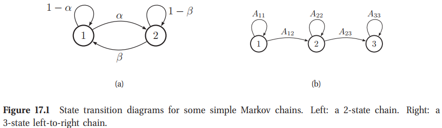
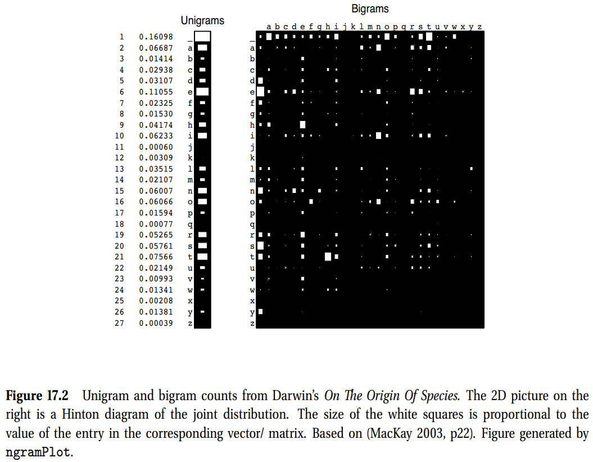
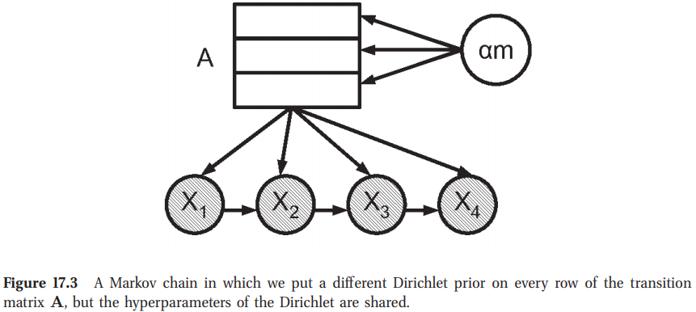
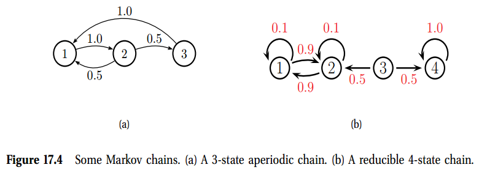
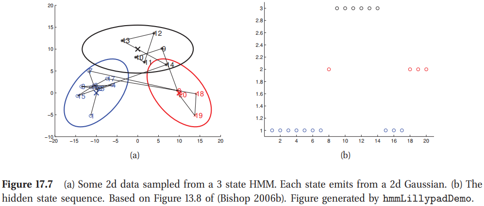
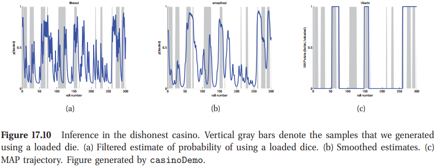
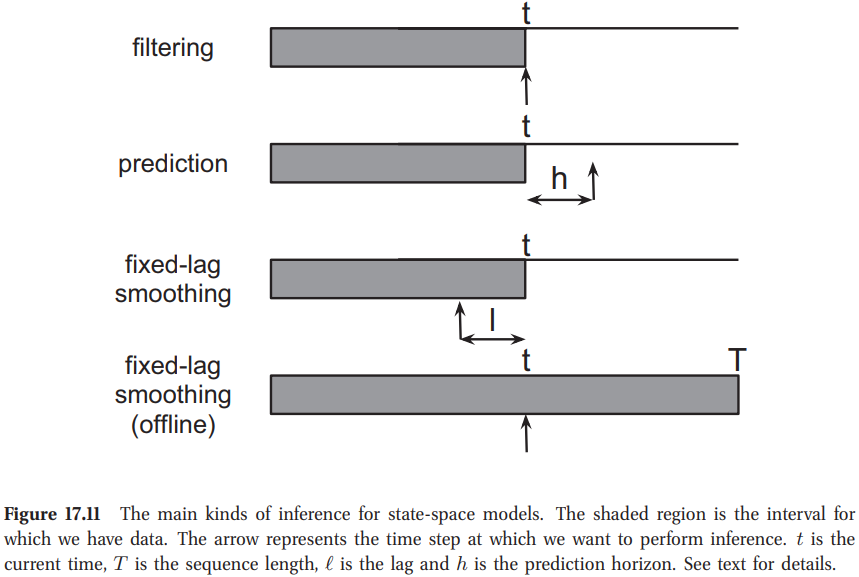
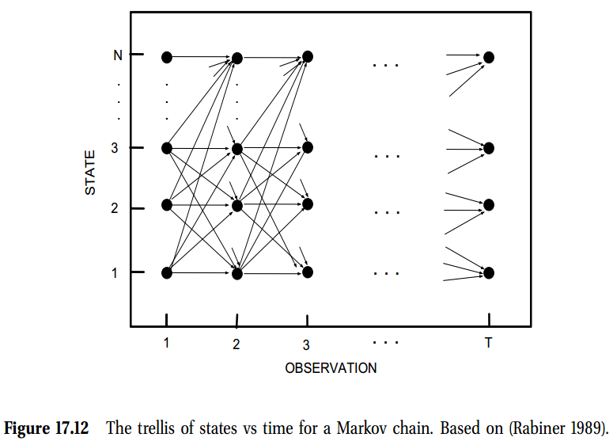
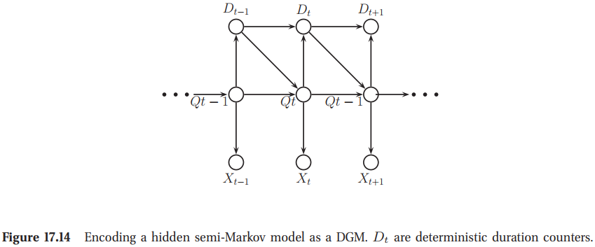
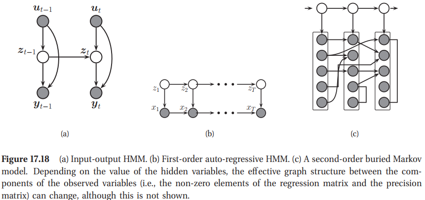

<!-- TOC -->

- [17 马尔科夫与隐马尔科夫模型(Markov and hidden Markov models)](#17-马尔科夫与隐马尔科夫模型markov-and-hidden-markov-models)
  - [17.1 引言(Introduction)](#171-引言introduction)
  - [17.2 马科夫模型(Markov models)](#172-马科夫模型markov-models)
    - [17.2.1 转移矩阵(Transition matrix)](#1721-转移矩阵transition-matrix)
    - [17.2.2 应用:语言模型(Application: Language modeling)](#1722-应用语言模型application-language-modeling)
      - [17.2.2.1 马科夫语言模型的MLE(MLE for Markov language models)](#17221-马科夫语言模型的mlemle-for-markov-language-models)
      - [17.2.2.2 删除插值的经验Bayes版](#17222-删除插值的经验bayes版)
    - [17.2.3 马科夫链的稳态分布*(Stationary distribution of a Markov chain*)](#1723-马科夫链的稳态分布stationary-distribution-of-a-markov-chain)
      - [17.2.3.1 什么是稳态分布(What is a stationary distribution?)](#17231-什么是稳态分布what-is-a-stationary-distribution)
  - [17.3 隐马科夫模型(Hidden Markov models)](#173-隐马科夫模型hidden-markov-models)
    - [17.3.1 HMMs的应用(Applications of HMMs)](#1731-hmms的应用applications-of-hmms)
  - [17.4 HMMs中的推理(Inference in HMMs)](#174-hmms中的推理inference-in-hmms)
    - [17.4.1 时间模型的推理问题类型(Types of inference problems for temporal models)](#1741-时间模型的推理问题类型types-of-inference-problems-for-temporal-models)
    - [17.4.2 前向算法(The forwards algorithm)](#1742-前向算法the-forwards-algorithm)
    - [17.4.3 前向-后向算法(The forwards-backwards algorithm)](#1743-前向-后向算法the-forwards-backwards-algorithm)
      - [17.4.3.1 基本思想(Basic idea)](#17431-基本思想basic-idea)
    - [17.4.4 Viterbi算法](#1744-viterbi算法)
      - [17.4.4.1 MAP vs MPE](#17441-map-vs-mpe)
  - [17.5 HMMs的学习(Learning for HMMs)](#175-hmms的学习learning-for-hmms)
    - [17.5.1 使用完全观测数据的训练(Training with fully observed data)](#1751-使用完全观测数据的训练training-with-fully-observed-data)
    - [17.5.2 HMMs的EM(Baum-Welch算法)(EM for HMMs(the Baum-Welch algorithm))](#1752-hmms的embaum-welch算法em-for-hmmsthe-baum-welch-algorithm)
      - [17.5.2.1 E步](#17521-e步)
      - [17.5.2.2 M步](#17522-m步)
  - [17.6 HMMs的推广(Generalizations of HMMs)](#176-hmms的推广generalizations-of-hmms)
    - [17.6.1 HHMs期间的变量(Variable duration (semi-Markov) HMMs)](#1761-hhms期间的变量variable-duration-semi-markov-hmms)
      - [17.6.1.1 HSMM as augmented HMMs](#17611-hsmm-as-augmented-hmms)
    - [17.6.3 输入输出HMMs(Input-output HMMs)](#1763-输入输出hmmsinput-output-hmms)
    - [17.6.4 自回归与buried HMMs(Auto-regressive and buried HMMs)](#1764-自回归与buried-hmmsauto-regressive-and-buried-hmms)
    - [17.6.5 Factorial HMM](#1765-factorial-hmm)
    - [17.6.6 Coupled HMM and the influence model](#1766-coupled-hmm-and-the-influence-model)

<!-- /TOC -->

# 17 马尔科夫与隐马尔科夫模型(Markov and hidden Markov models)

## 17.1 引言(Introduction)

本章中，我们讨论任意长度$T$的序列观测$X_1,\cdots,X_T$的概率模型。这种模型在计算生物、自然语言处理以及时间序列预测中有广泛应用。我们关注观测发生离散"时间步"的情况，尽管“时间”也可能指序列中的位置。

## 17.2 马科夫模型(Markov models)

回忆10.2.2节中一个马尔科夫链(Markov Chain)背后的基本思想，假设$X_t$捕获了预测未来的所有相关信息(也就是我们假设其实充分统计的)。如果我们假设离散时间步，我们可将联合分布写为
$$
p(X_{1:T}) = p(X_1)p(X_2\vert X_1)p(X_3\vert X_2)\cdots = p(X_1)\prod_{t=2}^T p(X_t\vert X_{t-1})       \tag{17.1}
$$
这称为**马尔科夫链**或**马尔科夫模型**。

如果我们假设转移函数(transition function)不是时间依赖的，那么链$p(X_t\vert X_{t-1})$称为是**同质的**、**平稳的**或**时不变的**。这是一个**参数绑定**的例子，**因为同一个参数由多个变量共享**。这个假设允许我们使用**固定数量**的参数对任意数量的变量进行建模；这种模型称为**随机过程**。

如果我们假设观测变量是离散的，所以$X_t\in\{1,\cdots,K\}$，这个称为**离散的或有限状态的马尔科夫链**。我们在剩余章节中都会使用这个假设。

### 17.2.1 转移矩阵(Transition matrix)

当$X_t$是离散时，所以$X_t\in\{1,\cdots,K\}$，条件分布$p(X_t\vert X_{t-1})$可以写为一个的$K\times K$矩阵，称为**转移矩阵**$\mathbf{A}$，其中$A_{ij}=p(X_t=j \vert X_{t-1}=i)$是从状态$i$转移到状态$j$的概率。矩阵的每行加和为$1，\sum_{j}A_{ij}=1$，所以称为一个**随机矩阵**。

> 图17.1 一些简单的Markov链的状态转移框架。Left:一个2-状态链。Right:一个3-状态从左到右的链。

一个平稳的(stationary)、有限状态的马尔科夫链(finite-state Markov chain)等效于一个**随机自动化(stochastic automation)**。通常可以将这样的自动机画为一个有向图，其中点代表状态箭头代表合理转移；也就是$\mathbf{A}$中的非零元素。这个称为一个**状态转移框架**。与弧相关的权重是概率。例如，如下的2-状态链为
$$
\mathbf{A}=\begin{pmatrix}
  1-\alpha & \alpha \\
  \beta & 1- \beta
\end{pmatrix} \tag{17.2}
$$
解释如图17.1。如下3-状态链为
$$
\mathbf{A}=\begin{pmatrix}
  A_{11} & A_{12} & 0 \\
  0 & A_{22} & A_{23} \\
  0 & 0 & 1
\end{pmatrix} \tag{17.3}
$$
这个称为**从左到右的转移矩阵(left-to-right transitioin matrix)**，通常用于语音识别领域。

转移矩阵的元素$A_{ij}$指定了通过单步从状态$i$到状态$j$的概率。$n$步转移矩阵$\mathbf{A}(n)$的定义为
$$
A_{ij}(n)\triangleq p(X_{t+n}=j\vert X_t=i) \tag{17.4}
$$
这是$n$步内从状态$i$到$j$的精确概率。很明显，$\mathbf{A}(1)=\mathbf{A}$。**Chapman-Kolmogorov**方程描述为
$$
A_{ij}(m+n) = \sum_{k=1}^K A_{ik}(m)A_{kj}(n)   \tag{17.5}
$$
意思是在$m+n$步内从$i$到$j$的概率是在$m$步内从$i$到$k$的概率然后$n$步内从$k$到$j$的概率，在所有的$k$上加和。我们可以将其写为矩阵乘积形式
$$
\mathbf{A}(m+n)=\mathbf{A}(m)\mathbf{A}(n)    \tag{17.6}
$$
因此
$$
\mathbf{A}(n) =\mathbf{A}\; \mathbf{A}(n-1) = \mathbf{A}\;\mathbf{A}\; \mathbf{A}(n-2) = \cdots = \mathbf{A}^n \tag{17.7}
$$
那么我们可以通过相乘转移矩阵，我们可以模拟多步的马尔科夫链。

### 17.2.2 应用:语言模型(Application: Language modeling)

马尔科夫模型的一个重要应用是实现语言模型的统计，其是**单词序列的概率分布**。我们定义状态空间为英语(或其他语言)中的所有单词。边缘分布是$p(X_t=k)$称为**一元语义统计**。如果使用一阶马尔科夫模型(first order markov model)，那么$p(X_t=k\vert X_{t-1}=j)$称为二元模型(bigram model)。如果使用二阶马尔科夫模型，那么$p(X_t=k\vert X_{t-1}=j,X_{t-2}=i)$称为**三元模型(trigram model)**。等等。一般，这些称为**n元模型**。例如，图17.2中展示了字母$\{a, \cdots, z,-\}$1-元与2-元计数

语言模型可以用在以下几种情况中：
- **语句补全** 语言模型可以根据句子中的前一个词预测下一个词。这可以用来减少所需的打字量，这对于残疾用户（例如，见David Mackay的Dasher system1）或移动设备的使用尤为重要。
- **数据压缩** 任何密度模型都可以用来一个定义编码方案，方法是将短码字分配给更可能的字符串。预测模型越精确，存储数据所需的位数就越少。

#### 17.2.2.1 马科夫语言模型的MLE(MLE for Markov language models)
我们现在讨论一种从训练数据估计转移矩阵的简单方式。任意长度为$T$的特定序列的概率给定为
$$
\begin{aligned}
  p(x_{1:T}\vert\boldsymbol{\theta}) &= \pi(x_1)A(x_1,x_2)\cdots A(x_{T-1},x_T) \\
  &= \prod_{j=1}^K (\pi_j)^{\mathbb{I}(x_1=j)}\prod_{t=2}^T\prod_{j=1}^K\prod_{k=1}^K (A_{jk})^{\mathbb{I}(x_t=k,x_{t-1}=j)}
\end{aligned} \tag{17.8-17.9}
$$
因此一系列序列$\mathcal{D}=(\mathbf{x}_1,\cdots,\mathbf{x}_N)$的对数似然给定为
$$
\log p(\mathcal{D}\vert\boldsymbol{\theta}) = \sum_{i=1}^N\log p(\mathbf{x}_i\vert\boldsymbol{\theta}) = \sum_{j}N_j^1\log\pi_j + \sum_j\sum_k N_{jk}\log A_{jk}    \tag{17.10}
$$
其中$\mathbf{x}_i=(x_{i,1},\cdots,x_{i,T_i})$是一个长度为$T_i$的序列，我们定义如下的计数：$N_j^1\triangleq\sum_{i=1}^N\mathbb{I}(x_{i,1}=j)$，$N_{jk}\triangleq \sum_{i=1}^N\sum_{t=1}^{T_i-1}\mathbb{I}(x_{i,t}=j,x_{x,t+1}=k)$。

这时我们可以将MLE写为一个归一化计数
$$
\hat{\pi}_j=\frac{N_j^1}{\sum_jN_j^1},\quad \hat{A}_{jk} = \frac{N_{jk}}{\sum_k N_{jk}}    \tag{17.12}
$$
这些结果可以直接扩展为一个高阶的马尔科夫模型。

#### 17.2.2.2 删除插值的经验Bayes版

解决稀疏数据问题的一种常用启发式方法称为**删除插值**(**deleted interpolation**)。这个将转移矩阵定义为一个二元频率$f_{jk}=N_{jk}/N_j$与一元频率$f_k=N_k/N$的凸组合
$$
A_{jk}=(1-\lambda)f_{jk}+\lambda f_k  \tag{17.13}
$$
$\lambda$项一般都是通过交叉验证来设置的。这也是一个相关的技术称为"后退平滑"；其思想是如果$f_{jk}$非常小，我们回退到一个更加可靠的估计，也就是$f_{k}$。

我们现在证明删除差值启发式是一个对**简单分层贝叶斯模型**所做的预测的近似值。首先，我们在转移矩阵上的每行使用一个**独立的狄利克雷先验**：
$$
\mathbf{A}_j\sim \text{Dir}(\alpha_0m_1, \cdots,\alpha_0m_K)
=\text{Dir}(\alpha_0\mathbf{m}) = \text{Dir}(\boldsymbol{\alpha})   \tag{17.14}
$$
其中$\mathbf{A}_j$是转移矩阵的第$j$行，$\mathbf{m}$是先验均值，且$\alpha_0$是先验强度。我们将对每行使用相同的先验：如图17.3所示。

后验给定为$\mathbf{A}_j\sim\text{Dir}(\boldsymbol{\alpha}+\mathbf{N}_j)$，其中$\mathbf{N}_j=(N_{j1},\cdots,N_{jK})$记录了我们从状态$j$转移到其他转态的次数。从方程3.51可知，后验预测密度为
$$
\begin{aligned}
  p(X_{t+1}=k\vert X_t=j,\mathcal{D})
  &=\bar{A}_{jk}=\frac{N_{jk}+\alpha m_k}{N_j+\alpha_0}=\frac{f_{jk}N_j+\alpha m_k}{N_j + \alpha_0} \\
  &= (1-\lambda_j)f_{jk}+\lambda_jm_k    \tag{17.15}
\end{aligned}
$$
其中$\bar{A}_{jk}=\mathbb{E}[A_{jk}\vert\mathcal{D},\boldsymbol{\alpha}]$且
$$
\lambda_j = \frac{\alpha}{N_j+\alpha_0}   \tag{17.16}
$$
这个与方程17.13很类似但是完全不同。主要区别是贝叶斯模型使用一个背景依赖权重$\lambda_{j}$将$m_k$与经验频率$f_{jk}$组合起来，而不是一个固定权重$\lambda$。这个类似于自适应删除插值。而且，该模型不是回退到经验边缘频率$f_k$，而是回退到模型参数$m_k$。

### 17.2.3 马科夫链的稳态分布*(Stationary distribution of a Markov chain*)

我们关注将马尔科夫模型作为一种定义在序列上定义联合概率分布的方式。然而，我们也可以将其解释为一个**随机动态系统(stochastic dynamic system)**，在此系统中，每个时间步我们都从一个状态跳到另一个状态。这种情况下，我们更加关注状态的**长期分布(long term distribution)**，已知为链的稳态分布。本节中，我们讨论一下相关理论。随后，我们考虑两个重要的应用：谷歌的PageRank算法，以及MCMC算法，用于根据难以归一化的概率分布生成样本。

#### 17.2.3.1 什么是稳态分布(What is a stationary distribution?)
令$A_{ij}=p(X_t=j\vert X_{t-1}=i)$是单步转移矩阵(one-step transition matrix)，令$\pi_t(j)=p(X_t\vert=j)$是在时刻$t$为状态$j$的概率。传统是在这种背景下假设$\boldsymbol{\pi}$是一个行向量。如果我们有在状态$\boldsymbol{\pi}_0$有一个初始分布，那么在时刻1时我们有
$$
\pi_1(j)=\sum_i\pi_0(i)A_{ij}   \tag{17.19}
$$
或矩阵形式
$$
\boldsymbol{\pi}_1 = \boldsymbol{\pi}_0\mathbf{A}   \tag{17.20}
$$
我们可以想象迭代这种方程。如果我们在在每段达到
$$
\boldsymbol{\pi} = \boldsymbol{\pi} \mathbf{A}   \tag{17.20}
$$
那么我们说我们已经达到稳态分布(stationary distribution)(也称为**不变分布(invariant distribution)**或是**平衡分布(equilibrium distribution)**)。一旦我们达到稳态分布，我们就不会离开。

例如，考虑图17.4(a)中的链。为了寻找其稳态分布，我们写作
$$
(\pi_1, \pi_2, \pi_3) = (\pi_1, \pi_2, \pi_3) \begin{pmatrix}
  1-A_{12}-A_{13} & A_{12} &A_{13} \\
  A_{21} & 1-A_{21}-A_{23} & A_{23} \\
  A_{31} & A_{32} & 1-A_{31}-A{32}
\end{pmatrix}   \tag{17.22}
$$
所以
$$
\pi_1=\pi_1 (1-A_{12}-A_{13}) +\pi_2A_{21} +\pi_3A_{31} \tag{17.23}
$$
或是
$$
\pi_1(A_{12}+A_{13}) = \pi_2A_{21} +\pi_3A_{31} \tag{17.24}
$$
一般，我们有
$$
\pi_i \sum_{j\not ={i}}A_{ij} = \sum_{j\not ={i}}\pi_j A_{ji} \tag{17.25}
$$
换而言之，在状态$i$的概率乘以流出状态$i$的网络流必须等于在其他状态$j$的概率乘以流入状态$i$的网络流。这个称为**全局平衡方程(global balance equations)**。我们可以然后求解这些方程，约束条件为$\sum_{j}\pi_{j}=1$。

## 17.3 隐马科夫模型(Hidden Markov models)
正如我们在10.2.2节中提到的，一个**隐马尔科夫模型(Hidden-Markov-Model(HMM))** 由一个离散时间离散状态的马尔科夫链(discrete-time discrete-state Markov chain)，其中隐状态为$z_t\in\{1,\cdots,K\}$，加上一个观测模型$p(\mathbf{x}_t\vert z_t)$组成。对应的联合分布(joint distribution)为
$$
p(\mathbf{z}_{1:T},\mathbf{x}_{1:T})=p(\mathbf{z}_{1:T}) p(\mathbf{x}_{1:T}\vert \mathbf{z}_{1:T}) = \left[ p(z_1)\prod_{t=2}^T p(z_t\vert z_{t-1}) \right]  \left[ \prod_{t=1}^T p(\mathbf{x}_t\vert z_{t}) \right] \tag{17.39}
$$

一个HMM中的观测可以是离散或是连续的。如果它们是离散的，对于观测模型通常是一个**观测矩阵**
$$
p(\mathbf{x}_t=l\vert z_t=k,\boldsymbol{\theta}) = B(k,l) \tag{17.40}
$$
如果观测是连续的，对于观测模型通常是一个**条件高斯**
$$
p(\mathbf{x}_t \vert z_t=k,\boldsymbol{\theta}) = \mathcal{N}(\mathbf{x}_t\vert \boldsymbol{\mu}_t,\mathbf{\Sigma}_k)   \tag{17.41}
$$

> (a) 从2状态HMM中采样的2维数据。每个状态来自一个2的高斯。(b)隐状态序列。

图17.7显示了一个示例，其中我们有3个状态，每个状态都发出不同的高斯状态。所得模型类似于**高斯混合模型(gaussian mixture model)**，不同之处在于聚类成员具有**马尔可夫动态(Markovian dynamics)**。(确实，HHMs有时称为**马尔科夫切换模型(Markov switching models)**)我们看到，我们倾向于在同一位置获得多个观测值，然后突然跳到一个新的群集。

### 17.3.1 HMMs的应用(Applications of HMMs)

HMM可用作序列上的黑箱密度模型。与马尔科夫模型相比，它们的优势在于可以通过潜在变量来表示观测值之间的**长期依赖关系**。特别要注意的是，它们并没有假设马尔可夫性质适用于观测本身。这种黑盒模型对时间序列预测很有用(Fraser 2008)。它们还可以用来定义生成分类器中的类条件密度(class-conditional densitiess)。

但是，更常见的是使隐藏状态具有某种所需的含义，然后尝试根据观察值估计隐藏状态，也就是如果我们是一个在线场景那么就是计算$p(z_t\vert\mathbf{x}_{1:t})$，如果我们是离线场景那么就是计算$p(z_t\vert\mathbf{x}_{1:T})$。下面我们举例一些使用HMMs的一些例子。
- **Automatic speech recognition** 这里$\mathbf{x}_t$代表了从语言信号中抽取的特征，$z_t$代表正在讲的单词。转移模型$p(z_t\vert z_{t-1})$代表了语言模型，观测模型$p(\mathbf{x}_t\vert z_t)$代表了acoustic模型。
- **Activity recognition** 这里$\mathbf{x}_t$代表了从声音frame中抽取的特征，$z_t$代表正在活动的个人的活动类型。
- **Part of speech tagging** 这里$x_t$代表了一个单词，$z_t$代表了部分speech。

## 17.4 HMMs中的推理(Inference in HMMs)

我们现在讨论假设参数是已知的情况下如何推断一个HHM的隐状态序列。完全相同的算法适用于其他链结构化图形模型，例如链CRF(请参见第19.6.1节)。在第20章中，我们将这些方法推广到任意图。在第17.5.2节中，我们展示了如何在参数估计的上下文中使用推理输出。

### 17.4.1 时间模型的推理问题类型(Types of inference problems for temporal models)

一个HMM的推断任务有几种不通过的类型。为了解释差异，我们考虑一个来自Durbin 1998的称为occasionally dishonest casino(偶尔不诚实的赌场)例子。这个模型中，$x_i\in\{1,2,\cdots,6\}$代表了骰子哪个面朝上，$z_t$代表了正在使用骰子的实体。大多数时候赌场会使用一个公平的骰子，$z=1$，但是偶尔也会切换到一个加重的骰子$z=2$。如果$z=1$观测的分布是一个symbols为$\{1, \cdots, 6\}$的均匀多项分布，如果$z=2$观测的分布是一个偏向于面6的分布。
这里“roll”称为观测的符号，“die”称为隐状态。那么我们看到模型生成一系列symbols，但是分布的统计信息时不时的发生突变。在一个典型的应用中，我们只是看到rolls，且想推断出正在使用哪个骰子。但是这里有不同种类的推理，我们总结如下。

- **Filtering**意味着在线计算**信念状态(belief state)**$p(z_t\vert\mathbf{x}_{1:t})$，或是随着数据流回溯计算。这个称为"filtering"，是因它更多的减少噪声，而不是仅使用当前估计值来简单的估算隐藏状态$p(z_t\vert\mathbf{x}_{t})$相比，它可以减少更多的噪声。**我们将看到我们可以通过一种序列形式简单的应用贝叶斯规则执行滤波(we can perform filtering by simply applying Bayes rule in a sequential fashion)**。图17.10是一个例子。
- **Smoothing**意味着给定所有**证据(evidence)** 的情况下离线计算$p(z_t\vert\mathbf{x}_{1:T})$。图17.10是一个例子。通过以过去与未来数据为条件，我们的不确定将会明显降低(By conditioning on past and future data, our uncertainty will be significantly reduced)。为了直观地理解这一点，请考虑侦探试图弄清楚谁犯了罪。 当他穿越犯罪现场时，不确定性很高，直到找到关键线索为止。 然后他有一个“啊哈”时刻，他的不确定性降低了，事后看来，以前所有令人困惑的观察结果都很容易解释。

> 图17.11 状态空间模型中的主要推理类型。阴影区域是我们已经有的数据。箭头代表的是我们希望执行推理的时间步。$t$是当前时刻，$T$是序列长度，$\ell$是延迟，$h$是预测长度。
- **Fixed lag smoothing**是在在线与离线估计之间的一个有趣的妥协；其涉及到计算$p(z_{t-\ell}\vert \mathbf{x}_{1:t})$，其中$\ell\gt0$称为延迟。这个算法会给出比滤波器性能更好的结果，但是会引起一个轻度延迟。通过改变延迟大小，在可以准确度与延迟之间取得一个平衡。
- **Predicttion** 与其像在固定延迟平滑中那样给定未来的情况下预测过去，我们更期望给定过去预测未来；也就是计算$p(z_{t+h}\vert\mathbf{x}_{1:t}),h\gt0$称为预测的时域。例如，假设$h=2$；那么我们有
  $$
  p(z_{t+2}\vert\mathbf{x}_{1:t})=\sum_{z_{t+1}}\sum_{z_t} p(z_{t+2}\vert z_{t+1})p(z_{t+1}\vert z_t) p(z_{t}\vert\mathbf{x}_{1:t}) \tag{17.42}
  $$
  执行这个计算很简单：我们只要启动(power up)转移矩阵然后将其应用到当前的信念状态。这个量$p(z_{t+h}\vert\mathbf{x}_{1:t})$是对于未来隐层状态的一个预测；这可以转化未来观测的一个预测
  $$
  p(\mathbf{x}_{t+h}\vert \mathbf{x}_{1:t})=\sum_{z_{t+h}}  p(\mathbf{x}_{t+h}\vert z_{t+h})  p(z_{t+h}\vert\mathbf{x}_{1:t})
  $$
  这是**后验预测密度(posterior predictive density)**，可以用于时间序列预测。看图17.11是一个滤波器、平滑与预测之间的相关性框架。
- **MAP estimation** 这意味着计算$\argmax_{\mathbf{z}_{1:T}} p(\mathbf{z}_{1:T} \vert \mathbf{x}_{1:T})$，这是一个最大可能状态序列。在HMMs背景下，这个称为**Viterbi解码**。图17.10解释了滤波，平滑与MAP解码之间的区别。我们看到平滑估计确实是比过滤的估计更加平滑。
- **Posterior Samples** 如果有超过一个以上的合理解释，它可以用来从后验采样，$\mathbf{z}_{1:T}\sim p(\mathbf{z}_{1:T}\vert \mathbf{x}_{1:T}$。这些采样比由平滑计算的边缘序列包含更多的信息。
- **Probability of evidence** 我们可以通过加和所有的隐藏路径来计算**证据的概率(probability of evidence)**，$p(\mathbf{x}_{1:T})=\sum_{\mathbf{z}_{1:T}} p(\mathbf{z}_{1:T},\mathbf{x}_{1:T})$。这个可以用来分类序列，(也就是如果HMM用作一个类条件密度)，用于基于模型的分类，用于异常检测。  

### 17.4.2 前向算法(The forwards algorithm)
我们现在描述如何回溯的计算HMM中的过滤边缘$p(z_t\vert\mathbf{x}_{1:t})$。

该算法分为两步。第一步是预测步骤，其中我们计算**one-step-ahead predictive density**；这个为时刻t的新的先验
$$
p(z_t=j\vert \mathbf{x}_{1:t-1}) = \sum_{i}p(z_t=j \vert z_{t-1}=i) p(z_{t-1}=i\vert \mathbf{x}_{1:t-1})      \tag{17.44}
$$
下面遇到更新步骤，其中我们使用贝叶斯规则丢弃$t$时刻的观测数据，
$$
\begin{aligned}
  \alpha_t(j) & \triangleq p(z_t=j\vert\mathbf{x}_{1:t}) = p(z_t=j\vert \mathbf{x}_{t}, \mathbf{x}_{1:t-1}) \\
  &= \frac{1}{Z_t} p(\mathbf{x}_{t} \vert z_t=j,\cancel{\mathbf{x}_{1:t-1}})p(z_t=j\vert\mathbf{x}_{1:t-1})
\end{aligned}
$$
其中归一化常数给定为
$$
Z_t \triangleq p(\mathbf{x}_{t}\vert \mathbf{x}_{1:t-1}) = \sum_j p (z_t = j \vert \mathbf{x}_{1:t-1})p(\mathbf{x}_t\vert z_t=j)  \tag{17.47}
$$
这个过程称为**预测-更新循环(predict-update cycle)**。分布$p(z_t\vert\mathbf{x}_{1:t})$称为$t$时刻的 **(过滤的)信念状态((filtered)belief state)**,是一个有K个数字的向量，通常记为$\boldsymbol{\alpha}_t$。矩阵形式可以将更新写成如下简单形式
$$
\boldsymbol{\alpha}_t \propto \boldsymbol{\psi}_t \odot (\mathbf{\Psi}^T\boldsymbol{\alpha}_{t-1})     \tag{17.48}
$$
其中$\psi_t(j)=p(\mathbf{x}_t\vert z_t=j)$是在时刻$t$时的**局部证据(local evidence)**，$\Psi(i,j)=p(z_t=j\vert z_{t-1}=i)$是转移矩阵，$\mathbf{u}\odot\mathbf{v}$是Hadamard积，对应向量的逐点乘积。算法17.1是伪代码。

另外在计算隐状态时，我们使用这些算法来计算证据的对数概率：
$$
\log p(\mathbf{x}_{1:T}\vert\boldsymbol{\theta}) = \sum_{t=1}^T \log p(\mathbf{x}_{t} \vert \mathbf{x}_{1:t-1}) = \sum_{t=1}^T \log Z_t   \tag{17.49}
$$
我们需要在对数域内计算，以防止数值下溢。

> **算法17.1**: 前向算法
> 1. 输入：转移矩阵$\psi(i,j)=p(z_t = j\vert z_{t-1}=i)$,局部证据向量$\psi_t(j)=p(\mathbf{x}_t\vert z_i =j)$,初始状态分布$\pi(j)=p(z_1\vert j)$；
> 2. $[\alpha_1, Z_1]=\text{normalize}(\boldsymbol{\psi}_1\odot \boldsymbol{\pi}))$;
> 3. for $t=2:T$ do $[\alpha_t, Z_t]=\text{normalize}(\boldsymbol{\psi}_t\odot \mathbf{\Psi}^{\top}\boldsymbol{\alpha}_{t-1}))$;
> 4. 返回$\boldsymbol{\alpha}_{1:T}$与$\log p(\mathbf{y}_{1:T})=\sum_t\log Z_t$;
> 5. 子例程：$[\mathbf{v},Z]=\text{normalize}(\mathbf{u}): Z=\sum_ju_j;v_j = u_j/Z$;

### 17.4.3 前向-后向算法(The forwards-backwards algorithm)
在17.4.2节中，我们解释了如何使用在线推断计算过滤边缘$p(z_t = j\vert \mathbf{x}_{1:t})$。我们现在讨论如何使用离线推断计算平滑边缘，$p(z_t = j\vert \mathbf{x}_{1:T})$。

#### 17.4.3.1 基本思想(Basic idea)

关键的分解依赖于一个事实，那就是我们可以通过以$z_t$为条件将链分为两部分，过去与未来
$$
\begin{aligned}
  p(z_t=j\vert \mathbf{x}_{1:T}) &\propto p(z_t=j, \mathbf{x}_{t+1:T} \vert \mathbf{x}_{1:t})\\ 
  & \propto p(z_t=j \vert \mathbf{x}_{1:t}) p( \mathbf{x}_{t+1:T} \vert z_t = j , \cancel{\mathbf{x}_{1:t}})    \tag{17.50}
\end{aligned}
$$
令$\alpha_t(j)\triangleq p(z_j=j\vert \mathbf{x}_{1:t})$为过滤的信念状态。同样，定义
$$
\beta_t(j)\triangleq p(\mathbf{x}_{t+1:T}\vert z_t=j)   \tag{17.51}
$$
是给定在$t$时刻的状态为$j$时未来证据的条件似然。(注意到，这不是状态的概率分布，因此不需要满足$\sum_j\beta_t(j)=1$)。最终，定义
$$
\gamma_t(j) \triangleq p(z_t=j\vert\mathbf{x}_{1:T})    \tag{17.52}
$$
为期望的平滑后验边缘。从方程17.50，我们有
$$
\gamma_t(j)\propto \alpha_t(j)\beta_t(j)    \tag{17.53}
$$
我们已经在17.4.2节中描述了如何以从左到右的形式回溯的计算$\alpha$。我们现在描述如何以从右到左的方式回溯的计算$\beta$。如果我们已经计算了$\beta_j$，我们可以如下计算$\beta_{j-1}$:
$$
\begin{aligned}
  \beta_{t-1}(i) &= p(\mathbf{x}_{t:T}\vert z_{t-1}=i)  \\
  &= \sum_j p(z_t=j,\mathbf{x}_t,\mathbf{x}_{t+1:T}\vert z_{t-1}=i) \\
  &= \sum_j p(\mathbf{x}_{t+1:T}\vert z_j = j,\cancel{z_{t-1}=i},\cancel{\mathbf{x}_t}) p(z_t=j,\mathbf{x}_t\vert z_{t-1}=i) \\
  &=\sum_j p(\mathbf{x}_{t+1:T}\vert z_j = j) p(\mathbf{x}_t\vert z_t=j,\cancel{z_{t-1}=i}) p(z_t=j \vert z_{t-1}=i) \\
  &= \sum_j \beta_j(j)\psi_t(j)\psi(i,j)
\end{aligned} \tag{17.54-17.58}
$$
我们可以将得到的方程写成矩阵向量形式，如下
$$
\boldsymbol{\beta}_{t-1} = \mathbf{\Psi}(\boldsymbol{\psi}_t\odot \boldsymbol{\beta}_t)
$$
基本情况是
$$
\beta_T(i) = p(\mathbf{x}_{T+1:T})
$$

### 17.4.4 Viterbi算法

Viterbi算法可以用来计算在一个链式结构的图模型中计算序列中最可能的状态；也就是可以计算
$$
\mathbf{z}^* = \argmax_{\mathbf{z}_{1:T}} p(\mathbf{z}_{1:T}\vert \mathbf{x}_{1:T}) \tag{17.68}
$$
这等效于图17.12中通过**trellis diagram**来计算最短路径，其中节点是在每个时间步的可能状态，节点与边权重是对数概率。一个路径的权重$z_1, \cdots, z_T$给定为
$$
\log \pi_1(z_1) + \log\phi_1(z_1) + \sum_{t=2}^T[\log \psi(z_{t-1}, z_t) + \log\phi_t(z_t)]   \tag{16.69}
$$

#### 17.4.4.1 MAP vs MPE

在讨论算法如何有效之前，

## 17.5 HMMs的学习(Learning for HMMs)
我们现在讨论如何估计参数$\boldsymbol{\theta}=(\boldsymbol{\pi},\mathbf{A,B})$，其中$\pi(i)=p(z_1=i)$是初始状态条件，$A(i,j)=p(z_1=j\vert z_{t-1}=i)$是转移矩阵，$\mathbf{B}$是类条件密度$p(\mathbf{x}_t\vert z_t=j)$的参数。我们首先考虑$\mathbf{z}_{1:T}$是训练集中观测的情况，然后$\mathbf{z}_{1:T}$是隐状态的情况。

### 17.5.1 使用完全观测数据的训练(Training with fully observed data)

如果我们观测隐状态序列，我们可以如17.2.2.1节中那样精确计算$\mathbf{A},\boldsymbol{\pi}$的MLEs。如果我们使用一个**共轭先验(conjugate prior)**，我们可以轻易计算后验。

如何估计$\mathbf{B}$的细节依赖于观测模型的形式。情形等同于拟合一个**生成分类器(generative classifier)**。例如，如果每个状态有一个与其相关的多努利(multinoulli)分布，参数为$B_{jl}=p(X_t\vert z_t=j),l\in\{1,\cdots,L\}$代表观测到的符号，MLE给定为
$$
\hat{B}_{jl}=\frac{N_{jl}^X}{N_j},\quad N_{jl}^X \triangleq \sum_{i=1}^N\sum_{t=1}^{T_i}\mathbb{I}(z_{i,t}=j,x_{i,t}=l)   \tag{17.92}
$$
这个结果非常直观：我们简单地将处于状态$j$的次与数看到的符号$l$加起来，然后除以处于状态$j$的次数。

类似的，如果每个状态有一个与其相关的高斯分布，我们有如下的MLEs：
$$
\hat{\boldsymbol{\mu}}_k = \frac{\bar{\mathbf{x}}_k}{N_k},\quad \hat{\mathbf{\Sigma}}_k = \frac{(\bar{\mathbf{x}}\bar{\mathbf{x}})^T_k-N_k \hat{\boldsymbol{\mu}}_k \hat{\boldsymbol{\mu}}_k^T}{N_k}    \tag{17.93}
$$
其中充分统计给定为
$$
\begin{aligned}
  \bar{\mathbf{x}}_k & \triangleq \sum_{i=1}^N\sum_{t=1}^{T_i} \mathbb{I}(z_{i,t}=k) \mathbf{x}_{i,t}   \\ 
  (\bar{\mathbf{x}}\bar{\mathbf{x}})^T_k & \triangleq \sum_{i=1}^N\sum_{t=1}^{T_i} \mathbb{I}(z_{i,t}=k) \mathbf{x}_{i,t} \mathbf{x}_{i,t}^T  \tag{17.94-17.95}
\end{aligned}
$$
对于其他种类的分布，可以得出类似的结果。 人们还可以轻松地将所有这些结果扩展为计算MAP估计值，甚至可以计算参数的全部后验。

### 17.5.2 HMMs的EM(Baum-Welch算法)(EM for HMMs(the Baum-Welch algorithm))
如果变量$z_t$不是可观测的，我们出于一个类似拟合一个混合模型的情况中。最常用的情况是使用EM算法来寻找MLE或MAP参数，当然也可以使用基于梯度下降的方法。本节中，我们推导EM算法，当应用与HMMs时，这个算法也称为Baum-Welch算法。

#### 17.5.2.1 E步

可以很直接的将完整数据对数似然的期望给定为
$$
\begin{aligned}
  Q(\boldsymbol{\theta}, \boldsymbol{\theta}^{old}) &= \sum_{k=1}^K \mathbb{E}[N_k^1]\log\pi_{k} + \sum_{j=1}^K\sum_{k=1}^K \mathbb{E}[N_{jk}]\log A_{jk} \\
  & + \sum_{i=1}^N\sum_{t=1}^{T_i}\sum_{k=1}^K p(z_t=k\vert \mathbf{x}_i, \boldsymbol{\theta}^{old})\log p(\mathbf{x}_{i,t}\vert \boldsymbol{\phi}_k)
\end{aligned}
$$
其中期望计数给定为
$$
\begin{aligned}
  \mathbb{E}[N_k^1] &= \sum_{i=1}^N p(z_{i1}=k\vert\mathbf{x}_i,\boldsymbol{\theta}^{old})  \\
  \mathbb{E}[N_{jk}] &= \sum_{i=1}^N\sum_{t=2}^{T_i} p(z_{i, t-1}=j, z_{i,t}=k\vert \mathbf{x}_i,\boldsymbol{\theta}^{old}) \\
  \mathbb{E}[N_{j}] &= \sum_{i=1}^N\sum_{t=1}^{T_i} p( z_{i,t}=j\vert \mathbf{x}_i,\boldsymbol{\theta}^{old}) 
\end{aligned}
$$
这些期望的充分统计可以通过在每个序列上运行forward-backward算法计算得到。尤其是，这些算法计算了如下的平滑节点与边的边缘：
$$
\begin{aligned}
  \gamma_{i,t}(j) &\triangleq p(z_t =j \vert \mathbf{x}_{i,1:T_i},\boldsymbol{\theta})  \\
  \xi_{i,t}(j,k) &\triangleq p(z_{t-1} =j, z_t=k \vert \mathbf{x}_{i,1:T_i},\boldsymbol{\theta})  
\end{aligned}
$$

#### 17.5.2.2 M步

基于11.3节，我们有$\mathbf{A}$与$\boldsymbol{\pi}$的M步来只是归一化期望计数
$$
\hat{A}_{jk} = \frac{\mathbb{E}[N_{jk}]}{\sum_{k^{\prime}}\mathbb{E}[N_{jk^{\prime}}]},  \hat{\pi}_k = \frac{\mathbb{E}[N_k^1]}{N}  \tag{17.103}
$$
这个结果确实很直觉：我们简单的加起来从$j$到$k$的转移的期望数字，然后除以从$j$过渡到其他的期望次数。

对于一个多努利观测模型，期望充分统计是
$$
\mathbb{E}[M_{jl}] = \sum
$$

## 17.6 HMMs的推广(Generalizations of HMMs)
### 17.6.1 HHMs期间的变量(Variable duration (semi-Markov) HMMs)
在一个标准的HMM中，状态$i$在$d$步中维持的概率为
$$
p(t_i=d)=(1-A_{ii})A_{ii}^d \propto \exp(d\log A_{ii})    \tag{17.111}
$$
其中$A_{ii}$是自循环概率。称为几何分布。然而，这种类型的d的指数衰减函数有时是无法实现的。

为了允许更多的持续时间，我们可以使用一种**semi-Markov model**(半马尔科夫模型)。**其称为半马尔科夫是因为预测下一个状态不是充分以过去状态为条件的**：我们也需要知道我们已经在这种状态多久了。当状态空间不是直接可观测的，结果称为 **hidden semi-Markov model (HSMM), variable duration HMM, explicit duration HMM**。

由于外显子和内含子的长度分布不是几何分布，HSMMs在许多基因发现程序中得到了广泛的应用，在一些芯片序列数据分析程序中也得到了应用。

HSMMs之所以有用，不仅是因为它可以更准确地模拟每个状态的等待时间，而且还因为它可以一次模拟一整批观测值的分布，而不是假设所有观测值都是条件iid。它们可以使用形如$p(\mathbf{x}_{t:t+l}\vert z_t=k,d_t=l)$的似然模型，如果状态$k$持续$l$步，对应生成$l$个相关观测。这对于分段线性的数据建模或显示其他局部趋势非常有用。

#### 17.6.1.1 HSMM as augmented HMMs

展示一个HSMM的一种方式是使用如图17.14的概率图模型。(在图中，我们已经假每个状态内的观测是iid的，但是这不是必须的)点$D_t\in\{0,1,\cdots,D\}$是一个状态持续计数，其中$D$是任意状态最大持续时间。当我们首先进入状态$j$时，我们从状态的持续分布中采样$D_t$，$D_t\sim p_j(\cdot)$。因此，$D_t$确定性的计数至$D_t=0$。当$D_t\gt0$时，状态$z_t$不允许改变。当$D_t=0$时，通过随机转移到一个新的状态。

### 17.6.3 输入输出HMMs(Input-output HMMs)

直接扩展一个HMM使其可以处理输入，如图17.18(a)。这个为序列形式的输入定义了一个条件密度模型
$$
p(\mathbf{y}_{1:T},\mathbf{z}_{1:T}\vert\mathbf{u}_{1:T},\boldsymbol{\theta})     \tag{17.115}
$$
其中$\mathbf{u}_{t}$是在$t$时刻的输入；有时这个称为一个控制信号。如果输入以及输出是连续的，一个典型的参数化是
$$
\begin{aligned}
  p(z_t\vert\mathbf{x}_t,z_{t-1}=i,\boldsymbol{\theta}) & = \text{Cat}(z_t\vert\mathcal{S}(\mathbf{W}_i\mathbf{u}_t)) \\
  p(\mathbf{y}_t\vert\mathbf{x}_t,z_{t}=j,\boldsymbol{\theta}) & = \mathcal{N}(\mathbf{y}_t\vert \mathbf{V}_j\mathbf{u}_t,\mathbf{\Sigma}_j)    \tag{17.116-17.117}
\end{aligned}
$$
那么转移矩阵为一个logistics回归模型，其参数依赖于之前的状态。观测模型时一个高斯分布，其参数依赖于当前状态。整个模型可以被认为是一个隐藏版的最大熵马尔科夫模型。

以输入$\mathbf{u}_{1:T}$以及参数$\boldsymbol{\theta}$为条件，我们可以应用前向-后向算法来估计隐状态。也可以直接使用EM算法来估计参数。

> (a) Input-Output HMM.(b)一阶自回归HMM；(c)一个二阶埋入式Markov模型。依赖于隐变量的值，在观测变量之间的成分之间的有效图结构可以改变。

### 17.6.4 自回归与buried HMMs(Auto-regressive and buried HMMs)

标准HMM假设给定**隐状态**后观测是条件独立的。实际上，情况往往并非如此。然而，如图18.7(b)所示，直接有从$\mathbf{x}_{t-1}$到$\mathbf{x}_t$的以及从$z_t$到$\mathbf{x}_t$的直接弧。这称为一个**自回归HMM(auto-regressive HMM)**或一个**体制切换马尔科夫模型(regime switching Markov model)**。对于连续数据，观测模型是
$$
p(\mathbf{x}_t\vert\mathbf{x}_{t-1},z_{t}=j,\boldsymbol{\theta})  = \mathcal{N}(\mathbf{x}_t\vert \mathbf{W}_j\mathbf{x}_{t-1}+\boldsymbol{\mu}_j,\mathbf{\Sigma}_j)     \tag{17.118}
$$
这是一个线性回归模型，参数是根据当前隐状态来选择的。我们也可以考虑高阶扩展，其中我们以过去$L$个观测为条件
$$
p(\mathbf{x}_t\vert\mathbf{x}_{t-L:t-1},z_{t}=j,\boldsymbol{\theta})  = \mathcal{N}(\mathbf{x}_t\vert \sum_{\ell=1}^{L} \mathbf{W}_{j,\ell}\mathbf{x}_{t-\ell}+\boldsymbol{\mu}_j,\mathbf{\Sigma}_j)     \tag{17.118}
$$
这类模型在计量经济学中被广泛应用(Hamilton 1990)。可以为离散观测定义类似的模型。

**AR-HMM本质上结合了两个马尔可夫链，一个在隐藏变量上，用于捕获长程依赖，另一个在观察变量上，用于捕获短期相关性**。因为$X$个点是可观测的，它们之间的联系只会影响本地证据(local evidence)的计算;**仍然可以使用前向-后向算法(forward-backward)来执行推理**。使用EM估计参数也是很直接的：E步不变，M步是对于转移矩阵。如果我们出于符号简化，假设为标量观测，M步涉及到最小化
$$
\sum_{t}\mathbb{E}\left[ \frac{1}{\sigma^2(s_t)} (y_t-\mathbf{y}_{t-L:t-1}^T\mathbf{w}(s_t))^2 + \log\sigma^2(s_t)  \right]   \tag{17.120}
$$
聚焦于$\mathbf{w}$项，我们看到这个需要求解$K$加权最小二乘问题
$$
J(\mathbf{x}_{1:K}) = \sum_{j}\sum_{t}\frac{\gamma_t(j)}{\sigma^2(j)}(y_t-\mathbf{y}_{t-L:t-1}^T\mathbf{w}_j)^2   \tag{17.121}
$$
其中$\gamma_{t}(j)=p(z_t=k\vert \mathbf{x}_{1:T})$是平滑后验边缘(smoothed posterior marginal)。这是一个加权线性回归问题，其中设计矩阵(design matrix)具有Toeplitz形式。利用Levinson-Durbin方法可以有效地解决这个子问题。

**埋入式马尔可夫模型(Buried Markov models)** 通过允许可观察节点之间的依赖关系结构基于隐藏状态发生改变来概括AR-HMM，如图17.18(c)所示。这种模型称为**动态贝叶斯多网络(dynamic Bayesina multi net)**，因为它是不同网络的混合。在**线性高斯(linear-Gaussian)** 的背景下，我们可以使用**稀疏回归矩阵(sparse regression matrix)**$\mathbf{W}_j$改变$\mathbf{x}_{t-1}\rightarrow \mathbf{x}_t$弧的结构，且我们可以使用 **稀疏高斯图模** 型改变$\mathbf{x}_t$的成分之间的联系的结构，有向或无向都可以。

### 17.6.5 Factorial HMM

一个HMM使用单个离散随机变量$z_t\in\{1,\cdots, K\}$表示隐状态。为了表示10个位的信息，将会需要$K=2^{10}=1024$个状态。相反的，我们可以考虑一个隐状态的**分布式表示(distributed representation)**，其中$z_{c,t}\in\{0,1\}$表示第$t$个隐状态的第$c$个位。现在，只需要用10个变量来表示10个位，如图17.19(a)。这个模型称为factorial HMM。

### 17.6.6 Coupled HMM and the influence model

如果我们有多个相关的数据流，我们可以使用一个耦合HMM，如图17.19(b)所示。