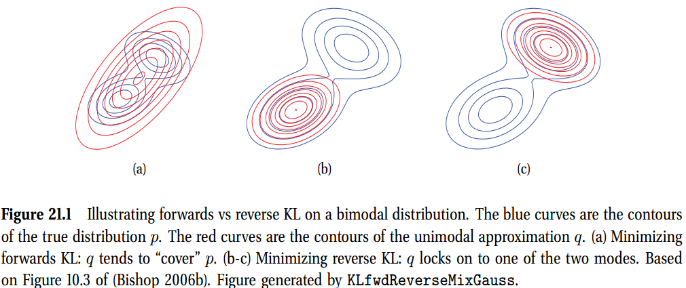
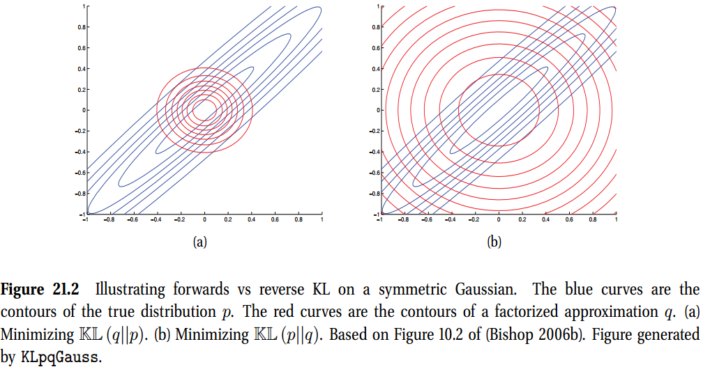
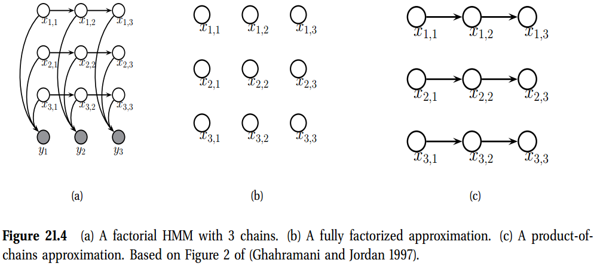
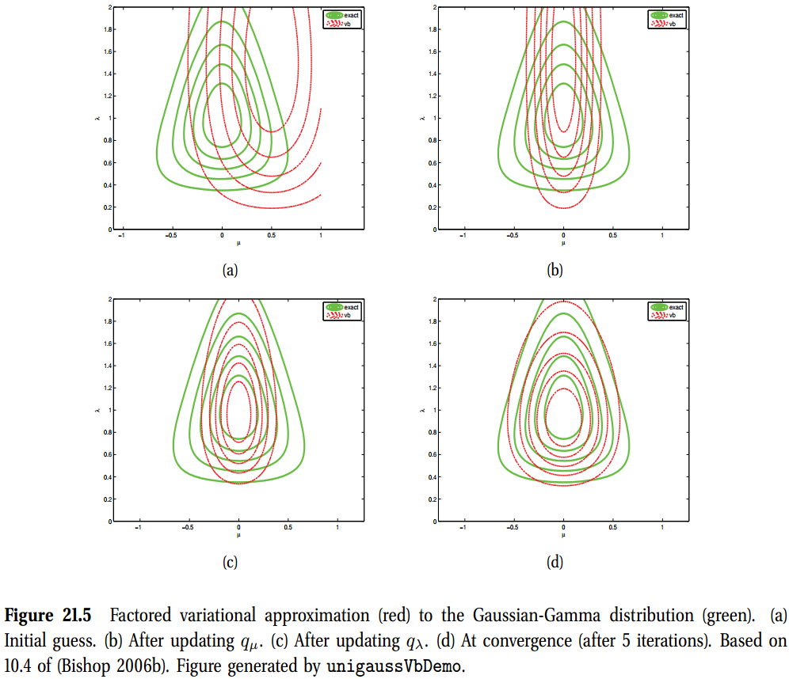

[toc]

# 21 Variational inference

## 21.1 Introduction

我们现在已经看到几种计算一个后验分布的算法。对于离散图模型，我们可以使用**连接树算法(junction tree algorithm)** 执行准确推断，在20.4节所讲。然而，这在图的树宽上需要指数时间，使得精确的推断常常不切实际。对于高斯图形模型，精确推理是树宽的立方。然而，如果我们有很多变量，即使这样也会太慢。**此外，JTA不适用于高斯情况以外的连续随机变量，也不适用于条件高斯情况以外的混合离散连续变量。**

例如，对于简单的两节点图模型，形式为$\mathbf{x}\rightarrow\mathcal{D}$，提供了与似然$p(\mathcal{D}\vert\mathbf{x})$(意味着似然必须是指数族)共轭的先验$p(\mathbf{x})$，我们可以解析计算准确后验$p(\mathbf{x}\vert\mathcal{D})$。(注意到本章中，$\mathbf{x}$代表未知变量，然而在第5章我们使用$\boldsymbol{\theta}$代表未知变量。)

更一般的背景中，我们必须使用近似推断方法。在8.4.1中，我们讨论高斯近似，在形式为$\mathbf{x}\rightarrow\mathcal{D}$的两节点模型推断中是有用的，其中先验不是共轭的。

**高斯近似(gaussian approximations)** 很简单。然而，一些后验不是使用高斯自然建模的。例如，当推断multinomial参数时，一个Dirichlet分布是更好的选择，当推断离散图模型中的状态时，分类分布是更好的选择。

在本章中，我们将研究基于**变分推理**的更为通用的确定性近似推理算法。基本思想是从一些易处理的族中挑选分布的一个近似$q(\mathbf{x})$，然后尝试使该近似尽可能的靠近真实后验分布$p^*(\mathbf{x})\triangleq p(\mathbf{x}\vert\mathcal{D})$。这将推理降级为一个优化问题(This reduce inference into optimization problem)。通过放松约束或是近似目标，我们可以在准确度与速度之间进行平衡。**归根结底，变分推理通常给我们地图估计的速度优势，但贝叶斯方法的统计优势。**

## 21.2 变分推断(Variational inference)

假设$p^*(\mathbf{x})$是我们真实但是难处理的分布，且$q(\mathbf{x})$是一些近似，来自一些易处理的族，例如一个多元高斯或一个 **因子化分布(factoried distribution)**。我们假设$q$有一些自由参数，我们希望优化使$q$类似$p^*$。

最小化的一个明显的成本函数是一个KL离散度
$$
\mathbb{KL}(p^* \Vert q) = \sum_{\mathbf{x}}p^*(\mathbf{x})\log\frac{p^*(\mathbf{x})}{q(\mathbf{x})}        \tag{21.1}
$$
然而这个方程很难处理，因为相对$p^*$求取期望很难处理。一个自然选择是求逆KL离散度
$$
\mathbb{KL}(q \Vert p^*) = \sum_{\mathbf{x}}q(\mathbf{x})\log\frac{q(\mathbf{x})}{p^*(\mathbf{x})}        \tag{21.2}
$$
这个目标函数的主要优势是相对$q$求取期望是易于求解的(通过为$q$选择一个合适的形式)。我们在21.2.2节中讨论这两个目标函数的区别。

不幸的是，方程21.2仍然是不可解的，因为逐点计算$p(\mathbf{x}^*)=p(\mathbf{x}\vert\mathcal{D})$是很难的，因为需要计算很难处理的归一化常数$Z=p(\mathcal{D})$。然而，未归一化的分布$\tilde{p}(\mathbf{x})\triangleq p(\mathbf{x}, \mathcal{D}) = p(\mathbf{x}\vert\mathcal{D})p(\mathcal{D}) = p^*(\mathbf{x})Z[=p(\mathcal{D}\vert\mathbf{x})p(\mathbf{x})])$是可计算的。我们因此定义新的目标函数为
$$
J(q) \triangleq \mathbb{KL}(q\Vert \tilde{p})           \tag{21.3}
$$
我们稍微滥用符号，因为$\tilde{p}$不是归一化的分布。插入KL的定义，我们得到
$$
\begin{aligned}
    J(q) &= \sum_{\mathbf{x}} q(\mathbf{x})\log\frac{q(\mathbf{x})}{\tilde{p}(\mathbf{x})}  \\
    &= \sum_{\mathbf{x}}q(\mathbf{x})\log\frac{q(\mathbf{x})}{Z p^*(\mathbf{x})} \\
    &=\sum_{\mathbf{x}} q(\mathbf{x}) \log\frac{q(\mathbf{x})}{p^*(\mathbf{x})} - \log Z  \\
    &= \mathbb{KL}(q\Vert p^*)-\log Z
\end{aligned}       \tag{21.4-21.7}
$$
因为$Z$是一个常量，通过最小化$J(q)$，我们将迫使分布$q$接近分布$p^*$。

因为KL离散度总是非负的，我们看到$J(q)$是 **NLL(negative log likelihood)** 的一个上界:
$$
J(q) = \mathbb{KL}(q\Vert p^*) - \log Z \geq -\log Z = -\log p(\mathcal{D})     \tag{21.8}
$$
另外，我们可以尝试最大化如下变量(称为能量泛函/energy functional)，这是数据对数似然的下界：
$$
L(q) \triangleq -J(q) = -\mathbb{KL}(q\Vert p^*) + \log Z \leq \log Z = \log p(\mathcal{D}) \tag{21.9}
$$
因为当$q=p^*$该下界是很紧的，我们看到变分推断与EM算法高度相关。

### 21.2.1 变分推断的另一种解释(Alternative interpretations of the variational objective)

该目标函数存在好几种写法，提供了好几种不同的视角。其中一个如下：
$$
J(q) = \sum_{\mathbf{x}}q(\mathbf{x})\log q(\mathbf{x}) - \sum_{\mathbf{x}}q(\mathbf{x})\log \tilde{p}(\mathbf{x}) = \mathbb{E}[\log q(\mathbf{x})] + \mathbb{E}[-\log \tilde{p}(\mathbf{x})] = -\mathbb{H}(q) + \mathbb{E}_q [E(\mathbf{x})]         \tag{21.10}
$$
在统计物理中，$J(q)$称为**变分自由能(variational free energy)**还是**亥姆霍兹自由能(Helmholtz free energy)**。

目标函数可以写成另一种形式
$$
\begin{aligned}
    J(q) &= \mathbb{E}_q [\log q(\mathbf{x}) - \log p(\mathbf{x})p(\mathcal{D} \vert \mathbf{x})]  \\
    &= \mathbb{E}_q [\log q(\mathbf{x}) - \log p(\mathbf{x}) - \log p(\mathcal{D} \vert \mathbf{x})]  \\
    &= \mathbb{E}_q [-\log p(\mathcal{D}\vert \mathbf{x})] + \mathbb{KL}(q(\mathbf{x}) \Vert p(\mathbf{x}))     \tag{21.11-21.13}
\end{aligned}
$$
这是期望NLL(expected NLL)，加上一个惩罚项，测量近似后验与精确先验之间的距离。

我们可以从信息论的角度解释变分目标。

### 21.2.2 Forward or reverse KL? *

因为KL离散度在参数方面不是对称的，相对$q$最小化$\mathbb{KL}(q \Vert p)$与最小化$\mathbb{KL}(p \Vert q)$给出不同的结果。下面讨论这两种方法的差异。

首先，考虑逆KL，$\mathbb{KL}(q\Vert p)$，也称为**I-映射/I-projection**或**信息映射/informarion projection**。根据定义，我们有
$$
\mathbb{KL}(q\Vert p) = \sum_{\mathbf{x}} q(\mathbf{x}) \ln \frac{q(\mathbf{x})}{p(\mathbf{x})}       \tag{21.14}
$$
如果$p(\mathbf{x}) = 0$且$q(\mathbf{x}) \gt 0$，该值是无限的。如果$p(\mathbf{x}) = 0$，我们必须保证$q(\mathbf{x}) = 0$。我们说逆KL对于$q$是$0$强制的。因此，$q$通常会低估$p$的支持。

现在考虑**前向KL(forward KL)**，也称为**M-映射(M-porjection)**或**阶矩映射(moment projection)**：
$$
\mathbb{KL}(p\Vert q) = \sum_{\mathbf{x}} p(\mathbf{x}) \ln \frac{p(\mathbf{x})}{q(\mathbf{x})}       \tag{21.15}
$$
如果$q(\mathbf{x}) = 0$且$p(\mathbf{x}) \gt 0$，该值是无限的。如果$p(\mathbf{x}) \gt 0$，我们必须保证$q(\mathbf{x}) \gt 0$。我们说逆KL对于$q$是$0$避免的。因此，$q$通常会高估$p$的支持。

这些方法的主要区别在图21.1中有解释。我们看到，当真实的分布是多模态(multimodal)时，使用前向KL是一个坏主意，因为得到的后验众数/均值将会位于一个低密度区域中，正好在两峰之间。在这种背景下，使用逆KL不只是难以计算，同时也是统计敏感的。

> 图21.1 解释了在二模态分布上的前向与后向KL。蓝色是真实分布$p$的轮廓。红色线是单模近似$q$的轮廓。(a) 最小化了前向KL: $q$倾向于覆盖$p$;(b-c)最小化反向KL: $q$锁在两个模态中的一个基于图10.3.

> 解释了在对称高斯上的前向与后向的KL。蓝色线是真实分布$p$的轮廓。红色曲线是一个因子化近似$q$的轮廓。(a)最小化了$\mathbb{KL}(q\Vert p)$.(b)最小化了$\mathbb{KL}(p\Vert q)$。

图21.2中另一种区别是，其中目标分布是拉长(elongated)的二维高斯分布，**近似分布(approximating distribution)** 是两个一维高斯分布的乘积。$p(\mathbf{x})=\mathcal{N}(\mathbf{x}\vert \boldsymbol{\mu},\mathbf{\Lambda}^{-1})$，其中
$$
\begin{aligned}
    \boldsymbol{\mu} = \begin{pmatrix}
        \mu_1 \\
        \mu_2
    \end{pmatrix}
\end{aligned}, \mathbf{\Lambda} = \begin{pmatrix}
    \Lambda_{11} & \Lambda_{12} \\
    \Lambda_{21} & \Lambda_{22}
\end{pmatrix}       \tag{21.16}
$$
在图21.2(a)中，我们显示了最小化$\mathbb{KL}(q\Vert p)$的结果。在该简单例子中，可以看到解的形式是
$$
\begin{aligned}
    q(\mathbf{x}) &= \mathcal{N}(x_1\vert m_1, \Lambda_{11}^{-1})\mathcal{N}(x_ 2  \vert m_2, \Lambda_{22}^{-1})  \\
    m_1 &= \mu_1 - \Lambda_{11}^{-1}\Lambda_{12} (m_2-\mu_2) \\
    m_2 &= \mu_2 - \Lambda_{22}^{-1}\Lambda_{21} (m_1-\mu_1) 
\end{aligned}   \tag{21.17-21.19}
$$
图21.2(a)显示了我们正确的捕获了均值，但是近似太过紧凑；它的方差由p的最小方差的方向控制。事实上，它通常是最小化$\mathbb{KL}(q\Vert p)$，其中$q$是因子化的，得到的近似是过度自信的。

在图21.2(b)，我们显示了最小化$\mathbb{KL}(p\Vert q)$的结果。当相对一个分解近似最小化前向KL时，最优解是将$q$设置为边缘的乘积。解的形式是
$$
q(\mathbf{x}) = \mathcal{N}(x_1\vert \mu_1, \Lambda_{11}^{-1}) \mathcal{N}(x_2 \vert \mu_2, \Lambda_{22}^{-1})      \tag{21.20}
$$
**图21.2(b)显示这个太宽了，因为其高估了$p$的支持。**

对于本书剩余章节，我们关注最小化$\mathbb{KL}(q\Vert p)$。在22.5节中，当我们讨论期望传播时，我们将讨论局部最优化$\mathbb{KL}(p\Vert q)$的方式。

通过定义**alpha离散**，我们可以创建一个由参数$\alpha\in\mathbb{R}$索引的离散测度族
$$
D_{\alpha}(p\Vert q)  \triangleq \frac{4}{1-\alpha^2} \left( 1 - \int p(x)^{(1+\alpha)/2}q(x)^{(1-\alpha)/2} dx \right)           \tag{21.21}
$$
当且仅当$p=q$时，测度满足$D_{\alpha}(p\Vert q)=0$，但这明显不是对称的，因此不是一个度。$\mathbb{KL}(p \Vert q)$对应于$\alpha\rightarrow1$，因此$\mathbb{KL}(q\Vert p)$对应于$\alpha\rightarrow-1$。当$\alpha=0$时，我们得到一个对称的离散测度，这与**Hellinger距离**线性相关，定义如下
$$
D_H(p\Vert q) \triangleq \int \left ( p(x)^{\frac{1}{2}} - q(x)^{\frac{1}{2}}      \right )^2 dx
$$
注意到$\sqrt{D_H(p\Vert q)}$是一个有效的距离测度，这是对称的非负的且满足三角不等式。

## 21.3 均值场方法(The mean field method)
变分推断最流行的形式之一称为**均值场**近似。该方法中，我们假设后验是完全因子近似的，形式为
$$
q(\mathbf{x}) = \prod_{i} q_i(\mathbf{x}_i)         \tag{21.23}
$$
我们的目标是求解如下优化问题
$$
\min_{q_1,\cdots,q_D}\mathbb{KL}(q \Vert p)
$$
我们在每个边缘分布$q_i$之上优化参数。在21.3.1节中，我们得出一个坐标下降方法，其中在每步，我们做出如下更新
$$
\log q_j(\mathbf{x}_j) = \mathbb{E}_{-q_j}[\log\tilde{p}(\mathbf{x})] + \text{const}        \tag{21.25}
$$
其中$\tilde{p}(\mathbf{x})=p(\mathbf{x},\mathcal{D})$是未归一化的后验，且符号$\mathbb{E}_{-q_j}[\log\tilde{p}(\mathbf{x})]$意味着相对除$x_j$之外的所有变量对$f(\mathbf{x})$求取期望。例如，如果我们有三个变量，那么
$$
\mathbb{E}_{-q_2}[\log f(\mathbf{x})] = \sum_{x_1}\sum_{x_3}q(x_1)q_3(x_3)f(x_1,x_2,x_3)            \tag{21.26}
$$
必要的地方用积分代替和。

当更新$q_j$时，我们只需要对与$x_j$共享一个因子的变量进行推理，即$j$的马尔可夫毯中的项(见第10.5.3节)；其他项被吸收到常数项中。因为我们用它们的平均值来代替相邻的值，所以这种方法被称为**平均场**。这与Gibbs采样(第24.2节)非常相似，除了在相邻节点之间发送采样值之外，我们在节点之间发送平均值。这往往更有效，因为平均值可以作为大量样本的代理。（另一方面，平均场消息很密集，而样本很稀疏；这可以使采样更易于扩展到非常大的模型。）

当然，一次更新一个分布可能会很慢，因为这是坐标下降的一种形式。已经提出了几种方法来加速这种基本方法，包括使用**模式搜索**（Honkela等人，2003）和**基于参数扩展的技术**（Qi和Jaakkola，2008）。但是，在本章中我们将不考虑这些方法。

值得注意的是，**平均场方法**可用于推断离散或连续的潜在量，使用$q_i$的各种参数形式，如下所示。这与我们稍后将遇到的其他一些变分方法形成了对比，这些方法的适用性受到了更大的限制。表21.1列出了我们在本书中介绍的一些平均场的例子。

### 21.3.1 均值场更新不等式的推导(Derivation of the mean field update equations)

回忆，变分推断的目标是最小化上界$J(q)\geq -\log p(\mathcal{D})$。等效的是，我们可以尝试最小化下界
$$
L(q) \triangleq -J(q) = \sum_{\mathbf{x}} q(\mathbf{x})\log \frac{\tilde{p}(\mathbf{x})}{q(\mathbf{x})} \leq \log p(\mathcal{D})  \tag{21.27}
$$

如果我们写出目标，挑出涉及$q_j$的项，并把所有其他项看作常数，我们得到
$$
\begin{aligned}
    L(q_j) &= \sum_{\mathbf{x}}\prod_{i} q_i(\mathbf{x}_i) \left[ \log \tilde{p}(\mathbf{x}) - \sum_{k}\log q_k(\mathbf{x}_k)   \right]         \\ 
    &= \sum_{\mathbf{x}_j}  \sum_{\mathbf{x}_{-j}} q_j(\mathbf{x}_j) \prod_{i\not= j} q_i(\mathbf{x}_i)     \left[ \log \tilde{p}(\mathbf{x}) - \sum_{k}\log q_k(\mathbf{x}_k)   \right]  \\
    &=  \sum_{\mathbf{x}_j} q_j(\mathbf{x}_j)  \sum_{\mathbf{x}_{-j}} \prod_{i\not= j} \log \tilde{p}(\mathbf{x})q_i(\mathbf{x}_i)  - \\
    & - \sum_{\mathbf{x}_j} q_j(\mathbf{x}_j)  \sum_{\mathbf{x}_{-j}} \prod_{i\not= j} q_i(\mathbf{x}_i)  \left[ \sum_{k\not = j}\log q_k(\mathbf{x}_k) + q_j(\mathbf{x}_j)  \right]\\
    &= \sum_{\mathbf{x}_j}q_j(\mathbf{x}_j) \log f_j(\mathbf{x}_j) - \sum_{\mathbf{x}_j} q_j(\mathbf{x}_j)\log q_j(\mathbf{x}_j) + \text{const}
\end{aligned}
$$
其中
$$
 \log f_j(\mathbf{x}_j) \triangleq \sum_{\mathbf{x}_{-j}}\prod_{i\not ={j}} q_i(\mathbf{x}_i)  \log \tilde{p}(\mathbf{x}) = \mathbb{E}_{-q_{j}}[\log \tilde{p}(\mathbf{x})]  \tag{21.32}
$$
所以我们想平均除$\mathbf{x}_j$以外的所有的隐变量。我们可以将$L(q_j)$重写为如下：
$$
L(q_j)=-\mathbb{KL}(q_j\Vert f_i)           \tag{21.33}
$$
我们可以通过最小化这个KL最大化L，其中我们需要通过设置$q_i=f_j$来完成
$$
q_j(\mathbf{x}_j)= \frac{1}{Z_j} \exp (\mathbb{E}_{-q_j}[\log \tilde{p}(\mathbf{x})])       \tag{21.34}
$$
我们通常可以忽略局部归一化常数$Z_j$，因为我们知道$q_j$必须是一个归一化分布。因此，我们必须使用形式
$$
\log q_j(\mathbf{x}_j) = \mathbb{E}_{-q_j}[\log \tilde{p}(\mathbf{x})] + \text{const}
$$

$q_j$分布的泛函形式将由变量$\mathbf{x})_j$的类型决定，以及模型的形式。如果是一个离散随机变量，那么$g_j$将是一个离散分布；如果$\mathbf{x}_j$是一个连续的随机变量，那么$q_j$将是一些pdf。

## 21.4 结构化均值场(Structured mean field *)

假设所有变量在后验概率中都是独立的，这是一个很强的假设，可能导致较差的结果。有时我们可以在问题中利用**可处理的子结构**，以便有效地处理某些类型的依赖关系。这被称为**结构化平均场方法**（Saul和Jordan 1995）。这个方法和以前一样，只是我们把变量集合在一起，同时更新它们。（接下来简单地将第i组中的所有变量视为一个“大变量”，然后重复第21.3.1节中的推导。）只要我们能在每个$q_i$中进行有效的推理，该方法总体上是可行的。下面我们举一个例子。参见（Bouchard Cote和Jordan 2009）了解该领域的一些最新工作。 

### 21.4.1 Example: factorial HMM
考虑在$17.6.5$节中介绍的因子化HMM模型。假设有$M$个链，每个长度为$T$，且假设每个隐节点有$K$个状态。这个模型定义如下
$$
p(\mathbf{x,y}) = \prod_{m}\prod_t p(x_{tm}\vert x_{t-1,m})p(\mathbf{y}_t\vert x_{tm})      \tag{21.53}
$$
其中$p(x_{tm}=k\vert x_{t-1,m}=j)=A_{mjk}$是链$m$中转移矩阵中的一个元素，$p(x_{1m}=k\vert x_{0m})=p(x_{1m}=k)=\pi_{mk}$是链$m$的初始状态分布，且
$$
p(\mathbf{y}_t\vert \mathbf{x}_t)=\mathcal{N}\left( \mathbf{y}_t\vert \sum_{m=1}^M \mathbf{W}_m\mathbf{x}_{tm} ,\mathbf{\Sigma} \right)     \tag{21.54}
$$
是观测模型，其中$\mathbf{x}_{tm}$是$x_{tm}$的一个1-of-K编码，$\mathbf{W}_m$是一个$D\times K$矩阵(假设$\mathbf{y}_t\in\mathbb{R}^D$)。图21.4(a)解释了$M=3$情况下的模型。即使每个链是先验独立的，它们在后验中是耦合的，因为它们有共同的孩子$\mathbf{y}_t$。应用于此图的连接树算法消耗$O(TML^{M+1})$的时间。下面，我们推导出一个结构化均值场算法。消耗时间为$O(TMK^2I)$，其中$I$是均值场迭代次数。

我们可以将精确后验写为如下形式
$$
\begin{aligned}
    p(\mathbf{x}\vert \mathbf{y}) &= \frac{1}{Z}\exp(-E(\mathbf{x,y})) \\
    E(\mathbf{x,y}) &= \frac{1}{2}\sum_{t=1}^T \left( \mathbf{y}_t - \sum_m \mathbf{W}_m\mathbf{x}_{tm}  \right)^T  \mathbf{\Sigma}^{-1} \left( \mathbf{y}_t - \sum_m \mathbf{W}_m\mathbf{x}_{tm}  \right) \\
    &-\sum_{m}\mathbf{x}_{1m}\tilde{\boldsymbol{\pi}}_m - \sum_{t=2}^T\sum_m \mathbf{x}_{tm}^T \tilde{\mathbf{A}}_m \mathbf{x}_{t-1,m}
\end{aligned}   \tag{21.55-21.56}
$$
其中$\tilde{\mathbf{A}}_m\triangleq\log\mathbf{A}_m$，$\tilde{\boldsymbol{\pi}}_m\triangleq \log\boldsymbol{\pi}_m$。

我们可将后验近似为边缘的乘积，如图21.4(b)，但是更好的近似是使用链的乘积，如图21.4(c)。每个链都可以使用**向前向后的算法(forwards-backwards)** 分别进行可处理的更新。更精确的，我们假设
$$
\begin{aligned}
    q(\mathbf{x\vert y}) &= \frac{1}{Z_q}\prod_{m=1}^M q(x_{1m}\vert\boldsymbol{\xi}_{1m}) \prod_{t=2}^T  q(x_{tm}\vert x_{t-1,m},\boldsymbol{\xi}_{tm})  \\
    q(x_{1m}\vert\boldsymbol{\xi}_{1m}) &= \prod_{k=1}^K (\xi_{1mk}\pi_{mk})^{x_{1mk}} \\
    q(x_{tm}\vert x_{t-1,m},\boldsymbol{\xi}_{tm}) &= \prod_{k=1}^K \left( \xi_{tmk} \prod_{j=1}^K (A_{mjk})^{x_{t-1, m,j}}  \right)       
\end{aligned}    \tag{21.57-21.59}
$$
我们看到$\xi_{tmk}$参数在近似局部证据中扮演着重要角色，将其他链的影响平均化。这与精确的局部证据形成了对比，局部证据将所有的链条连接在一起。

我们也可以将后验近似重写为$q(\mathbf{x})=\frac{1}{Z_q}\exp(-E_q(\mathbf{x}))$，其中
$$
E_q(\mathbf{x}) = -\sum_{t=1}^T \sum_{m=1}^M \mathbf{x}_{tm}^T \tilde{\boldsymbol{\xi}}_{tm} - \sum_{m=1}^M \mathbf{x}_{1m}^T \tilde{\boldsymbol{\pi}}_{m} - \sum_{t=2}^T\sum_{m=1}^M \mathbf{x}_{tm}^T\tilde{\mathbf{A}}_m \mathbf{x}_{t-1,m}      \tag{21.60}
$$
其中$\tilde{\boldsymbol{\xi}}_{tm}=\log \boldsymbol{\xi}_{tm}$。我们看到，这与精确后验具有相同的时间因素，但局部证据项是不同的。目标函数给定为
$$
\mathbb{KL}(p\Vert p) = \mathbb{E}(E) - \mathbb{E}(E_q) \log Z_q + \log Z   \tag{21.61}
$$
其中期望是相对$q$取的。可以证明，更新形式为
$$
\begin{aligned}
    \boldsymbol{\xi}_{tm} &= \exp\left( \mathbf{W}_m^T\mathbf{\Sigma}^{-1}\tilde{\mathbf{y}}_{tm} - \frac{1}{2}\boldsymbol{\delta}_m   \right)  \\
    \boldsymbol{\delta}_m &\triangleq \text{diag}(\mathbf{W}_m^T\mathbf{\Sigma}^{-1}\mathbf{W}_m) \\
    \tilde{\mathbf{y}}_{tm} &\triangleq \mathbf{y}_t - \sum_{\ell\not ={m}}^M\mathbf{W}_{\ell}\mathbb{E}[\mathbf{x}_{t,\ell}]
\end{aligned}\tag{21.62-21.64}
$$

## 21.5 变分贝叶斯(Variational Bayes)

到目前为止，我们一直致力于在假设模型参数$\theta$已知的情况下推断隐变量$\mathbf{z}_i$。现在假设，我们想推断参数本身。如果我们作一个完全因子化(也就是均值场)的近似$p(\boldsymbol{\theta}\vert \mathcal{D})\approx \prod_{k}q(\boldsymbol{\theta}_k)$，我们得到一种称为变分贝叶斯(**varational Bayes**)的方法。我们在下面给出一些VB的例子，假设没有隐变量。如果我们想同时推断隐变量与参数，且假设形式$p(\boldsymbol{\theta}, \mathbf{z}_{1:N}\vert \mathcal{D})\approx q(\boldsymbol{\theta})\prod_i q_i(\mathbf{z}_i)$，我们得到一种称为变分贝叶斯EM，讨论在21.6节中。

### 21.5.1 Example: VB for a univariate Gaussian

我们考虑应用VB推断1维高斯分布的后验参数，$p(\mu,\lambda\vert\mathcal{D})$，其中$\lambda=1/\sigma^2$是精确度。出于方便，我们使用形式如下的共轭先验
$$
p(\mu,\lambda)=\mathcal{N}(\mu\vert\mu_0,(\kappa_0\lambda)^{-1})\text{Ga}(\lambda\vert a_0,b_0)     \tag{21.65}
$$
然而，我们将使用一个形式如下的近似因子化后验
$$
q(\mu,\lambda)=q_{\mu}(\mu)q_{\lambda}(\lambda)     \tag{21.66}
$$
我们不需要指定分布$q_μ$和$q_λ$的形式；在求导过程中，最优形式会自动“脱落”（而且很方便，它们分别是高斯分布和伽马分布）。

你可能想知道为什么我们要这样做，因为我们知道如何计算这个模型的确切后验概率。有两个原因。首先，这是一个有用的教学练习，因为我们可以比较我们的近似值和精确的后验值的质量。其次，可以很简单的修改该方法来处理一个半共轭先验，形式为$p(\mu,\lambda) = \mathcal{N}(\mu\vert\mu_0,\tau_0)\text{Ga}(\lambda\vert a_0,b_0)$，精确推断已经不再可能。

### 21.5.1.1 目标分布(Target distribution)

未归一化对数后验的形式为
$$
\begin{aligned}
    \log\tilde{p}(\mu,\lambda) &= \log p(\mu,\lambda,\mathcal{D}) = \log p(\mathcal{D}\vert\mu,\lambda) + \log p(\mu\vert\lambda) + \log p(\lambda)  \\
    &= \frac{N}{2} \log\lambda - \frac{\lambda}{2}\sum_{i=1}^N (x_i-\mu)^2 - \frac{\kappa_0\lambda}{2}(\mu-\mu_0)^2  \\
    &+\frac{1}{2}\log(\kappa_0\lambda) + (a_0-1)\log\lambda - b_0\lambda + \text{const}     \tag{21.68}
\end{aligned}
$$

#### 21.5.1.2 更新$q_{\mu}(\mu)$

$q_{\mu}(\mu)$的最优形式通过在$\lambda$上平均得到
$$
\begin{aligned}
    \log q_{\mu}(\mu) &= \mathbb{E}_{q_{\lambda}}[\log p(\mathcal{D}\vert\mu,\lambda) + \log p(\mu\vert\lambda)] + \text{const}   \\
    &= -\frac{\mathbb{E}_{q_{\lambda}[\lambda]}}{2} \left\{ \kappa_0(\mu-\mu_0)^2 + \sum_{i=1}^N(x_i-\mu)^2  \right\} + \text{const}
\end{aligned}
$$
通过完成平方一，可以证明$q_{\mu}(\mu)=\mathcal{N}(\mu\vert\mu_N,\kappa_N^{-1})$，其中
$$
\mu_N=\frac{\kappa_0\mu_0 + N\bar{x}}{\kappa_0 + N}, \kappa_N = (\kappa_0+N)\mathbb{E}_{q_{\lambda}}[\lambda]       \tag{21.71}
$$

此阶段，我们不知道$q_{\lambda}(\lambda)$是什么，且因此我们可以计算$\mathbb{E}(\lambda)$，但是我们将在下面进行推导。

#### 21.5.1.2 更新$q_{\lambda}(\lambda)$

$q_{\lambda}(\lambda)$的最优形式给定为
$$
\begin{aligned}
    \log q_{\lambda}(\lambda) &= \mathbb{E}_{q_{\mu}}[\log p(\mathcal{D}\vert \mu,\lambda) + \log p(\mu\vert\lambda) + \log p(\lambda)] + \text{const}   \\
    &= (a_0-1)\log\lambda - b_0\lambda + \frac{1}{2}\log\lambda + \frac{N}{2}\log\lambda \\
    &\quad -\frac{\lambda}{2}\mathbb{E}_{q_{\mu}}\left[ \kappa_0 (\mu-\mu_0)^2 + \sum_{i=1}^N (x_i-\mu)^2  \right]+ \text{const}
\end{aligned}
$$
我们可以将此视为一个对数的Gamma分布，因此$q_{\lambda}(\lambda)=\text{(Ga)}(\lambda\vert a_N,b_N)$，其中
$$
\begin{aligned}
    a_N &= a_0 + \frac{N+1}{2}  \\
    b_N & = b_0 + \frac{1}{2}\mathbb{E}_{q_{\mu}}\left[ \kappa_0 (\mu-\mu_0)^2 + \sum_{i=1}^N (x_i-\mu)^2   \right]
\end{aligned}
$$

#### 21.5.1.4 Computing the expectations
为了实现更新，我们必须具体化如何计算各种期望。因为$q(\mu)=\mathcal{N}(\mu\vert\mu_N,\kappa_N^{-1})$，我们有
$$
\begin{aligned}
    \mathbb{E}_{q_{\mu}}[\mu] &= \mu_N \\
    \mathbb{E}_{q_{\mu}}[\mu^2] &= \frac{1}{\kappa_N} \mu_N^2 \\
\end{aligned}
$$
因为$q(\lambda)=\text{Ga}(\lambda\vert a_n,b_N)$，我们有
$$
\mathbb{E}_{q_{\lambda}}[\lambda] = \frac{a_N}{b_N}     \tag{21.78}
$$
我们现在给出更新方程的清晰形式。对于$q(\mu)$我们有
$$
\begin{aligned}
    \mu_N &= \frac{\kappa_0\mu_0 + N\bar{x}}{\kappa_0 + N}\\
     \kappa_N &= (\kappa_0+N)\frac{a_N}{b_N}
\end{aligned}       \tag{21.80}
$$

#### 21.5.1.5 解释(Illustration)

图21.5给出了这种方法的一个实例。绿色轮廓代表了精确后验，是一个高斯-Gamma。虚线红色轮廓代表了多次迭代后的变分近似。我们看到最后的近似与精确解合理的接近。然而，它比真实分布更加"紧凑"。这总是均值场低估后验不确定性的情况。

### 21.5.1.6 更低界(Lower bound *)
在VB中，我最大化$L(q)$，这是对数边缘似然的下界
$$
L(q) \leq \log p(\mathcal{D}) = \log \int\int p(\mathcal{D}\vert\mu,\lambda)p(\mu,\lambda)d\mu d\lambda     \tag{21.83}
$$
这对于计算下界本身是很有用的，主要有三个原因。首先，可以用来评估算法的收敛性。其次，可以用来评估代码的正确性：与EM一样，如果边界不是单调增加的，肯定是有一个bug的。最后，边界可以作为边缘似然的一个近似，可以用于贝叶斯模型选择。

不幸的是，计算这个下界涉及到大量枯燥的代数。我们计算出这个例子的细节，但对于其他模型，为了简洁起见，我们将只陈述结果而不进行证明，甚至完全省略对界的讨论。

对于这个模型，$L(q)$可以如下计算：
$$
\begin{aligned}
    L(q) &= \int \int q(\mu,\lambda)\log\frac{p(\mathcal{D},\mu,\lambda)}{q(\mu,\lambda)}d\mu d\lambda \\
    & =\mathbb{E}[\log p(\mathcal{D}\vert \mu,\lambda)] + \mathbb{E}[\log p(\mu\vert\lambda)] + \mathbb{E}[\log p(\lambda)]  \\
    &\quad -\mathbb{E}[\log p(\mu)] -\mathbb{E}[\log p(\lambda)]
\end{aligned}           \tag{21.84-21.85}
$$
其中所有的期望是相对$q(\mu,\lambda)$。将最后两项识别为一个高斯熵以及一个Gamma分布的熵，给定为
$$
\begin{aligned}
    \mathbb{H}(\mathcal{N}(\mu_N,\kappa_N^{-1})) &= -\frac{1}{2}\log\kappa_N + \frac{1}{2}(1+\log(2\pi)) \\
    \mathbb{H}(\text{Ga}(\mu_N,\kappa_N^{-1})) &= \log\Gamma(a_N)-(a_N-1)\psi(a_N)-\log(b_N)+a_N
\end{aligned}       \tag{21.86-21.87}
$$
其中$\psi()$是gamma分布。

为了计算其他项，我们需要如下事实：
$$
\begin{aligned}
    \mathbb{E}[\log x\vert x\sim\text{Ga}(a,b)] &= \psi(a)-\log(b)                \\
    \mathbb{E}[x\vert x\sim\text{Ga}(a,b)] &= \frac{1}{b}   \\
    \mathbb{E}[x\vert x\sim\mathcal{N}(\mu,\sigma^2)] &= \mu       \\
    \mathbb{E}[x^2\vert x\sim\mathcal{N}(\mu,\sigma^2)] &= \mu+\sigma^2
\end{aligned}
$$
对于期望对数似然，可以证明：
$$
\begin{aligned}
    &\mathbb{E}_{q(\mu,\lambda)}[\log p(\mathcal{D} \vert \mu,\lambda)] \\
    & = -\frac{N}{2} \log (2\pi) + \frac{N}{2}\mathbb{E}_{q(\lambda)}[\log\lambda]-\frac{\mathbb{E}[\lambda]_{q(\lambda)}}{2}\sum_{i=1}^N\mathbb{E}_{q(\mu)}[(x_i-\mu)^2]  \\
    &= -\frac{N}{2}\log(2\pi)+\frac{N}{2}(\psi(a_N)-\log b_N)  \\
    &\quad -\frac{Na_N}{2b_N}(\hat{\sigma}^2+\bar{x}^2-2\mu_N\bar{x}+\mu_N^2+\frac{1}{\kappa_N})
\end{aligned}
$$
其中$\bar{x},\hat{\sigma}^2$是经验均值之与方差。
$\lambda$是期望对数先验，我们有
$$
\begin{aligned}
    \mathbb{E}_{p(\lambda)}[\log p(\lambda)] &= (a_0-1)\mathbb{E}[\log\lambda]-b_0\mathbb{E}[\lambda]+a_0\log b_0-\log\Gamma(a_0) \\
    &=(a_0-1)(\psi(a_N)-\log(b_N))-b_0\frac{a_N}{b_N}+a_0\log b_0-\log\Gamma(a_0)
\end{aligned}       \tag{21.95-21.96}
$$
$\mu$是期望对数先验，可以证明
$$
\begin{aligned}
    \mathbb{E}[\log p(\mu\vert\lambda)] &= \frac{1}{2}\log\frac{\kappa_0}{2\pi}+\frac{1}{2}\mathbb{E}[\log\lambda]q(\lambda)-\frac{\mathbb{E}[\lambda]_{q(\lambda)}}{2}[(\mu-\mu_0)^2\kappa_0\lambda]    \\
    &= \frac{1}{2}\log\frac{\kappa_0}{2\pi}+\frac{1}{2}(\psi(a_N)-\log(b_N))-\frac{\kappa_0}{2}\frac{a_N}{b_N}\left[\frac{1}{\kappa_N}+(\mu_N-\mu_0)^2 \right]
\end{aligned}       \tag{21.97}
$$

### 21.5.2 Example: VB for linear regression
在7.6.4节中，我们讨论了一个经验贝叶斯方法，用来设置岭回归的超参，称为**证据过程**。实际中，我们假设一个似然的形式为$p(\mathbf{y\vert X},\boldsymbol{\theta})=\mathcal{N}(\mathbf{Xw},\lambda^{-1})$，先验的形式为$p(\mathbf{w})=\mathcal{N}(\mathbf{w\vert0,\alpha^{-1}I})$。我们然后计算$\alpha,\lambda$的类型2的估计。

## 21.6 变分贝叶斯EM(Variational Bayes EM)

现在考虑隐变量模型，形式为$\mathbf{z}_i\rightarrow\mathbf{x}_i\leftarrow\boldsymbol{\theta}$。包含了混合模型、PCA、HMM。主要有2类未知：参数$\boldsymbol{\theta}$以及隐变量$\mathbf{z}_i$。