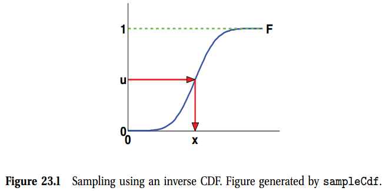
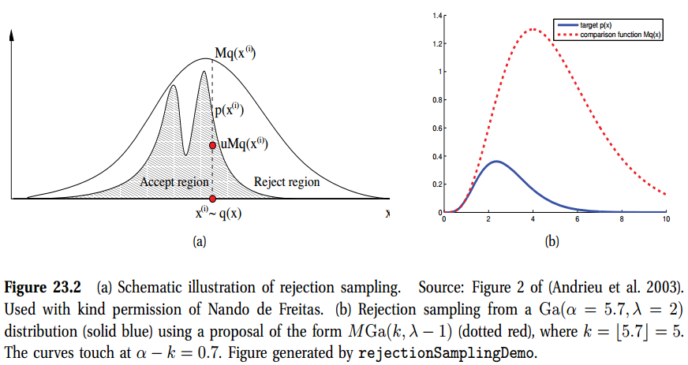
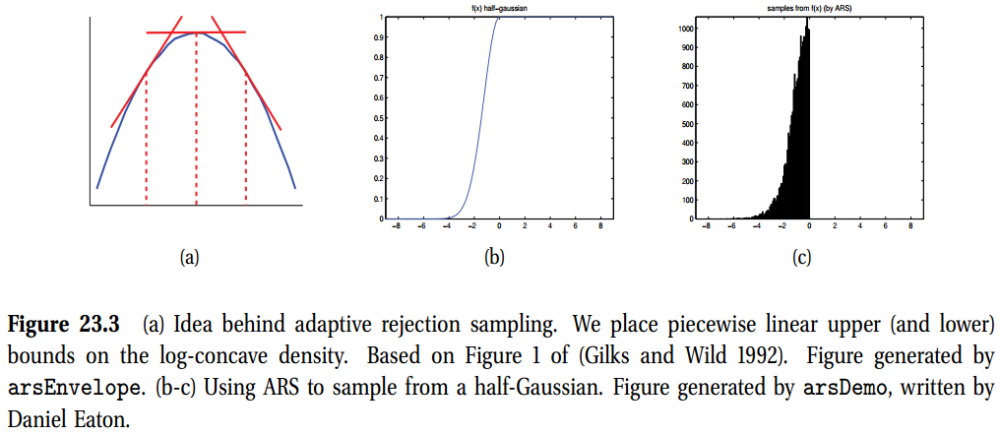

[toc]

# 23 Mento Carlo inference

## 23.1 Introduction

到目前，我们讨论了各种用于后验推断的确定性算法。这些算法具有贝叶斯方法的优势，但仍然与基于优化的点估计方法一样快。这些方法的麻烦在于它们很难推导，且它们限制了它们的应用领域(例如，尽管均值场最近扩展到了更加复杂的分布，它们通常假设存在共轭先验和指数族可能性)。尽管，它们速度很快，但它们的精度通常受到我们选择的近似形式的限制。

本章，我们讨论基于蒙特卡洛近似的另一种类型的算法。其思想非常简单：从后验$\mathbf{x}^s \sim p(\mathbf{x}\vert \mathcal{D})$生成一些采样，然后使用这些来计算任何感兴趣的量。例如一个后验边缘$p(x_1\vert\mathcal{D})$，或两个量的后验差异$p(x_1-x_2\vert\mathcal{D})$，或是后验的预测$p(y\vert\mathcal{D})$等等。所有这些量可以用一些合适的函数$f$来近似这些量$\mathbb{E}[f\vert \mathcal{D}]\approx \frac{1}{S}\sum_{s=1}^{S}f(\mathbf{x}^s)$。

通过产生足够多的样本，我们可以实现任何我们想实现的精度。主要问题是：如何从一个概率分布有效的生成采样，尤其是在高维情况下？本章，我们讨论生成独立采样的非迭代的方法。下章，我们讨论一种迭代方法，称为MarkovChainMonteCarlo，或是MCMC，产生的独立采样在高维情况下效果非常好。

## 23.2 Sampling from standard distributions

我们简单讨论了从标准形式的1维或2维分布的一些采样方式。这些方法通常作为更加复杂方法的子例程。

### 23.2.1 Using the cdf

从一元分布采样的最简单的方法是基于**逆概率变换(inverse probability transform)**。令$F$是采样来源分布的cdf，令$F^{-1}$是其逆。我们使用如下结果。

> **理论23.2.1** 如果$U\sim U(0,1)$是一个均匀分布，那么$F^{-1}(U)\sim F$。

因此，我们可以从任意一个单元分布采样，然后可以计算其逆，如下：使用一个伪随机数生成器，生成一个随机数$u\sim U(0,1)$。令u代表y轴的高，然后沿着x轴滑动到与F曲线相交，然后下拉并返回相应的x值。这对应于计算$x=F^{-1}(u)$。

例如，考虑一个指数分布
$$
\text{Expon}(x\vert \lambda) \triangleq \lambda e^{-\lambda x}\mathbb{I}(x \geq 0)      \tag{23.3}
$$
cdf是
$$
F(x) = 1 - e^{-\lambda x}\mathbb{I}(x\geq 0)    \tag{23.4}
$$
其逆函数是
$$
F^{-1}(p)=-\frac{\ln(1-p)}{\lambda}     \tag{23.5}
$$

### 23.2.2 Sampling from a Gaussian (Box-Muller method)

我们现在描述一种从高斯采样的一种方法。主要思想是从一个单位半径的圆上均匀采样，然后使用变量的变化公式从球形2d高斯推导样本。这个可以被认为是从一个1维高斯的两个采样。

更详细的是，均匀采样$z_1, z_2 \in (-1, 1)$，然后忽略不满条件$z_1^2 + z_2^2 \leq  1$的对。结果将会是在单元圆内均匀分布的点，所以$p(\mathbf{z})=\frac{1}{\pi}\mathbb{I}$。现在定义：
$$
x_i = z_i\left(\frac{-2\ln r^2}{r^2}\right)^{\frac{1}{2}}
$$
对于$i=1:2$，其中$r^2=z_1^2 + z_2^2$。使用变量公式的多元变换，我们有
$$
p(x_1, x_2) = p(z_1, z_2)\left\vert \frac{\partial(z_1, z_2)}{\partial(x_1, x_2)} \right\vert= \left[ \frac{1}{\sqrt{2\pi}} \exp\left(-\frac{1}{2}x_1^2\right) \right] \left[ \frac{1}{\sqrt{2\pi}} \exp\left(-\frac{1}{2}x_2^2\right) \right]
$$
因此$x_1,x_2$是来自单元高斯的两个独立采样。这称为**Box-Muller**方法。

为了从单元高斯进行采样，我们首先计算其协方差矩阵$\mathbf{\Sigma}=\mathbf{LL}^T$，其中$\mathbf{L}$是下三角阵。下面我们使用Box-Muller方法采样$\mathbf{x}\sim\mathcal{N}(\mathbf{0,I})$。最终，我们设置为$\mathbf{y=Lx}+\boldsymbol{\mu}$。因为
$$
\text{cov}[\mathbf{y}] = \mathbf{L}\text{cov}[\mathbf{x}]\mathbf{L}^T = \mathbf{LIL}^T=\mathbf{\Sigma}  \tag{23.8}
$$

## 23.3 Rejection sampling

当无法使用逆cdf方法时，另一种采样方法是使用**拒绝采样(rejection sampling)**。

### 22.3.1 Basic idea

在rejection采样中，我们创造一个**提议分布**$q(x)$，其满足对于某些常数$M$，$Mq(x)\geq \tilde{q}(x)$，其中$\tilde{p}(x)$是$p(x)$未归一化的版本。函数$Mq(x)$为$\tilde{p}$提供了一个上包络线。我们然后采样$x\sim q(x)$，其对应挑选一个随机的x位置，然后采样$u\sim U(0,1)$，其对应于在包络线下挑选一个随机高度。如果$u>\frac{\tilde{p}(x)}{Mq(x)}$，我们拒绝采样，要不然接受其。看图23.2(a)，其中接受域为阴影部分，拒绝区域为上包络线与阴影部分之间白色区域。

我们现在证明这个过程是正确的。令
$$
S=\{(x,u):u \leq\tilde{p}(x)/Mq(x)  \}, S_0= \{(x,u):x\leq x_0, u \leq\tilde{p}(x)/Mq(x)  \}        \tag{23.9}
$$

然后，cdf的接受点给定为
$$
\begin{aligned}
    P(x\leq x_0\vert x \;\text{accepted}) &= \frac{P(x\leq x_0, x \;\text{accepted})}{P(x \;\text{accepted})} \tag{23.10} \\
    & = \frac{\int\int \mathbb{I}((x,u)\in S_0)q(x)dudx}{\int\int \mathbb{I}((x,u)\in S)q(x)dudx} 
    &= \frac{\int_{-\infin}^{x_0}\tilde{p}(x)dx}{\int_{-\infin}^{\infin}\tilde{p}(x)dx}
\end{aligned}
$$

这个方法如何有效？因为我们产生了概率$p(x)$，并以概率$\frac{\tilde{p}(x)}{Mq(x)}$接受，接受的概率是
$$
p(accept) = \int \frac{\tilde{p}(x)}{Mq(x)} q(x)dx = \frac{1}{M}\int\tilde{p}(x)dx \tag{23.12}
$$
因此，我们想选择尽可能小的M使得满足$Mq(x)\geq \tilde{p}(x)$。

### 23.3.2 Example

例如，我们想从gamma分布采样
$$
\text{Ga}(x\vert\alpha,\lambda)=\frac{1}{\Gamma(\alpha)}x^{\alpha-1}\lambda^{\alpha}\exp(-\lambda x)\tag{23.13}
$$
可以证明如果$X_i\sim \text{Expon}(\lambda)$，以及$Y=X_1 + \cdots +X_k$，那么$Y\sim \text{Ga}(k, \lambda)$。然而，我们可以使用$\text{Ga}(k, \lambda - 1)$分布作为一个提议的拒绝采样，其中$k=\lfloor\alpha\rfloor$。比例的形式为
$$
\frac{p(x)}{q(x)} = \frac{\text{Ga}(x\vert \alpha, x)}{\text{Ga}(x\vert k, \lambda - 1)}
$$
比例在$x=\alpha -k$处获得最大值。因此
$$
M = \frac{\text{Ga}(\alpha - k)\vert\alpha, \lambda}{\text{Ga}(\alpha - k\vert k, \lambda - 1)}
$$
### 23.3.3 应用到贝叶斯统计
假设我们想从后验$p(\boldsymbol{\theta}\vert\mathcal{D})=p(\mathcal{D}\vert\boldsymbol{\theta})p(\boldsymbol{\theta})/ p(\mathcal{D})$中采样。我们可以使用$\tilde{p}(\boldsymbol{\theta})=p(\mathcal{D}\vert \boldsymbol{\theta}) p(\boldsymbol{\theta})$的拒绝采样作为目标分布，$p(\boldsymbol{\theta})=p(\boldsymbol{\theta})$作为我们的提议。$M=p(\mathcal{D}\vert\hat{\boldsymbol{\theta}})$, $M=p(\mathcal{D}\vert\hat{\boldsymbol{\theta}})$，其中$\hat{\boldsymbol{\theta}}=\argmax p(\mathcal{D}\vert\boldsymbol{\theta})$是MLE。我们以概率
$$
\frac{\tilde{p}(\boldsymbol{\theta})}{Mq(\boldsymbol{\theta})} = \frac{p(\mathcal{D}\vert\boldsymbol{\theta})}{p(\mathcal{D}\vert \hat{\boldsymbol{\theta}})}
$$
来自先验的具有高似然的样本可能保留在后验中。当然，如果在先验与后验之间有很大的错配，该过程就会无效。下面讨论更好的算法。

### 23.3.4 自适用拒绝采样(Adaptive rejection sampling)

现在我们描述一种方法，可以自动的将一个紧凑的上包络线$q(x)$设置为任何对数凹面密度$p(x)$。思想是用分段线性函数来拟合对数密度上限，如图23.3(a)。我们在分布的基础上基于固定的网格为片段选择初始位置。我们然后可以计算在这些位置的对数密度的梯度，并使线在这些点处相切。

## 23.4 重要性采样(Importance Sampling)

我们现在描述一种称为重要性采样的MonteCarlo方法来近似形式如下的积分
$$
I=\mathbb{E}[f]=\int f(\mathbf{x})p(\mathbf{x})d\mathbf{x}  \tag{23.19}
$$
### 23.4.1 基本思想
其想法是在有高概率$f(\mathbf{x})$但是$\lvert f(\mathbf{x})\rvert$同样也很大的区域内采样$\mathbf{x}$。得到的结果是**super sufficient**，意味着如果我们打算从精确分布$p(\mathbf{x})$采样，那么只需要更少的采样。理由是采样主要关注空间中重要的部分。例如，假设我们想估计一个**稀有事件(rare event)** 的概率。定义$f(\mathbf{x})=\mathbb{I}(\mathbf{x}\in E)$。那么相比从$p(\mathbf{x})$采样，从提议的形式$q(\mathbf{x})\approx f(\mathbf{x})p(\mathbf{x})$采样更好。

重要性采样从任意提议$q(\mathbf{x})$采样。然后使用这些采样估计如下的积分
$$
\mathbb{E}[f] = \int f(\mathbf{x})\frac{p\mathbf{x}}{q(\mathbf{x})}q(\mathbf{x})d\mathbf{x} \approx\frac{1}{S}\sum_{s=1}^S w_s f(\mathbf{x}^s) =\hat{I}     \tag{23.20}
$$
其中$w_s\triangleq\frac{p(\mathbf{x}^s)}{q(\mathbf{x}^s)}$是重要性权重。注意到，不像拒绝性采样，我们使用所有的采样。

那我们该如何选择提议呢？一个自然的准则是最小化估计$\hat{I}=\sum_sw_wf(\mathbf{x}^s)$的方差。现在
$$
\text{var}_{q(\mathbf{x})} [f(\mathbf{x})w(\mathbf{x})]=\mathbb{E}_{q(\mathbf{x})}[f^2(\mathbf{x})w^2(\mathbf{x})]-I^2      \tag{23.21}
$$
因为最后一项独立于$q$，我们将其忽略。根据Jensen不等式，我们有如下的lower边界：
$$
\mathbb{E}_{q(\mathbf{x})}[f^2(\mathbf{x})w^2(\mathbf{x})] \geq (\mathbb{E}_{q(\mathbf{x})}[\lvert f(\mathbf{x})w(\mathbf{x})\rvert])^2 = \left(  \int\lvert f(\mathbf{x})\rvert p(\mathbf{x})d\mathbf{x}  \right)      \tag{23.22}
$$
当我们使用最优重要性分布时可获得下边界：
$$
q^*(\mathbf{x}) = \frac{\lvert f(\mathbf{x}) \rvert p(\mathbf{x})}{\int\lvert f(\mathbf{x^{\prime}})\rvert p(\mathbf{x^{\prime}})d\mathbf{x^{\prime}}}
$$
当我们没有一个人特殊的目标函数$f(\mathbf{x})$时，我们通常尽量使得$q(\mathbf{x})$与$p(\mathbf{x})$尽可能接近。总之，这是很难的，尤其是在高维情况下，但是可能通过改善提议分布来提升近似度。这个称为**自适应重要性采样(adaptive importance sampling)**。

### 23.4.2 处理未归一化的分布(Handling unnormalized distributions)

更多的情况是我们可以计算未归一化的目标分布$\tilde{p}(\mathbf{x})$，而不是归一化的常数$Z_p$。我们可能也想使用一个未归一化的提议$\tilde{q}(\mathbf{x})$，以及可能未归一化的常数$Z_q$。首先计算
$$
\mathbb{E}[f] = \frac{Z_q}{Z_p} \int f(\mathbf{x}) \frac{\tilde{p}(\mathbf{x})}{\tilde{q}(\mathbf{x})}q(\mathbf{x})d\mathbf{x} \approx \frac{Z_q}{Z_p} \frac{1}{S}\sum_{s=1}^S \tilde{w}_s f(\mathbf{x}^s)      \tag{23.24}
$$
其中$\tilde{w}_s \triangleq \frac{\tilde{p}(\mathbf{x})}{\tilde{q}(\mathbf{x})}$是未归一化的重要性权重。我们可以使用相同的采样集合来计算比例$\frac{Z_q}{Z_p}$
$$
\frac{Z_q}{Z_p}  = \frac{1}{Z_p} \int\tilde{p}(\mathbf{x}) d\mathbf{x} = \int \frac{\tilde{p}(\mathbf{x})}{\tilde{q}(\mathbf{x})}q(\mathbf{x})d\mathbf{x} \approx \frac{1}{S}\sum_{s=1}^S \tilde{w}_s       \tag{23.25}
$$
因此
$$
\hat{I}=\frac{\frac{1}{S}\sum_{s=1}^S \tilde{w}_s f(\mathbf{x}^s)}{\frac{1}{S}\sum_{s=1}^S \tilde{w}_s} = \sum_{s=1}^S w_s f(\mathbf{x}^s)      \tag{23.26}
$$
其中
$$
w_s \triangleq \frac{\tilde{w}_s}{\sum_{s^{\prime}} \tilde{w}_{s^{\prime}}}     \tag{23.27}
$$
是归一化的权重。得到的估计是两个估计的比率，因此是有偏的。然而，$S\rightarrow\infty$，我们有$\hat{I}\rightarrow I$，在这个弱假设下。

### 23.4.3 一个DGM的重要性采样:似然权重(Importance sampling for a DGM: likelihood weighting)

我们现在描述一种方法使用重要性采样从一个分布生成采样，其可以描述为一个有向图模型。

如果我们没有证据，我们可以从一个DGM的无条件联合分布$p(\mathbf{x})$采样如下：首先采样根结点，然后采样它们孩子，然后再采样它们的孩子。这个称为**祖先采样(ancestral sampling)**。其是有效的，因此在一个DAG中，我们总是可以使用拓扑排序结点，所以父在子结点之前。(注意到，对于无条件无向图模型的采样，没有等效的简单方法。)

现在，我们假设我们有一些证据，所以一些节点被"钳制"到观测值，且我们希望从后验$p(x\vert\mathcal{D})$采样。如果所有的变量是分离的，我们可以使用如下简单的过程：执行祖先采样，但是只要我们采样

毋庸置疑，逻辑采样是无效的，不能适用于当我们有真正的价值证据。然而，可以如下修改。但是不要采样观测值；相反的，我们只使用它们的观测值。这等效于使用一个提议形式：
$$
q(\mathbf{x}) = \prod_{t\notin  E}p(x_t\vert \mathbf{x}_{\text{pa}(t)})\prod_{t\in E}(\delta)
$$
