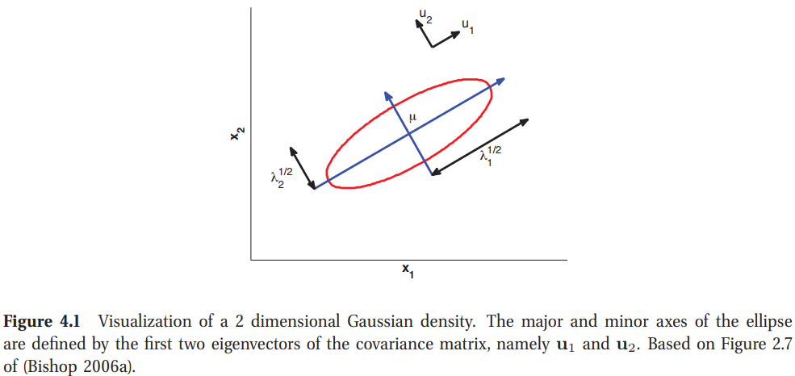
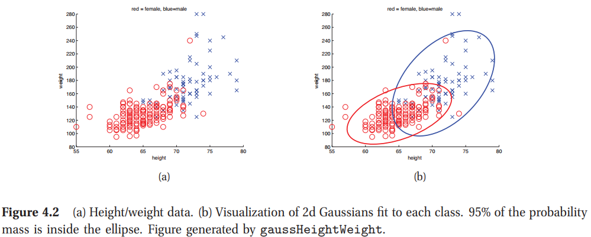
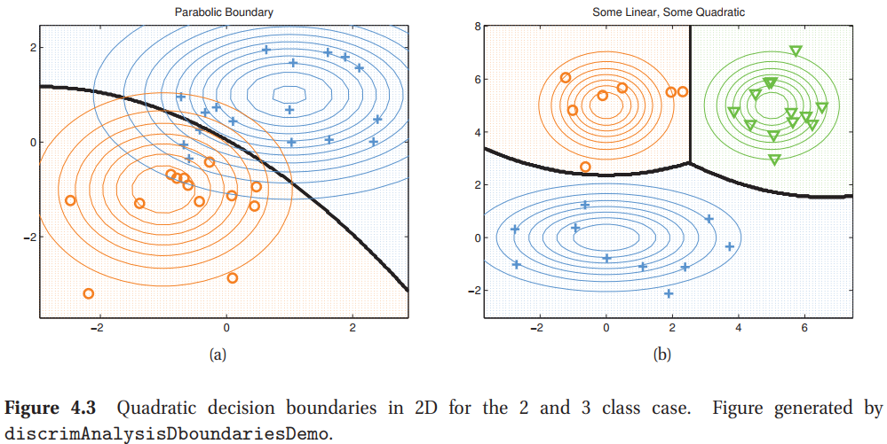
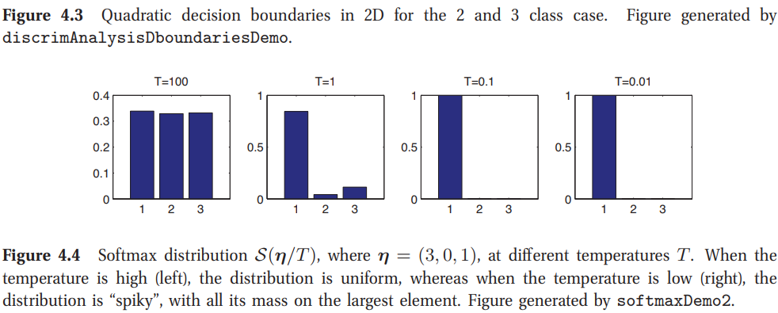
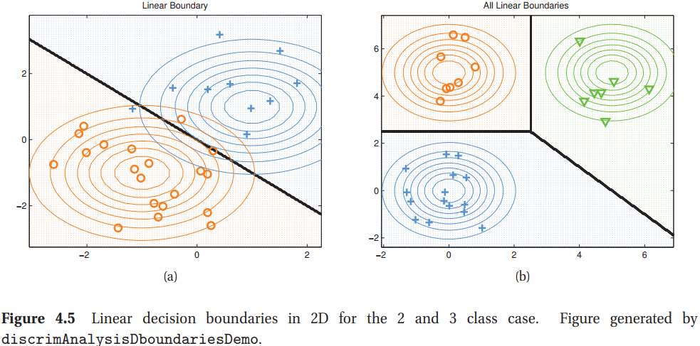
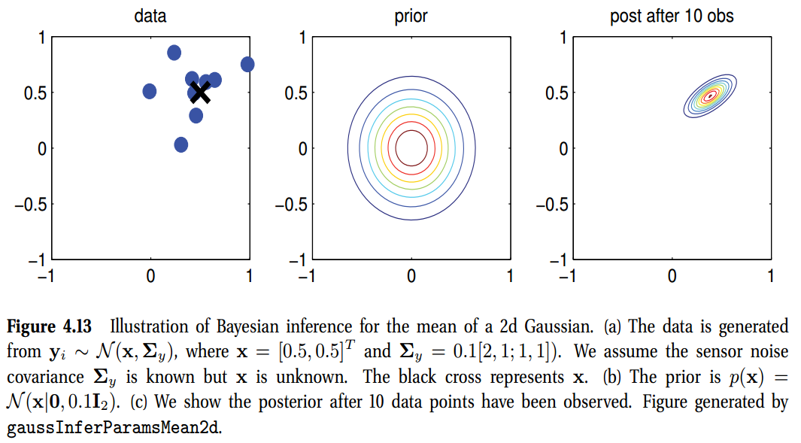

[toc]

# 4 Gaussian models

## 4.1 引言(Introduction)

本章讨论**多元高斯**或**多元正态(MVN)**，在连续变量中经常使用的联合概率密度函数。

### 4.1.1 符号(Notation)
我们使用$[x_1, \cdots, x_D]$来代表用$D$个标量堆叠起来的一个列向量。类似的，如果我们写成$\mathbf{x}=[\mathbf{x}_1, \cdots, \mathbf{x}_D]$，其中左手边是一个高的列向量，意味着我们是沿着行堆叠$\mathbf{x}_i$；这通常写作$\mathbf{x}=(\mathbf{x}_1^T,\cdots, \mathbf{x}_D^T)^T$。

### 4.1.2 基础(Basics)

一个MVN写作
$$
\mathcal{N}(\mathbf{x}\vert \boldsymbol{\mu},\mathbf{\Sigma}) \triangleq \frac{1}{(2\pi)^{D/2}\lvert\mathbf{\Sigma}\rvert^{1/2}} \exp \left[ -\frac{1}{2}(\mathbf{x}-\boldsymbol{\mu})^T\mathbf{\Sigma}^{-1} (\mathbf{x}-\boldsymbol{\mu})     \right]      \tag{4.1}
$$

指数项中的表达式是数据向量$\mathbf{x}$与均值向量$\boldsymbol{\mu}$之间的马氏距离，我们可以通过对$\mathbf{\Sigma}$执行一个特征值分解来对这个量有一个深入的理解。可以写成$\mathbf{\Sigma}=\mathbf{U}\mathbf{\Lambda}\mathbf{U}^T$，其中$\mathbf{U}$是一个正交阵，其中特征值满足$\mathbf{U}^T\mathbf{U}=\mathbf{I}$，且$\mathbf{\Lambda}$是特征值的对角阵。

使用谱分解，我们有
$$
\mathbf{\Sigma}^{-1}=\mathbf{U}^{-T}\mathbf{\Lambda}^{-1}\mathbf{U}^{-1}=\mathbf{U}\mathbf{\Lambda}^{-1}\mathbf{U}^{T} = \sum_{i=1}^D\frac{1}{\lambda_{i}}\mathbf{u}_i\mathbf{u}_i^T        \tag{4.2}
$$
其中$\mathbf{u}_i$是$\mathbf{U}$的第$i$列，包含了第$i$个特征值。因此，我们可以将马氏距离写作
$$
\begin{aligned}
    (\mathbf{x}-\boldsymbol{\mu})^T\mathbf{\Sigma}^{-1} (\mathbf{x}-\boldsymbol{\mu}) &= (\mathbf{x}-\boldsymbol{\mu})^T  \sum_{i=1}^D\frac{1}{\lambda_{i}}\mathbf{u}_i\mathbf{u}_i^T (\mathbf{x}-\boldsymbol{\mu}) \\
    &= \sum_{i=1}^D \frac{1}{\lambda_{i}} (\mathbf{x}-\boldsymbol{\mu})^T \mathbf{u}_i\mathbf{u}_i^T (\mathbf{x}-\boldsymbol{\mu}) = \sum_{i=1}^D \frac{y_i^2}{\lambda_i}      \tag{4.4}
\end{aligned}
$$
其中$y_i \triangleq \mathbf{u}_i^T (\mathbf{x}-\mathbf{u})$。回忆2维空间中的椭圆
$$
\frac{y_1^2}{\lambda_1} + \frac{y_2^2}{\lambda_2} = 1
$$
因此，我们看到高斯分布的等概率密度的等高线是沿着椭圆分布的。如图4.1所示。特征向量决定椭圆的方向，特征值决定椭圆的椭圆度。

总的来说，我们看到马哈拉诺比斯(Mahalanobis)距离对应于变换坐标系中的欧几里得距离，其中我们移动了$\mathbf{\mu}$，然后旋转了$\mathbf{U}$。

### 4.1.3 一个MVN的最大似然估计(MLE for an MVN)
我们现在描述使用MLE来计算MVN的参数估计。在后面的章节中，我们将讨论参数的贝叶斯推断，可以有效缓解过拟合，且可以对我们的估计值提供置信度。

**理论4.1**(一个高斯的MLE)如果我们有$N$个iid采样，$x_i\sim\mathcal{N}(\boldsymbol{\mu},\mathbf{\Sigma})$，那么参数的MLE给定为
$$
\begin{aligned}
    \hat{\boldsymbol{\mu}}_{mle} &= \frac{1}{N}\sum_{i=1}\mathbf{x}_i \triangleq \bar{\mathbf{x}} \\
    \hat{\mathbf{\Sigma}}_{mle} &= \frac{1}{N}\sum_{i=1}^N(\mathbf{x}_i-\bar{\mathbf{x}})(\mathbf{x}_i-\bar{\mathbf{x}})^T = \frac{1}{N}(\sum_{i=1}^N \mathbf{x}_i\mathbf{x}_i^T) - \bar{\mathbf{x}} \bar{\mathbf{x}}^T     \tag{4.7}
\end{aligned}
$$
MLE是经验均值与经验协方差。在单元情况下，我们得到如下相似的结果
$$
\begin{aligned}
    \hat{\mu}&=\frac{1}{N}\sum_i x_i=\bar{x} \\ 
    \hat{\sigma}^2 &= \frac{1}{N}\sum_{i}(x_i-\bar{x})^2=\left( \frac{1}{N}\sum_{i}x_i^2 \right) - \bar{x}^2
\end{aligned}
$$

#### 4.1.3.1 证明(Proof*)

为了证明这个结果，我们需要一些来自矩阵代数的结果。在方程中，$\mathbf{x},\mathbf{b}$是向量，$\mathbf{A},\mathbf{B}$是矩阵。同时，符号$\text{tr}\mathbf{A}$是矩阵的**迹**，$\text{tr}(\mathbf{A})=\sum_iA_{ii}$。
$$
\begin{aligned}
    \frac{\partial(\mathbf{b}^T\mathbf{a})}{\partial \mathbf{a}} &= \mathbf{b} \\
    \frac{\partial \mathbf{a}^T\mathbf{A}\mathbf{a}}{\partial\mathbf{a}} &= (\mathbf{A}+\mathbf{A}^T)\mathbf{a} \\
    \frac{\partial}{\partial \mathbf{A}}\text{tr}(\mathbf{B}\mathbf{A}) &= \mathbf{B}^T \\
    \frac{\partial}{\partial\mathbf{A}} \log\lvert\mathbf{A}\rvert &= \mathbf{A}^{-T} \triangleq (\mathbf{A}^{-1})^T \\
    \text{tr}\mathbf{ABC} &= \text{tr}(\mathbf{CAB}) = \text{tr}(\mathbf{BCA})
\end{aligned}
$$
最后一个方程称为跟踪算子的**循环置换属性**。使用此方法，我们可以得出广泛使用的迹技巧，该方法将标量内积$\mathbf{x}^T \mathbf{Ax}$重新排序如下
$$
\mathbf{x}^T \mathbf{Ax} = \text{tr}(\mathbf{x}^T \mathbf{Ax})=\text{tr}(\mathbf{xx}^T \mathbf{A})=\text{tr}(\mathbf{Axx}^T)
$$
**证明**：对数似然如下
$$
\mathcal{\ell} = \log p(\mathcal{D}\vert \boldsymbol{\mu},\mathbf{\Sigma}) = \frac{N}{2}\log\lvert \mathbf{\Lambda}\rvert -  \frac{1}{2}\sum_{i=1}^N(\mathbf{x}_i-\boldsymbol{\mu})^T\mathbf{\Lambda}(\mathbf{x}_i-\boldsymbol{\mu}) \tag{4.12}
$$
其中$\mathbf{\Lambda}=\mathbf{\Sigma}^{-1}$是精度矩阵。

使用替代$\mathbf{y}_i=\mathbf{x}_i-\boldsymbol{\mu}$与积分的链式规则，我们有
$$
\begin{aligned}
    \frac{\partial}{\partial\boldsymbol{\mu}} (\mathbf{x}_i-\boldsymbol{\mu})^T\mathbf{\Lambda}(\mathbf{x}_i-\boldsymbol{\mu}) &=\frac{\partial}{\partial\mathbf{y}_i}\mathbf{y}_i^T\mathbf{\Sigma}^{-1}\mathbf{y}_i  \frac{\partial\mathbf{y}_i}{\partial\boldsymbol{\mu}} \\
    &= -1(\mathbf{\Sigma}^{-1}+\mathbf{\Sigma}^{-T})\mathbf{y}_i \tag{4.14}
\end{aligned}
$$
因此
$$
\begin{aligned}
    \frac{\partial}{\partial\boldsymbol{\mu}}\ell (\boldsymbol{\mu},\mathbf{\Sigma}) &=  -\frac{1}{2}\sum_{i=1}^N -2\mathbf{\Sigma}^{-1}(\mathbf{x}_i-\boldsymbol{\mu}) = \mathbf{\Sigma}^{-1}\sum_{i=1}^N  (\mathbf{x}_i-\boldsymbol{\mu}) = 0  \\
\hat{\boldsymbol{\mu}} &= \frac{1}{N}\sum_{i=1}^N\mathbf{x}_i=\bar{\mathbf{x}} \tag{4.16}
\end{aligned}
$$
所以，$\boldsymbol{\mu}$的MLE是经验均值。

现在我们可以使用迹技巧将的$\mathbf{\Lambda}$最大似然估计重写为
$$
\begin{aligned}
    \ell(\mathbf{\Lambda}) &= \frac{N}{2} \log\lvert \mathbf{\Lambda}\rvert - \frac{1}{2}\sum_i \text{tr}\left[ (\mathbf{x}_i-\boldsymbol{\mu})^T(\mathbf{x}_i-\boldsymbol{\mu})\mathbf{\Lambda} \right] \\
    &= \frac{N}{2}\log\lvert\mathbf{\Lambda}\rvert - \frac{1}{2}\sum_i \text{tr}\left[ \mathbf{S}_{\mu}\mathbf{\Lambda} \right]
\end{aligned}
$$
其中
$$
\mathbf{S}_{\mu}\triangleq\sum_{i=1}^N(\mathbf{x}_i-\boldsymbol{\mu})^T(\mathbf{x}_i-\boldsymbol{\mu})
$$
是以$\boldsymbol{\mu}$为中心的散射矩阵。相对$\mathbf{\Lambda}$的导数为
$$
\begin{aligned}
    \frac{\partial\ell(\mathbf{\Lambda})}{\partial\mathbf{\Lambda}} &= \frac{N}{2}\mathbf{\Lambda}^{-T} - \frac{1}{2}\mathbf{S}_{\mu}^T=0 \\
    \mathbf{\Lambda}^{-T} &= \mathbf{\Lambda}^{-1}=\mathbf{\Sigma}=\frac{1}{N}\mathbf{S}_{\mu}
\end{aligned}
$$
所以
$$
\hat{\mathbf{\Sigma}} = \frac{1}{N}\sum_{i=1}^N (\mathbf{x}_i-\boldsymbol{\mu})(\mathbf{x}_i-\boldsymbol{\mu})^T
$$
这只是中心为$\boldsymbol{\mu}$的经验协方差矩阵。如果我们插入MLE$\boldsymbol{\mu}=\bar{\mathbf{x}}$，我们得到一个协方差矩阵的MLE的标准方程。$\blacksquare$

### 4.1.4 高斯的最大熵推导(Maximum entropy derivation of the Gaussian *)

在本节中，我们表明**多元高斯分布**是具有指定均值和协方差的最大熵分布(另请参见第9.2.6节)。这是高斯广泛使用的一个原因：前两个阶矩通常是我们可以从数据中得到可靠估计的,因此我们需要一个能够捕获这些属性的分布，但在其他方面尽可能少地进行额外的假设。

为了简化符号，我们假设均值为0。pdf的形式如下
$$
p(\mathbf{x})=\frac{1}{Z}\exp\left(-\frac{1}{2}\mathbf{x}^T\mathbf{\Sigma}^{-1}\mathbf{x} \right)       \tag{4.24}
$$
如果我们定义$f_{ij}(\mathbf{x})=x_ix_j,\lambda_{ij}=\frac{1}{2}(\Sigma^{})_{ij}，i,j\in\{1,2,\cdots,D\}$我们看到这与方程9.74一样。这个分布的可微熵给定为
$$
h(\mathcal{N}(\boldsymbol{\mu},\mathcal{\Sigma})) = \frac{1}{2}\ln[(2\pi e)^D \lvert\mathbf{\Sigma}\rvert ]     \tag{4.25}
$$
我现在证明MVN在所有给定协方差矩阵$\mathbf{\Sigma}$的分布中具有最大熵。

**理论4.2** 令$q(\mathbf{x})$为满足条件的$\int q(\mathbf{x})x_ix_j=\Sigma_{ij}$的任意密度。令$p=\mathcal{N}(\mathbf{0},\mathbf{\Sigma})$。那么有$h(q)\leq h(p)$。
证明：我们有
$$
\begin{aligned}
    0 & \leq \mathbb{KL}(q\Vert p)=\int q(\mathbf{x})\log\frac{q(\mathbf{x})}{p\mathbf{x}}d\mathbf{x} \\
    &= -h(q)-\int q(\mathbf{x})\log p(\mathbf{x})d\mathbf{x} \\
    &=^* -h(q)-\int p(\mathbf{x})\log p(\mathbf{x})d\mathbf{x} \\ 
    &=-h(q)+h(p)
\end{aligned}
$$

## 4.2 高斯判别分析(Gaussian discriminant analysis)
MVN的一个重要原因是在一个生成分类器中定义类条件密度，也就是
$$
p(\mathbf{x}\vert y=c,\boldsymbol{\theta}) = \mathcal{N}(\mathbf{x}\vert \boldsymbol{\mu}_c, \mathbf{\Sigma}_c)\tag{4.30}
$$
得到的技术称为高斯判别分析或是GDA((Gaussian) discriminant analysis)。如果$\mathbf{\Sigma}_c$是对角的，这等效于贝叶斯。

我们可以如下决策规则来分类一个特征向量
$$
\hat{y}(\mathbf{x}) = \argmax_c [\log p(y=c\vert \boldsymbol{\pi}) + \log p(\mathbf{x}\vert \boldsymbol{\theta}_c)]     \tag{4.31}
$$
当我们计算每个类条件密度下$\mathbf{x}$的概率，我们其实在测量$\mathbf{x}$到每个类中心$\boldsymbol{\mu}_c$的距离。这个可以被看作最近质心分类器。

作为一个例子，如图4.2，显示了二维空间中显示了2个高斯类密度，表示男性和女性的身高和体重。我们可以看到这些特征是相互关联的，这是意料之中的（高个子往往体重更重）。每个类的椭圆包含95%的概率质量。如果我们在类上有一个均匀先验，我们可以按照如下分类一个新的检测向量
$$
\hat{y}=\argmax_c(\mathbf{x}-\boldsymbol{\mu}_c)^T\mathbf{\Sigma}_c^{-1}(\mathbf{x}-\boldsymbol{\mu}_c)     \tag{4.32}
$$

### 4.2.1 二次型判别分析(Quadratic discriminant analysis (QDA))
类标签的后验给定为方程2.13。我们可以通过插入高斯密度的定义深入了解这个模型，如下
$$
p(y=c\vert\mathbf{x},\boldsymbol{\theta}) = \frac{\pi_c\vert2\pi_c\mathbf{\Sigma_c}\vert^{-\frac{1}{2}}\exp[-\frac{1}{2}(\mathbf{x}-\boldsymbol{\mu}_c)^T\mathbf{\Sigma}_c^{-1}(\mathbf{x}-\boldsymbol{\mu}_c)]}{\sum_{c^{\prime}}\pi_{c^{\prime}}\vert2\pi_{c^{\prime}}\mathbf{\Sigma_{c^{\prime}}}\vert^{-\frac{1}{2}}\exp[-\frac{1}{2}(\mathbf{x}-\boldsymbol{\mu}_{c^{\prime}})^T\mathbf{\Sigma}_{c^{\prime}}^{-1}(\mathbf{x}-\boldsymbol{\mu}_{c^{\prime}})]}
$$
设置阈值会得到$\mathbf{x}$的二次函数。这个结果称为二次型判别分析。图4.3给出了一个决策边界的例子。

### 4.2.2 4.2 线性判别分析(Linear discriminant analysis (LDA))

我们考虑一个特殊情况，其中协方差矩阵在类别之间是共享或tied的，$\mathbf{\Sigma}_c=\mathbf{\Sigma}$。这种情况下，我们可以将4.33简化为
$$
\begin{aligned}
    p(y=c\vert\mathbf{x},\boldsymbol{\theta}) &\propto \pi_c \exp \left[ \boldsymbol{\mu}_c^T\mathbf{\Sigma}^{-1}\mathbf{x} -\frac{1}{2}\mathbf{x}^T\mathbf{\Sigma}^{-1}\mathbf{x}-\frac{1}{2}\boldsymbol{\mu}_c^T\mathbf{\Sigma}^{-1}\boldsymbol{\mu}_c   \right] \\
    &= \exp\left[ \boldsymbol{\mu}_c^T\mathbf{\Sigma}^{-1}\mathbf{x} -\frac{1}{2}\boldsymbol{\mu}_c^T\mathbf{\Sigma}^{-1}\boldsymbol{\mu}_c +\log\pi_c  \right] \exp\left[ -\frac{1}{2}\mathbf{x}^T\mathbf{\Sigma}^{-1}\mathbf{x} \right]
\end{aligned}
$$
因为二次型项$\mathbf{x}^T\mathbf{\Sigma}^{-1}\mathbf{x}$是独立于$c$的，可以在分子与分母中舍弃。如果，我们定义
$$
\begin{aligned}
    \gamma_c &= -\frac{1}{2}\boldsymbol{\mu}_c\Sigma^{-1}\boldsymbol{\mu}_c + \log\pi_c \\
    \boldsymbol{\beta}_c &= \mathbf{\Sigma}^{-1}\boldsymbol{\mu}_c 
\end{aligned}
$$
那么我们可以写成
$$
p(y=c\vert\mathbf{x},\boldsymbol{\theta}) = \frac{e^{\boldsymbol{\beta}_c^T\mathbf{x}+\gamma_c}}{\sum_{c^{\prime}}e^{\boldsymbol{\beta}_{c^{\prime}}^T\mathbf{x}+\gamma_{c^{\prime}}}}=\mathcal{S}(\boldsymbol{\eta})_c     \tag{4.38}
$$
其中$\boldsymbol{\eta}= [\boldsymbol{\beta}_1^T\mathbf{x}+\gamma_1, \cdots,\boldsymbol{\beta}_c^T\mathbf{x}+\gamma_c]$，且$\mathcal{S}$是softmax函数，定义如下
$$
\mathcal{S}(\boldsymbol{\eta})_c = \frac{e^{\eta_c}}{\sum_{c^{\prime}=1}e^{\eta_{c^{\prime}}}}  \tag{4.39}
$$
softmax函数之所以称为softmax函数，是因为它的行为有点像max函数。为了了解这个，我们使用称为温度的常数$T$分割每个$\eta_c$。那么$T\rightarrow0$，我们发现
$$
\mathcal{S}(\boldsymbol{\eta}/T)_c = \begin{cases}
    1.0 & if c=\argmax_{c^{\prime}}\eta_{c^{\prime}} \\
    0.0 & otherwise
\end{cases} \tag{4.40}
$$
换句话说，在低温下，分布基本上所有的时间都在最可能的状态，而在高温下，它会均匀地访问所有的状态。见图4.4。注意，这个术语来自统计物理领域，在这里通常使用**Boltzmann分布**，它与softmax函数的形式相同。

方程4.38的一个有趣的性质是，如果我们取对数，我们以$\mathbf{x}$的一个线性函数终结。(其为线性的原因是因为$\mathbf{x}^T\mathbf{\Sigma}^{-1}\mathbf{x}$在分子分母中抵消了。)那么任意两个类$c,c^{\prime}$之间的决策边界是一条直线。因此这个技术称为线性判别分析(LDA)。我们可以得到如下形式的直线
$$
\begin{aligned}
    p(y=c\vert\mathbf{x},\boldsymbol{\theta}) &= p(y=c^{\prime}\vert\mathbf{x},\boldsymbol{\theta}) \\
    \boldsymbol{\beta}_c^T\mathbf{x}+\gamma_c &= \boldsymbol{\beta}_{c^{\prime}}^T\mathbf{x}+\gamma_{c^{\prime}} \\
    \mathbf{x}^T(\boldsymbol{\beta}_{c^{\prime}} - \boldsymbol{\beta}_{c}) &= \gamma_{c^{\prime}} - \gamma_c
\end{aligned}
$$
如图4.5所示。

拟合一个LDA模型然后得到类别后验的另一种方法是直接为$C\times D$的权重矩阵$\mathbf{W}$拟合$p(y\vert\mathbf{x,W})=\text{Cat}(y\vert\mathbf{x,W})$。这个称为**多类logistics回归**，或是**多努利logistics回归**。

### 4.2.3 二类LDA(Two-class LDA)

为了进一步了解这些方程的含义，我们考虑一下二项情况。这种情况下，后验给定为
$$
\begin{aligned}
    p(y=1\vert\mathbf{x} \boldsymbol{\theta}) &= \frac{e^{\boldsymbol{\beta}_1^T\mathbf{x}+\gamma_1}}{e^{\boldsymbol{\beta}_1^T\mathbf{x}+\gamma_1} + e^{\boldsymbol{\beta}_0^T\mathbf{x}+\gamma_0}}    \tag{4.45} \\
    &= \frac{1}{1+e^{(\boldsymbol{\beta}_0-\boldsymbol{\beta}_1)^T\mathbf{x}+(\gamma_0-\gamma_1)}} \\
    &= \text{sigm}((\boldsymbol{\beta}_0-\boldsymbol{\beta}_1)^T\mathbf{x}+(\gamma_0-\gamma_1))
\end{aligned}
$$
其中$\text{sigm}(\eta)$称为sigmod函数。

$$
\begin{aligned}
    \gamma_1-\gamma_0 &= -\frac{1}{2}\boldsymbol{\mu}_1^T\mathbf{\Sigma}^{-1}\boldsymbol{\mu}_1 + \frac{1}{2}\boldsymbol{\mu}_0^T\mathbf{\Sigma}^{-1}\boldsymbol{\mu}_0 + \log(\pi_1/\pi_0)  \\   \tag{4.46}
    &= -\frac{1}{2} (\boldsymbol{\mu}_1 - \boldsymbol{\mu}_0)^T \mathbf{\Sigma}^{-1} (\boldsymbol{\mu}_1 - \boldsymbol{\mu}_0) + \log(\pi_1/\pi_0)
\end{aligned}
$$

所以，如果我们定义
$$
\begin{aligned}
    \mathbf{w} &= \boldsymbol{\beta}_1 - \boldsymbol{\theta}_0 = \mathbf{\Sigma}^{-1}(\boldsymbol{\mu}_1 - \boldsymbol{\mu}_0) \\
    \mathbf{x}_0 &= \frac{1}{2}(\boldsymbol{\mu}_1 + \boldsymbol{\mu}_0) - (\boldsymbol{\mu}_1 - \boldsymbol{\mu}_0)\frac{\log(\pi_1/\pi_0)}{(\boldsymbol{\mu}_1 - \boldsymbol{\mu}_0)^T\mathbf{\Sigma}^{-1}(\boldsymbol{\mu}_1 - \boldsymbol{\mu}_0)}
\end{aligned}
$$

## 4.3 联合高斯分布的推理(Inference in jointly Gaussian distributions)

给定一个联合分布$p(\mathbf{x}_1, \mathbf{x}_2)$，对于计算边缘$p(\mathbf{x}_1)$与条件分布$p(\mathbf{x}_1\vert\mathbf{x}_2)$很有用。我们现在讨论如何实现，然后给定一些应用。这些运算最坏情况下消耗$O(D^3)$时间。在20.4.3节中有更快的方法。

### 4.3.1 结果的描述(statement of result)

**Theorem 4.3.1**(一个MVN的边缘与条件)。假设$\mathbf{x}=(\mathbf{x}_1,\mathbf{x}_2)$是联合高斯，参数为
$$
\begin{aligned}
    \boldsymbol{\mu} = \begin{pmatrix}
        \boldsymbol{\mu}_1 \\
        \boldsymbol{\mu}_2
    \end{pmatrix},\mathbf{\Sigma} = \begin{pmatrix}
        \mathbf{\Sigma}_{11}, \mathbf{\Sigma}_{12} \\
        \mathbf{\Sigma}_{21}, \mathbf{\Sigma}_{22}
    \end{pmatrix}, \mathbf{\Lambda} = \mathbf{\Sigma}^{-1} = \begin{pmatrix}
        \mathbf{\Lambda}_{11}, \mathbf{\Lambda}_{12} \\
        \mathbf{\Lambda}_{21}, \mathbf{\Lambda}_{22}
    \end{pmatrix}
\end{aligned}       \tag{4.67}
$$
边缘分布给定为
$$
\begin{aligned}
    p(\mathbf{x}_1) &= \mathcal{N}(\mathbf{x}_1\vert\boldsymbol{\mu}_1,\mathbf{\Sigma}_{11})        \\
    p(\mathbf{x}_2) &= \mathcal{N}(\mathbf{x}_2\vert\boldsymbol{\mu}_2,\mathbf{\Sigma}_{22}) 
\end{aligned}       \tag{4.68}
$$
后验条件分布给定为
$$
\begin{aligned}
    p(\mathbf{x}_1\vert\mathbf{x}_2) &= \mathcal{N}(\mathbf{x}_1\vert\boldsymbol{\mu}_{1\vert2},\mathbf{\Sigma_{1\vert2}})   \\
    \boldsymbol{\mu_{1\vert2}} &=\boldsymbol{\mu}_1 + \mathbf{\Sigma}_{12}\mathbf{\Sigma}_{22}^{-1}(\mathbf{x}_2-\boldsymbol{\mu}_2) \\
    &= \boldsymbol{\mu}_1 - \mathbf{\Lambda}_{11}\mathbf{\Lambda}_{12}^{-1}(\mathbf{x}_2-\boldsymbol{\mu}_2) \\
    &= \mathbf{\Sigma}_{1\vert2}(\mathbf{\Lambda}_{11}\boldsymbol{\mu}_1 -  \mathbf{\Lambda}_{12}(\mathbf{x}_2-\boldsymbol{\mu}_2)) \\
    \mathbf{\Sigma}_{1\vert2} &= \mathbf{\Sigma}_{11} - \mathbf{\Sigma}_{12}\mathbf{\Sigma}_{22}^{-1}\mathbf{\Sigma}_{21} = \mathbf{\Lambda}_{11}^{-1}
\end{aligned}
$$
等式4.69在这本书中非常重要，我们在它周围放了一个盒子，你很容易就能找到它。有关证明，请参见第4.3.4节

我们看到，边缘与条件密度其本身也是高斯的。对于边缘，我们只是提取对应于$\mathbf{x}_1$与$\mathbf{x}_2$的行与列。对于条件分布，我们需要多做一点工作。然而，其不是很复杂：条件均值只是$\mathbf{x}_2$的一个线性函数，条件方差是一个常矩阵，独立于$\mathbf{x}_2$。我们对于后验均值给出三种不同的表达式，对于后验方程，我们给出两种不同的表达式。

### 4.3.2 例子(Examples)

### 4.3.2.1 一个2d高斯的边缘与条件分布(Marginals and conditionals of a 2d Gaussian)
我们现在考虑一个2d例子。协方差矩阵是
$$
\mathbf{\Sigma} = \begin{pmatrix}
    \sigma_1^2 & \rho\sigma_1\sigma_2 \\
    \rho\sigma_1\sigma_2 & \sigma_2^2
\end{pmatrix}
$$
边缘分布$p(x_1)$是一个1D高斯，通过将联合分布映射到$x_1$直线上得到：
$$
p(x_1) = \mathcal{N}(x_1\vert \mu_1,\sigma_1^2)     \tag{4.71}
$$
假设我们获得$X_2=x_2$；条件$p(x_1\vert x_2)$通过直线$X_2=x_2$切片联合分布得到
$$
p(x_1\vert x_2) = \mathcal{N}\left(x_1\vert \mu_1+\frac{\rho\sigma_1\sigma_2}{\sigma_2^2}(x_2-\mu_2),  \sigma_1^2 - \frac{(\rho\sigma_1\sigma_2)^2}{\sigma_2^2}  \right)     \tag{4.72}
$$
如果$\sigma_1=\sigma_2=\sigma$，我们得到
$$
p(x_1\vert x_2) = \mathcal{N}\left(x_1\vert \mu_1+\rho(x_2-\mu_2),  \sigma_1^2(1-\rho^2)  \right)     \tag{4.73}
$$

### 4.3.2.2 插值无噪声数据(Interpolating noise-free data)

假设我们想估计定义在区间$[0,T]$上的1维函数，使得对于$N$个观测点$t_i$有$y_i=f(t_i)$。我们假设现在数据是无噪声，所以我们想对其使用插值，也就是通过数据精确拟合函数。问题是:函数如何在观测数据点之间运行。一般合理的假设是未知函数是平滑的。在15章中，我们将展示如何encode函数的先验，并用观测值的更新先验并得到函数的后验。但在本节中，我们采用了一种更简单的方法，这种方法足以对定义在一维输入上的函数进行MAP估计。

我们先把问题离散化。首先我们把函数的支持度分成$D$等子区间。然后我们定义
$$
x_j= f(s_j), s_j = jh, h =\frac{T}{D}, 1\leq j \leq D   \tag{4.74}
$$
我们可以通过假设$x_j$是其邻居$x_{j-1}$与$x_{j+1}$的均值来**编码平滑先验(encode smoothness prior)**，假设高斯噪声
$$
x_j = \frac{1}{2}(x_{j-1} + x_{j+1}) + \epsilon_j, \quad 2\leq j \leq D-2   \tag{4.75}
$$
其中$\boldsymbol{\epsilon}\sim\mathcal{N}(\mathbf{0},(1/\lambda)\mathbf{I})$。精确项$\lambda$控制了我们认为函数变化的程度：大$\lambda$对应于一种信念，即函数是非常平滑的，一个小的$\lambda$对应于一种信念，即函数相当“摇摆”。以向量形式，上述方程可以写成
$$
\mathbf{Lx} = \boldsymbol{\epsilon} \tag{4.76}
$$
其中$\mathbf{L}$是一个$(D-2)\times D$维的二阶**有限差分矩阵**
$$
\mathbf{L} = \frac{1}{2}\begin{pmatrix}
    -1 & 2 &-1 & & \\
    & -1 & 2 & -1 \\
    & & \ddots \\
    & & & -1 & 2 & -1
\end{pmatrix}  \tag{4.77}
$$
对应的先验形式是
$$
p(\mathbf{x}) = \mathcal{N}(\mathbf{x}\vert \mathbf{0}, (\lambda^2\mathbf{L}^{\top}\mathbf{L})^{-1}) \propto \exp\left(-\frac{\lambda^2}{2}\lVert\mathbf{Lx}\lVert_2^2 \right)   \tag{4.78}
$$
我们因此假设我们通过$\lambda$缩放了$\mathbf{L}$，所以我们可以忽略$\lambda$项，我们只要用$\mathbf{\Lambda}=\mathbf{L}^{\top}\mathbf{L}$代表精确矩阵。

注意到尽管$\mathbf{x}$是$D$-维向量，精确矩阵$\mathbf{\Lambda}$的秩为$D-2$。因此这是一个不适当的先验知识，称为内在高斯随机场(在19.4.4节中有进一步介绍)。然后，提供$N\geq 2$个数据点，后验将是恰当的。

现在令$\mathbf{x}_2$是函数的$N$个无噪声观测，$\mathbf{x}_1$是$D-N$个未知的函数值。不失一般性，假设未知变量先排序，然后是已知变量。然后我们可以将$\mathbf{L}$矩阵可以分割为如下
$$
\mathbf{L}=[\mathbf{L}_1, \mathbf{L}_2],\mathbf{L}_1\in\mathbb{R}^{(D-2)\times (D-N)}, \mathbf{L}_2\in\mathbb{R}^{(D-2)\times N}
$$
我们也可以分割联合分布的精确矩阵
$$
\mathbf{\Lambda} = \mathbf{L^{\top}L} = \begin{pmatrix}
    \mathbf{\Lambda}_{11} & \mathbf{\Lambda}_{12} \\
    \mathbf{\Lambda}_{21} & \mathbf{\Lambda}_{22}
\end{pmatrix} = \begin{pmatrix}
    \mathbf{L}_{1}^{\top}\mathbf{L}_1 & \mathbf{L}_{1}^{\top}\mathbf{L}_2 \\
    \mathbf{L}_{2}^{\top}\mathbf{L}_1 & \mathbf{L}_{2}^{\top}\mathbf{L}_2
\end{pmatrix}
$$
使用方程4.69，我们可以将条件分布写为如下形式
$$
\begin{aligned}
    p(\mathbf{x}_1\vert \mathbf{x}_2) &= \mathcal{N}(\boldsymbol{\mu}_{1\vert 2},\mathbf{\Sigma}_{1\vert 2})  \\
    \boldsymbol{\mu}_{1\vert 2} &= -\mathbf{\Lambda}_{11}^{-1}-\mathbf{\Lambda}_{12}\mathbf{x}_2 \\
    \mathbf{\Sigma}_{1\vert 2} &= \boldsymbol{\Lambda}_{11}^{-1}
\end{aligned}       \tag{4.81-4.83}
$$
现在，我们通过求解如下线性方程系统来计算均值
$$
\mathbf{L}_1\boldsymbol{\mu}_{1\vert 2} = -\mathbf{L}_2\mathbf{x}_2  \tag{4.84}
$$
因为$\mathbf{L}_1$是对角的，这是有效的。图4.10给出了这些方程的一些解释。我们看到后验均值$\boldsymbol{\mu}_{1\vert 2}$等于在特定点的观测数据，并根据需要在两者之间平滑插值。

### 4.3.3 Information form

假设$\mathbf{x}\sim\mathcal{N}(\boldsymbol{\mu}, \mathbf{\Sigma})$。可以证明$\mathbb{E}=\boldsymbol{\mu}$是均值向量，$\text{cov}[\mathbf{x}]=\mathbf{\Sigma}$是协方差矩阵。这称为分布的**阶矩参数/moment parameters**。然而，有时使用**标准参数**或是**自然参数**很有用，定义为
$$
\mathbf{\Lambda}\triangleq \mathbf{\Sigma}^{-1}, \boldsymbol{\xi} \triangleq \mathbf{\Sigma}^{-1}\boldsymbol{\mu}    \tag{4.85}
$$
使用
$$
\boldsymbol{\mu} = \mathbf{\Lambda}^{-1}\boldsymbol{\xi}, \mathbf{\Sigma} = \mathbf{\Lambda}^{-1}    \tag{4.86}
$$
使用标准参数，我们可以写出MVN的信息形式
$$
\mathcal{N}_c(\mathbf{x}\vert \boldsymbol{\xi}, \mathbf{\Lambda}) = (2\pi)^{-D/2}\lvert\mathbf{\Lambda}\rvert^{\frac{1}{2}}\exp \left[ -\frac{1}{2}(\mathbf{x}^{\top}\mathbf{\Lambda}\mathbf{x} + \boldsymbol{\xi}^{\top}\mathbf{\Lambda}^{-1}\boldsymbol{\xi} -2\mathbf{x}^{\top}\boldsymbol{\xi})      \right]  \tag{4.87}
$$
其中我们使用符号$\mathcal{N}_c$来区分阶矩参数化$\mathcal{N}()$。

我们也可以信息形式的边缘与条件公式。我们发现
$$
\begin{aligned}
    p(\mathbf{x}_2) &= \mathcal{N}_c(\mathbf{x}_2\vert \boldsymbol{\xi}_2 - \mathbf{\Lambda}_{21}\mathbf{\Lambda}^{-1}_{11}\boldsymbol{\xi}_1, \mathbf{\Lambda}_{22} - \mathbf{\Lambda}_{21} \mathbf{\Lambda}_{11}^{-1}\mathbf{\Lambda}_{12}) \\
    p(\mathbf{x}_1\vert \mathbf{x}_2) & = \mathcal{N}_c(\mathbf{x}_1\vert \boldsymbol{\xi}_1 - \mathbf{\Lambda}_{12}\mathbf{x}_2, \mathbf{\Lambda}_{11})
\end{aligned}
$$
我们可以看到以阶矩形式边缘更简单，条件以信息形式更简单。

另一个在信息形式上更简单的操作是两个高斯数相乘。我们可以证明
$$
\mathcal{N}_c(\xi_f, \lambda_f)\mathcal{N}_c(\xi_g, \lambda_g) = \mathcal{N}_c(\xi_f + \xi_g, \lambda_f + \lambda_g)    \tag{4.90}
$$
然后，以阶矩形式，事情要复杂得多:
$$
\mathcal{N}_c(\mu_f, \sigma_f^2)\mathcal{N}_c(\mu_g, \sigma_g^2)  = \mathcal{N}\left( \frac{\mu_g\sigma_f^2 + \mu_f\sigma_g^2}{\sigma_f^2 + \sigma_g^2}, \frac{\sigma_f^2\sigma_g^2}{\sigma_f^2 + \sigma_g^2}  \right)  \tag{4.91}
$$

### 4.3.2.3 数据插补(Data imputation)

### 4.3.3 信息形式(Information form)

## 4.4 线性高斯系统(Linear Gaussian systems)

假设我们有两个变量$\mathbf{x,y}$。令$\mathbf{x}\in\mathbb{R}^{D_x}$是一个隐变量，$\mathbf{y}\in\mathbb{R}^{D_y}$是$\mathbf{x}$的一个噪声观测。我们假设有如下先验与似然
$$
\begin{aligned}
    p(\mathbf{x}) & =\mathcal{N}(\mathbf{x}\vert \boldsymbol{\mu}_x,\mathbf{\Sigma}_x) \\
    p(\mathbf{y\vert x}) &= \mathcal{N}(\mathbf{y}\vert \mathbf{Ax+b},\mathbf{\Sigma}_y)
\end{aligned}       \tag{4.124}
$$
其中$\mathbf{A}$是大小为$D_y\times D_x$的矩阵。这是一个**线性高斯系统**的例子，我们将这个系统性的表示为$\mathbf{x}\rightarrow\mathbf{y}$，意味着$\mathbf{x}$生成$\mathbf{y}$。本节中，我们展示如何逆转箭头，也就是如何从$\mathbf{y}$推理出$\mathbf{x}$。我们将结果描述如下，然后给出几个例子。

### 4.4.1 结果描述(Statement of the result)
**理论4.4.1**(线性高斯系统的贝叶斯规则)给定一个**线性高斯系统**，如方程4.124，后验$p(\mathbf{x\vert y})$给定如下
$$
\begin{aligned}
    p(\mathbf{x}\vert \mathbf{y}) &= \mathcal{N}(\mathbf{x}\vert \boldsymbol{\mu}_{x\vert y}, \mathbf{\Sigma}_{x\vert y})       \\
    \mathbf{\Sigma}_{x\vert y}^{-1} &= \mathbf{\Sigma}^{-1}_{x} + \mathbf{A}^{\top}\mathbf{\Sigma}^{-1}_{y}\mathbf{A} \\
    \boldsymbol{\mu}_{x\vert y} &= \mathbf{\Sigma}_{x\vert y} [\mathbf{A}^{\top}\mathbf{\Sigma}_y^{-1}(\mathbf{y-b})+\mathbf{\Sigma}_x^{-1}\boldsymbol{\mu}_x]
\end{aligned}   \tag{4.125}
$$
另外，归一化常数给定为
$$
p(\mathbf{y}) = \mathcal{N}(\mathbf{y\vert A}\boldsymbol{\mu}_x+\mathbf{b}, \mathbf{\Sigma}_y + \mathbf{A}\mathbf{\Sigma}_{x}\mathbf{A}^{\top})
$$

### 4.4.2 例子(Examples)
本节中，我们将会给出上述结果的一个应用。

#### 4.4.2.1 根据噪声观测推理一个未知标量(Inferring an unknown scalar from noisy measurements)

假设，我们有$N$个潜在变量$x$的噪声观测$y_i$；我们假设观测噪声有固定精确度$\lambda_y = \frac{1}{\sigma^2}$，所以似然为
$$
p(y_i\vert x) = \mathcal{N}(y_i\vert x, \lambda_y^{-1})     \tag{4.127}
$$
让我们为未知源的值使用一个高斯先验
$$
p(x)=\mathcal{N}(x\vert \mu_0 ,\lambda_0^{-1})  \tag{4.128}
$$
我们想计算$p(x\vert y_1, \cdots, y_N,\sigma^2)$。我们通过定义$\mathbf{y}=(y_1,\cdots, y_N),\mathbf{A}=\mathbf{1}_N^{\top}$，为高斯应用贝叶斯规则得到如下规则
$$
\begin{aligned}
    p(x\vert \mathbf{y}) &= \mathcal{N}(x\vert \mu_N, \lambda_N^{-1}) \\
    \lambda_N &=  \lambda_0 + N\lambda_y \\
    \mu_N &= \frac{N\lambda_y\bar{y} + \lambda_0\mu_0}{\lambda_N} = \frac{N\lambda_y}{\lambda_0 + N\lambda_y}\bar{y} + \frac{\lambda_0}{\lambda_0 + N\lambda_y}\mu_0
\end{aligned}
$$
这些方程是非常直观的：后验精确度$\lambda_N$是先验$\lambda_0$加上$N$个单元的测量精度$\lambda_y$。同样，后验均值$\mu_N$是MLE$\bar{y}$与先验均值$\mu_0$的凸组合。很清楚，后验均值是MLE与先验的一个妥协。如果先验相对信号强度较弱($\lambda_0$相对$\lambda_y$较小)，我们在MLE上给予更小的权重。如果先验相对信号强度强($\lambda_0$相对$\lambda_y$大)我们在先验上给予更大的权重。在图14.2中进行了解释，类似于3.6图中的beta-binomial模型的结果。

注意到后验均值是关于$N\lambda_y\bar{y}$，所以有$N$个精度为$\lambda_y$的观测值，类似于有一个值为$\bar{y}$精度为$N\lambda_y$的观测。

我们可以将结果写成后验方差，而不是后验精确，如下
$$
\begin{aligned}
    p(x\vert \mathcal{D}, \sigma^2) & = \mathcal{N}(x\vert \mu_N, \tau_N^2) \\
    \tau_N^2 &= \frac{1}{\frac{N}{\sigma^2} + \frac{1}{\tau_0^2}} = \frac{\sigma^2\tau_0^2}{N\tau_0^2 + \sigma^2} \\
    \mu_N &= \tau_N^2\left( \frac{\mu_0}{\tau_0^2} + \frac{N\bar{y}}{\sigma^2} \right) = \frac{\sigma^2}{N\tau_0^2 + \sigma^2}\mu_0 + \frac{N\tau_0^2}{N\tau_0^2 + \sigma^2}\bar{y}
\end{aligned}   \tag{4.132-4.134}
$$
其中$\tau_0^2=1/\lambda_0$是先验方差，$\tau_N^2=1/\lambda_N$是后验方差。

通过每次观测后的更新，我们可以顺序计算后验。如果$N=1$，我们可以在看到单个观测后重写后验(观测如下，其中我们定义$\Sigma_y=\sigma^2,\Sigma_0=\tau_0^2,\Sigma_1=\tau_1^2$是似然方差，先验与后验)
$$
\begin{aligned}
    p(x\vert y) &= \mathcal{N}(x\vert \mu_1,\Sigma_1) \\
    \Sigma_1  &= \left (\frac{1}{\Sigma_0} + \frac{1}{\Sigma_y} \right)^{-1} = \frac{\Sigma_y\Sigma_0}{\Sigma_y + \Sigma_0} \\
    \mu_1 &= \Sigma_1 \left (\frac{\mu_0}{\Sigma_0} + \frac{y}{\Sigma_y} \right)
\end{aligned}   \tag{4.135-4.137}
$$
我们可以将后验均值写成3中方式
$$
\begin{aligned}
    \mu_1 &= \frac{\Sigma_y}{\Sigma_y + \Sigma_0} \mu_0 + \frac{\Sigma_0}{\Sigma_y + \Sigma_0}y \\
    &= \mu_0 + (y - \mu_0)\frac{\Sigma_0}{\Sigma_y + \Sigma_0} \\
    &= y-(y-\mu_0)\frac{\Sigma_y}{\Sigma_y + \Sigma_0}
\end{aligned}
$$
第一个方程是先验与数据的凸组合。第二个方程是先验均值向数据的调整。第三个方程是数据向先验的调整；这个称为**shrinkage**。这是表达似然与先验权衡的所有等效方式。如果$\Sigma_0$相对于$\Sigma_Y$相对很小，对应域一个强先验，收缩的量很大；然而如果$\Sigma_0$相对于$\Sigma_Y$相对很大，对应一个弱先验，收缩的量很小。

量化收缩量的另一种方法是**信噪比/signal-to-noise ratio**，定义如下
$$
\text{SNR} \triangleq \frac{\mathbb{E}[X^2]}{\mathbb{E}[\epsilon^2]} = \frac{\Sigma_0 + \mu_0^2}{\Sigma_y}      \tag{4.141}
$$
其中$x\sim\mathcal{N}(\mu_0,\Sigma_0)$是真实信号，$y=x+\epsilon$是观测信号，$\epsilon\sim\mathcal{N}(0,\Sigma_y)$是噪声项。

#### 4.4.2.2 根据噪声观测推理一个未知向量(Inferring an unknown vector from noisy measurements)

> 对于2维高斯的均值的贝叶斯推理的解释。(a)数据生成于$\mathbf{y}_i\sim\mathcal{N}(\mathbf{x},\mathbf{\Sigma}_y)$，其中$\mathbf{x}=[0.5,0.5]^{\top}$，$\mathbf{\Sigma}=0.1[2,1;1,1])$。我们假设传感器噪声协方差$\mathbf{\Sigma}_y$已知，但是$\mathbf{x}$未知。黑叉代表$\mathbf{x}$。(b)先验是$p(\mathbf{x})=\mathcal{N}(\mathbf{x}\vert \mathbf{0},0.1\mathbf{I}_2)$。(c)我们展示观测到10个数据点后的后验。

现在考虑$N$个向量值观测，$\mathbf{y}_i \sim \mathcal{N}(\mathbf{x,\Sigma}_y)$，且一个高斯先验$\mathbf{x}\sim\mathcal{N}(\boldsymbol{\mu}_0,\mathbf{\Sigma}_0)$。设置$\mathbf{A=I,b=0}$，使用$\bar{\mathbf{y}}$代表精度为$N\mathbf{\Sigma}_y^{-1}$的有效观测值，我们有
$$
\begin{aligned}
    p(\mathbf{x}\vert \mathbf{y}_1,\cdots,\mathbf{y}_N) &= \mathcal{N}(\mathbf{x}\vert \boldsymbol{\mu}_N, \mathbf{\Sigma}_N) \\
    \mathbf{\Sigma}_N^{-1} &= \mathbf{\Sigma}_0^{-1} + N\mathbf{\Sigma}_y^{-1} \\
    \boldsymbol{\mu}_N &= \mathbf{\Sigma}_N (\mathbf{\Sigma}_y^{-1}(N\bar{\mathbf{y}}) + \mathbf{\Sigma}_0^{-1}\boldsymbol{\mu}_0)
\end{aligned}\tag{4.142-4.144}
$$
图4.3是一个2维例子。我们认为$\mathbf{x}$表示为真实数据，但是未知，定位是2维空间中的一个对象，例如
导弹或飞机，且$\mathbf{y}_i$是噪声观测，例如雷达‘噪声’。当我们收到更多的光点，我们就能够更好地定位源。在第18.3.1节中，我们将看到如何使用著名的Kalman滤波算法扩展这个示例来跟踪移动对象。 

现在假设我们有多个测量装置，我们想把它们组合在一起；这就是所谓的**传感器融合/sensor fushion**。如果我们有多个具有不同协方差的观测值(对应于具有不同可靠性的传感器)，则后验值将是数据的适当加权平均值。考虑图4.14中的例子。我们使用一个$\mathbf{x}$上的无信息先验，也就是$p(\mathbf{x})=\mathcal{N}(\boldsymbol{\mu}_0,\mathbf{\Sigma}_0)=\mathcal{N}(\mathbf{x}\vert \mathbf{0},10^{10}\mathbf{I}_2)$。我们得到2个噪声观测，$\mathbf{y}_i \sim \mathcal{N}(\mathbf{x,\Sigma}_{y,1})$与$\mathbf{y}_i \sim \mathcal{N}(\mathbf{x,\Sigma}_{y,2})$。然后计算$p(\mathbf{x}\vert \mathbf{y}_1,\mathbf{y}_2)$。

在图4.14(a)中，我们令$\mathbf{\Sigma}_{y,1},\mathbf{\Sigma}_{y,2}=0.01\mathbf{I}_2$，所以两个传感器是同等可靠的。这种情况下，后验平均值介于两个观察值$\mathbf{y}_1,\mathbf{y}_2$之间。在图4.14(b)中，我们设置$\mathbf{\Sigma}_{y,1}=0.05\mathbf{I}_2,\mathbf{\Sigma}_{y,2}=0.01\mathbf{I}_2$，所以传感器2比传感器1更可靠。这种情况下，后验均值更靠近$\mathbf{y}_2$。

#### 4.4.2.3 内插噪声数据(Interpolating noisy data)
我们现在回顾4.3.2.2节中的例子。这次我们不再假设是无噪声观测。相反的，我们假设我们获得$N$个观测噪声$y_i$;不失一般性的，我们假设对应$x_1,\cdots,x_N$。我们可以将其建模为一个线性高斯模型:
$$
\mathbf{y=Ax}+\boldsymbol{\epsilon} \tag{4.146}
$$
其中$\boldsymbol{\epsilon}=\mathcal{N}(\mathbf{0,\Sigma}_y,\mathbf{\Sigma}_y=\sigma^2\mathbf{I}$，其中$\sigma^2$是观测噪声，且$\mathbf{A}$是一个$N\times D$维映射矩阵。用于选择观测元素。例如，如果$N=2,D=4$，我们有
$$
\mathbf{A} = \begin{bmatrix}
    1 & 0 & 0 & 0 \\
    0 & 1 & 0 & 0
\end{bmatrix}
$$
使用与以前相同的不适当先验,$\mathbf{\Sigma}_x = (\mathbf{L}^{\top}\mathbf{L})^{-1}$，我们可以很容易地计算后验均值和方差。在图4.15中，我们绘制了后验均值、后验方差和一些后验样本。现在我们看到先前的精度$λ$影响后验均值和后验方差。特别是对于强先验(大$λ$), 估计非常平滑，不确定度很低。但是对于一个弱的先验(小的$λ$), 估计是摇摆不定的，不确定性(远离数据)很高。

后验均值也可以通过计算如下优化问题来得到
$$
\min_{\mathbf{x}} \frac{1}{2\sigma^2}\sum_{i=1}^N (x_i-y_i)^2 + \frac{\lambda}{2} \sum_{i=1}^D [(x_j-x_{j-1})^2 +(x_j-x_{j+1})^2]       \tag{4.148}
$$
其中，我们定义了$x_0=x_1$且$x_D = x_{D+1}$。我们将这个看作是如下问题的离散近似
$$
\min_f\frac{1}{2\sigma^2} \int [f(t)-y(t)]^2dt + \frac{\lambda}{2}[f^{\prime}(t)]^2dt       \tag{4.149}
$$
其中$f^{\prime}(t)$是$f$的一阶导。第一项用于拟合数据，第二项用于惩罚波动大的函数。这是**Tikhonov regularization**的例子，在**函数性数据分析/functional data analysis**中很流行的方法。

###  4.4.3 Proof of the result *

我们现在推导方程4.125。基本思想是推导联合分布，$p(\mathbf{x,y})= p(\mathbf{x})p(\mathbf{y\vert x})$，然后使用4.3.1节中的结果来计算$p(\mathbf{x\vert y})$。

更详细的是，联合分布的对数如下
$$
\log p(\mathbf{x, y}) = -\frac{1}{2} (\mathbf{x}-\boldsymbol{\mu}_x)^{\top}\mathbf{\Sigma}_x^{-1} (\mathbf{x}-\boldsymbol{\mu}_x) - \frac{1}{2}(\mathbf{y-Ax-b})^{\top}\mathbf{\Sigma}_y^{-1}(\mathbf{y-Ax-b})    \tag{4.150}
$$
很明显这是一个联合高斯分布，因为它是二次型的指数形式。

展开包含$\mathbf{x}$和$\mathbf{y}$的二次项，忽略线性项和常数项，我们有
$$
\begin{aligned}
    Q &= -\frac{1}{2}\mathbf{x}^{\top}\mathbf{\Sigma}_x^{-1}\mathbf{x} -\frac{1}{2}\mathbf{y}^{\top}\mathbf{\Sigma}_y^{-1}\mathbf{y} -\frac{1}{2}\mathbf{Ax}^{\top}\mathbf{\Sigma}_y^{-1}\mathbf{Ax} + \mathbf{y}^{\top}\mathbf{\Sigma}_y^{-1}\mathbf{Ax} \\
    &= -\frac{1}{2}\begin{pmatrix}
        \mathbf{x} \\
        \mathbf{y}
    \end{pmatrix}^{\top} \begin{pmatrix}
        \mathbf{\Sigma}_x^{-1} + \mathbf{A}^{\top}\mathbf{\Sigma}_y^{-1}\mathbf{A} & -\mathbf{A}^{\top}\mathbf{\Sigma}_y^{-1} \\
        -\mathbf{\Sigma}_y^{-1}\mathbf{A} & \mathbf{\Sigma}_y^{-1}
    \end{pmatrix} \begin{pmatrix}
        \mathbf{x} \\
        \mathbf{y}
    \end{pmatrix} \\
    &= \begin{pmatrix}
        \mathbf{x} \\
        \mathbf{y}
    \end{pmatrix}^{\top} \mathbf{\Sigma}^{-1} \begin{pmatrix}
        \mathbf{x} \\
        \mathbf{y}
    \end{pmatrix}
\end{aligned}
$$
联合分布的精确度定义为
$$
\begin{aligned}
    \mathbf{\Sigma}^{-1} = \begin{pmatrix}
        \mathbf{\Sigma}_x^{-1} + \mathbf{A}^{\top}\mathbf{\Sigma}_y^{-1}\mathbf{A} & -\mathbf{A}^{\top}\mathbf{\Sigma}_y^{-1} \\
        -\mathbf{\Sigma}_y^{-1}\mathbf{A} & \mathbf{\Sigma}_y^{-1}
    \end{pmatrix} \triangleq \mathbf{\Lambda} = \begin{pmatrix}
        \mathbf{\Lambda}_{xx} & \mathbf{\Lambda}_{xy} \\
        \mathbf{\Lambda}_{yx} & \mathbf{\Lambda}_{yy}
    \end{pmatrix}
\end{aligned}
$$
从方程4.69可以知道，使用事实$\boldsymbol{\mu}_y = \mathbf{A}\boldsymbol{\mu}_x+\mathbf{b}$，我们有
$$
\begin{aligned}
    p(\mathbf{x\vert y}) &= \mathcal{N}(\boldsymbol{\mu}_{x\vert y}, \mathbf{\Sigma}_{x\vert y}) \\
    \mathbf{\Sigma}_{x\vert y}^{-1} &= \mathbf{\Lambda}_{xx}^{-1} = [\mathbf{\Sigma}^{-1}_{x} + \mathbf{A}^{\top}\mathbf{\Sigma}^{-1}_{y}\mathbf{A}]^{-1} \\
    \boldsymbol{\mu}_{x\vert y} &= \mathbf{\Sigma}_{x\vert y}[\mathbf{\Lambda}_{xx}\boldsymbol{\mu}_x - \mathbf{\Lambda}_{xy}(\mathbf{y}-\boldsymbol{\mu}_y)] \\
    &= \mathbf{\Sigma}_{x\vert y} [\mathbf{A}^{\top}\mathbf{\Sigma}_y^{-1}(\mathbf{y-b})+\mathbf{\Sigma}_x^{-1}\boldsymbol{\mu}_x]
\end{aligned}
$$

## 4.5 Digression: The Wishart distribution *