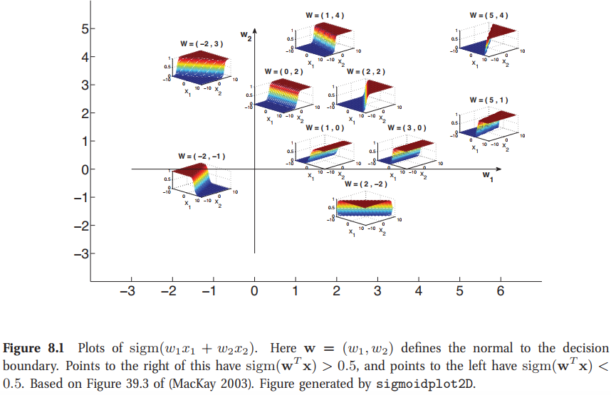
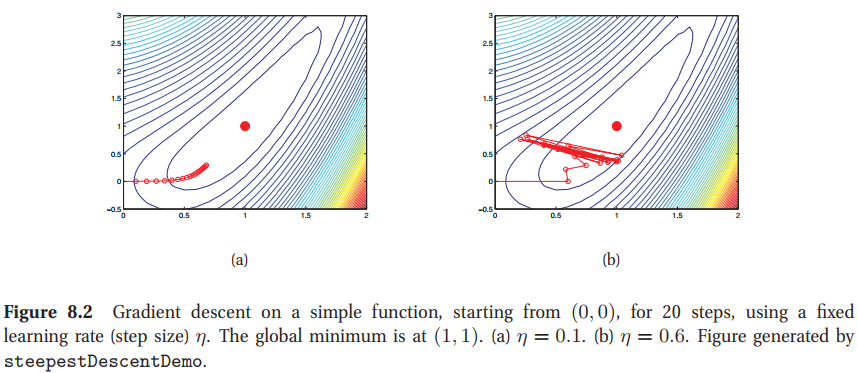
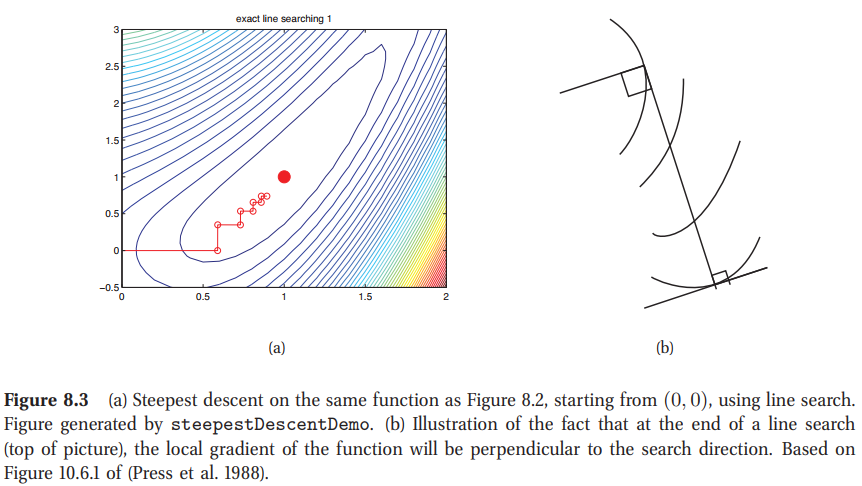
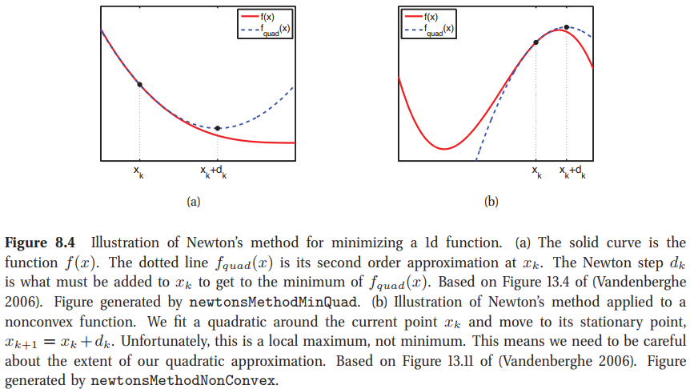
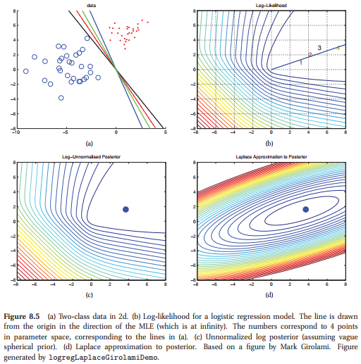
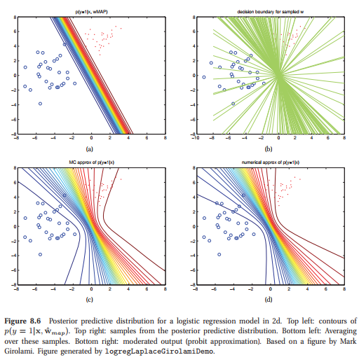
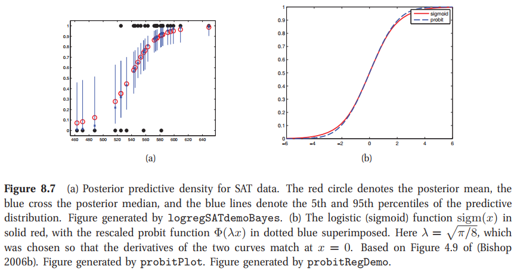
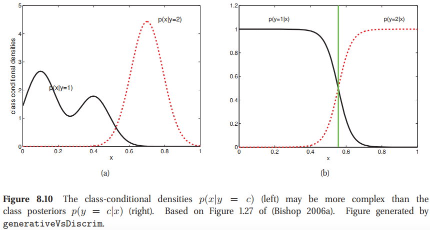
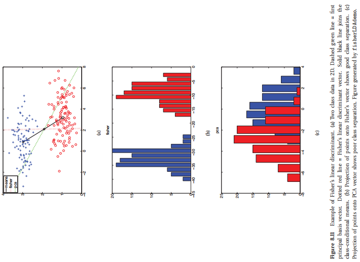

<!-- TOC -->

- [8 Logistic regression](#8-logistic-regression)
  - [8.1 Introduction](#81-introduction)
  - [8.2 Model specification](#82-model-specification)
  - [8.3 模型拟合(Model fitting)](#83-模型拟合model-fitting)
    - [8.3.1 MLE](#831-mle)
    - [8.3.2 最速下降(Steepest descent)](#832-最速下降steepest-descent)
    - [8.3.3 牛顿法(Newton’s method)](#833-牛顿法newtons-method)
    - [8.3.4 迭代重加权最小二乘(Iteratively reweighted least squares(IRLS))](#834-迭代重加权最小二乘iteratively-reweighted-least-squaresirls)
    - [8.3.5 Quasi-Newton (variable metric) methods](#835-quasi-newton-variable-metric-methods)
    - [8.3.6 $\ell_2$正则化(regularization)](#836-ell_2正则化regularization)
    - [8.3.7 多分类的logistics回归(Multi-class logistic regression)](#837-多分类的logistics回归multi-class-logistic-regression)
  - [8.4 Bayesian logistic regression](#84-bayesian-logistic-regression)
    - [8.4.1 Laplace approximation](#841-laplace-approximation)
    - [8.4.2 Derivation of the BIC](#842-derivation-of-the-bic)
    - [8.4.3 Gaussian approximation for logistic regression](#843-gaussian-approximation-for-logistic-regression)
    - [8.4.4 近似后验预测(Approximating the posterior predictive)](#844-近似后验预测approximating-the-posterior-predictive)
      - [8.4.4.1 蒙特卡洛近似(Monte Carlo approximation)](#8441-蒙特卡洛近似monte-carlo-approximation)
    - [8.4.5 残差分析(Residual analysis(outlier detection)*)](#845-残差分析residual-analysisoutlier-detection)
  - [8.5 在线学习与随机优化(Online learning and stochastic optimization)](#85-在线学习与随机优化online-learning-and-stochastic-optimization)
    - [8.5.1 在线学习与regret最小化(Online learning and regret minimization)](#851-在线学习与regret最小化online-learning-and-regret-minimization)
    - [8.5.2 随机优化与风险最小化(Stochastic optimization and risk minimization)](#852-随机优化与风险最小化stochastic-optimization-and-risk-minimization)
    - [8.5.2.1 设定步长(Setting the step size)](#8521-设定步长setting-the-step-size)
    - [8.5.2.2 每个参数化步长(Per-parameter step sizes)](#8522-每个参数化步长per-parameter-step-sizes)
      - [8.5.2.3 SGD对比批学习(SGD compared to batch learning)](#8523-sgd对比批学习sgd-compared-to-batch-learning)
    - [8.5.3 The LMS algorithm](#853-the-lms-algorithm)
    - [8.5.4 感知机学习(The perceptron algorithm)](#854-感知机学习the-perceptron-algorithm)
    - [8.5.5 一个贝叶斯观点(A Bayesian view)](#855-一个贝叶斯观点a-bayesian-view)
  - [8.6 生成与判别分类器(Generative vs discriminative classifiers)](#86-生成与判别分类器generative-vs-discriminative-classifiers)
    - [8.6.1 每个方法的优缺点(Pros and cons of each approach)](#861-每个方法的优缺点pros-and-cons-of-each-approach)
    - [8.6.2 处理缺失值(Dealing with missing data)](#862-处理缺失值dealing-with-missing-data)
      - [8.6.2.1 测试阶段的缺失值(Missing data at test time)](#8621-测试阶段的缺失值missing-data-at-test-time)
    - [8.6.3 Fisher线性判别分析(Fisher’s linear discriminant analysis (FLDA) *)](#863-fisher线性判别分析fishers-linear-discriminant-analysis-flda-)
      - [8.6.3.1 最优一维的投射(Derivation of the optimal 1d projection)](#8631-最优一维的投射derivation-of-the-optimal-1d-projection)
      - [8.6.3.3 FLDA的概率解释(Probabilistic interpretation of FLDA *)](#8633-flda的概率解释probabilistic-interpretation-of-flda-)

<!-- /TOC -->

# 8 Logistic regression
## 8.1 Introduction

建立概率分类器的一种方法是创建一个形式为$p(y,\mathbf{x})$的联合模型，然后以$\mathbf{x}$为条件，从而得到$p(y|\mathbf{x})$。这被称为**生成方法**。另一种方法是直接拟合$p(y|\mathbf{x})$形式的模型。这就是所谓的**判别方法**，也是我们在本章中采用的方法。特别是，我们将假设参数为线性的判别模型。我们将看到，这将大大简化模型拟合。在第8.6节中，我们比较了生成和判别方法，在后面的章节中，我们将考虑非线性和非参数判别模型。

## 8.2 Model specification

正如我们在1.4.6节中讨论的，logistics回归对应于二分类模型
$$
p(y|\mathbf{x},\mathbf{w})=\text{Ber}(y|\text{sigm}(\mathbf{w}^T \mathbf{x}))   \tag{8.1}
$$
一个1d例子如图1.19(b)。logistics回归可以轻易地扩展到高维输入。例如，图8.1显示了2维输入与不同权重向量$\mathbf{w}$的$p(y=1|\mathbf{x},\mathbf{w})=\text{sigm}(\mathbf{w}^T\mathbf{x})$的图画。如果我们将这些概率的阈值设定在0.5，我们将得出一个线性决策边界。且法向量给定为$\mathbf{w}$。

## 8.3 模型拟合(Model fitting)

本节中，我们将讨论一个logistics回归模型的参数估计的算法。

### 8.3.1 MLE

logistics回归的负对数似然给定为
$$
\begin{aligned}
    \text{NLL}(\mathbf{w}) &= -\sum_{i=1}^{N}\log\left[\mu_{i}^{\mathbb{I}(y_i=1)}\times(1-\mu_i)^{\mathbb{I}(y_i=0)} \right] \\
    &= -\sum_{i=1}^{N}\left[ y_i\log\mu_i+(1-y_i)\log(1\mu_i)  \right]
\end{aligned}
$$
这也称为误差函数的**交叉熵**。

这个方程的另一种书写方式如下。假设$\tilde{y}_i\in\{-1,+1\}$来替代$y_{i}\in{0,1}$。我们有$p(y=1)=\frac{1}{1+\exp(\mathbf{-w}^T\mathbf{x})}$。我们有$p(y=-1)=\frac{1}{1+\exp(-\mathbf{w}^T\mathbf{x})}$且$p(y=1)=\frac{1}{1+\exp(+\mathbf{w}^T\mathbf{x})}$。因此
$$
\text{NLL}(\mathbf{w})=\sum_{i=1}^{N}\log\left(1+\exp\left(-\tilde{y}_i\mathbf{w}^T\mathbf{x}_i\right)\right)    \tag{8.4}
$$
不像线性回归，我们不能将MLE写成闭环形式。相反的，我们需要使用一种优化算法来计算这个方程。为此，我们需要计算出梯度与Hessian。

在logistics回归中，可以证明梯度与Hessian给定为
$$
\begin{aligned}
    \mathbf{g} &= \frac{d}{d\mathbf{w}}f(\mathbf{w})=\sum_{i}(\mu_i-y_i)\mathbf{x}_i = \mathbf{X}^T(\boldsymbol{\mu}-\mathbf{y}) \\
    \mathbf{H}&= \frac{d}{d\mathbf{w}}f(g(\mathbf{w})^T) = \sum_{i}(\nabla_{\mathbf{w}}\mu_i)\mathbf{x}_i^T=\sum_i \mu_i(1-\mu_i)\mathbf{x}_i\mathbf{x}_i^T \\
    &= \mathbf{X}^T\mathbf{S}\mathbf{X}
\end{aligned}
$$
其中$\mathbf{S}\triangleq\text{diag}(\mu_i(1-\mu_i))$。可以证明$\mathbf{H}$是正定的。因此NLL是凸的，有唯一的全局极小值。之下我们讨论一些寻找最小值的方法。

### 8.3.2 最速下降(Steepest descent)

也许，对于无约束最优化最简单的方法是梯度下降方法，也称为最速下降。写为如下
$$
\boldsymbol{\theta}_{k+1}=\boldsymbol{\theta}_{k}-\eta_{k}\mathbf{g}_k  \tag{8.8}
$$
其中$\eta_{k}$是**步长**或**学习率**。梯度下降中的主要问题是：如何设置步长？这个证明是非常有技巧的。如果我们使用一个常数的学习率，但是太小的话，收敛将会很慢，但是如果我们设置的很大的话，方法将会收敛失败。这将在图8.2中进行解释，我们画了如下凸函数
$$
f(\boldsymbol{\theta}) = 0.5(\theta_1^2-\theta_2)^2+0.5(\theta_1-1)^2   \tag{8.9}
$$
我们任意的从(0，0)开始。图8.2(a)中，我们使用一个固定的步长$\eta=0.1$；我们看到沿着低估缓慢移动。在图8.2(b)，我们使用一个固定步长$\eta=0.6$；我们看到算法开始在山谷的两边上下摆动，并且永远不会收敛到最优值。

我们现在开发一种更加稳定的方法来选择步长，使得可以保证无论我们在何处开始该方法都可以收敛到全局最小值。(这个性质称为全局收敛，这个不应该与收敛到全局最优混淆)。通过泰勒理论，我们有
$$
f(\boldsymbol{\theta}+\eta\mathbf{d}) \approx f(\boldsymbol{\theta}) + \eta\mathbf{g}^T\mathbf{d}       \tag{8.10}
$$ 
其中$\mathbf{d}$为下降方向(descent direction)。所以，如果$\eta$选择的足够小，那么$f(\boldsymbol{\theta} +\eta\mathbf{d})\lt f(\boldsymbol{\theta})$，因为梯度不会为负。但是我们不会选择太小的步长$\eta$，或是我们将非常缓慢的移动可能不会达到最小值。所以我们选择$\eta$来最小化
$$
\phi(\eta) = f(\boldsymbol{\theta}_k + \eta \mathbf{d}_k)   \tag{8.11}
$$ 
是这称为直线最小化或是一维搜索。有多种解决这种1维优化问题。

图8.3(a)证明一维搜索对我们这个问题确实有效。然而，**我们可以看到，在精确的直线搜索下，最陡下降路径表现出典型的锯齿(zig-zag)形行为**。为了研究为何这样，注意到一个精确地一维搜索满足$\eta_k = \argmin_{\eta\gt0}\phi(\eta)$。对于最优的一个必要条件是$\phi^{\prime}(\eta) = 0$。根据链式规则，有$\phi^{\prime}(\eta)=\mathbf{d}^T\mathbf{g}$，其中$\mathbf{g} = f^{\prime}(\boldsymbol{\theta}+\eta\mathbf{d})$是在**步长结束时的梯度(gradient at the end of step)**。所以，要么我们有$\mathbf{g}=0$，意味着我们有一个平稳点，要么$\mathbf{g}\perp\mathbf{d}$，意味着准确搜索停止在一个点，在该点局部梯度垂直于搜索方向。因此，后续方向将会是正交的。这个解释了zig-zag行为。

一个简单的启发式方法可以减少zig-zag的影响，那就是增加一个**动量项**$(\boldsymbol{\theta}_k-\boldsymbol{\theta}_{k-1})$，如下
$$
\boldsymbol{\theta}_{k+1} = \boldsymbol{\theta}_{k} - \eta_k\mathbf{g}_k + \mu_k(\boldsymbol{\theta}_k-\boldsymbol{\theta}_{k-1})   \tag{8.12}
$$
其中$0\leq\mu_k\leq1$控制了动量项的重要性。在优化社区中，这被称为**重球方法**。

另一种最小化"zig-zag"影响的方式是使用**共轭梯度**方法。这是为了形如$f(\boldsymbol{\theta})=\boldsymbol{\theta}^T\mathbf{A}\boldsymbol{\theta}$二次型目标函数选择的方法，源于求解线性系统。然而，非线性GC并不是很流行。

### 8.3.3 牛顿法(Newton’s method)

可以通过考虑空间曲率获得更快的优化方法。这种方法称为**二阶最优化方法**。首要例子为牛顿方法。这是一种迭代方法，组成如下
$$
\boldsymbol{\theta}_{k+1}=\boldsymbol{\theta}_k - \eta_{k}\mathbf{H}_k^{-1}\mathbf{g}_{k}
$$ 
算法的伪代码如下：
**算法8.1**:最小化严格凸函数的牛顿方法
1、初始化$\boldsymbol{\theta}_0$。
2、$k=1,2,\cdots,$直到收敛
    计算$\mathbf{g}_k=\nabla f(\boldsymbol{\theta}_k)$;
    计算$\mathbf{H}_k=\nabla^2f(\boldsymbol{\theta}_k)$;
    为$\mathbf{d}_k$求解$\mathbf{H}_k\mathbf{d}_k=-\mathbf{d}_k$
    沿着$\mathbf{d}_k$使用一维搜索寻找步长$\eta_k$;
    更新$\boldsymbol{\theta}_{k+1}=\boldsymbol{\theta}_k+\eta_k\mathbf{d}_k$

算法可以推导如下。考虑使用一个$\boldsymbol{\theta}_k$附近的二阶泰勒展开式来近似$f(\boldsymbol{\theta})$:
$$
f_{quad}(\boldsymbol{\theta})=f_k+\mathbf{d}_k^T(\boldsymbol{\theta}-\boldsymbol{\theta}_k)+\frac{1}{2}(\boldsymbol{\theta}-\boldsymbol{\theta})^T\mathbf{H}_k(\boldsymbol{\theta} -\boldsymbol{\theta}_k)  \tag{8.14} 
$$
可以将这个重写为
$$
f_{quad}(\boldsymbol{\theta}) = \boldsymbol{\theta}^T\mathbf{A}\boldsymbol{\theta} + \mathbf{b}^T\boldsymbol{\theta} + c    \tag{8.15}
$$
其中
$$
\mathbf{A}=\frac{1}{2}\mathbf{H}_k, \mathbf{b}=\mathbf{g}_k-\mathbf{H}_k\boldsymbol{\theta}_k,c=f_k-\mathbf{g}_k^T\boldsymbol{\theta}_k+\frac{1}{2}\boldsymbol{\theta}_k^T\mathbf{H}_k\boldsymbol{\theta}_k \tag{8.15}
$$
$f_{quad}$的最小值是
$$
\boldsymbol{\theta}=-\frac{1}{2}\mathbf{A}^{-1}\mathbf{b}=\boldsymbol{\theta}_k - \mathbf{H}_{k}^{-1}\mathbf{g}_{k} \tag{8.17}
$$
因此牛顿步长为$\mathbf{d}_k=-\mathbf{H}^{-1}_k\mathbf{g}_k$应该添加到$\boldsymbol{\theta}_k$来最小化围绕$\boldsymbol{\theta}_k$附件的$f$的二阶近似。图8.4(a)有一个解释。

在它的最简形式内，牛顿方法需要$\mathbf{H}_k$是正定的，如果函数是严格凸的。如果函数不是严格凸的，那么$\mathbf{H}_k$可能将不是正定的，因此$\mathbf{d}_k=-\mathbf{H}_{k}^{-1}g_{k}$将不是一个最速方向。这种情况下，一个简单的策略就是反向最速方向$\mathbf{d}_k=-\mathbf{g}_k$。**Levenberg-Marquardt算法**是一种混合牛顿步和最速下降步数的自适应方法。这种方法在求解**非线性最小二乘问题**时得到了广泛的应用。另一种方法：不是直接计算$\mathbf{d}_k=-\mathbf{H}_k^{-1}\mathbf{g}_k$，我们可以使用**共轭梯度(CG)**求解线性系统方程$\mathbf{H}_k\mathbf{d}_k=-\mathbf{g}_k$。如果$\mathbf{H}_k$不是正定的，当检测到负曲率时，我们可以简单地截断CG迭代；这称为**截断牛顿**。

### 8.3.4 迭代重加权最小二乘(Iteratively reweighted least squares(IRLS))

现在我们应用牛顿算法来寻找二项logistics回归的MLE。这个模型在$k+1$迭代的牛顿更新如下($\eta_k=1$，因为Hessian是精确的)：
$$
\begin{aligned}
    \mathbf{w}_{k+1} &= \mathbf{w}_k-\mathbf{H}^{-1}\mathbf{g}_k \\
    &=\mathbf{w}_k+(\mathbf{X}^T\mathbf{S}_k\mathbf{X})^{-1}\mathbf{X}^T(\mathbf{y}-\boldsymbol{\mu}_k) \\
    &=(\mathbf{X}^T\mathbf{S}_k\mathbf{X})^{-1}[(\mathbf{X}^T\mathbf{S}_k\mathbf{X})\mathbf{w}_k + \mathbf{X}^T(\mathbf{y}-\boldsymbol{\mu}_k)]  \\
    &= (\mathbf{X}^T\mathbf{S}_k\mathbf{X})^{-1}\mathbf{X}^T[\mathbf{S}_k\mathbf{X}\mathbf{w}_k + \mathbf{y}-\boldsymbol{\mu}_k] \\
    &= (\mathbf{X}^T\mathbf{S}_k\mathbf{X})^{-1}\mathbf{X}^T\mathbf{S}_k\mathbf{z}_k        \tag{8.18-8.22}
\end{aligned}
$$
其中我们定义**工作响应**为
$$
\mathbf{z}_k\triangleq\mathbf{X}\mathbf{w}_k+\mathbf{S}_{k}^{-1}(\mathbf{y}-\boldsymbol{\mu}_k) \tag{8.23}
$$
方程8.22是一个加权最小二乘问题的例子，是
$$
\sum_{i=1}^{N}S_{ki}(z_{ki}-\mathbf{w}^T\mathbf{x}_i)^2 \tag{8.24}
$$
的一个最小化值。
因为$\mathbf{S}_k$是一个对角阵，我们可以将目标以成分形式重写为
$$
z_{ki}=\mathbf{w}_k^T\mathbf{x}_i+\frac{y_{i}-\mu_{ki}}{\mu_{ki}(1-\mu_{ki})}       \tag{8.25}
$$
这个算法称为迭代重加权最小二乘，因为在每个迭代中，我们计算一个加权的最小二乘问题，其中权重矩阵$\mathbf{S}_k$在每个迭代中都会变化。

### 8.3.5 Quasi-Newton (variable metric) methods

所有二阶优化算法之母是牛顿算法，我们在第8.3.3节中讨论过。不幸的是，清晰明确的计算$\mathbf{H}$可能代价太高了。**拟牛顿(Quasi-Newton)方法**利用从每一步梯度向量中收集的信息迭代地建立一个对Hessian的近似。最常见的方法称为**BFGS**(以其发明者Broyden、Fletcher、Goldfarb和Shanno命名)，它用如下方程更新Hessian的近似值$\mathbf{B}_k \approx \mathbf{H}_k$
$$
\begin{aligned}
    \mathbf{B}_{k+1}&=\mathbf{B}_k + \frac{\mathbf{y}_k\mathbf{y}_k^T}{\mathbf{y}_k^T\mathbf{s}_k} - \frac{(\mathbf{B}_k\mathbf{s}_k)(\mathbf{B}_k\mathbf{s}_k)^T}{\mathbf{s}_k^T\mathbf{B}_k\mathbf{s}_k}\\
    \mathbf{s}_k&=\boldsymbol{\theta}_k-\boldsymbol{\theta}_{k-1}   \\
    \mathbf{y}_k&=\mathbf{g}_k-\mathbf{g}_{k-1} 
    \tag{8.26-8.28}
\end{aligned}
$$
这是对矩阵的二阶更新，并确保矩阵保持正定(在一定的步长限制下)。我们一般的从一个对角近似开始$\mathbf{B}_0=\mathbf{I}$。因此，BFGS可以看作是Hessian的“对角加低秩”近似。

### 8.3.6 $\ell_2$正则化(regularization)

正如我们更喜欢岭回归而不是线性回归一样，我们应该更喜欢logistic回归的MAP估计而不是计算MLE。事实上，正则化在分类背景中很重要，即使我们有大量的数据。为了了解原因，假设数据是线性可分得。在这种情况下，当$\Vert \mathbf{w}\Vert\rightarrow\infty$获得的MLE，对应于一个无限陡峭的sigmod函数$\mathbb{I}(\mathbf{w}^T\mathbf{x}\gt w_0$，也称为一个线性阈值单元。这就为训练数据分配了最大的概率质量。然而，这样的解决方案非常脆弱，不能很好地推广。

为了阻止这个，我们可以使用$\ell_2$正则化，正如我们在岭回归中做的那样。我们注意到新的目标函数，梯度以及Hessian有如下形式：
$$
\begin{aligned}
    f^{\prime}&=\text{NLL}(\mathbf{w}) + \lambda\mathbf{w}^T\mathbf{w} \\
    \mathbf{g}^{\prime}(\mathbf{w}) &= \mathbf{g}(\mathbf{w}) + \lambda\mathbf{w} \\
    \mathbf{H}^{\prime}(\mathbf{w}) &= \mathbf{H}(\mathbf{w}) + \lambda\mathbf{I}   \tag{8.30-8.32}
\end{aligned}
$$
将这些修改的方程带入到任何的基于梯度的优化器是一件很简单的事情。

### 8.3.7 多分类的logistics回归(Multi-class logistic regression)

我们现在考虑**multinomial logistics回归**，有时也称为**最大熵分类器**。模型的形式为
$$
p(y=c|\mathbf{x},\mathbf{W}) = \frac{\exp(\mathbf{w}_c^T\mathbf{x})}{\sum_{c^{\prime}=1}^C \exp(\mathbf{w}_{c^{\prime}}^T\mathbf{x})}   \tag{8.33}
$$
有一个小小的变体，称为**条件logit模型**，针对每个数据案例在不同的类集合上进行归一化；这对于用户在提供给他们的不同项目集之间进行的建模选择非常有用。

我们现在介绍一些符号。令$\mu_{ic}=p(y_i=c|\mathbf{x}_i,\mathbf{W}=\mathcal{S}(\boldsymbol{\eta}_i)_c$，其中$\boldsymbol{\eta}_i=\mathbf{W}^T\mathbf{x}_i$是一个$C\times1$的向量。也可以令$y_{ic}=\mathbb{I}(y_i=c)$是一个$y_i$的one-of-C编码；那么$\mathbf{y}_i$是一个位向量，其中当且仅当$y_i=c$时第$c$个位开启。根据(Krishnapuram et al. 2005)，我们可以$\mathbf{w}_c=0$来保证可识别性，且定义$\mathbf{w} = \text{vec}(\mathbf{W}(:,1:C-1))$为一个$D\times(C-1)$的列向量。

有了这个，对数似然可以写为
$$
\begin{aligned}
    \ell(\mathbf{W}) &= \log\prod_{i=1}^{N}\prod_{c=1}^{C}\mu_{ic}^{y_{ic}}=\sum_{i=1}^{N}\sum_{c=1}^{C}y_{ic}\log\mu_{ic}\\       \tag{8.35}
    &= \sum_{i=1}^{N}\left[ \left(\sum_{c=1}^{C}y_{ic}\mathbf{w}_c^T\mathbf{x}_i \right) - \log\left(\sum_{c^{\prime}=1}^{C}\exp(\mathbf{w}_{c^{\prime}}^T\mathbf{x}_i)  \right)\right]
\end{aligned}
$$
定义NLL为
$$
f(\mathbf{w})=-\ell(\mathbf{w}) \tag{8.36}
$$
我们现在计算这个表达式的梯度与Hessian。因为$\mathbf{w}$是一个块结构的，符号有点麻烦，但是思想很简单。定义$\mathbf{A}\bigotimes\mathbf{B}$为$\mathbf{A}$与$\mathbf{B}$的**Kronecker积**。如果$\mathbf{A}$是一个$m\times n$的矩阵，$\mathbf{B}$是一个$p\times q$的矩阵，因此$\mathbf{A}\bigotimes\mathbf{B}$是一个$mp\times nq$的块矩阵
$$
\mathbf{A}\bigotimes\mathbf{B} = 
\begin{bmatrix}
    a_{11}\mathbf{B} & \cdots & a_{1n}\mathbf{B} \\
    \vdots & \ddots & \vdots \\
    a_{m1}\mathbf{B} & \cdots & a_{mn} \mathbf{B}
\end{bmatrix}\tag{8.37}
$$
可以证明梯度给定为
$$
\mathbf{g}(\mathbf{W}) = \nabla f(\mathbf{W}) = \sum_{i=1}^N(\boldsymbol{\mu}_i-\mathbf{y}_i) \bigotimes \mathbf{x}_i   \tag{8.38}
$$
其中$\mathbf{y}_i=(\mathbb{I}(y_1=1),\cdots,\mathbb{I}(y_i=C-1))$且$\boldsymbol{\mu}_i(\mathbf{W}) = $

## 8.4 Bayesian logistic regression

很自然的想要计算logistics回归模型参数上的完全后验$p(\mathbf{w}|\mathcal{D})$。这对于我们希望将置信区间与我们的预测相关联的任何情况都是有用的(例如，在解决上下文bandit问题时，这是必要的，见第5.7.3.1节)。

不幸的是，不像线性回归那样，我们无法精确计算，因为这里没有logistics回归的方便的共轭先验。我们讨论一个简单的近似；一些其他的方法包括MCMC，变分推断，期望传播等等。为了简单起见，我们坚持使用二元逻辑回归。

### 8.4.1 Laplace approximation

本节中，我们讨论如何对一个后验分布做一个高斯近似。近似按照如下方式工作。假设$\boldsymbol{\theta}\in \mathbb{R}^D$。令
$$
p(\boldsymbol{\theta}|\mathcal{D}) = \frac{1}{Z}e^{-E(\boldsymbol{\theta})} \tag{8.49}
$$
其中$E(\boldsymbol{\theta})$称为能量函数，等于非标准化对数后验的负对数$E(\boldsymbol{\theta})=-\log p(\boldsymbol{\theta},\mathcal{D}),Z=p(\mathcal{D})$是归一化常数。在众数$\boldsymbol{\theta}^*$(拥有最小能量状态)附近执行一个泰勒展开式，我们得到
$$
E(\boldsymbol{\theta}) \approx E(\boldsymbol{\theta}^*) + (\boldsymbol{\theta}-\boldsymbol{\theta}^*)^T\mathbf{g} + \frac{1}{2}(\boldsymbol{\theta}-\boldsymbol{\theta}^*)^T\mathbf{H}(\boldsymbol{\theta}-\boldsymbol{\theta}^*)   \tag{8.50}
$$
其中$\mathbf{g}$是梯度，$\mathbf{H}$是能量函数在众数处的Hessian：
$$
\mathbf{g}\triangleq \nabla E(\boldsymbol{\theta})|\boldsymbol{\theta}^*,\quad \mathbf{H}\triangleq\frac{\partial^2E(\boldsymbol{\theta})}{\partial\boldsymbol{\theta}\partial\boldsymbol{\theta}^T} |\boldsymbol{\theta}^*  \tag{8.51}
$$
因为$\boldsymbol{\theta}^*$是众数，梯度项为0。因此
$$
\begin{aligned}
    \hat{p}(\boldsymbol{\theta}|\mathcal{D}) &\approx \frac{1}{Z}e^{-E(\boldsymbol{\theta}^*)}\exp\left[-\frac{1}{2}(\boldsymbol{\theta}-\boldsymbol{\theta}^*)^T\mathbf{H}(\boldsymbol{\theta}-\boldsymbol{\theta}^*)  \right] \\
    &= \mathcal{N}(\boldsymbol{\theta}|\boldsymbol{\theta}^*,\mathbf{H}^{-1})\\
    Z=p(\mathcal{D}) & \approx \int\hat{p}(\boldsymbol{\theta}|\mathcal{D})d\boldsymbol{\theta} = e^{-E(\boldsymbol{\theta}^*)}(2\pi)^{D/2}\vert\mathbf{H}\vert^{-\frac{1}{2}}  \tag{8.53-8.54}
\end{aligned}
$$
方程(8.54)称为边缘似然的Laplace近似。因此，方程(8.52)也称为后验的Laplace近似。然而在统计学界，“Laplace近似”一词是指更加复杂的方法。因此更好的方法是“高斯近似”。高斯近似是一种更加合理的近似，因为由于类似于中心极限定理的原因，后验经常随着采样的增加更加高斯化。(在物理学中，有一种类似的技术被称为鞍点近似.)

### 8.4.2 Derivation of the BIC

我们可以使用高斯近似将对数边缘似然写成如下方式，丢弃相关常数
$$
\log p(\mathcal{D}) \approx \log p(\mathcal{D}|\boldsymbol{\theta}^*) + \log p(\boldsymbol{\theta}^*) - \frac{1}{2}\log\vert\mathbf{H}\vert \tag{8.55}
$$
我们现在关注近似的第三项。我们有$\mathbf{H}=\sum_{i=1}^{N}\mathbf{H}_i$，其中$\mathbf{H}_i=\nabla\nabla\log p(\mathcal{D}_i|\boldsymbol{\theta})$。我们通过一个固定矩阵$\hat{\mathbf{H}}$来近似每个$\mathbf{H}_i$，那么我有
$$
\log\vert\mathbf{H}\vert = \log\vert N\hat{\mathbf{H}} \vert =\log(N^d\vert\hat{\mathbf{H}}\vert) = D\log N + \log\vert\hat{\mathbf{H}}\vert        \tag{8.56}
$$
其中$D=\text{dim}(\boldsymbol{\theta})$，而且我们假设$\mathbf{H}$是满秩的。我们可以丢弃$\log\vert\hat{\mathbf{H}}\vert$项，因为它独立于$N$，且这个会被似然所压倒。将所有的pieces放在一起，我们回复BIC分数
$$
\log p(\mathcal{D}) \approx \log p(\mathcal{D}|\hat{\boldsymbol{\theta}}) - \frac{D}{2}\log N\tag{8.57}
$$

### 8.4.3 Gaussian approximation for logistic regression

我们现在将高斯近似应用到logistics回归。我们将使用一个形式为$p(\mathbf{w})=\mathcal{N}(\mathbf{w}|\mathbf{O},\mathbf{V}_0)$的高斯先验，正如我们在MAP估计中做的那样。近似后验给定为
$$
p(\mathbf{w}|\mathcal{D}) \approx \mathcal{N}(\mathbf{w}|\hat{\mathbf{w}},\mathbf{H}^{-1})      \tag{8.58}
$$
其中$\hat{\mathbf{w}}=\argmin_{\mathbf{w}}E(\mathbf{w}), E(\mathbf{w})=-(\log p(\mathcal{D}|\mathbf{w})+\log(p(\mathbf{w}))),\mathbf{H}=\nabla^2 E(\mathbf{w})|_{\hat{\mathbf{w}}}$。

作为一个例子，考虑图8.5中的2维可线性分割数据。有许多参数设置对应于完全分离训练数据的行；我们展示了4个例子。似然表面如图8.5(b)所示，在图中，我们可以看到，当我们沿着一个脊梁$w_2/w_1=2.35$(由一条直角线指明)在参数空间中向上移到到右边时，似然是没有边界的。这么做的原因是我们可以通过驱使$\Vert\mathbf{w}\Vert$变的无穷大来最大化似然，因为大的回归权重使得sigmoid函数变的非常陡峭，将其变为一个阶跃函数。因此当数据是线性可分时，MLE不是并不是很好定义。

为了正则化问题，我们使用一个非常巨大的球形先验，中心在原点$\mathcal{N}(\mathbf{w}|\mathbf{0},100\mathbf{I})$。用这个球面先验值乘以似然曲面得到了高度倾斜的后验面，如图8.5(c)所示。（后验是倾斜的，因为似然函数“切掉”了参数空间中与数据不符的区域（以一种“软”的方式）MAP估计用蓝点表示。与MLE不同，这不是无限的。

对这个后验的高斯近似在图8.5(d)中展示。我们看到这是一个对称分布，因此没有一个很大的近似。当然，它得到的模式是正确的(通过构造)，它至少代表了这样一个事实，即西南-东北方向(对应于分隔线方向的不确定性)比垂直于此方向的不确定性更大。虽然这是一个粗略的近似值，但这肯定比用delta函数来逼近后验函数要好，而delta函数正是MAP估计所做的。

### 8.4.4 近似后验预测(Approximating the posterior predictive)

给定后验概率，我们可以计算可信区间，进行假设检验等，就像我们在第7.6.3.3节中对线性回归所做的那样。但是在机器学习中，兴趣通常集中在预测上。后验预测分布形式为
$$
p(y|\mathbf{x},\mathcal{D}) = \int p(y|\mathbf{x},\mathbf{w})p(\mathbf{w}|\mathcal{D})d\mathbf{w}   \tag{8.59}
$$
不幸的是这个积分难以处理。

最简单的近似是插件近似，也就是在二元情况下，取形式
$$
p(y=1|\mathbf{x}, \mathcal{D}) \approx p(y=1|\mathbf{x}, \mathbb{E}[\mathbf{w}])\tag{8.60}
$$
其中$\mathbb{E}[\mathbf{w}]$是后验均值。这种背景下，$\mathbb{E}[\mathbf{w}]$称为**贝叶斯点**。当然，这样的插入式估计低估了不确定性。我们在下面讨论一些更好的近似值。

#### 8.4.4.1 蒙特卡洛近似(Monte Carlo approximation)

一个更好的方法是使用蒙特卡洛近似，如下
$$
p(y=1|\mathbf{x},\mathcal{D}) \approx \frac{1}{S}\sum_{s=1}^{S}\text{sigm}((\mathbf{w}^s)^T\mathbf{x})  \tag{8.61}
$$
其中$\mathbf{w}^s\sim p(\mathbf{w}|\mathcal{D})$是来自后验的采样。如果我们使用蒙特卡洛来近似后验，我们可以重复使用这些样本来预测。如果我们使用一个后验的高斯近似，我们可以使用标准方法来高斯近似独立采样。

图8.6(b)显示了二维示例的后验预测样本。图8.6(c)显示了这些样本的平均值。通过对多个预测进行平均，我们可以看到决策边界中的不确定性随着我们离训练数据的进一步移动而“散开”。因此，虽然决策边界是线性的，但后验预测密度不是线性的。还要注意的是，后验平均判定边界与两个类别的距离大致相等；这是第14.5.2.2节中讨论的大裕度原则的贝叶斯模拟。

图8.7(a)显示了1d中的一个示例。红点表示在训练数据处评估的后验预测值的平均值。垂直的蓝线表示后验预测的95%可信区间；蓝色小星星是中值。我们看到，用贝叶斯方法，我们可以根据学生的SAT分数，而不是仅仅得到分数估计，来模拟学生通过考试的概率的不确定性。

### 8.4.5 残差分析(Residual analysis(outlier detection)*)

有时，检测那些奇异值是非常有用的。这称为残差分析或案例分析。在回归背景下，这个可以通过计算$r_i=y_i-\hat{y}_i$来完成，其中$\hat{y}_i=\hat{\mathbf{w}}^T\mathbf{x}_i$。如果模型假设是正确的，这些值应该服从$\mathcal{N}(0,\sigma^2)$的分布。这个可以通过**qq-plot**来评估，在qq图中，我们将高斯分布的$N$个理论分位数与$r_i$的$N$个经验分位数进行比较。偏离直线的点是潜在的异常值。

基于残差的经典方法对二元数据并不适用，因为它们依赖于检验统计量的渐近正态性。然而，采用一个贝叶斯方法，我们只需要将异常值定义为$p(y_i|\hat{y}_i)$非常小的点即可，其中$\hat{y}_i = \text{sigm}(\hat{\mathbf{w}}^T\mathbf{x}_i)$。注意到$\hat{\mathbf{w}}$从全样本数据中估计得到。一个更好的方法是在预测$y_i$时将$(\mathbf{x}_i,y_i)$从$\mathbf{w}$的估计中排除出去。这就是说，我们将异常值定义为那些在交叉验证后验预测分布下的概率很低的店，定义为
$$
p(y_i|\mathbf{x}_i, \mathbf{x}_{-i}, \mathbf{y}_{-i}) = \int p(y_i|\mathbf{x}_i,\mathbf{w})\prod_{i^{\prime}\neq i} p(y_{i^{\prime}}|\mathbf{x}_{i^{\prime}},\mathbf{w})p(\mathbf{w})d\mathbf{w}    \tag{8.73}
$$
这个可以通过采样方法来有效近似。为了进一步讨论logistics回归模型中的残差分析，可以看(Johnson and Albert 1999, Sec 3.4)。

## 8.5 在线学习与随机优化(Online learning and stochastic optimization)

传统机器学习是线下执行的，意味着有一批数据处理，且优化的方程如下：
$$
f(\boldsymbol{\theta}) = \frac{1}{N}\sum_{i=1}^N f(\boldsymbol{\theta},\mathbf{z}_i)    \tag{8.74}
$$
其中$\mathbf{z}_i=(\mathbf{x}_i, y_i)$位于监督情况中，或$\mathbf{x}_i$在非监督情况中，且$f(\boldsymbol{\theta},\mathbf{z}_i)$是一些类型的损失函数。例如，我们可能使用
$$
f(\boldsymbol{\theta},\mathbf{z}_i) = -\log p(y_i|\mathbf{x}_i,\boldsymbol{\theta})     \tag{8.75}
$$
其中我们尝试最大化似然。另外，我们使用
$$
f(\boldsymbol{\theta},\mathbf{z}_i)=L(y_i, h(\mathbf{x}_i, \boldsymbol{\theta}))    \tag{8.76}
$$
其中$h(\mathbf{x}_i, \boldsymbol{\theta})$是预测函数，$L(y, \hat{y})$是例如平方误差或是huber损失等这样的损失函数。在频率决策理论，平均损失称为风险，所以这个整体方法称为**经验风险最小化或ERM**。

然而，我们有流数据，我们需要执行在线学习，所以我们可以在每个新的数据点到达时更新我们的估计，而不是一直等到结束为止。即使我们有一批数据，如果数据在内存中量很大，我们也可以将其看做一个数据流。下面我们讨论用于这种场景的学习方法。

### 8.5.1 在线学习与regret最小化(Online learning and regret minimization)

假设在每一步，“自然”呈现一个样本$z_k$，“学习者”必须用参数估计$\boldsymbol{\theta}_k$来响应。在理论机器学习社区中，在线学习的目标是**遗憾regret**，这是相对于使用单个固定参数值的事后所能获得的最佳值而产生的平均损失：
$$
\text{regret}_k \triangleq \frac{1}{k}\sum_{i=1}^{k}f(\boldsymbol{\theta}_t, \mathbf{z}_t) - \min_{\boldsymbol{\theta}^*\in\Theta}\frac{1}{k}\sum_{t=1}^{k}f(\boldsymbol{\theta}_*, \mathbf{z}_t)       \tag{8.77}
$$
例如，想象我们在股票市场中投资。令$\theta_j$为对股票$j$的投资数量，令$z_j$是股票的数量。我们的损失函数为$f(\boldsymbol{\theta},\mathbf{z})=-\boldsymbol{\theta}^T\mathbf{z}$。regret是我们每步通过交易可以如何获得更多(或更惨)，而不是采取"买入持有策略"。

一个在线学习很简单的算法是在线梯度下降，如下：在每步$k$，使用
$$
\boldsymbol{\theta}_{k+1}=\text{proj}_{\Theta}(\boldsymbol{\theta}_k - \eta_{k}\mathbf{g}_k)        \tag{8.78}
$$
更新参数，其中$\text{proj}_{\mathcal{V}}(\mathbf{v})=\argmin_{\mathbf{w}\in\mathbf{V}} \Vert\mathbf{w}-\mathbf{v}\Vert_2$是向量$\mathbf{v}$到空间$\mathbf{V}$的映射，$\mathbf{g}_k=\nabla f(\boldsymbol{\theta}_k, \mathbf{z}_k$是梯度，且$\eta_{k}$是步长。(投影步长只有在当参数必须位于一个特定的$\mathbb{R}^D$的子集中才需要)下面我们将看到这种将遗憾最小化的方法如何与更传统的目标（如MLE）相关。

### 8.5.2 随机优化与风险最小化(Stochastic optimization and risk minimization)

现在假设我们不是想最小化rgret相对于过去的最小化，而是想最小化未来的期望损失，就如图统计学习理论中的大多数。也就是想最小化
$$
f(\boldsymbol{\theta})=\mathbb{E}[f(\boldsymbol{\theta}, \mathbf{z})]   \tag{8.79}
$$
其中期望是针对历史数据。目标函数中一些变量为随机的优化函数称为**随机优化**。[^2]

假设我们从分布的采样接受到无限流。优化例如方程8.79那样的随机目标的一种方式是每步执行方程8.78中的更新。这称为**随机梯度优化(SGD)**。因为我们一般是希望得到单个参数的估计，我们可以运行一个平均
$$
\bar{\boldsymbol{\theta}}_k = \frac{1}{k}\sum_{t=1}^{k}\boldsymbol{\theta}_t    \tag{8.80}
$$
这称为**Polyak-Ruppert平均**，可以回溯的应用如下：
$$
\boldsymbol{\theta}_k = \bar{\boldsymbol{\theta}}_k  - \frac{1}{k}(\bar{\boldsymbol{\theta}}_k  - \boldsymbol{\theta}_k)        \tag{8.81}
$$

### 8.5.2.1 设定步长(Setting the step size)

我们现在讨论一些可以保证SGD收敛的学习率的充分条件。这些被称为**Robins-Monro**条件：
$$
\sum_{k=1}^{\infty}\eta_{k}=\infty, \sum_{k=1}^{\infty}\eta_{k}^2
 \lt \infty   \tag{8.82}
$$
$\eta_k$随时间变化的值集称为**学习速率表**。使用了各种各样的公式，例如$\eta_k=1/k$，或是如下方程
$$
\eta_k = (\tau_0 + k)^{-\kappa}     \tag{8.83}
$$
其中$\tau_0 \geq 0$使得算法的早期迭代变得缓慢，且$\kappa\in (0.5,1]$控制了旧值得遗忘率。

需要调整这些调节参数是随机优化中的主要缺点。一个简单的启发式方法如下：存储一个数据的初始子集，且在这个子集上尝试$\eta$值得区间；然后选择那个使得目标函数下降最快的结果，并将其应用到剩余数据。请注意，这可能导致无法收敛，但当保持集上的性能提高达到停滞时，该算法可以终止(这称为**早停(early stopping)**)。

### 8.5.2.2 每个参数化步长(Per-parameter step sizes)

SGD的一个缺点就是对所有的参数使用相同的步长。我们现在简单介绍一个方法称为**adagrad**(**自适应梯度**的简写)，类似于对角Hessian近似的思想。尤其是，如果$\theta_i(k)$在时刻$t$的参数$i$，且$g_{i}(k)$是它的梯度，然后我们更新如下
$$
\theta_{i}(k+1) = \theta_{i}(k) - \eta \frac{g_{i}(k)}{\tau_0 + \sqrt{s_i(k)}}      \tag{8.84}
$$
这个结果是一个逐步步长，根据损失函数的曲率进行自适应调整。

#### 8.5.2.3 SGD对比批学习(SGD compared to batch learning)

如果我们没有无限的数据流，我们可以通过从训练集中随机抽取数据点来“模拟”一个。本质上，我们通过将方程8.74视为经验分布的期望值来优化它。

从理论上讲，我们应该用有放回的抽样，但在实践中，通常最好是将数据和样本随机置换，然后重复。对整个数据集的一次这样的传递称为epoch。一些伪代码见算法8。

在这个离线情况中，通常计算B个数据案例中的**mini-batch**的梯度更好。如果$B=1$，这是标准的SGD，如果$B=N$，这是标准的最速下降法。一般使用$B\sim 100$。

尽管SGD是一种简单的一阶方法，但它在某些问题上的表现出奇地好，尤其是那些具有大数据集的问题(bottou2007)。这样做的直观原因是，只要看几个例子，就可以得到一个相当好的梯度估计值。**使用大数据集仔细评估精确的梯度通常是浪费时间的，因为算法将不得不在下一步重新计算梯度**。**通常更好地利用计算机时间进行噪声估计并在参数空间中快速移动**。作为一个极端的例子，假设我们通过复制每个例子使训练集加倍。批处理方法将花费两倍的时间，但在线方法不会受到影响，因为梯度的方向没有改变(将数据的大小加倍会改变梯度的大小，但这无关紧要，因为梯度是按步长缩放的)。

**除了提高速度，SGD通常不太容易陷入浅的局部极小值，因为它增加了一定量的“噪音”。因此，用非凸目标拟合模型在机器学习界非常流行，例如神经网络（16.5节）和深层信念网络（28.1节）**。

### 8.5.3 The LMS algorithm

作为SGD的一个例子，我们考虑如何以一种在线学习的方式来计算线性回归的MLE。我们得出方程7.14的批梯度。在迭代$k$在线梯度给定为
$$
\mathbf{g}_k = \mathbf{x}_i(\boldsymbol{\theta}_k^T - y_i)      \tag{8.86}
$$
其中$i=i(k)$是在迭代$k$的训练样例。如果数据集是流，我们使用$i(k)=k$；为了简单起见，我们将从现在开始假设这一点。等式8.86是很容易解释的；它是$\hat{y}_k=\boldsymbol{\theta}_k^T\mathbf{x}_k$，是特征向量$\mathbf{x}_k$的加权，权重为我们预测间的差异，且真实向量为$y_k$；因此梯度像一个误差信号。

在计算梯度后，我们按如下形式取一个步长
$$
\boldsymbol{\theta}_{k+1} = \boldsymbol{\theta}_{k} - \eta_{k}(\hat{y}_k - y_k)\mathbf{x}_{k}  \tag{8.87}
$$
这里没有映射步的需要，因为这是一个无约束优化问题。这个算法称为**least mean squares(LMS)算法**。

图8.8显示了将这个算法应用到图7.2中的数据的结果。我们在$\boldsymbol{\theta}=(-0.5, 2)$开始，并在26次迭代后逐渐收敛的(某种意义上，$\Vert \boldsymbol{\theta}_k - \boldsymbol{\theta}_{k-1}\Vert_2^2$低于$10^{-2}$的阈值)。

注意到LMS可能需要多次传送数据来寻找最小值。相反的，基于Kalman滤波器使用了二阶信息的回溯最小二乘算法，单次传送即可找到最小值。

### 8.5.4 感知机学习(The perceptron algorithm)

现在我们考虑如何以在线的方式拟合二元logistics回归模型。批梯度给定为方程8.5。在线的情况下，更新权重有最简形式
$$
\boldsymbol{\theta}_k = \boldsymbol{\theta}_{k-1} - \eta_{k}\mathbf{g}_{i} = \boldsymbol{\theta}_{k-1} - \eta_{k}(\mu_{i}-y_{i})\mathbf{x}_i    \tag{8.88}
$$
其中$\mu_{i}=p(y_{i}=1|\mathbf{x}_{i}, \boldsymbol{\theta}_k) = \mathbb{E}[y_{i}|\mathbf{x}_i, \boldsymbol{\theta}_k]$。我们看到这个有如图LMS算法完全相同的形式。确实，这个对所有的广义线性模型都成立。

我们现在考虑一个对这个算法的近似。具体的，令
$$
\hat{y}_{i} = \arg\max_{y\infty\{o,1\}} p (y|\mathbf{x}_i, \boldsymbol{\theta})             \tag{8.89}
$$
代表了最有可能的类别标签。我们将梯度中的$\mu_i=p(y=1|\mathbf{x}_i, \boldsymbol{\theta})=\text{sigm}(\boldsymbol{\theta}^T\mathbf{x}_i)$代替$\hat{y}_i$。近似梯度变为
$$
\mathbf{g}_{i} \approx (\hat{y}_{i}-y_i)\mathbf{x}_i        \tag{8.90}
$$
如果我们假设$y\in\{-1, +1 \}$而不是$y\in\{0, +1 \}$，将使得代数更加简单。这种情况下，我们的预测变为
$$
\hat{y}_i = \text{sign}(\boldsymbol{\theta}^T\mathbf{x}_i)      \tag{8.91}
$$
那么如果$\hat{y}_i y_i=-1$，我们分类错误，但是如果$\hat{y}_i y_i=+1$，我们猜测标签正确。

在每步，我们通过添加梯度，更新权重向量。关键的观测是，如果我们预测正确，那么$\hat{y}_i=y_i$，所以梯度为0，且我们不会改变权重向量。但是如果$\mathbf{x}_i$是误分类的，我们按照如下方式来更新权重：如果$\hat{y}_i=1$但是$y_i=-1$，那么负梯度为$-(\hat{y}_i-y_i)\mathbf{x}_i=-2\mathbf{x}_i$；如果$\hat{y}_i=-1$但是$y_i=1$，那么负梯度为$-(\hat{y}_i-y_i)\mathbf{x}_i=2\mathbf{x}_i$。我们可以将因子$2$合并到学习率$\eta$，在误分类的情况下只需要将更新写为，
$$
\boldsymbol{\theta}_{k}=\boldsymbol{\theta}_{k-1} + \eta_{k}y_{i}\mathbf{x}_{i}     \tag{8.92}
$$
因为重要的只是权重的符号，而不是大小，我们将$\eta_{k}=1$。

可以证明这个称为感知机的算法，在提供线性可分割的数据后，将会收敛；也就是，存在参数$\boldsymbol{\theta}$使得符号为$\text{sign}(\boldsymbol{\theta})^T\mathbf{x}$预测在训练集上实现0误差。然而，如果数据不是线性可分的，算法将不会收敛，即使会收敛也会消耗大量的时间。有更好的方法来训练logistics回归模型(例如使用恰当的SGD算法，不需要梯度近似，或是IRLS)。然而，感知器算法，是很重要的；这是第一个推导出的机器学习算法之一，曾经应用在模拟软件实现上。另外，算法可以用来拟合模型，计算边缘分布$p(y_i|\mathbf{x}, \boldsymbol{\theta})$比计算MAP输出$\arg\max_{\mathbf{y}}p(\mathbf{y}|\mathbf{x}, \boldsymbol{\theta})$代价更高；这引起了一些结构性输出分类问题。

### 8.5.5 一个贝叶斯观点(A Bayesian view)

在线学习的另一种方法是采用一种贝叶斯观点。概念非常简单:我们只是回溯应用贝叶斯准则
$$
p(\boldsymbol{\theta}|\mathcal{D}_{1:k}) \propto p(\mathcal{D}_k|\boldsymbol{\theta})p(\boldsymbol{\theta}|\mathcal{D}_{1:k-1})     \tag{8.93}
$$
这有一个明显的返回一个后验而不是一个点估计。也允许在线调整超参数。这是很重要的，因为在线背景下交叉验证无法使用。最终，其还有的优势是比SGD更快(不是很明显)。为了了解原因，注意到通过建模每个参数的后验方差以及均值，我们可以有效的为每个参数关联一个不同的学习率，这是一个简单的方法来建模空间曲率。这些方程可以使用概率论的常用规则来进行调整。相反的，获取在线的二阶优化则更加技巧化。

作为一个简单地例子，在18.2.3节中，我们证明如果使用Kalman滤波来在线拟合一个线性回归模型。不像LMS算法，这个算法在单次传递数据后收敛到最优答案。这种方式的一种扩展，可以在线学习一个鲁棒的非线性回归模型在(Ting et al. 2010)中进行了描述。**对于GLM情况，我们可以使用一种假设的密度滤波器，其中我们可以使用一个有对角方差的高斯来进行后验；方差项作为每个参数的步长**。另一种方法是使用**粒子滤波**(第23.5节)；这在（Andrieu et al.2000），用于连续学习核化线性/逻辑回归模型。

## 8.6 生成与判别分类器(Generative vs discriminative classifiers)

在4.2.2节中，我们证明了通过高斯判别分析得到的类别标签的后验是有与logistics回归完全相同的形式的，也就是$p(y=1|\mathbf{x}) = \text{sigm}(\mathbf{w}^T\mathbf{x})$。因此在这两种情况下决策边界是$\mathbf{x}$的线性函数。然而，注意到，许多生成模型可以给出logistics回归的后验；也就是，如果每个类条件密度是泊松分布$p(x|y=c)=\text{Poi}(x|\lambda_{c})$。所以由GDA做的假设比logistics回归的假设更强。

这些模型的进一步的区别是它们训练的方式。当拟合一个判别模型时，我们用车最大化条件对数似然$\sum_{i=1}^{N}\log p(y_i|\mathbf{x}_i, \boldsymbol{\theta})$，然而当拟合一个生成模型时，我们通常最大化联合对数似然$\sum_{i=1}^{N}\log p(y_i,\mathbf{x}_i | \boldsymbol{\theta})$。很明显，这将导致不同的结果。

当GDA做的高斯假设是正确时，如果要达到相同的绩效水平该模型比logistics回归需要更少的数据，但是如果高斯假设不正确，logistics回归将会更好。这是因为判别模型不需要对特征的分布进行建模。在图8.10中有解释。我们看到类条件密度相当复杂；尤其是$p(x|y=1)$是一个multimodal分布，比较难估计。然而，类后验$p(y=c|x)$是一个sigmoidal函数，中心在0.55的阈值。总之，这证明判别模型将会更加准确，因为它们的工作某种意义上更加简单。

### 8.6.1 每个方法的优缺点(Pros and cons of each approach)

- **Easy to fit**？ 正如我们看到的，生成分类器更易拟合，例如，在3.5.1.1以及4.2.4中，我们证明了，我可以通过简单的计数以及平均开拟合一个朴素贝叶斯模型以及一个LDA模型。相反的，logistics回归需要求解一个凸优化模型。
- **Fit classes seperately**? 在一个生成分类器中，我们独立地估计每个类的条件密度的参数，这样当我们添加更多的类时，我们不必重新训练模型。相反，在判别模型中，所有参数都是相互作用的，因此如果我们添加一个新的类，则必须重新训练整个模型。
- **Handle missing features easily**? 有时一些输入是不可观测的。在一个生成分类器中，有一个简单的方法来处理这个，正如我们在8.6.2中讨论的那样。然而，在一个判别分类器中，对这个问题没有原则性解答，因为模型总是假设$\mathbf{x}$是可用的。
- **Can handle unlabeled training data**? 有更有趣的半监督学习，使用没有标注的数据来求解一个监督任务。使用生成模型相对容易，但是对于判别模型相对更容易。
- **Symmetric in inputs and outputs**?我们可以向后运行一个生成模型，给定通过计算$p(\mathbf{x}|y)$得到的输出，可以推导出最可能的输入。这对于判别模型不太可能。原理是一个生成模型定义了$\mathbf{x}$与$y$的联合分布，因此对于输入与输出是同等的。
- **Can handle feature preprocessing**?判别模型的一个巨大的优势是它们允许以任意方式预处理输入；也就是，我们可以用$\boldsymbol{\phi}(\mathbf{x})$来替换$\mathbf{x}$，可以是一些基扩展，如图8.9那样解释的。通常很难基于预处理数据定义一个生成模型。因为新的特征可以以一种复杂的方式来相关联。
- **精确校准的概率**?一些生成模型，例如朴素贝叶斯，提出了一些强关联假设，但是这些假设往往无效。这导致了非常极端的后验类概率(非常接近0或1)。判别模型，例如logistics回归通常在其概率估计方面得到更好的校准。

### 8.6.2 处理缺失值(Dealing with missing data)

有时一些输入不是可观的；这可能是由于传感器故障，或在调查中未能完成输入等。这称为**缺失值问题**。有原则地处理缺失数据的能力是生成模型的最大优势之一。

为了形式化我们的假设，我们可以将二进制响应变量$r_i \in\{0,1\}$关联起来，它指定每个值席是否被观察到。联合模型的形式为$p(\mathbf{x}_i, r_i|\boldsymbol{\theta},\phi)=p(r_i|\mathbf{x}_i, \phi)p(\mathbf{x}_i|\boldsymbol{\theta})$，其中$\phi$是控制项目是否被观测到的参数。如果我们假设$p(r_i|\mathbf{x}_i, \phi) = p(r_i|\phi)$，我们说数据是**随机完全缺失的**或**MCAR**。如果我们假设$p(r_i|\mathbf{x}_i, \phi) = p(r_i|\mathbf{x}_i^o，\phi)$，其中$\mathbf{x}_i^o$是$\mathbf{x}_i$的观测部分，我们说数据是**随机缺失**的或**MAR**。如果这些假设都不会成立，我们说数据**不是完全随机缺失的**或**NMAR**。在这种情况下，**我们必须有建模缺失数据的机制，因为丢失的模式是关于丢失数据的值和相应参数的信息**。例如，在大多数协同过滤问题中都是这样。有关进一步讨论，请参见示例(Marlin 2008)。此后，我们将假定数据为MAR。

当处理缺失值时，区分只是在训练阶段有缺失值的情况与更难处理的在测试阶段有缺失值的情况是很有用的。我们将讨论这两种情况。注意到类标签经常在测试阶段缺失；但是类标签有时也在训练阶段缺失，这个问题称为半监督学习。

#### 8.6.2.1 测试阶段的缺失值(Missing data at test time)

在一个生成分类器中，我们可以通过边缘化来处理受损的特征。例如，如果我们缺少x1的值，我们可以计算

### 8.6.3 Fisher线性判别分析(Fisher’s linear discriminant analysis (FLDA) *)

判别分析是一种生成性分类方法，需要对特征进行MVN拟合。正如我们讨论的，这在高维是一个问题。另一种方式是降低特征$\mathbf{x}\in\mathbb{R}^D$的维度，然后拟合一个MVN得到低维的特征$\mathbf{z}\in\mathbb{R}^L$。最简单的方法是使用一个线性分割矩阵$\mathbf{z}=\mathbf{W}\mathbf{x}$，其中$\mathbf{W}$是一个$L\times D$维的矩阵。找到$\mathbf{W}$的一种方法是使用PCA；这个结果类似RDA，因为SVD与PCA本质上是相同的。然而，PCA是一种无监督技术，不会将类标签考虑进去。然后，得到的低维特征不是必须的最优分类，如图8.11中解释的。另一种方法是寻找矩阵$\mathbf{w}$使得低维数据可以尽可能的使用高斯类条件密度模型来进行分类。高斯化的假设是合理的，因为我们是计算特征的线性组合。这个方法称为Fisher的线性判别分析。

FLDA是对判别与生成技术的有趣的混合。这种技术的缺点是被严格限制在使用$L\leq C-1$维，忽略了$D$。在二分类情况中，这意味着我们在寻找可以投射到数据上的单个向量$\mathbf{w}$。下面，我们推导出在二维情况中的最优$\mathbf{w}$。然后推广到多维情况中，最后我们给出这种技术的概率解释。

#### 8.6.3.1 最优一维的投射(Derivation of the optimal 1d projection)

现在我们根据(Bishop 2006b，第4.1.4节)的介绍，推导出两类情况下的最优方向$\mathbf{w}$。定义类条件均值为
$$
\boldsymbol{\mu}_1 = \frac{1}{N_1}\sum_{i:y_1=1}\mathbf{x}_i, \boldsymbol{\mu}_2 = \frac{1}{N_2}\sum_{i:y_i=2}\mathbf{x}_i  \tag{8.98}
$$
令$m_k=\mathbf{w}^T\boldsymbol{\mu}_k$是每个均值到线条$\mathbf{w}$的投影。令$z_i=\mathbf{w}^T\mathbf{x}_i$是数据到线条的投影。投影点的方差与
$$
s_{k}^2= \sum_{i:y_i=k}(z_i - m_k)^2        \tag{8.99}
$$
成正比。目标是寻找$\mathbf{w}$使得均值$m_1-m_2$之间的距离最大，同时保证投影的距离是"紧凑"的:
$$
J(\mathbf{w}) = \frac{(m_2-m_1)^2}{s_1^2+s_2^2} \tag{8.100}
$$
我们可将上述模型重写为如下形式：
$$
J(\mathbf{w}) = \frac{\mathbf{w}^T\mathbf{S}_B\mathbf{w}}{\mathbf{w}^T\mathbf{S}_W\mathbf{w}}        \tag{8.101}
$$
其中$\mathbf{S}_B$是类之间的散点矩阵
$$
\mathbf{S}_B = (\boldsymbol{\theta}_2 - \boldsymbol{\theta}_1)(\boldsymbol{\theta}_2 - \boldsymbol{\theta}_1)^T \tag{8.102}
$$
且$\mathbf{S}_W$是类内的散点矩阵，给定为
$$
\mathbf{S}_W = \sum_{i:y_i=1}(\mathbf{x}_i-\boldsymbol{\theta}_1)(\mathbf{x}_i-\boldsymbol{\theta}_1)^T + \sum_{i:y_i=2}(\mathbf{x}_i-\boldsymbol{\theta}_2)(\mathbf{x}_i-\boldsymbol{\theta}_2)^T          \tag{8.103}
$$
注意
$$
\mathbf{w}^T\mathbf{S}_B\mathbf{w} = \mathbf{w}^T(\boldsymbol{\mu}_2 - \boldsymbol{\mu}_1)(\boldsymbol{\mu}_2 - \boldsymbol{\mu}_1)^T\mathbf{w}     \tag{8.104}
$$
$$
\begin{aligned}
    \mathbf{w}^T\mathbf{S}_W\mathbf{w} &=  \sum_{i:y_i=1}(\mathbf{x}_i-\boldsymbol{\mu}_1)(\mathbf{x}_i-\boldsymbol{\mu}_1)^T + \sum_{i:y_i=2}(\mathbf{x}_i-\boldsymbol{\mu}_2)(\mathbf{x}_i-\boldsymbol{\mu}_2)^T  \\
    &= \sum_{i:y_i=1}(z_i - m_1)^2 +\sum_{i:y_i}(z_i-m_2)^2     \tag{8.105}
\end{aligned}
$$
方程8.101是两个标量的比率；我们可以相对$\mathbf{w}$求其导数并令其为0。可以证明，当
$$
\mathbf{S}_B\mathbf{w} = \lambda\mathbf{S}_W\mathbf{w}      \tag{8.107}
$$
时$J(\mathbf{w})$为最大化的，其中$\lambda = \frac{\mathbf{w}^T\mathbf{S}_B\mathbf{w}}{\mathbf{w}^T\mathbf{S}_W\mathbf{w}}$。
方程8.107称为**广义特征值**问题。如果$\mathbf{S}_W$是可逆的，我们将其变为一个普通的特征值问题
$$
\mathbf{S}_{W}^{-1}\mathbf{S}_B\mathbf{w}=\lambda\mathbf{w} \tag{8.109}
$$
然而，在二分类情况中，有一个更简单的解。尤其是因为
$$
\mathbf{S}_B\mathbf{w} = (\boldsymbol{\mu}_2 - \boldsymbol{\mu}_1)(\boldsymbol{\mu}_2 - \boldsymbol{\mu}_1)^T\mathbf{w}  = (\boldsymbol{\theta}_2 - \boldsymbol{\theta}_1)(m_2-m_1)   \tag{8.110}
$$
那么，从方程8.109，我们有
$$
\begin{aligned}
    \lambda\mathbf{w} &= \mathbf{S}_{w}^{-1}(\boldsymbol{\mu}_2 - \boldsymbol{\mu}_1)(m_2-m_1)          \\
    \mathbf{w} & \propto \mathbf{S}_{w}^{-1}(\boldsymbol{\mu}_2 - \boldsymbol{\mu}_1)     \tag{8.112}
\end{aligned}
$$

#### 8.6.3.3 FLDA的概率解释(Probabilistic interpretation of FLDA *)

为了找到FLDA一个有效的概率解释，我们使用(Kumar and Andreo
1998; Zhou et al. 2009).的方法。他们提出一个称为**heteroscedastic LDA**(HLDA)的方法。令$\mathbf{W}$是一个$D\times D$维的可逆矩阵，令$\mathbf{z}_i=\mathbf{W}\mathbf{x}_i$是一个可转换过的数据。我们现在将全协方差高斯函数拟合到转换后的数据中，每个类一个，但约束条件是只有前L个分量是类特定的；剩余的$H=D-L$的成分将是类之间共享。那么将是不可判别的。我们使用
$$
\begin{aligned}
    p(\mathbf{z}_i|\boldsymbol{\theta}, y_i=c) &= \mathcal{N}(\mathbf{z}_i | \boldsymbol{\mu}_c, \mathbf{\Sigma}_c) \\
    \boldsymbol{\theta}_c & \triangleq (\mathbf{m}_c; \mathbf{m}_0) \\
    \mathbf{\Sigma}_c & \triangleq  \begin{pmatrix}
        \mathbf{S}_c & \mathbf{0} \\
        \mathbf{0} & \mathbf{S}_0 
    \end{pmatrix}       \tag{8.121}
\end{aligned}
$$
其中$\mathbf{S}_0$是共享的$H$维矩阵，且$\mathbf{S}_0$是共享的$H\times H$为协方差。原始数据的pdf给定为
$$
\begin{aligned}
    p(\mathbf{x}_i | y_i = c, \mathbf{W}, \boldsymbol{\theta}) &= \vert\mathbf{W} \vert\mathcal{N}(\mathbf{W}\mathbf{x}_i \vert \boldsymbol{\mu}_c, \mathbf{\Sigma}_c)  \\
    & = \vert\mathbf{W}\vert\mathcal{N}(\mathbf{W}_L\mathbf{x}_i\vert\mathbf{m}_c, \mathbf{S}_c)\mathcal{N}(\mathbf{W}_H\mathbf{x}_i\vert\mathbf{m}_0, \mathbf{S}_0)          \tag{8.123}
\end{aligned}
$$
其中$\mathbf{W} = \begin{pmatrix}
    \mathbf{W}_L \\
    \mathbf{W}_H
\end{pmatrix}$。
对于固定的$\mathbf{W}$，很容易得出$\boldsymbol{\theta}$的MLE。然后可以使用梯度方法来优化$\mathbf{W}$。

[^2]:在随机优化中，目标函数是随机的，因此算法也是。然而，也可以对确定的目标函数应用随机优化算法。示例包括模拟退火(第24.6.1节)和应用于经验风险最小化问题的随机梯度下降。在线学习和随机优化之间存在一些有趣的理论联系，但超出了这本书的范围。