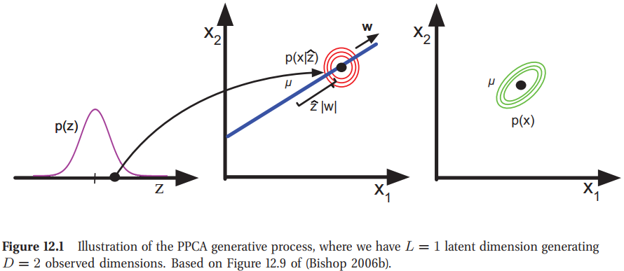
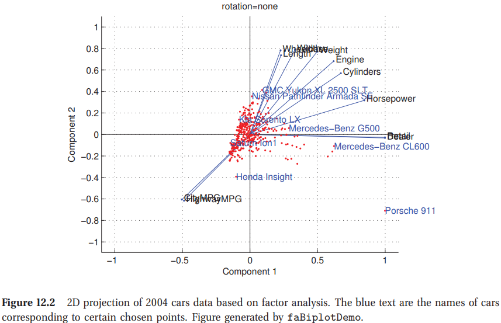
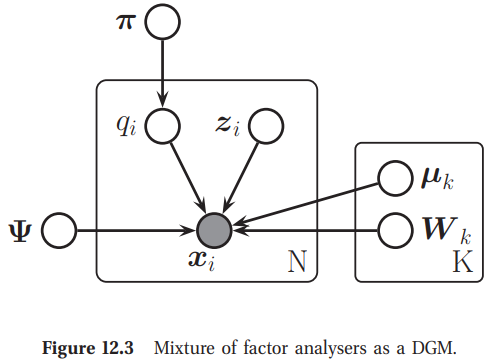
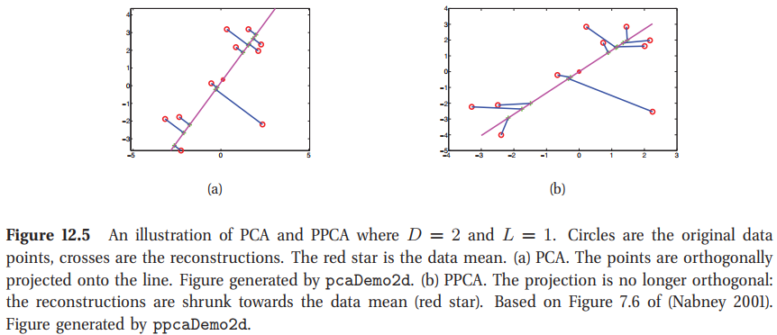
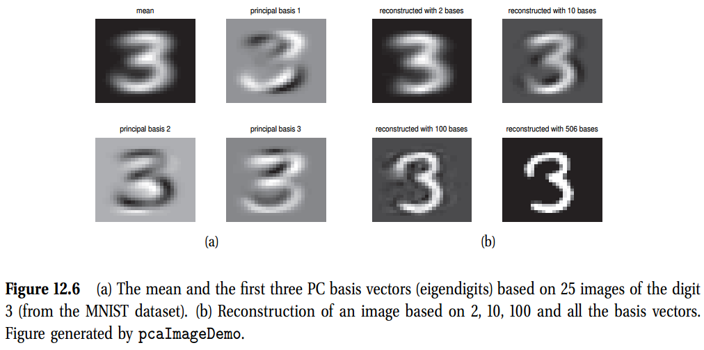
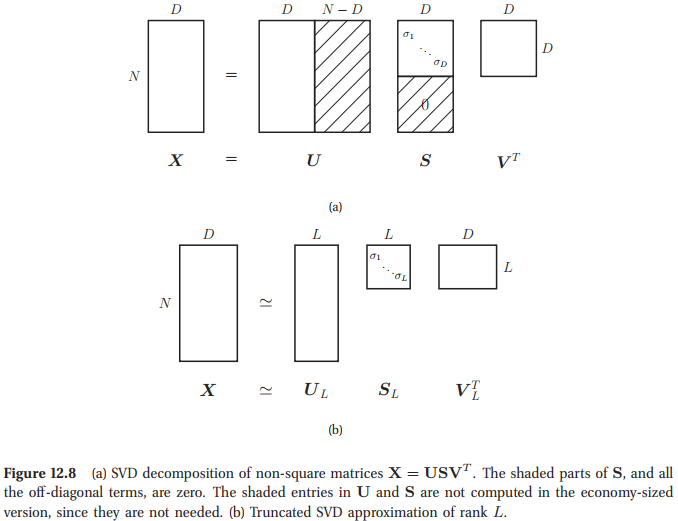
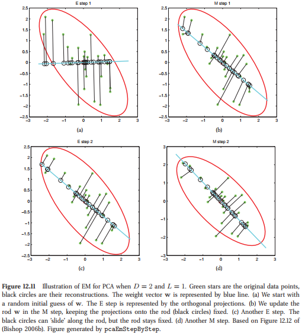
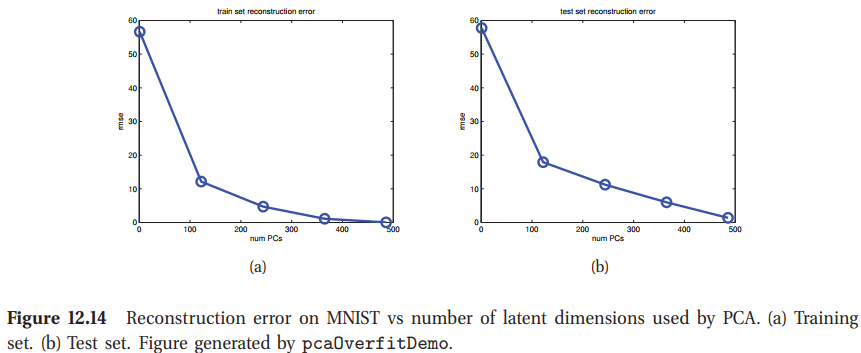
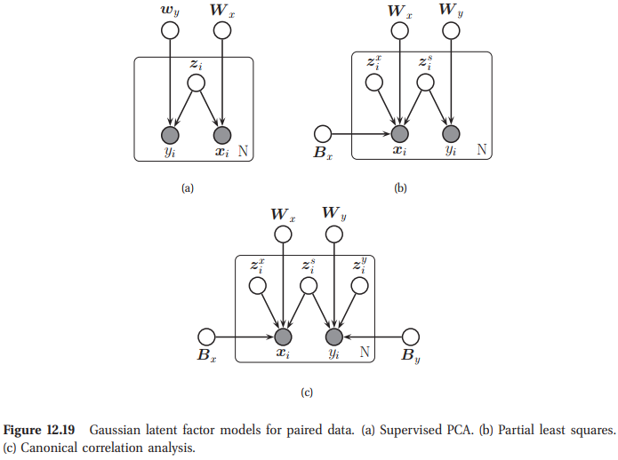

<!-- TOC -->

- [Chap12 Latent Linear Model](#chap12-latent-linear-model)
  - [12.1 因子分析(Factor Analysis)](#121-因子分析factor-analysis)
    - [12.1.1 FA是MVN的一个低秩参数化(FA is a low rank parameterization of an MVN)](#1211-fa是mvn的一个低秩参数化fa-is-a-low-rank-parameterization-of-an-mvn)
    - [12.1.2 隐因子的推断(Inference of the latent factors)](#1212-隐因子的推断inference-of-the-latent-factors)
    - [12.1.3 不可识别性(Unidentifiability)](#1213-不可识别性unidentifiability)
    - [12.1.4 Mixtures of factor analysers](#1214-mixtures-of-factor-analysers)
    - [12.1.5 EM for factor analysis models](#1215-em-for-factor-analysis-models)
    - [12.1.6 拟合有缺失值的FA模型(Fitting FA models with missing data)](#1216-拟合有缺失值的fa模型fitting-fa-models-with-missing-data)
  - [12.2 主元成分分析(Principle Components Analysis-PCA)](#122-主元成分分析principle-components-analysis-pca)
    - [12.2.1 Classical PCA: statement of the theorem](#1221-classical-pca-statement-of-the-theorem)
    - [12.2.2 Proof*](#1222-proof)
    - [12.2.3 奇异值分解(Singular value decomposition (SVD))](#1223-奇异值分解singular-value-decomposition-svd)
    - [12.2.4 Probabilistic PCA](#1224-probabilistic-pca)
    - [12.2.5 PCA的EM算法](#1225-pca的em算法)
  - [12.3 选择隐维度的数量](#123-选择隐维度的数量)
    - [12.3.1 Model selection for FA/PPCA](#1231-model-selection-for-fappca)
    - [12.3.2 PCA的模型选择](#1232-pca的模型选择)
  - [12.5 成对和多视图数据的PCA(PCA for paired and multi-view data)](#125-成对和多视图数据的pcapca-for-paired-and-multi-view-data)
    - [12.5.1 监督PCA(隐因子回归)](#1251-监督pca隐因子回归)

<!-- /TOC -->

# Chap12 Latent Linear Model

## 12.1 因子分析(Factor Analysis)

混合模型的一个问题是，它们只使用一个隐变量来生成观测。特别是，每个观察只能来自$K$个原型之一。可以将混合模型视为使用$K$个隐藏的二进制变量，表示聚类实体的one-hot编码。但是由于这些变量是互斥的，因此该模型的表示能力仍然受到限制。

另一种方法是使用一个实值隐变量的向量，$\mathbf{z}_i\in\mathbb{Z}^L$。最简单的先验是使用一个高斯(随后我们会考虑其他选择)
$$
p(\mathbf{z}_i) = \mathcal{N}(\mathbf{z}_i|\boldsymbol{\mu}_0,\mathbf{\Sigma}_0)        \tag{12.1}
$$
如果观测值也是连续的，$\mathbf{x}_i\in\mathbb{R}^D$，我们可以使用一个高斯似然。正如线性回归中一样，我们将假设均值是一个(隐)输入的线性函数，然后生成
$$
p(\mathbf{x}_i | \mathbf{z}_i, \boldsymbol{\theta}) = \mathcal{N}(\mathbf{W}\mathbf{z}_i + \boldsymbol{\mu}, \mathbf{\Psi})  \tag{12.2}
$$
其中$\mathbf{W}$是一个$D\times L$的矩阵，称为**因子负荷矩阵**，且$\mathbf{\Psi}$是一个$D\times D$的协方差矩阵。我们取$\mathbf{\Psi}$是一个对角阵，因为模型的全部点强迫$\mathbf{z}_i$来解释相关性，而不是“融入”观测值的协方差。总体模型称为**因子分析/FA**。$\mathbf{\Psi}=\sigma^2\mathbf{I}$的特殊情况称为**概率主元成分分析(Probabilitic Principle Component Analysis-PPCA)**。取这个名字的原因后面会逐渐清晰。

生成过程如图12.1所示，其中$L=1, D=2$，$\mathbf{\Psi}$是对角的。我们采用各向同性的高斯“喷雾罐”，并将其沿着由$\mathbf{w}z_i +\mu$定义的$1d$线滑动。这会在$2d$中引起一个细长的(因而是相关的)高斯。

> 从生成角度来解释一个二维数据空间与一维隐空间的概率PCA模型。首先从隐变量的先验分布$p(z)$来采样一个值$\hat{z}$，然后从一个均值为$\mathbf{w}\hat{z}+\boldsymbol{\mu}$方差为$\sigma^2\mathbf{I}$的同向高斯分布采样一个值，从而生成观测数据点$\mathbf{x}$。绿色椭圆代表了边缘分布$p(\mathbf{x})$的密度等高线。

### 12.1.1 FA是MVN的一个低秩参数化(FA is a low rank parameterization of an MVN)

FA可以认为是一种使用少量参数来具体化$\mathbf{x}$上的一个联合密度模型的方式。根据来自方程4.126，为了看这个，诱导边缘分布是一个高斯
$$
\begin{aligned}
    p(\mathbf{x}_i|\boldsymbol{\theta}) &= \int\mathcal{N}(\mathbf{x}_i|\mathbf{W}\mathbf{z}_i + \boldsymbol{\mu}, \mathbf{\Psi})\mathcal{N}(\mathbf{z}_i|\boldsymbol{\mu}_0,\mathbf{\Sigma}_0)d\mathbf{z}_i \\
    &=\mathcal{N}(\mathbf{x}_i | \mathbf{W}\boldsymbol{\mu}_0 + \boldsymbol{\mu}, \mathbf{\Psi} + \mathbf{W}\mathbf{\Sigma}_0\mathbf{W}^T)      \tag{12.4}
\end{aligned}
$$
从这个我们看到，不是一般性的，我们可以设置$\boldsymbol{\mu}_0$，因为我们也可以将$\mathbf{W}\boldsymbol{\mu}_0$合并进$\boldsymbol{\mu}$。类似的，我们可以设置$\mathbf{\Sigma}_0=\mathbf{I}$，因为我们总是可以通过定义一个新的**权重矩阵**$\tilde{\mathbf{W}} = \mathbf{W}\mathbf{\Sigma}^{-\frac{1}{2}}_0$来“模拟”相关的先验知识。我们发现
$$
\text{cov}[\mathbf{x}|\boldsymbol{\theta}] = \tilde{\mathbf{W}}^T + \mathbb{E}[\epsilon\epsilon^T] = \mathbf{W}\mathbf{\Sigma_0^{-\frac{1}{2}}}\mathbf{\Sigma}_0(\mathbf{W}\mathbf{\Sigma}_0^{-\frac{1}{2}})^T+ \mathbf{\Psi} = \mathbf{W}\mathbf{W}^T+\mathbf{\Psi}    \tag{12.5}
$$
我们然后看到FA使用一个**低秩分解low-rank decomposition**来近似可见向量的协方差矩阵：
$$
\mathbf{C} \triangleq \text{cov}[\mathbf{x}] =\mathbf{W}\mathbf{W}^T + \mathbf{\Psi}        \tag{12.6}
$$
这个是只使用了$O(LD)$个参数，允许在完全协方差高斯($O(D^2)$个参数)与一个对角协方差($O(D)$个参数)之间进行一个灵活的妥协。注意到，如果我们没有将$\mathbf{\Psi}$限制到对角阵，我们可以尝试将$\mathbf{\Psi}$设置为一个完全协方差矩阵；然后我们设置$\mathbf{W}=0$，这种情况下不需要隐因子。

### 12.1.2 隐因子的推断(Inference of the latent factors)

尽管，FA可以被看作是一个定义$\mathbf{x}$之上密度的方式，但是它也经常被使用，因为我们希望隐因子可以显示数据中一些有趣的东西。为了实现这个，我们需要计算隐因子上的后验。我们可以计算高斯的**贝叶斯准则**，给定为
$$
\begin{aligned}
    p(\mathbf{z}_i|\mathbf{x}_i,\boldsymbol{\theta}) &=\mathcal{N}(\mathbf{z}_i|\mathbf{m}_i, \mathbf{\Sigma}_i)    \\
    \mathbf{\Sigma}_i &\triangleq (\mathbf{\Sigma}_0^{-1} + \mathbf{W}^T\mathbf{\Psi}^{-1}\mathbf{W})^{-1} \\
    \mathbf{m}_i &\triangleq \mathbf{\Sigma}_i(\mathbf{W}^T\mathbf{\Psi}^{-1}(\mathbf{x}_i-\boldsymbol{\mu})+\mathbf{\Sigma}_0^{-1}\boldsymbol{\mu}_0)
\end{aligned}
$$
注意到在FA模型中，$\mathbf{\Sigma}_i$实际上是独立于$i$的，所以我们可以将其记为$\mathbf{\Sigma}$。计算这个矩阵消耗时间为$O(L^3+L^2D)$，计算每个$\mathbf{m}_i=\mathbb{E}[\mathbf{z}_i|\mathbf{x}_i,\boldsymbol{\theta}]$消耗时间$O(L^2+LD)$。$\mathbf{m}_i$有时称为**隐分数**或**隐因子**。

让我们给出一个简单地例子。我们考虑有$D=11$个变量以及$N=387$等情况，描述了汽车的各个方面，例如发动机尺寸，气缸数，每加仑英里数(MPG)，价格等。我们可以拟合一个$L=2$维度的模型。我们可以将$\mathbf{m}_i$分数画为$\mathbb{R}^2$中的点来将其可视化，如图11.2。

为了可以更好地理解隐因子的意思，我们可以将每个特征维度对应的单位因子$\mathbf{e}_1=(1,0,\cdots,0),\mathbf{e}_2=(0,1,0,\cdots,0)$等投影到低维空间中。这个可以显示未图12.2中的蓝色线条；这称为一个**biplot**。我们看到水平坐标代表价格，对应的特征标记为“经销商”和“零售”，昂贵的汽车在右边。垂直坐标轴代表燃油效率/大小:重型车辆效率较低，较高位置较高，而轻型车辆效率较高，较低位置较低。

### 12.1.3 不可识别性(Unidentifiability)

就像混合模型，FA也是不可识别的。为了了解这个，我们假设$\mathbf{R}$是一个任意正交旋转矩阵，满足$\mathbf{R}\mathbf{R}^T=\mathbf{I}$。我们定义$\tilde{\mathbf{W}} = \mathbf{W}\mathbf{R}$；然后这个修改模型的似然函数与未修改模型的似然相同
$$
\begin{aligned}
    \text{cov}&=\tilde{\mathbf{W}}\mathbb{E}[\mathbf{z}\mathbf{z}^T]\tilde{\mathbf{W}}^T+\mathbb{E}[\epsilon\epsilon^T] \\
    &=\mathbf{WRR^TW^T+\Psi=WW^T+\Psi}  \tag{12.11}
\end{aligned}
$$
在几何上，将$\mathbf{W}$乘以正交矩阵就像在生成$\mathbf{x}$之前旋转$\mathbf{z}$一样；但是由于$\mathbf{z}$是从各向同性的高斯中得出的，因此这对可能性没有影响。因此，我们也不能唯一地标识$\mathbf{W}$，因此也不能唯一地标识潜在因子。

为了保证唯一解，我们需要移除$L(L-1)/2$的自由度，因为这是大小为$L\times L$正交矩阵的数量。总的来说，FA模型具有$D + LD-L(L-1)/2$个自由参数(均值除外)，其中第一项源自$\mathbf{\Psi}$。显然，我们要求此值小于或等于$D(D+1)/2$，即无约束（但对称）协方差矩阵中参数的数量。这为我们提供了$L$的上限，如下所示
$$
L_{max}=\lfloor D + 0.5(1 − \sqrt{1 + 8D}) \rfloor
$$

不幸的是，即使我们设定$L\lt L_{max}$，我们依然无法唯一的识别参数，因为旋转模糊仍然存在。不可识别性不影响模型的预测性能。然而，却影响负载矩阵，因此也会影响隐含因子的解释性。因为因子分析通常用来发现数据中的结构，这个过程需要被重视。因此一些常用的解是：
- **强制$\mathbf{W}$为对角阵** 也许对于识别问题最简洁的方案就是将$\mathbf{W}$设定为对角阵，按照相应隐因子的方差降序排序列。这个方法被PCA采用，我们将在$12.2$节中进行讨论。这个结果不必要求更好的可解释性，但是至少得是唯一的。
- **强制$\mathbf{W}$为下三角阵** 一种实现可识别性的方式是保证第一个可见特征是由第一个隐因子生成，前两个可见特征是由前两个隐因子生成，以此类推，这种方式在贝叶斯社区很常见。例如，如果$L=3, D=4$。对象的因子负载矩阵为
$$
\mathbf{W}=
\begin{pmatrix}
    w_{11} & 0 & 0 \\
    w_{21} & w_{22} & 0 \\
    w_{31} & w_{32} & w_{33} \\
    w_{41} & w_{42} & w_{43} \\
\end{pmatrix}   \tag{12.13}
$$
我们也要求$w_{jj}\gt0, j=1:L$。这个约束矩阵中的参数的总数量为$D+DL-L(L-1)/2$，这等于唯一不可识别参数的数量。这种方法的缺点是前$L$个可见变量，称为**发现变量(founder variable)**，影响了隐因子的解释性，因此必须仔细选择。

- **权重上的系数提升先验** 我们不需要提前指定$\mathbf{W}$中的元素，我们可以选择使用$\ell_1$正则化、ARD或spike-slab先验来将矩阵元素设为0。这个称为稀疏因子分析。这个不是必须保证一个唯一的MAP估计，但是不鼓励解释性解。
- **选择一个信息丰富的旋转矩阵** 有大量的启发式方法来试图找到可以用来修改$\mathbf{W}$的旋转矩阵$\mathbf{R}$，同时也尝试提升解释性，一般鼓励其实稀疏性的。一种常用的方法称为**varimax**
- **对隐因子使用非高斯先验** 在12.6节中，我们将讨论如何使用高斯分布来替代$p(\mathbf{z}_i)$，可以保证我们有时可以唯一识别$\mathbf{W}$以及隐因子。这个技术称为ICA。

### 12.1.4 Mixtures of factor analysers

FA模型假设数据位于低维线性流形上。现实中，大多数数据用一些低维**曲线流形(curve manifold)** 的形式来来建模会更好。我们可以通过片段线性流形来近似一个曲线流形。这个建议使用如下模型：令$\mathbf{W}_k, k=1:K$为第$k$个维度为$L_k$的线性子空间。假设我们有一个隐指标量$q_i\in \{1,\cdots,K\}$，指明我们应该使用哪个子空间来生成数据。我们然后从一个高斯先验采样$\mathbf{z}_i$，然后输到$\mathbf{W}_k$矩阵(其中$k=q_i$)，添加噪声。更精确的是，建模如下
$$
\begin{aligned}
    p(\mathbf{x}_i|\mathbf{z}_i,q_i=k,\boldsymbol{\theta}) &= \mathcal{N}(\mathbf{x}_i | \boldsymbol{\mu}_k + \mathbf{W}_k\mathbf{z}_i, \mathbf{\Psi}) \\
    p(\mathbf{z}_i|\boldsymbol{\theta}) &= \mathcal{N}(\mathbf{z}_i | \mathbf{0},\mathbf{I}) \\
    p(q_i| \boldsymbol{\theta}) &= \text{Cat}(q_i| \boldsymbol{\pi}) \tag{12.14-12.16}
\end{aligned}
$$
这称为**混合矩阵分析(MFA)**。

### 12.1.5 EM for factor analysis models

利用第四章的结果，可以很容易地导出一个EM算法来拟合FA模型。只要再多做一点工作，我们就可以混合使用FAs。下面我们陈述无需证明的结果。推导可以在(Ghahramani and Hinton 1996a)中找到；但是，如果你想精通数学，自己推导这些方程是一个有用的练习。

为了获得单因子分析器的结果，只需要将如下方程中设置$r_{ic}=1, c=1$。在第12.2.5节中，我们将看到在拟合PPCA模型时产生的这些方程的进一步简化，其中的结果将得到一个特别简单和优雅的解释。

在E步，我们计算聚类$c$为数据点$i$的后验责任为
$$
r_{ic}\triangleq p(q_{i}=c|\mathbf{x}_i,\boldsymbol{\theta}) \propto \pi_{c}\mathcal{N}(\mathbf{x}_i|\boldsymbol{\mu}_c,\mathbf{W}_c\mathbf{W}_c^T+\mathbf{\Psi})       \tag{12.17}
$$
$\mathbf{z}_i$的条件后验概率是
$$
\begin{aligned}
    p(\mathbf{z}_i|\mathbf{x}_i,q_i=c,\boldsymbol{\theta}) &=\mathcal{N}(\mathbf{z}_i|\mathbf{m}_{ic},\mathbf{\Sigma}_{ic}) \\
    \mathbf{\Sigma}_{ic}&\triangleq (\mathbf{I}_{L}+\mathbf{W}_c^T\mathbf{\Psi}_c^{-1}\mathbf{W}_c)^{-1} \\
    \mathbf{m}_{ic} &\triangleq \mathbf{\Sigma}_{ic}(\mathbf{W}_c^T\mathbf{\Psi}_c^{-1}(\mathbf{x}_i-\boldsymbol{\mu}_c))   \tag{12.18-12.20}
\end{aligned}
$$
在M步，很容易同时估计$\boldsymbol{\mu}_c$与$\mathbf{W}_c$，通过定义$\tilde{W}_c=(\mathbf{W}_c, \boldsymbol{\mu}_c),\tilde{z}=(\mathbf{z},1)$。也可以定义
$$
\begin{aligned}
    \mathbf{b}_{ic} &\triangleq \mathbb{E}[\mathbf{z}|\mathbf{x}_i,q_i=c]=[\mathbf{m}_{ic};1] \\
    \mathbf{C}_{ic}&\triangleq \mathbb{E}[\tilde{\mathbf{z}}\tilde{\mathbf{z}}^T |\mathbf{x}_i,q_i=c]=\begin{pmatrix}
        \mathbb{E}[\mathbf{z}\mathbf{z}^T|\mathbf{x}_i,q_i=c]& \mathbb{E}[\mathbf{z}|\mathbf{x}_i,q_i=c] \\
        \mathbb{E}[\mathbf{z}|\mathbf{x}_i,q_i=c]^T & 1
    \end{pmatrix}
\end{aligned}
$$
M步如下
$$
\begin{aligned}
    \hat{\tilde{\mathbf{W}}}_c &= \left[ \sum_i r_{ic}\mathbf{x}_i\mathbf{b}_{ic}^T \right] \left[ \sum_i r_{ic}\mathbf{C}_{ic} \right]^{-1} \\
    \tilde{\mathbf{\Psi}} &= \frac{1}{N}\text{diag}\left\{ \sum_{ic} r_{ic}(\mathbf{x}_i - \hat{\tilde{\mathbf{W}}}_c\mathbf{b}_{ic})\mathbf{x}_i^T \right\} \\
    \hat{\pi}_c &= \frac{1}{N}\sum_{i=1}^{N}r_{ic} \tag{12.23-12.25}
\end{aligned}
$$

### 12.1.6 拟合有缺失值的FA模型(Fitting FA models with missing data)

在许多应用中，例如协同过滤，我们会有缺失值。EM方法的一个用处就是拟合一个FA/PPCA模型，很容易扩展到这种情形。然而，如果存在大量的缺失数据，过拟合会成为一个问题。因此，执行MAP估计或是使用贝叶斯推断变得很重要。

## 12.2 主元成分分析(Principle Components Analysis-PCA)

考虑一个FA模型，其中约束为$\mathbf{\Psi}=\sigma^2\mathbf{I}$且$\mathbf{W}$是正交的。可以证明，随着$\sigma^2\rightarrow 0$，这个模型可以降级到经典的主元成分分析(PCA)，也称为**Karhunen Loeve**变换。$\sigma^2\gt0$的版本称为**概率PCA(PPCA)**，或是**敏感PCA**。(一个等效的结构是独立推导的)

为了使这个结果更有意义，我们首先学习一下经典的PCA。然后将PCA与SVD联系起来。然后最终返回讨论PPCA

### 12.2.1 Classical PCA: statement of the theorem

经典PCA的全面观点总结如下。

**理论12.1** 假设我们想寻找$L$个线性基向量$\mathbf{w}_j\in\mathbb{R}^D$的一个正交集合，以及对应的分数$\mathbf{z}_i\in\mathbb{R}^L$，使得我们最小化平均**重构误差**
$$
J(\mathbf{W},\mathbf{Z}) =\frac{1}{N}\sum_{i=1}^N\Vert\mathbf{x}_i-\hat{\mathbf{x}}_i\Vert^2        \tag{12.26}
$$
其中$\hat{\mathbf{x}}_i=\mathbf{W}\mathbf{z}_i$，约束条件为$\mathbf{W}$是正交阵。等效的，我们将这个目标函数重写如下
$$
J(\mathbf{W},\mathbf{Z}) =\Vert\mathbf{X}-\mathbf{W}\mathbf{Z}^T \Vert^2_F        \tag{12.27}
$$
其中$\mathbf{Z}$是一个$N\times L$的矩阵，$\mathbf{z}_i$位于其行中，且$\Vert\mathbf{A}\Vert_F$是矩阵$\mathbf{A}$的**Frobenius范数**，定义为
$$
\Vert\mathbf{A}\Vert_F=\sqrt{\sum_{i=1}^m\sum_{j=1}^n a_{ij}^2} = \sqrt{\text{tr}(\mathbf{A}^T\mathbf{A})} = \lVert \mathbf{A}(:)\rVert_2 \tag{12.28}
$$
通过设置$\hat{\mathbf{W}}=\mathbf{V}_L$可得到最优解，其中$\mathbf{V}_L$包含了经验协方差矩阵($\hat{\mathbf{\Sigma}}=\frac{1}{N}\sum_{i=1}^{N}\mathbf{x}_i\mathbf{x}_i^T$)的$L$个最大特征值对应的特征向量。更进一步，数据的最优低维编码给定为$\hat{\mathbf{z}}_i=\mathbf{W}^T\mathbf{x}_i$，这是数据到由特征向量张成的列空间的正交投影。

> 图12.5 解释了PCA与PPCA，其中$D=2, L=1$。圆圈是原始数据点，星号是重构数据。红星是数据均值。(a)PCA。数据点正交映射到直线上。(a)PPCA.映射不再是正交的:重构缩小到数据平均值。

其中一个例子如图12.5(a)所示$D=2, L=1$。对角线是向量$\mathbf{w}_1$，这称为第一个主元成分或是主元方向。数据点$\mathbf{x}_i\in\mathbb{R}^2$，是正交映射到这条线得到$z_i\in\mathbb{R}$。这是对数据最好的一维近似。

总之，很难可视化高维数据，但如果数据恰好是一组图像，则很容易实现。图12.6显示了前三个主元向量，重塑为图片，以及使用大量的基向量来重塑特定图片。

下面我们将说明主方向是数据显示最大方差的方向。这意味着主成分分析可能仅仅因为测量尺度而被方差高的方向“误导”。图12.7(a)显示了一个例子，其中垂直轴(重量)使用的范围比水平轴(高度)大，导致线条看起来有些“不自然”。因此，标准做法是首先标准化数据，或等效地使用相关矩阵而不是协方差矩阵。从图12.7（b）可以明显看出这一点的好处。

### 12.2.2 Proof*
证明：
我们使用$\mathbf{w}_i\in\mathbb{R}^D$来代表第$j$个主元方向，$\mathbf{x}_i\in\mathbb{R}^D$代表第$i$个高维观测值，$\mathbf{z}_i\in\mathbb{R}^L$代表第$i$个低维表示，$\tilde{\mathbf{z}}_i\in\mathbb{R}^L$代表$[z_{1j},\cdots,z_{Nj}]$，这是第$j$个所有低维向量中的成分。

我们从估计最好的$1$维解$\mathbf{w}_1\in\mathbb{R}^D$开始，对应的投射点$\tilde{\mathbf{z}}_1\in\mathbb{R}^N$。我们将发现剩余基$\mathbf{w}_2,\mathbf{w}_3$等。重构误差为
$$
\begin{aligned}
    J(\mathbf{w}_1,\mathbf{z}_1) &= \frac{1}{N}\sum_{i=1}^{N}\Vert \mathbf{x}_{i} -z_{i1}\mathbf{w}_1 \Vert ^2 = \frac{1}{N}\sum_{i=1}^{N}(\mathbf{x}_{i1} -z_i\mathbf{w}_1)^T(\mathbf{x}_{i1} -z_i\mathbf{w}_1) \\
    &=\frac{1}{N}\sum_{i=1}^N[\mathbf{x}_i^T\mathbf{x}_i - 2z_{i1}\mathbf{w}_1^T\mathbf{x}_i + z_{i1}^2\mathbf{w}_1^T\mathbf{w}_1] \\
    &=\frac{1}{N}\sum_{i=1}^N[\mathbf{x}_i^T\mathbf{x}_i - 2z_{i1}\mathbf{w}_1^T\mathbf{x}_i + z_{i1}^2]        \tag{12.29-12.31}
\end{aligned}
$$
因为基于正交假设$\mathbf{w}_1^T\mathbf{w}_1=1$。相对$z_{i1}$求导，并令其为0可得到
$$
\frac{\partial}{\partial z_{i1}}J(\mathbf{w}_1,\mathbf{z}_1) =\frac{1}{N}[-2\mathbf{w}_1^T\mathbf{x}_i + 2z_{i1}] = 0 \Rightarrow z_{i1}=\mathbf{w}_1^T\mathbf{x}_i \tag{12.32}
$$
因此最优重构权重可以将数据正交投射到第一个主元方向$\mathbf{w}_1$上获得。重新带入可得
$$
J(\mathbf{w}_1) =\frac{1}{N}\sum_{i=1}^N[\mathbf{x}_i^T\mathbf{x}_i-z_{i1}^2] = \text{const} - \frac{1}{N}\sum_{i=1}^N z_{i1}^2
$$
投影坐标的方差给定为
$$
\text{var}[\tilde{\mathbf{z}}_1] = \mathbb{E}[\tilde{z}_1^2] - (\mathbb{E}[\tilde{z}_1])^2 = \frac{1}{N}\sum_{i=1}^N z_{i1}^2 - 0   \tag{12.34}
$$
因为
$$
\mathbb{E}[z_{i1}] = \mathbb{E}[\mathbf{x}_i^T\mathbf{w}_1]=\mathbb{E}[\mathbf{x}_i]^T\mathbf{w}_1=0    \tag{12.35}
$$
因为数据已经被中心化了。从这个角度看，我们看到最小化重构误差等效于最大化投射数据的方差
$$
\argmin_{\mathbf{w}_1}J(\mathbf{w}_1) =\argmax_{\mathbf{w}_1}\text{var}[\tilde{\mathbf{z}}_1]       \tag{1.36}
$$
这也是为什么说PCA是寻找最大方差的方向。这称为PCA的分析角度。

投射数据的方差可以写为
$$
\frac{1}{N}\sum_{i=1}^{N}z_{i1}^2 = \frac{1}{N}\sum_{i=1}^{N}\mathbf{w}_1^T\mathbf{x}_i^T\mathbf{x}_i\mathbf{w}_1=\mathbf{w}_1^T\hat{\mathbf{\Sigma}}\mathbf{w}_1       \tag{12.37}
$$
其中$\hat{\mathbf{\Sigma}}=\frac{1}{N}\sum_{i=1}^N\sum_i \mathbf{x}_i^T\mathbf{x}_i$是经验协方差矩阵(如果数据标准化就是相关性矩阵)。

通过令$\Vert\mathbf{w}_1 \Vert \rightarrow \infin$，我们可以轻易最小化投射数据的方差，所以我们设定一个约束$\Vert\mathbf{w}_1\Vert=1$，最大化
$$
\tilde{J}(\mathbf{w}_1) = \mathbf{w}_1^T\tilde{\mathbf{\Sigma}}\mathbf{w}_1 + \lambda_1(\mathbf{w}_1^T\mathbf{w}_1-1)   \tag{12.38}
$$
其中$\lambda_1$是拉格朗日乘子。取导数，令其为$0$可得
$$
\begin{aligned}
    \frac{\partial}{\partial\mathbf{w}_1}\tilde{J}(\mathbf{w}_1) &= 2\tilde{\mathbf{\Sigma}}\mathbf{w}_1 - 2\lambda_1\mathbf{w}_1=0  \tag{12.39} \\
    \tilde{\mathbf{\Sigma}}\mathbf{w}_1 &=\lambda_1\mathbf{w}_1
\end{aligned}
$$
因此，最大化方差的方向是协方差矩阵的特征向量。左乘$\mathbf{w}_1$，我们发现投射数据的方差为
$$
\mathbf{w}_1^T\tilde{\mathbf{\Sigma}}\mathbf{w}_1 =\lambda_1    \tag{12.41}
$$
因为我们想最大化方差，选择对应最大特征值得特征向量。

我们现在寻找另一个可以最小化重构误差的方向$\mathbf{w}_2$，约束为$\mathbf{w}_1\mathbf{w}_2=0$且$\mathbf{w}_2^T\mathbf{w}_2=1$。误差为
$$
J(\mathbf{w}_1, \mathbf{z}_1,\mathbf{w}_2,\mathbf{z}_2) = \frac{1}{N}\sum_{i=1}^N\Vert \mathbf{x}_i - z_{i1}\mathbf{w}_1 - z_{i2}\mathbf{w}_2 \Vert^2   \tag{12.42}
$$
相对$\mathbf{w}_1$与$\mathbf{z}_1$进行最优化，给出与之前相同的解。令$\frac{\partial J}{\partial\mathbf{z}_2}=0$得到$z_{i2}=\mathbf{w}_2^T\mathbf{x}_i$。换而言之，第二个主元成分编码是通过投射到第二个主元成分方向得到的。带入得到
$$
J(\mathbf{w}_2) = \frac{1}{n}\sum_{i=1}^{N}[\mathbf{x}_i^T\mathbf{x}_i - \mathbf{w}_1^T\mathbf{x}_i\mathbf{x}_i^T\mathbf{w}_1 - \mathbf{w}_2^T\mathbf{x}_i\mathbf{x}_i^T\mathbf{w}_2] = \text{const}-\mathbf{w}_2^T\tilde{\mathbf{\Sigma}}\mathbf{w}_2      \tag{12.43}
$$
将常数项丢弃，然后加入约束生成
$$
\tilde{J}(\mathbf{w}_2)=-\mathbf{w}_2^T\tilde{\mathbf{\Sigma}}\mathbf{w}_2 + \lambda_2(\mathbf{w}_2^T\mathbf{w}_2-1) + \lambda_{12}(\mathbf{w}_2^T\mathbf{w}_1-0)   \tag{12.44}
$$
得到
$$
\tilde{\mathbf{\Sigma}}\mathbf{w}_2 =\lambda_2\mathbf{w}_2  \tag{12.45}
$$

### 12.2.3 奇异值分解(Singular value decomposition (SVD))

我们用**协方差矩阵的特征向量**定义了PCA的解。然而，这里有另一种方式来获得解，是**基于奇异值分解/SVD**。这个基本上概括了从平方矩阵到其他类型矩阵的特征向量的符号。

尤其是，任何$N\times D$矩阵$\mathbf{X}$可以如下分解
$$
\underbrace{\mathbf{X}}_{N\times D} = \underbrace{\mathbf{U}}_{N\times N} \underbrace{\mathbf{S}}_{N\times D} \underbrace{\mathbf{V^T}}_{D\times D} \tag{12.46}
$$
其中$\mathbf{U}$是一个$N\times N$的矩阵，其列是正交的($\mathbf{U}^T\mathbf{U}=\mathbf{I}_N$)，$\mathbf{V}$是一个$D\times D$的矩阵，其**行与列都是正交的**($\mathbf{V}^T\mathbf{V}=\mathbf{V}\mathbf{V}^T=\mathbf{I}_D$)，且$\mathbf{S}$是一个$N\times D$的矩阵，其主对角上包含了$r=\min(N,D)$个**奇异值**$\sigma_i\gt0$，剩余的$0$由来填充。$\mathbf{U}$的列是左奇异向量，$\mathbf{V}$的列是右奇异向量。具体的可以看图12.8(a)。

> (a)非平方矩阵$\mathbf{X}=\mathbf{USV}^{\top}$的SVD分解。$\mathbf{S}$的阴影部分，且所有的非对角项是0。$\mathbf{U}$与$\mathbf{S}$中的阴影项

因为有最多$D$个奇异值(假设$N\gt D$)，$\mathbf{U}$剩余的$N - D$列是不相关的，因为它们可以被0乘。**经济型SVD或薄型SVD**避免了计算这些不必要的元素。我们将这个分解记为$\hat{\mathbf{U}}\hat{\mathbf{S}}\hat{\mathbf{V}}$。如果$N\gt D$，我们有
$$
\underbrace{\mathbf{X}}_{N\times D} = \underbrace{\hat{\mathbf{U}}}_{N\times D} \underbrace{\hat{\mathbf{S}}}_{D\times D} \underbrace{\hat{\mathbf{V^T}}}_{D\times D} \tag{12.47}
$$
如果$N\lt D$有
$$
\underbrace{\mathbf{X}}_{N\times D} = \underbrace{\hat{\mathbf{U}}}_{N\times N} \underbrace{\hat{\mathbf{S}}}_{N\times N} \underbrace{\hat{\mathbf{V}^T}}_{N\times D} \tag{12.48}
$$
计算经济型$\text{SVD}$花费时间为$O(ND\min(N,D))$。

在特征向量以及奇异向量之间的联系如下。对于任意的实矩阵$\mathbf{X}$，如果有$\mathbf{X=USV}^T$，我们有
$$
\mathbf{X}^T\mathbf{X}=\mathbf{V}\mathbf{S}^T\mathbf{U}^T\mathbf{U}\mathbf{S}\mathbf{V}^T=\mathbf{V}\mathbf{S}^T\mathbf{S}\mathbf{V}^T=\mathbf{V}\mathbf{D}\mathbf{V}^T     \tag{12.49}
$$
其中$\mathbf{D}=\mathbf{S}^2$是一个对角阵，包含了平方奇异值。因此
$$
(\mathbf{X}^T\mathbf{X})\mathbf{V}=\mathbf{V}\mathbf{D}  \tag{12.50}
$$
所以$\mathbf{X}^T\mathbf{X}$的特征向量等于$\mathbf{V}$，$\mathbf{X}$的右奇异特征向量，$\mathbf{X}\mathbf{X}^T$的特征值等于$\mathbf{D}$，平方奇异值。类似的
$$
\begin{aligned}
    \mathbf{X}\mathbf{X}^T&=(\mathbf{USV}^T)(\mathbf{V}\mathbf{S}^T\mathbf{U}^T)=\mathbf{U(S}\mathbf{S}^T)\mathbf{U}^T  \\
    (\mathbf{X}\mathbf{X}^T)\mathbf{U}&=\mathbf{U(S}\mathbf{S}^T)=\mathbf{UD}
\end{aligned}       \tag{12.51-12.52}
$$
因此，$\mathbf{X}\mathbf{X}^T$的特征向量等于$\mathbf{U}$，$\mathbf{X}$的左奇异特征向量，$\mathbf{X}\mathbf{X}^T$的特征值等于$\mathbf{D}$。我们可以总结如下：
$$
\mathbf{U}=\text{evec}(\mathbf{X}\mathbf{X}^T),\mathbf{V}=\text{evec}(\mathbf{X}^T\mathbf{X}),\mathbf{S}^2=\text{eval}(\mathbf{X}\mathbf{X}^T)=\text{eval}(\mathbf{X}^T\mathbf{X})  \tag{12.53}
$$
由于特征向量不受矩阵的线性缩放影响，我们看到$\mathbf{X}$的右奇异矩阵等效于经验协方差矩阵$\hat{\mathbf{\Sigma}}$的特征向量。进一步，$\hat{\mathbf{\Sigma}}$的特征值是一个缩放版平方奇异值。

然而，SVD与PCA之间的联系会更进一步。从方程12.46，我们可以将一个$r$秩的矩阵展示如下
$$
\mathbf{X} = \sigma_1
\begin{pmatrix}
    \vert \\
    \mathbf{u}_1 \\
    \vert
\end{pmatrix}(-\mathbf{v}_1^T-) + \cdots + \sigma_r
\begin{pmatrix}
    \vert \\
    \mathbf{u}_r \\
    \vert
\end{pmatrix}(-\mathbf{v}_r^T-) \tag{12.54}
$$
这称为**截断SVD**。参数的总数目需要使用一个秩$L$近似代表一个$N\times D$矩阵
$$
NL+LD+L=L(N+D+1)        \tag{12.56}
$$

### 12.2.4 Probabilistic PCA
现在重新回归PPCA。可以证明如下显着的结果。
> **理论12.2.2** 考虑一个因子分析模型，其中$\mathbf{\Psi}=\sigma^2\mathbf{I}, \mathbf{W}$是正交的。观测数据的对数似然为
$$
\log p(\mathbf{X}|\mathbf{W},\sigma^2)=-\frac{N}{2}\ln\vert\mathbf{C}\vert-\frac{1}{2}\sum_{i=1}^{N}\mathbf{x}_{i}^T\mathbf{C}^{-1}\mathbf{x}_i=-\frac{N}{2}\ln\vert\mathbf{C}\vert+\text{tr}(\mathbf{C}^{-1}\hat{\mathbf{\Sigma}})   \tag{12.60}
$$
其中$\mathbf{C}=\mathbf{W}\mathbf{W}^T+\sigma^2\mathbf{I}$且$\mathbf{S}=\frac{1}{N}\sum_{i=1}^{N}\mathbf{x}_i\mathbf{x}_i^T=\frac{1}{N}\mathbf{X}^T\mathbf{X}$。对数似然的最大化给定为
$$
\hat{\mathbf{W}}=\mathbf{V}(\mathbf{\Lambda}-\sigma^2\mathbf{I})^{\frac{1}{2}}\mathbf{R}
$$
其中$\mathbf{R}$是一个任意的$L\times L$的正交矩阵，$\mathbf{V}$是一个$D\times L$矩阵，列是$\mathbf{S}$的前$L$个特征向量，$\mathbf{\Lambda}$是对应的特征值对角阵。不是一般性的，我们可以设置$\mathbf{R=I}$。进一步，噪声方差的MLE给定为
$$
\hat{\sigma}^2 = \frac{1}{D-L}\sum_{j=L+1}^D\lambda_j \tag{12.62}
$$

那么，随着$\sigma^2\rightarrow 0$，我们有$\hat{\mathbf{W}}\rightarrow\mathbf{V}$，正如经典的PCA。可以看到隐因子的后验给定为
$$
\begin{aligned}
    p(\mathbf{z}_i\vert \mathbf{x}_i, \hat{\boldsymbol{\theta}}) &= \mathcal{N}(\mathbf{z}_i\vert \hat{\mathbf{F}}^{-1}\hat{\mathbf{W}}^{\top}\mathbf{x}_i,\sigma^2\hat{\mathbf{F}}^{-1}) \\
    \hat{\mathbf{F}} &\triangleq \hat{\mathbf{W}}^{\top}\hat{\mathbf{W}}+\hat{\sigma}^2\mathbf{I}
\end{aligned}   \tag{12.63-12.64}
$$
(不要将$\mathbf{F}=\mathbf{W}^{\top}\mathbf{W}+\sigma^2\mathbf{I}$与$\mathbf{F}=\mathbf{W}^{\top}\mathbf{W}+\sigma^2\mathbf{I}$混淆了)因此，随着$\sigma^2\rightarrow0$，我们发现。然后，后验可以通过数据到$\mathbf{V}$的列空间的一个正交映射得到，如同经典的PCA。

### 12.2.5 PCA的EM算法

尽管拟合一个PCA模型的常用方式是使用特征向量方法，或SVD，我们也可以使用EM方法，我们将证明这种方法有一些优势。PCA的EM方法依赖于PCAde概率描述。然而，算法将持续在0噪声环境下有小$\sigma^2=0$。

令$\tilde{\mathbf{Z}}$是一个$L\times L$的矩阵。存储了它的列的后验均值。类似的，令$\tilde{\mathbf{X}}=\mathbf{X}^T$存储了列的原始数据。根据方程12.63，当$\sigma^2=0$时，我们有
$$
\tilde{\mathbf{Z}}=(\mathbf{Z}^T\mathbf{W})^{-1}\mathbf{W}^T\tilde{\mathbf{X}}  \tag{12.65}
$$
这组成了E步。注意到，这只是数据的一个正交化映射。

根据方程12.23，M步给定为
$$
\hat{\mathbf{W}}=\left[ \sum_i\mathbf{x}_i\mathbb{E}[\mathbf{z}_i]^T \right]\left[ \sum_i\mathbb{E}[\mathbf{z}_i]\mathbb{E}[\mathbf{z}_i]^T \right]^{-1}        \tag{12.66}
$$
其中我们利用当$\sigma^2=0$时$\mathbf{\Sigma}=\text{cov}[\mathbf{z}_i|\mathbf{x}_i,\boldsymbol{\theta}]=0\mathbf{I}$的事实。可以将这个表达式与多输出线性回归的MLE，后者形式为$\mathbf{W}=(\sum_i\mathbf{y}_i\mathbf{x}_i^T)(\sum_i\mathbf{x}_i\mathbf{x}_i^T)^{-1}$。然后，我们看到M步有点像线性回归，只是将观测值得输入替换为隐变量的期望值。

总之，整个算法为
- E步：$\tilde{\mathbf{Z}}=(\mathbf{W}^T\mathbf{W})^{-1}\mathbf{W}^T\tilde{\mathbf{W}}$
- M步：$\mathbf{W}=\tilde{\mathbf{X}}\tilde{\mathbf{Z}}^{T}(\tilde{\mathbf{Z}}\tilde{\mathbf{Z}}^{T})^T$

(Tipping and Bishop 1999)证明了EM算法唯一稳定的不动点是全局最优解。也就是说，EM算法收敛到一个解，其中$W$张成了与由前$L$个特征向量定义的线性子空间相同的空间。然而，如果我们想要$W$是正交的，并且要以特征值的降序来包含特征向量，我们就必须对得到的矩阵进行正交化(这可以非常便宜地完成)。或者，我们可以修改EM以直接给出主要依据(Ahn and Oh 200)。

这个算法在$D=2$和$L=1$的情况下有一个简单的物理类比。考虑$\mathbb{R}^2$中由弹簧连接到刚性杆上的一些点，其方向由向量$\mathbf{w}$定义。令$z_i$是第$i$个附加到杆的弹簧，在E步骤中，我们保持杆固定，并让连接点四处滑动，以最小化弹簧能量(弹簧能量与残差平方和成正比)。在M步中，我们保持连接点固定，让杆旋转，以使弹簧能量最小化。见图12.11。

除了这种令人愉快的直观解释外，PCA的EM算法比特征向量法有以下优势：
- EM更快。尤其是假设$N,D\gg L$，EM的主要成本是在E步的投射操作，消耗的总时间为$O(TLND)$，其中$T$是迭代的次数。(Roweis 1997)显示了迭代次数通常很小。
- EM可以被以一种在线方式进行应用；也就是我们可以数据流来更新对$\mathbf{W}$的估计。
- EM可以一种更简单的方式来处理缺失值
- EM可以扩展到处理PPCA/FA模型的混合模型。
- EM可以修改为变EM或是变贝叶斯EM来拟合更加复杂的模型。

## 12.3 选择隐维度的数量

在11.5节中，我们讨论了如何选择混合模型中成分$K$的数量。本节中，我们将讨论如何选择FA/PCA模型的隐维度$L$的数量。

### 12.3.1 Model selection for FA/PPCA

如果我们使用一个概率模型，我们原则上可以计算$L^{*}=\argmax_{L}p(L|\mathcal{D})$。然而，主要有两个问题。第一个，计算LVM的边缘似然是很难的。实际中，可以利用简单近似，例如BIC或变分低界。另外，我们可以使用交叉验证似然作为一个业绩测量，尽管比较慢，因为每个模型要拟合$F$次，其中$F$是CV的折数。

第二个问题是需要搜索大量的潜在模型。通常的方法是对$L$的所有候选值执行穷举搜索。然而，有时我们可以将模型设定为它的最大规模，然后使用一个称为自动相关性确定的技术(第13.7节)，并结合EM，自动删除不相关的权重。

### 12.3.2 PCA的模型选择

由于PCA不是一个概率模型，我们无法使用上述描述的任何模型。一个对似然的明显近似是重构误差
$$
E(\mathcal{D},L)=\frac{1}{\vert\mathcal{D}\vert}\sum_{i\in\mathcal{D}}\Vert\mathbf{x}_i-\hat{\mathbf{x}_i}\Vert^2   \tag{12.67}
$$
这种情况的PCA，重构给定为$\hat{\mathbf{x}}_i=\mathbf{W}\mathbf{z}_i+\boldsymbol{\mu}$其中$\mathbf{z}_i=\mathbf{W}^T(\mathbf{x}_i-\boldsymbol{\mu})$，且$\mathbf{W},\boldsymbol{\mu}$从$\mathcal{D}_{\text{train}}$中估计得到。

图12.14(a)中画出了MNIST训练数据的$E(\mathcal{D}_{\text{train}},L)\text{vs} L$。我们看到它下降得很快，这表明我们可以用少量的因素来捕捉像素的大部分经验相关性，如图12.6所定性地说明的那样。

可以证明使用$L$项的残差给定为丢弃特征值的和
$$
E(\mathcal{D}_{\text{train}},L)=\sum_{j=L+1}^{D}\lambda_{j}     \tag{12.68}
$$
因此，绘制误差的另一种方法是按降序绘制保留的特征值。这被称为**碎石图scree plot**，因为“该图看起来像一座山的侧面，而‘碎石’是指从山上落下并躺在其底部的碎片”。3这将具有与残差图相同的形状。

一个相关量是解释方差的分数，定义为
$$
F(\mathcal{D}_{\text{train},L})=\frac{\sum_{j=1}^L\lambda_j}{\sum_{j^{\prime}=1}^{L_{max}}\lambda_{j^{\prime}}} \tag{12.69}
$$
这将捕获与scree图相同的信息。

## 12.5 成对和多视图数据的PCA(PCA for paired and multi-view data)

通常会有一对相关的数据集，例如基因表达和基因拷贝数，或者用户的电影分级和电影评论。把这些自然地结合在一起就是想把它们嵌入到一起。这是一个**数据融合**的例子。在某些情况下，我们可能希望通过低维“瓶颈”来预测另一个$\mathbf{x}_{i2}$中的一个元素，例如$\mathbf{x}_{i1}$。

选择我们讨论这些任务的各种隐高斯模型。模型可以轻易的从数据对推广到数据集合$\mathbf{x}_{im},m=1:M$。我们关注$\mathbf{x}_{im}\in\mathbb{R}^{D_{m}}$的情况。这种情况下，联合密度是多元高斯，我们可以使用EM或Gibbs采样拟合模型。

我们可以将模型推广到处理离散和计数数据，使用指数族作为响应分布，而不是高斯分布，正如我们在27.2.2节中所解释的那样。然而，这将需要在E步骤中使用近似推理(或对MCMC的类似修改)。

### 12.5.1 监督PCA(隐因子回归)
考虑如下模型，解释如图12.19(a):
$$
\begin{aligned}
    p(\mathbf{z}_i)&=\mathcal{N}(\mathbf{0},\mathbf{I}_{L})\\
    p(y_i|\mathbf{z}_i)&=\mathcal{N}(\mathbf{w}_y^T\mathbf{z}_i+\mu_y,\Sigma_y^2)\\
    p(\mathbf{x}_i|\mathbf{z}_i)&=\mathcal{N}(\mathbf{W}_x\mathbf{z}_i+\boldsymbol{\mu}_x,\sigma_x^2\mathbf{I}_D)
\end{aligned}   \tag{12.75-12.77}
$$