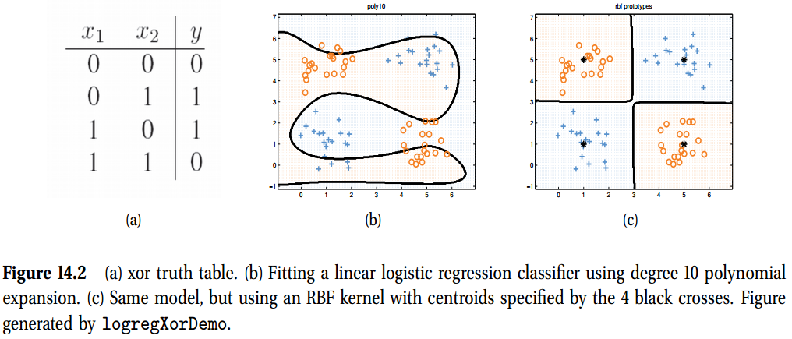
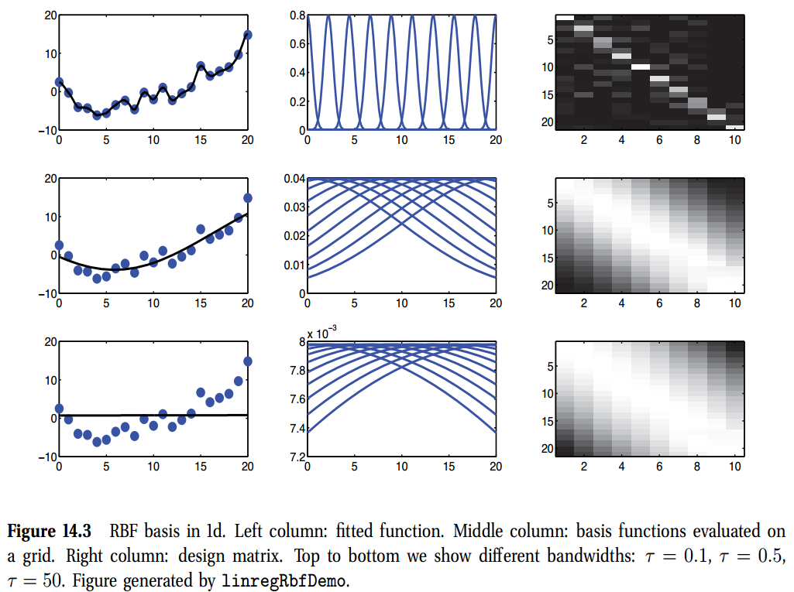
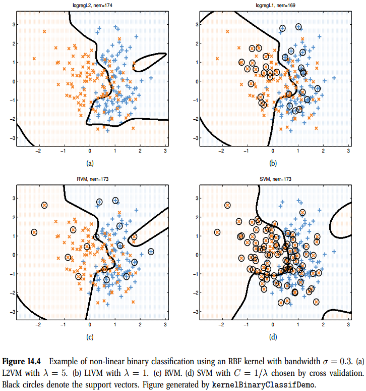
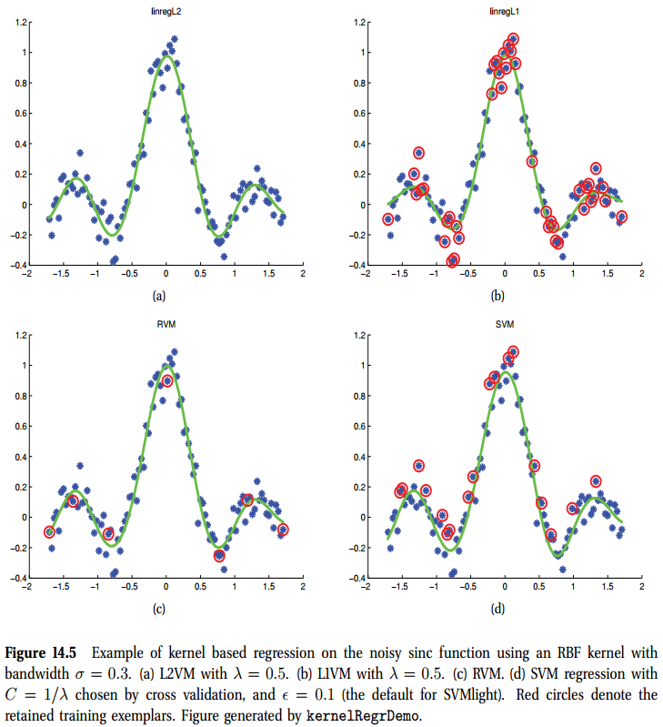
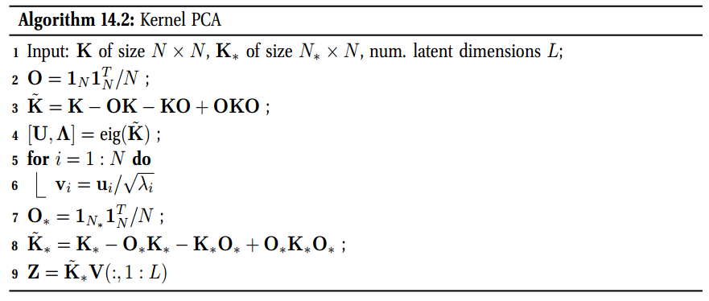
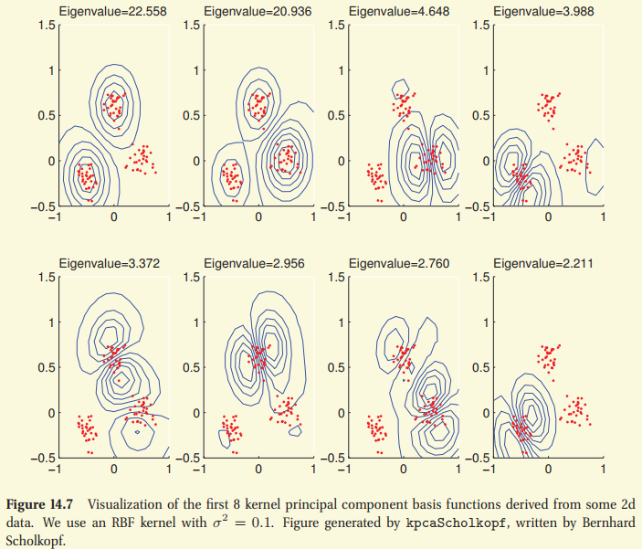
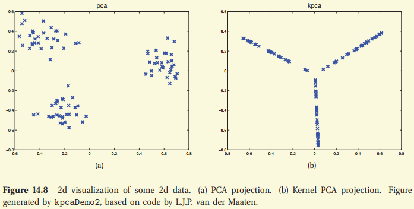
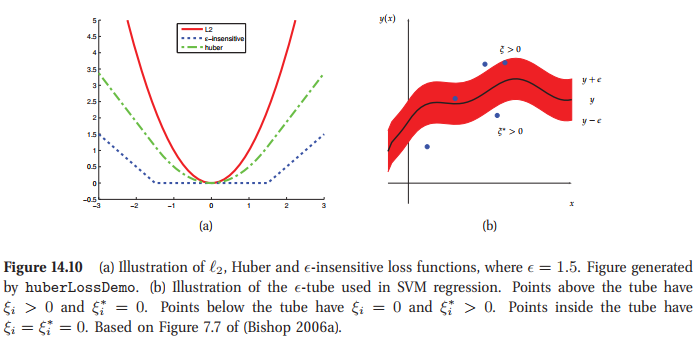
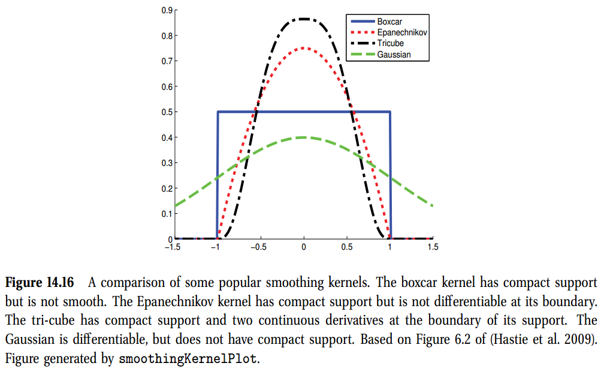
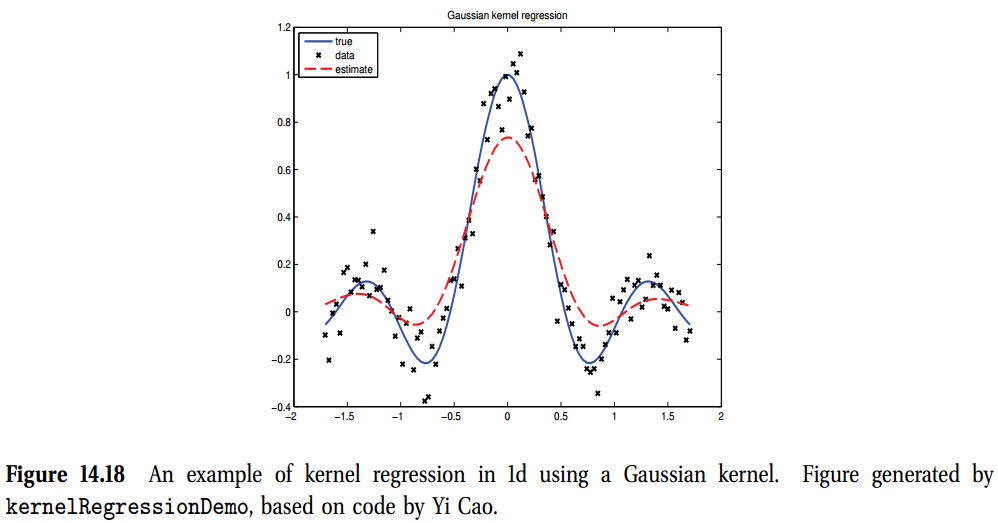

<!-- TOC -->

- [Chap14 核(Kernels)](#chap14-核kernels)
  - [14.1 引言(Introduction)](#141-引言introduction)
  - [14.2 核函数](#142-核函数)
    - [14.2.1 RBF核](#1421-rbf核)
    - [14.2.2 对比文件的核](#1422-对比文件的核)
    - [14.2.3 Mercer核](#1423-mercer核)
    - [14.2.4 (Linear kernels)线性核](#1424-linear-kernels线性核)
    - [14.2.5 Matern kernels](#1425-matern-kernels)
    - [14.2.6 String kernels](#1426-string-kernels)
    - [14.2.8 Kernels derived from probabilistic generative models](#1428-kernels-derived-from-probabilistic-generative-models)
      - [14.2.8.1 Probability product kernels](#14281-probability-product-kernels)
      - [14.2.8.2 Fisher kernels](#14282-fisher-kernels)
  - [14.3 在GLM内部使用核(Using kernals inside GLMs)](#143-在glm内部使用核using-kernals-inside-glms)
    - [14.3.1 Kernel Machines](#1431-kernel-machines)
    - [14.3.2 L1VMs, RMVs, 以及其他稀疏向量机(L1VMs, RVMs, and other sparser vector machines)](#1432-l1vms-rmvs-以及其他稀疏向量机l1vms-rvms-and-other-sparser-vector-machines)
  - [14.4 核技巧(Kernel trick)](#144-核技巧kernel-trick)
    - [14.4.1 核化的最近邻分类(Kernalized nearest neighbor classification)](#1441-核化的最近邻分类kernalized-nearest-neighbor-classification)
    - [14.4.2 核化K中心点聚类(Kernelized K-medoids clustering)](#1442-核化k中心点聚类kernelized-k-medoids-clustering)
    - [14.4.3 核化岭回归(Kernaliszed ridge regression) {#14.3.3}](#1443-核化岭回归kernaliszed-ridge-regression-1433)
      - [14.4.3.1 原始问题(The primal problem)](#14431-原始问题the-primal-problem)
      - [14.4.3.2 对偶问题(The dual problem)](#14432-对偶问题the-dual-problem)
      - [14.4.3.3 计算成本](#14433-计算成本)
    - [14.4.4 核PCA(Kernal PCA)](#1444-核pcakernal-pca)
  - [14.5 支持向量机(Support vector machines-SVMs)](#145-支持向量机support-vector-machines-svms)
    - [14.5.1 用于回归的SVMs(SVMS for regression)](#1451-用于回归的svmssvms-for-regression)
    - [14.5.2 用于分类的SVMs](#1452-用于分类的svms)
      - [14.5.2.1 Hinge loss](#14521-hinge-loss)
      - [14.5.2.2 最大间隔准则(Max margin principle)](#14522-最大间隔准则max-margin-principle)
      - [14.5.2.3 概率输出(Probabilities output)](#14523-概率输出probabilities-output)
    - [14.5.3 选择C](#1453-选择c)
    - [14.5.5 SVMs的一个概率解释(A probabilities interpretations of SVMs)](#1455-svms的一个概率解释a-probabilities-interpretations-of-svms)
  - [14.6 Comparison of discriminative kernel methods](#146-comparison-of-discriminative-kernel-methods)
  - [14.7 Kernels for building generative models](#147-kernels-for-building-generative-models)
    - [14.7.1 Smoothing kernels](#1471-smoothing-kernels)
    - [14.7.2 Kernel density estimation (KDE)](#1472-kernel-density-estimation-kde)
    - [14.7.3 From KDE to KNN](#1473-from-kde-to-knn)
    - [14.7.4 Kernel regression](#1474-kernel-regression)
    - [14.7.5 Locally weighted regression](#1475-locally-weighted-regression)

<!-- /TOC -->

# Chap14 核(Kernels)

## 14.1 引言(Introduction)

本书到目前为止，对于希望以任意方式分类、聚类或是处理的的对象，我们都假设其可以表示为一个固定大小的特征向量，一般形式是$\mathbf{x}_{i} \in \mathbb{R}^{D}$。然而，对于某些固定种类的对象，并不是很清楚怎么将它们很好的表示为固定大小的特征向量(fixed-size feature vectors)。例如，我们应该如何展示一个可变长度的文本文件或是蛋白序列。

对于这种问题的一种方法是为数据定义一个**生成模型(generativ model)**，使用推断出来的隐表示(latent representation)或是模型参数(model parameters)作为特征，然后将这些特征插入到标准方法中。例如，第28章中，我们讨论的深度学习，其本质是用非监督学习的方式去学习好的特征展示(essentially an unsupervised way to learn good feature representation)。

另一种方法是假设我们有多种方式来测量对象之间的**相似度(similarity)**，而不需要将其转化为特征向量的形式。例如，当对比字符串时，我们可以计算它们之间的编辑距离。令$\kappa(\mathbf{x}, \mathbf{x}^{\prime}) \geq 0$是对象$\mathbf{x}, \mathbf{x}^{\prime} \in \mathcal{X}$相似度的一些测量方法，其中$\mathcal{X}$是一些抽象空间；我们称 $\kappa$为一个核函数。注意，"核"有多种意思。

本章中，我们将讨论几种类型的核函数。我们然后描述一些可以纯粹写成以核函数计算的算法。当我们无法接触到要处理的对象$\mathbf{x}$的内部时，我们可以使用这种方法。

## 14.2 核函数

我们将核函数定义为两个参数的实值函数，$\kappa(\mathbf{x}, \mathbf{x}^{\prime}) \in \mathbb{R}, \mathbf{x}$，其中$\mathbf{x},\mathbf{x}^{\prime} \in \mathcal{X}$。一般函数是对称的，也就是$\kappa(\mathbf{x}, \mathbf{x}^{\prime}) = \kappa(\mathbf{x}^{\prime}, \mathbf{x})$，非负的(也就是$\kappa(\mathbf{x}, \mathbf{x}^{\prime}) \geq 0$)，因此可以解释为相似度的测量，但这不是必须的。我们给定几个例子。

### 14.2.1 RBF核

平方指数核(**squared expotenial kernel/SE kernel**)或是高斯核(**Gaussian kernel**)定义为
$$
\kappa(\mathbf{x}, \mathbf{x}^{\prime}) = \exp \left( -\frac{1}{2}(\mathbf{x} - \mathbf{x}^{\prime})^{T} \Sigma^{-1} (\mathbf{x} - \mathbf{x}^{\prime}) \right) \tag{14.1}
$$
如果$\Sigma$是对称的，可以写为
$$
\kappa(\mathbf{x}, \mathbf{x}^{\prime}) = \exp\left( -\frac{1}{2}\sum_{j=1}^{D}(x_{j} - x_{j}^{\prime})^2 \right) \tag{14.2}
$$
我们可以将$\sigma_{j}$解释为定义维度j的描述长度缩放(**characteristic length scale**)。如果$\sigma_{j}=\infty$，对应的维度可以忽略；称为**ARD核**。如果$\Sigma$是球形的，我们得到各向同性核(isotropic kernel)
$$
\kappa(\mathbf{x},\mathbf{x}^{\prime}) = \exp\left(-\frac{\|\mathbf{x}-\mathbf{x}^{\prime}\|^{2}}{2\sigma^2} \right) \tag{14.3}
$$
这里$\sigma^2$称为**带宽**。方程14.3是一个**径向基函数(radial basis function)**或**RBF核**的例子，因为其只是$\|\mathbf{x}-\mathbf{x}^{\prime}\|$一个函数。

### 14.2.2 对比文件的核

当执行文档分类或是查询时，对比两个文件$\mathbf{x}_{i}$与$\mathbf{x}_{i^{\prime}}$是一种非常重要的方式。如果我们使用一包单词来表示的话，其中$x_{ij}$代表单词$j$在文档$i$中发生的次数，我们可以使用**余弦相似度(cosine similarity)**，定义为
$$
\kappa(\mathbf{x},\mathbf{x}^{\prime}) = \frac{\mathbf{x}_{i}^{T}\mathbf{x}_{i^{\prime}}}{\|\mathbf{x}_{1}\|_{2} \|\mathbf{x}_{i^{\prime}}\|_{2}}
$$
当$\mathbf{x}_{i}$与$\mathbf{x}_{i^{\prime}}$解释为向量时，这个量测量了二者之间角度的余弦值。因为$\mathbf{x}_{i}$是一个计数向量，余弦相似度在0-1之间，其中0代表着向量正交，因此两个单词之间没有共同点。

不幸的是，这个简单的方法效果并不是很好，主要有两个原因。首先，如果$\mathbf{x}_{i}$与$\mathbf{x}_{i^{\prime}}$之间有任意的一个单词相同，它们是相似的，即使是最常用的单词，如很多文档中出现的"the"或"and"，这是很难区分的。第二，如果一个可辨别单词在文档中经常出现则，相似度被人为的提高了，即使单词的用法往往是突发性的，也就是说，一单一个单词在文档被使用，还有可能再次被使用。

不幸的是，我们可以使用简单的预处理来明显提升这个绩效。思想是用一个称为**TF-IDF表示**的新特征向量来代替单词计数特征，'term frequency inverse document frequency'。我们定义如下：
首先，术语频率定义为一个计数的对数变换
$$
\text{tf}_{ij} \triangleq \log(1+x_{ij})  \tag{14.5}
$$
这减少了一个文档内多频率发生单词的影响力。第二，逆文档频率定义为
$$
\text{idf}(j) \triangleq \log\left(\frac{N}{1+\sum_{i=1}^{N}\mathbb{I}(x_{ij}) \gt 0}\right)  \tag{14.6}
$$
其中$N$是总的文档数量，分母计数了有多少文档包含$j$。最终我们定义
$$
\text{tf-idf}(\mathbf{x}_{i}) \triangleq [\text{tf}(x_{ij}) \times \text{idf}(j)]_{i=1}^{V} \tag{14.7}
$$

然后我们在余弦相似度测量的内部使用这个。我们新核的形式为
$$
\kappa(\mathbf{x}, \mathbf{x}^{\prime}) = \frac{\phi(\mathbf{x}_{i})^{T}\phi(\mathbf{x}_{i^{\prime}})}{\|\phi(\mathbf{x}_{i}) \|_{2} \|\phi(\mathbf{x}_{i^{\prime}}) \|_{2}}  \tag{14.8}
$$
其中$\phi(\mathbf{x}) = \text{tf-idf}(\mathbf{x})$

### 14.2.3 Mercer核

我们准备研究的一些方法需要核函数满足一些要求，也就是对于任意输入的集合$\{\mathbf{x}_{i}\}_{i=1}^{N}$，由
$$
\mathbf{K} = \begin{pmatrix}
    \kappa(\mathbf{x}_{1}, \mathbf{x}_{1}), \cdots, \kappa(\mathbf{x}_{1}, \mathbf{x}_{N}) \\
    \vdots\\
    \kappa(\mathbf{x}_{N}, \mathbf{x}_{1}), \cdots, \kappa(\mathbf{x}_{N}, \mathbf{x}_{N})
\end{pmatrix}
\tag{14.9}
$$
定义的Gram矩阵是正定的。我们称这种核是一个**Mercer核**，或是**正定核(positive definite kernel)**。**可以证明高斯核实一个Mercer核，因为它是余弦相似核**。

Mercer核的重要性是如下结果，称为**Mercer理论**。如果Gram矩阵是正定的，我们可以计算一个特征值分解(谱分解)
$$
\mathbf{K} = \mathbf{U}^{T}\mathbf{\Lambda}\mathbf{U} \tag{14.10}
$$
其中$\mathbf{\Lambda}$是一个特征值为$\lambda_{i}\gt0$的对角阵。我们现在考虑$\mathbf{K}$的一个元素:
$$
k_{ij} = (\mathbf{\Lambda}^{\frac{1}{2}}\mathbf{U}_{:,i})^{T}(\mathbf{\Lambda}^{\frac{1}{2}}\mathbf{U}_{:,j})  \tag{14.11}
$$
我们定义$\phi(\mathbf{x}_{i}) = \mathbf{\Lambda}^{\frac{1}{2}}\mathbf{U}_{:,i}$，那么有
$$
k_{ij} = \phi(\mathbf{x}_{i})^{T}\phi(\mathbf{x}_{j})  \tag{14.12}
$$
然后我们看到核矩阵中的元素可以通过执行特征向量的内积计算而得到，而这些向量由eigenvector$\mathbf{U}$隐含的定义。总之，如果核是Mercer的，那么就存在一个函数$\phi$将$\mathbf{x}\in\mathcal{X}$映射到$\mathbb{R}^{D}$中，使得
$$
\kappa(\mathbf{x}, \mathbf{x^{\prime}}) = \boldsymbol{\phi}(\mathbf{x})^{T}\boldsymbol{\phi}(\mathbf{x^{\prime}})
$$
其中$\boldsymbol{\phi}$依赖于$\kappa$的特征函数(eigen function)(所以$D$是一个潜在无限维的空间)。

例如，考虑一个(非平稳的)多项式核$\kappa(\mathbf{x}, \mathbf{x^{\prime}}) = (\gamma\mathbf{x}^{T}\mathbf{x}^{\prime} + r)^{M}$，其中$r\gt0$。可以看出对应的特征向量$\boldsymbol{\phi}(\mathbf{x})$包含度为$M$的项。例如，如果$M=2，\gamma=r=1$且$\mathbf{x},\mathbf{x}^{\prime}\in\mathbb{R}^2$，我们有
$$
\begin{aligned}
    (1+\mathbf{x}^{T}\mathbf{x}^{\prime})^2 &= (1 + x_{1}x_{1}^{\prime} + x_{2}x_{2}^{\prime})^2 \\
    &= 1 + 2x_{1}x_{1}^{\prime} + 2x_{2}x_{2}^{\prime} + (x_{1}x_{1}^{\prime})^2 + (x_{2}x_{2}^{\prime})^2 + 2x_{1}x_{1}^{\prime}2x_{2}x_{2}^{\prime} \tag{14.14-15}
\end{aligned}
$$
我们可以将其写为的形式$\boldsymbol{\phi}(\mathbf{x})^{T}\boldsymbol{\phi}(\mathbf{x^{\prime}})$，其中
$$
\boldsymbol{\phi}(\mathbf{x})=[1,\sqrt{2}x_{1}, \sqrt{2}x_{2},x_{1}^{2},x_{2}^{2},\sqrt{2}x_{1}x_{2}] \tag{14.16}
$$
所以使用这个核类等效于在6维特征空间上工作。在高斯核的情况下，特征映射位于一个无限维的空间。这种情况下，很难清晰展示特征向量。

另一个核的例子不是Mercer核，是一个称为sigmoid核，定义为
$$
\kappa(\mathbf{x},\mathbf{x^{\prime}}) = \tanh(\gamma\mathbf{x}^T\mathbf{x}^{\prime} + r)
$$ 
(尽管名字是sigmoid核，但使用的是tanh函数)。这种核是受到多层感知机的启发，但是没有使用其的理由(对于一个真实的"神经网络核"是正定的，参见15.4.5节)。

总之，建立一个是Mercer的核是很难的，需要来自泛函分析的技术。然而，可以看出可以使用一系列标准的准则从简单核构建复杂的核。例如，如果$\kappa_{1}$,$\kappa_{2}$都是Mercer，那么$\kappa(\mathbf{x}, \mathbf{x}^{\prime}) = \kappa_{1}(\mathbf{x}, \mathbf{x}^{\prime}) + \kappa_{2}(\mathbf{x}, \mathbf{x}^{\prime})$。

### 14.2.4 (Linear kernels)线性核

一般推演出一个由核暗指的特征向量是非常困难的，只有在核是Mercer时才有可能。然而，从一个特征向量得出一个核是很容易的：我们只要使用
$$
\begin{aligned}
  \kappa (\mathbf{x}, \mathbf{x}^{\prime}) = \phi(\mathbf{x})^T\phi(\mathbf{x}^{\prime}) = \langle \phi(\mathbf{x}), \phi(\mathbf{x}^{\prime})\rangle   \tag{14.18}
\end{aligned}
$$
如果$\phi(\mathbf{x})=\mathbf{x}$，我们得到**线性核**，定义为
$$
\begin{aligned}
  \kappa(\mathbf{x}, \mathbf{x}^{\prime}) = \mathbf{x}^T\mathbf{x}^{\prime} \tag{14.19}
\end{aligned}
$$
如果原始数据已经是高维的，这个核会很有用，如果原始特征是单个信息的，例如一包单词表示，其中单词规模很大，或是许多基因的表达水平。这种情况下，决策边界可以表示为原始特征的一个线性组合，所以有必要在其他的特征空间内工作。

当然，并不是所有的高维问题都是线性可分的。例如，图像是高维的，但是单个像素没有信息，所以图像分离一般需要非线性核。

### 14.2.5 Matern kernels
**Matern kernels**通常用于高斯过程回归中，形式如下：
$$
\begin{aligned}
  \kappa(r) = \frac{2^{1-\nu}}{\Tau(\nu)}\left( \frac{\sqrt{2\nu}r}{\ell} \right) K_{\nu}\left( \frac{\sqrt{2\nu}r}{\ell}  \right)    \tag{14.20}
\end{aligned}
$$
其中，$r=\lVert\mathbf{x}-\mathbf{x}^{\prime}\rVert,\nu>0,\ell>0$，且$K_{\nu}$是一个修改的Bessel函数。随着$\nu\rightarrow\infty$,这个接近与SE核。如果$\nu=\frac{1}{2}$，核简化为
$$
\kappa(r) = \exp(-r/\ell)     \tag{14.21}
$$
如果$D=1$，且我们使用这个核来定义一个高斯过程，我们得到**Ornstein-Uhlenbeck process**，其描述了布朗运动下粒子的速度。

### 14.2.6 String kernels
当输入是结构化对象时kernel的真实力量才会显现出来。作为一个例子，我们现在描述一种用**string kernel**对比两个可变长度字符串的的方式。

### 14.2.8 Kernels derived from probabilistic generative models

假设我们有一个**特征向量的概率生成模型**$p(\mathbf{x}\vert\boldsymbol{\theta})$。那么，我们有多种方式使用这个模型来定义核函数，从而使得模型适合**判别任务(discriminative tasks)**。我们下面描述两种方法。

#### 14.2.8.1 Probability product kernels

一种方法是定义一个如下核
$$
\begin{aligned}
  \kappa(\mathbf{x}_i, \mathbf{x}_j) = \int p(\mathbf{x}\vert\mathbf{x}_i)^{\rho} p(\mathbf{x}\vert\mathbf{x}_j)^p d\mathbf{x}  \tag{14.23}
\end{aligned}
$$
其中$\rho > 0$，且$p(\mathbf{x}\vert\mathbf{x}_i)$通常可以通过$p(\mathbf{x}\vert\hat{\boldsymbol{\theta}}(\mathbf{x}_i))$，其中$\hat{\boldsymbol{\theta}}(\mathbf{x}_i)$是一个使用单个数据向量计算的参数估计。这个称为概率积核(**probability product kernel**)

尽管，对单个数据点拟合一个模型看起来很奇怪，重要的是在心里记住拟合的模型只用用来看两个对象的相似度。尤其是，如果我们对$\mathbf{x}_i$拟合模型，那么模型认为$\mathbf{x}_i$是很像的，意味着$\mathbf{x}_i$与$\mathbf{x}_j$是相似的。例如，假设$p(\mathbf{x}\vert\boldsymbol{\theta}) = \mathcal{N}(\boldsymbol{\mu}, \sigma^2\mathbf{I})$，其中$\sigma^2$是固定的。如果$\rho = 1$，我们使用$\hat{\boldsymbol{\mu}}=\mathbf{x}_i$且$\hat{\boldsymbol{\theta}}(\mathbf{x}_j) = \mathbf{x}_j$，我们发现
$$
\kappa(\mathbf{x}_i, \mathbf{x}_j) = \frac{1}{(4\pi\sigma^2)^{D/2}}\exp\left( -\frac{1}{4\sigma^2} \lVert \mathbf{x}_i-\mathbf{x}_j  \rVert^2 \right)   \tag{14.24}
$$
这是一个RBF核。

可以证明，可以为各种生成模型计算方程14.23，包含有隐变量的模型，例如HHMs。这为变长度的序列提供了一种定义核的方式。更进一步，**即使是实值向量这个计数依然有效**。

#### 14.2.8.2 Fisher kernels

一种使用生成模型定义核的更加有效的方式是使用**Fisher kernel**，定义如下：
$$
\kappa(\mathbf{x}, \mathbf{x}^{\prime}) = \mathbf{g}(\mathbf{x})^T\mathbf{F}^{-1}\mathbf{g}(\mathbf{x}^{\prime})    \tag{14.25}
$$
其中$\mathbf{g}$是对数似然的梯度，或是**分数向量(score vector)**，是在MLE$\hat{\boldsymbol{\theta}}$处计算的：
$$
\mathbf{g}(\mathbf{x})\triangleq \nabla_{\boldsymbol{\theta}}\log p(\mathbf{x}\vert\boldsymbol{\theta})\vert_{\hat{\boldsymbol{\theta}}}
$$
其中$\mathbf{F}$是Fisher信息矩阵，本质上是Hessian：
$$
\mathbf{g}(\mathbf{x}) = \nabla\nabla_{\boldsymbol{\theta}}\log p(\mathbf{x}\vert\boldsymbol{\theta})\vert_{\hat{\boldsymbol{\theta}}}
$$
注意到$\hat{\boldsymbol{\theta}}$是所有数据的函数，所以$\mathbf{x}$与$\mathbf{x}^{\prime}$的相似性也是在所有数据的背景下计算的。同样，也要注意到我们必须拟合一个模型。

## 14.3 在GLM内部使用核(Using kernals inside GLMs)

本节中，我们讨论了一种使用核进行分类与回归的简单方式。随后我们可以看其他方法。

### 14.3.1 Kernel Machines

当输入特征变量形式为
$$
\phi(\mathbf{x}) = [\kappa(\mathbf{x},\boldsymbol{\mu}_{1}),\cdots, \kappa(\mathbf{x},\boldsymbol{\mu}_{K})] \tag{14.28}
$$
时，我们定义一个核机器为一个GLM，其中$\boldsymbol{\mu}_{k}\in\mathcal{X}$是一个有$K$个质心的集合。如果$\kappa$是一个RBF核，这称为一个**RBF网络(RBF network)**。我们下面讨论选择$\boldsymbol{\mu}_{k}$的方式。我们称等式14.28为一个**核化的特征向量(kernelised feature vector)**。注意到在这种方法中，核不需要是Mercer核。

我们可以通过定义$p(y|\mathbf{x},\boldsymbol{\theta}) = \text{Ber}(\mathbf{w}^T\boldsymbol{\phi}(\mathbf{x}))$为logistics回归使用核化特征向量。这种方式提供了一种简单定义非线性决策边界的方法。作为一个例子，我们考虑数据来自异或(xor)函数。这是一个两个二元输入的一个二元值函数。它的真实表显示为图14.2(a)。在图14.2中我们展示了一些由xor函数标记的数据，但是我们已经对这些点进行了抖动，以便图片可以更清晰。我们甚至不能使用一个度为10的多项式来分割数据。然而，使用一个RBF核以及4个原型可以轻易解决这个问题。

我们可以通过定义$p(y|\mathbf{x},\boldsymbol{\theta})=\mathcal{N}(\mathbf{w}^{T}\boldsymbol{\phi}(\mathbf{x}),\sigma^2)$在一个线性回归模型中使用核化的特征向量。例如，图14.3中显示了用$K=10$的均匀空间RBF原型拟合一个1d数据，但带宽从小到大。小的值导致波动很大的函数，因为预测的函数值只对那些距离其中一个$\boldsymbol{\mu}_k$很近的点$\mathbf{x}$才是非零。如果带宽很大，设计矩阵将会缩减为1的常矩阵，因为每个点等效接近于原型；因此对应的函数只是一条直线。

> 左边列是拟合的函数，中间是计算的基函数，右边列是设计矩阵。

### 14.3.2 L1VMs, RMVs, 以及其他稀疏向量机(L1VMs, RVMs, and other sparser vector machines)

核机器的主要问题是：我们如何选择质心$\boldsymbol{\mu}_{k}$？如果输入是低维欧几里德空间，我们可以用原型均匀地平铺数据所占据的空间，如图14.2(c)中那些所做的。然而，由于维度灾难，这个方法会在高纬度问题下失效。如果$\boldsymbol{\mu}_{k}\in \mathbb{R}^{D}$，我们可以尝试执行这些参数的**数值优化**，或是可以使用MCMC推断，但是最终的目标函数/后验是高度多模态的。此外，这些技术很难扩展到内核最有用的结构化输入空间。 

另一种方法是寻找数据中的聚类，然后为每个聚类中心赋予一个原型(许多聚类算法只需要一个相似性度量作为输入)。然而，有高密度的输入的区域不一定就是原型最有助于表示输出的区域，也就是说，聚类是一项无监督任务，它可能不会产生任何对预测有用的表示。此外，还需要选择聚类的数量。

一个简单的方法是使得每个例子$\mathbf{x}_{i}$是一个原型，所以我们得到
$$
\boldsymbol{\phi}(\mathbf{x}) = [\kappa(\mathbf{x}, \mathbf{x}_{1}), \cdots, \kappa(\mathbf{x},\mathbf{x}_{N})] \tag{14.29}
$$
我们看到$D=N$，所以我们有如数据点一样多的参数。 但是，我们可以使用第13章中讨论的$\mathbf{w}$的任何稀疏性促进先验来有效地选择训练样本的一个子集。我们称这个为**稀疏向量机**。

最常用的选择是$\ell_{1}$正则化。(注意到在多类情况中，有必要使用group lasso，每个例子与C权重有关)。我们称这个为**L1VM**，代表"$\ell_{1}$正则化向量机"。类似，我们定义使用$\ell_{2}$正则化的为**L2VM**，代表"$\ell_{2}$正则化向量机"；当然这不是稀疏的。

我们可以使用**ARD/SBL**得到更大的系数，得到一个称为**相关支持向量/RVM**的方法。可以使用泛型的ARD/SBL算法来拟合这个模型，尽管实际中大多数使用贪婪算法。

另一种非常流行的方法是使用**支持向量机(SVM)**创建一个稀疏核机器。它没有使用稀疏提升先验，其本质是修改了似然项，从贝叶斯的角度看，这是相当不自然的。然而，正如我们将看到的，效果是相似的。

在图14.4中，我们比较了2d中二分类问题中使用相同RBF内核的L2VM，L1VM，RVM和SVM。出于简化，L2VM和L1VM手动选择了$\lambda$；对于RVMs，使用**经验贝叶斯**估计参数；对于SVM，我们使用CV来选择$C=1/\lambda$，因为SVM性能对参数很敏感。我们看到所有的方法性能类似。然而，RVM是最稀疏的，然后是L1VM，然后是SVM。RVM是训练最快的，因为CV对于SVM很慢。

在图14.5中，我们对比了1维回归问题中使用一个RBF核的L2VM，L1VM，RVM和SVM。再次发现，预测是很相似的，但是RVM是稀疏的。

## 14.4 核技巧(Kernel trick)

与其用核来定义我们的特征向量$\boldsymbol{\phi}(\mathbf{x}) = [\kappa(\mathbf{x},\mathbf{x}_{1}), \cdots, \kappa(\mathbf{x}, \mathbf{x}_{N})]$，不如可以使用原始的特征向量$\mathbf{x}$，我们修改算法使其可以调用核函数$\kappa(\mathbf{x},\mathbf{x}_{1})$来替代所有形式为$\langle\mathbf{x},\mathbf{x}^{\prime}\rangle$。这个称谓**核技巧**。可以证明许多算法都可以用这种方式核化。下面我们给出一些例子。注意到，为了使这个核技巧有效我们需要其是一个Mercer核。

### 14.4.1 核化的最近邻分类(Kernalized nearest neighbor classification)

回忆一个1NN分类(14.2节)，我们只需要计算一个测试向量对所有训练数据的欧式距离，寻找最近的一个，然后查找它的标签。可以通过观察来核化
$$
\| \mathbf{x}_{i} - \mathbf{x}_{i^{\prime}} \| = \langle\mathbf{x}_{i}, \mathbf{x}_{i} \rangle + \langle\mathbf{x}_{i^{\prime}}, \mathbf{x}_{i^{\prime}} \rangle - 2\langle\mathbf{x}_{i}, \mathbf{x}_{i^{\prime}} \rangle
$$
这使我们可以将最近邻分类器应用于结构化数据对象。 

### 14.4.2 核化K中心点聚类(Kernelized K-medoids clustering)

K均值聚类使用欧式距离来测量相似度，对于结构化对象不是那么合适。我们现在描述如果开发一个核化版本的算法。

第一步是使用**K-mediods**算法来替代**K-means**算法。这类似于K均值，但是我们不再是是用赋予聚类的所有数据向量的均值来展示聚类的质心，而是将每个数据向量的质心代表其本身。我们经常处理整数索引，而不是数据对象。我们像之前一样将对象赋予最近的质心。当我们更新质心时，我们寻找属于聚类的每个对象，并计算它与相同聚类中其他点的距离之和，我们挑取有最小值的和：
$$
m_{k}=\argmin_{i:z_{i}=k}\sum_{i^{\prime}:z_{i^{\prime}}=k}d(i,i^{\prime})  \tag{14.31}
$$
其中
$$
d(i, i^{\prime}) \triangleq \|\mathbf{x}_{i} - \mathbf{x}_{i^{\prime}} \|
$$
每个聚类消耗$O(n_{k}^{2})$，然而K均值消耗$O(n_{k}D)$来更新每个聚类。伪代码在算法5中。通过计算每个类的最近中心点，这个方法可以修改为得出一个分类器。这已知为**最近中心分类**。

这个算法可以使用方程14.30替代距离计算$d(i, i^{\prime})$而进行核化。

### 14.4.3 核化岭回归(Kernaliszed ridge regression) {#14.3.3}

将核技巧应用到基于距离计算的方法是很简单的。但是如何应用到类似岭回归这样的参数方法不是很明显。然而，这个是可以做到的，我们选择探索一下。这个可以作为研究SVM是的一个很好的预热。

#### 14.4.3.1 原始问题(The primal problem)

令$\mathbf{x}\in\mathbb{R}^{D}$是一些特征向量，且$\mathbf{X}$是一个对应的$N\times D$的设计矩阵。我们想最小化
$$
J(\mathbf{w}) = (\mathbf{y}-\mathbf{X}\mathbf{w})^T(\mathbf{y}-\mathbf{X}\mathbf{w}) + \lambda\|\mathbf{w}\|^2  \tag{14.33}
$$
最优解给定为
$$
\mathbf{w} = (\mathbf{X}^T\mathbf{X}+\lambda\mathbf{I}_{D})^{-1}\mathbf{X}^{T}y = \left(\sum_{i}\mathbf{x}_{i}\mathbf{x}_{i}^T + \lambda\mathbf{I}_{D}\right)^{-1}\mathbf{X}^Ty     \tag{14.34}
$$

#### 14.4.3.2 对偶问题(The dual problem)

方程14.34还不是内积的形式。然而，使用矩阵可逆理论(方程4.107)，我们将岭回归估计重新写为如下形式
$$
\mathbf{w} = \mathbf{X}^{T}\left(\mathbf{X}\mathbf{X}^T + \lambda\mathbf{I}_{N}\right)^{-1}y  \tag{14.35}
$$
消耗$O(N^3+N^2D)$的时间来计算。如果$D$很大这是有利的。此外，我们看到可以用Gram矩阵$\mathbf{K}$来替代$\mathbf{X}\mathbf{X}^T$部分核化这个问题。那么关于主要的$\mathbf{X}^T$项呢？

我们定义如下**对偶变量**
$$
\boldsymbol{\alpha} \triangleq (\mathbf{K} + \lambda\mathbf{I}_{N})^{-1}\mathbf{y}      \tag{14.36}
$$
我们可以将**原始问题**重写为如下
$$
\mathbf{w} = \mathbf{X}^{T}\boldsymbol{\alpha} = \sum_{i=1}^N\alpha_{i}\mathbf{x}_{i}       \tag{14.37}
$$
这个告诉我们解向量只是$N$个训练向量的线性组合。当我们在测试时插入这个来计算预测均值，我们得到
$$
\hat{f}(\mathbf{x}) = \mathbf{w}^{T}\mathbf{x} = \sum_{i=1}^{N}\alpha_{i}\mathbf{x}_{i}^{T}\mathbf{x}_{i} = \sum_{i=1}^{N}\alpha_{i}\kappa(\mathbf{x}\mathbf{x}_{i})        \tag{14.38}
$$
我们通过将**原始问题**变换为**对偶问题**成功核化了岭回归问题。这个技术也可以应用到其他线性模型，例如logistics回归。

#### 14.4.3.3 计算成本
**思想很重要：**
计算对偶变量$\boldsymbol{\alpha}$的成本是$\mathcal{O}(N^3)$，然而计算原始变量$\mathbf{w}$的时间成本是$\mathcal{O}(D^3)$。因此核方法在高维空间中很有用，即使我们只使用一个**线性核**(c.f., 方程7.44中的SVD技巧)。然而，使用对偶变量进行预测的时间是$O(ND)$，当使用对偶变量进行预测的时间消耗是$O(D)$。我们可以通过使得$\boldsymbol{\alpha}$进行稀疏化来进行加速，我们在14.5节中进行讨论。

### 14.4.4 核PCA(Kernal PCA)
在12.2节中，我们看到如何使用PCA来计算一些数据的低维线性embedding。这需要发现采样协方差矩阵(sample covariance matrix)$\mathbf{S} =\frac{1}{N} \sum_{i=1}^{N} \mathbf{x}_{i}\mathbf{x}_{i}^{T} = (1/N)\mathbf{X}^T\mathbf{X}$的特征向量。然而，我们也通过发现内积矩阵$\mathbf{X}^T\mathbf{X}$的特征向量来计算PCA，显示如下。这允许我们使用核技巧来生成一个非线性embedding，该方法称为**核PCA**。

首先，令$\mathbf{U}$为一个正交矩阵，其中包含了$\mathbf{X}\mathbf{X}^T$的特征向量，对应的特征值在$\mathbf{\Lambda}$中。通过定义，我们有$(\mathbf{X}\mathbf{X}^T)\mathbf{U}=\mathbf{U}\mathbf{\Lambda}$。通过左乘$\mathbf{X}^T$得出
$$
(\mathbf{X}^T\mathbf{X})(\mathbf{X}^T\mathbf{U}) = (\mathbf{X}^T\mathbf{U})\mathbf{\Lambda}  \tag{14.39}
$$
从中我们可以看出$\mathbf{X}^T\mathbf{X}$的特征向量是$\mathbf{\Lambda} = \mathbf{X}^T\mathbf{U}$，特征值给定为$\mathbf{\Lambda}$。然而，这些特征向量是没有归一化的，因为$\|\mathbf{v}_{j} \|^2=\mathbf{u}_{j}^T\mathbf{X}\mathbf{X}^T\mathbf{u}_{j}=\lambda_{j}\mathbf{u}_{j}^{T}\mathbf{u}_{j}=\lambda_{j}$。所以归一化的特征向量给定为$\mathbf{V}_{pca} = \mathbf{X}^{T}\mathbf{U}\mathbf{\Lambda}^{-\frac{1}{2}}$。如果$D\gt N$这对普通PCA是一种有用的技巧，因为$\mathbf{X}^T\mathbf{X}$的大小为$D \times D$，而$\mathbf{X}\mathbf{X}^T$的大小为$N \times N$。它也会允许我们使用核技巧。

现在令$\mathbf{K}=\mathbf{X}\mathbf{X}^T$是Gram矩阵。回忆Mercer理论，使用一个核意味着一些潜在特征空间，所以我们明确用$\boldsymbol{\phi(\mathbf{x}_{i})}=\boldsymbol{\phi}_{i}$替代$\mathbf{x}_{i}$。令$\mathbf{\Phi}$是对应的设计(notional)矩阵，且$\mathbf{S}_{\phi}=\frac{1}{N}\sum_{i}\boldsymbol{\phi}_{i}\boldsymbol{\phi}_{i}^T$是特征空间中对应的协方差矩阵。特征向量给定为$\mathbf{V}_{kpca}=\mathbf{\Phi}^{T}\mathbf{U}\mathbf{\Lambda}^{-\frac{1}{2}}$，其中$\mathbf{U}$与$\mathbf{\Lambda}$包含了$\mathbf{K}$的特征向量与特征值。当然，我们不能实际计算$\mathbf{V}_{kpca}$，因为$\boldsymbol{\phi}_i$是潜在的无限维。然而，我们可以按照如下计算一个测试向量$\mathbf{x}_{*}$到特征空间上的投影：
$$
\phi^{T}_{*}\mathbf{V}_{kpca} = \boldsymbol{\phi}_{*}^T\mathbf{\Phi}\mathbf{U}\mathbf{\Lambda}^{-\frac{1}{2}} = \mathbf{k}_{*}^{T}\mathbf{U}\mathbf{\Lambda}^{-\frac{1}{2}}  \tag{14.40}
$$
其中$\mathbf{k}_{*}=[\kappa(\mathbf{x}_{*},\mathbf{x}_{1}), \cdots, \kappa(\mathbf{x}_{*}, \mathbf{x}_{N})]$。

但是这里仍然有一个细节需要考虑。到目前为止，我们已经假设投影数据有零均值，但是通常不是这样的。我们不能简单的从特征空间中减去均值。然而，这里有一个技巧我们可以使用。定义**中心化的特征向量**为$\tilde{\boldsymbol{\phi}}_{i} = \mathbf{\phi}(\mathbf{x}_{i}) - \frac{1}{N}\sum_{j=1}^{N}\boldsymbol{\phi}(\mathbf{x}_{j})$。中心化特征向量的Gram矩阵为
$$
\begin{aligned}
    \tilde{K}_{ij} &= \tilde{\boldsymbol{\phi}}_{i}^{T}\tilde{\boldsymbol{\phi}}_{j} \tag{14.42} \\
    &= \boldsymbol{\phi}_{i}^{T}\boldsymbol{\phi}_{j} - \frac{1}{N}\sum_{k=1}^{N}\boldsymbol{\phi}_{i}^{T}\boldsymbol{\phi}_{k} - \frac{1}{N}\sum_{k=1}^{N}\boldsymbol{\phi}_{j}^{T}\boldsymbol{\phi}_{k} + \frac{1}{N^2}\sum_{k=1}^{N}\sum_{l=1}^{M}\boldsymbol{\phi}_{k}^{T}\boldsymbol{\phi}_{l}  \\
    &= \kappa(\mathbf{x}_{i}, \mathbf{x}_{j}) - \frac{1}{N}\sum_{k=1}^{N}\kappa(\mathbf{x}_{i}, \mathbf{x}_{k}) - \frac{1}{N}\sum_{k=1}^{N}\kappa(\mathbf{x}_{j}, \mathbf{x}_{k}) + \frac{1}{N^2}\sum_{k=1}^{N}\sum_{l=1}^{M}\kappa(\mathbf{x}_{k},\mathbf{x}_{l})
\end{aligned}
$$
这个可以表达为矩阵形式：
$$
\tilde{\mathbf{K}} = \mathbf{H}\mathbf{K}\mathbf{H}      \tag{14.44}
$$
其中$\mathbf{H}\triangleq\mathbf{I}-\frac{1}{N}\mathbf{1}_{N}\mathbf{1}_{N}^{T}$是中心化矩阵。我们可以将所有线性代数的过程转换为伪代码的形式。

鉴于线性PCA受制于使用$L\leq D$的成分，在KPCA中，我们使用多达$N$个成分，因为$\Phi$的秩为$N\times D^{*}$，其中$D^*$是（潜在无限）嵌入特征向量的维度。图14.7中，给出了一个使用一个RBF核应用到$D=2$维的数据的方法。我们将单元网格中的数据点映射到前8个成分，且使用轮廓图来观看对应的面。我看到前两个成分将3个聚类分开，剩余的成分分割聚类。

尽管由kPCA学习的特征对分类很有用，但是它们对数据可视化不是很有用。例如，图14.8显示来图14.7中的数据映射到由PCA与kPCA计算的前2个主元。明显的，PCA完美的展示了数据。kPCA通过不同的线条展示每个聚类。

当然，没有必要将2维数据映射到2d中。让我们考虑一个不同的数据，我们将使用一个12维数据展示油管流量的3种未知阶段。我们使用PCA与kPCA将这个映射到2d中。结果如图14.9中所示。如果我们在低维空间中执行最近邻分类，kPCA将会出现13个错误，PCA出现20个错误。尽管如此，kPCA映射不是自然地。15.5节中我们将讨论如何做核化版的概率PCA。

注意到，在核PCA与称为**多维缩放-MDS**的技术之间有紧密联系。这个方法寻找一个低维embedding使得在嵌入空间的欧式距离近似原始异类矩阵。

## 14.5 支持向量机(Support vector machines-SVMs)

在14.3.2中，我们看到一种得到**稀疏核机器(sparse kernel machine)** 的方式，即使用一个有核基函数(kernel basis function)的GLM，加上一个例如$\ell_1$或$\text{ARD}$这样的稀疏促进先验。另一个方式是将目标函数从**负对数似然(NLL)** 变换到一些其他类型的损失函数，如我们在6.5.5中讨论的那样。尤其是考虑$\ell_2$正则化的经验风险函数(empirical risk function)
$$
J(\mathbf{w},\lambda) = \sum_{i=1}^{N}L(y_{i},\hat{y}_{i}) + \lambda \|\mathbf{w}\|^2   \tag{14.45}
$$
其中$\hat{y}_i = \mathbf{w}^{T}\mathbf{x}_i + w_{0}$。(到目前为止，这是在原始的特征空间中；我们马上引入核空间)。如果$L$是二次型损失，这等效于岭回归，如果$L$是6.73节中定义的对数损失函数，这等效于logistics回归。

在岭回归中，我们知道解的形式是$\hat{\mathbf{w}} = (\mathbf{X}^T\mathbf{X} + \lambda I)^{-1}\mathbf{X}^T \mathbf{y}$，且插件预测的形式为$\hat{w}_0 + \hat{\mathbf{w}}^{T}\mathbf{x}$。正如我们在[14.4.3](#1443-核化岭回归kernaliszed-ridge-regression-1433) 节中看的，我们可以将这些方程用一个只包含形式为$\mathbf{x}\mathbf{x}^{\prime}$的内积形式来重写，我们只要将其中的内积用核函数$\kappa(\mathbf{x},\mathbf{x}^{\prime})$来替代即可。这是核化(kernelized)，但不是稀疏的。然而，如果我们将二次型或是对数损失函数用一些其他的函数来代替，我们可以保证解是稀疏的，所以预测只依赖于训练数据的子集，称为**支持向量**。将核技巧与一个修改的损失函数组合起来的技术称为**支持向量机/SVM**。这种技术最初是设计用来二分类的，但是后来扩展到回归问题以及多分类问题。

注意到，从概率的角度来看SVM是很不自然的。首先，它们不是在先验中编码稀疏性，而是在损失函数中编码。其次，它们使用一种算法技巧来编码核，而不是模型明显的一部分。最后，SVMs不会导致概率输出结果，将会导致各种困难，尤其是在多分类的背景下。

使用类似14.3.2节中讨论的L1VM或是RVM的技术是可能获得**稀疏、概率、基于核(sparse, probabilistic, kernel-based)** 的多类分类器，效果比SVMs要更好。然而，尽管它们不是非概率性质的，，我也包含关于SVMs的讨论，主要有两个原因。首先，它们非常流行，广泛使用，所有机器学习的同学都应该了解它们。其次，在结构化的输出中，它们是有相对概率方法有计算优势的；在19.7节中。

### 14.5.1 用于回归的SVMs(SVMS for regression)

核化的岭回归的一个问题就是解向量$\mathbf{w}$依赖于所有的输入训练数据。我们现在寻找一种方法来产生一个稀疏估计。

Vapnik提出了Huber损失函数的一种变体，称为$\boldsymbol{\epsilon}$**敏感损失函数**，定义为
$$
L_{\epsilon}(y,\hat{y}) \triangleq
\begin{cases}
    0 & \text{if}\; |y-\hat{y}|\lt\epsilon \\
    |y-\hat{y}|-\epsilon & \text{otherwise}
\end{cases} \tag{14.46}
$$
这意味着位于管内预测范围内的任何点不受惩罚，如图14.10。

对应的目标函数为经常写为如下形式
$$
J=C\sum_{i=1}^{N}L_{\epsilon}(y_{i},\hat{y}_{i}) + \frac{1}{2}\Vert \mathbf{w}\Vert^2
$$
其中$\hat{y}_{i} = f(\mathbf{x}_{i}) = \mathbf{w}^{T}\mathbf{x}_{i} + w_{0}$且$C=1/\lambda$是一个正则化常数。这个目标函数是凸且无约束的，但是不可微，因为损失项中的绝对值函数。如13.4节中，我们只讨论lasso问题，因此有几种算法可以使用。一个流行的方法是将问题描述为一个约束优化问题。尤其，我们引入**松弛变量**来表示每个点在管之外的程度
$$
\begin{aligned}
    y_i \leq f(\mathbf{x}_{i}) + \epsilon + \xi_{i}^{+} \\
    y_i \geq f(\mathbf{x}_{i}) - \epsilon - \xi_{i}^{-} 
\end{aligned}
$$
给定这个，我们可以将目标函数重新写为
$$
J=C\sum_{i=1}^{N}(\xi_{i}^{+}+\xi_{i}^{-}) + \frac{1}{2}\Vert \mathbf{w} \Vert^2 \tag{14.50}
$$
这是$\mathbf{w}$的一个二次型函数，必须在线性约束(14.48-14.49)下以及正约束$\xi_{i}^{+}\geq 0$以及$\xi_{i}^{-} \geq 0$的条件下进行最小化求解。这是一个含有$2N+D+1$个变量的标准二次型规划。

可以看到最优解的形式是
$$
\hat{\mathbf{w}} = \sum_{i}\alpha_{i}\mathbf{x}_{i} \tag{14.51}
$$
其中$\alpha_{i} \geq 0$。更进一步，可以证明$\boldsymbol{\alpha}$是稀疏的，**因为我们不在意误差是否小于**$\epsilon$。对于$\alpha_{i} \geq 0$的$\mathbf{x}_{i}$称为支持向量；这是误差位于$\epsilon$管之外的点。

一旦模型被训练了，我们使用
$$
\hat{y}(\mathbf{x}) = \hat{w}_0+\hat{\mathbf{w}}^T\mathbf{x} \tag{14.52}
$$
来进行预测。
插入$\hat{\mathbf{w}}$的定义，有
$$
\hat{y}(\mathbf{x}) = \hat{w}_{0} + \sum_{i}\alpha_{i}\mathbf{x}_{i}^{T}\mathbf{x}      \tag{14.53}
$$
最后，我们将$\mathbf{x}_{i}^{T}\mathbf{x}$替换为$\kappa(\mathbf{x}_{i}, \mathbf{x})$，得到一个核化的解：
$$
\hat{y}(\mathbf{x}) = \hat{w}_{0} + \sum_{i}\alpha_{i}\kappa(\mathbf{x}_{i}, \mathbf{x})      \tag{14.53}
$$

### 14.5.2 用于分类的SVMs

我们现在讨如何将SVM应用于分类。

#### 14.5.2.1 Hinge loss
在6.5.5节中， 我们证明了logistics模型的负对数似然函数
$$
L_{\text{nll}}(y,\eta) = -\log p(y\vert\mathbf{x},\mathbf{w})=\log(1+e^{-t\eta}) \tag{14.55}
$$
是一个二分类的0-1风险上的凸上边界，其中$\eta=f(\mathbf{x})=\mathbf{w}^T\mathbf{x} + w_{0}$是对数几率比例，且我们假设标签为$y\in\{-1,+1\}$而不是$y\in\{0,1\}$。本节中，我们将NLL损失替换为hinge损失，定义如下
$$
L_{\text{hinge}}(y,\eta) = \max(0,1-y\eta)=(1-y\eta)_{+} \tag{14.56}
$$
这里，$\eta=f(\mathbf{x})$是我们选择标签$y=1$的"自信"；然而，它不需要任何概率框架。看图6.7，我们发现函数看起来像一个门铰链，因此这是它的名字。总是目标函数的的形式为
$$
\min_{\mathbf{w}, w_{0}}\frac{1}{2}\Vert\mathbf{w}\Vert^2+C\sum_{i=1}^{N}(1-y_{i}f(\mathbf{x}_{i}))_{+} \tag{14.57}
$$
再一次，这是不可微的。因为其他的max项。然而，通过引入松弛变量$\xi_{i}$，可以看出来这等效于求解
$$
\min_{\mathbf{w},w_{0},\boldsymbol{\xi}} \frac{1}{2} \Vert\mathbf{w}\Vert^2 + C\sum_{i=1}^{N}\xi_{i}  \quad \text{s.t.} \quad \xi_{i} \geq 0, y_i(\mathbf{x}_{i}^{T}\mathbf{w}+w_0)\geq1-\xi_i,i=1:N \tag{14.58}
$$
这是一个有$N+D+1$个变量得二次型规划，约束为$O(N)$。我们可以消除原始变量$\mathbf{w}, w_0, \xi_{i}$，只求解N个对偶变量，为约束对应于拉格朗日乘子。标准的求解器消耗$O(N^3)$的时间。然而，已经发现了可以避免使用泛型QP求解器的特定算法，例如顺序最小化优化**SMO**算法。实际中这个消耗时间为$O(N^2)$。然而，如果$N$很大，即使这样也会很大。在这种情况下，通常使用线性SVMs，消耗了$O(N)$时间。

可以证明解的形式为
$$
\hat{\mathbf{w}} = \sum_{i}\alpha_{i}\mathbf{x}_{i} \tag{14.59}
$$
其中$\alpha_i=\lambda_i y_i$，$\boldsymbol{\alpha}$是稀疏的(因为是hinge损失)。对于$\alpha_i$的$\mathbf{x}_i$称为支持向量；这些点既可能是错误分类的，也可能是正确分类的，但是在间隔的内部或是边缘上。图14.2(b)是一个解释。

在测试时，预测使用
$$
\hat{y}(\mathbf{x}) = \text{sgn}(f(\mathbf{x})) = \text{sgn}(\hat{w}_{0}+\hat{\mathbf{w}}^{T}\mathbf{x})    \tag{14.60}
$$
使用方程14.59以及核技巧我们有
$$
\hat{y}(\mathbf{x}) = \text{sgn}\left(
    \hat{w}_0+\sum_{i=1}^{N}\alpha_{i}\kappa(\mathbf{x}_i, \mathbf{x})
    \right)
    \tag{14.61}
$$

#### 14.5.2.2 最大间隔准则(Max margin principle)

本节中，我们从一个完全不同的角度得出方程14.58。回忆我们的目标是得出一个判别函数$f(\mathbf{x})$，该函数在由核选择指定的特征空间中是线性的。考虑这个诱导空间中的一个点$\mathbf{x}$。参考图14.2(a)，我们看到
$$
\mathbf{x}=\mathbf{\mathbf{x}}_{\perp}+r\frac{\mathbf{w}}{\Vert\mathbf{w}\Vert} \tag{14.62}
$$
其中$r$是$\mathbf{x}$到决策边界的距离，其标准向量为$\mathbf{w}$，$\mathbf{x}_{\perp}$是$\mathbf{x}$到这个边界上的正交投影。因此
$$
f(\mathbf{x}) = \mathbf{w}^T\mathbf{x}+w_0=(\mathbf{w}^T\mathbf{x}_{\perp})+r\frac{\mathbf{w}^T\mathbf{w}}{\Vert\mathbf{w}\Vert}        \tag{14.63}
$$
现在$f(\mathbf{x}_{\perp})=0$，所以$0=\mathbf{w}^T\mathbf{x}_{\perp}$。因此$f(\mathbf{x})=r\frac{\mathbf{w}^T\mathbf{w}}{\sqrt{\mathbf{w}^{T}\mathbf{w}}}$，$r=\frac{f(\mathbf{x})}{\Vert\mathbf{w}\Vert}$。

我们使得这个距离$r=\frac{f(\mathbf{x})}{\Vert\mathbf{w}\Vert}$尽可能大，如图14.11中所示。尤其是，这里可能有多种线条可以将训练数据分割开来(尤其是在一个高维特征空间内)，但是直觉上讲最好的肯定是可以挑选出最大间隔的一个；也就是，最近点之间的垂直距离。另外，我们希望保证每个点是在正确的边界的一侧，因此我们希望$y_{i}f(\mathbf{x}_i)\gt0$。所以我们的目标函数是
$$
\max_{\mathbf{w},w_0}\min_{i=1}^{N}\frac{y_{i}(\mathbf{w}^{T}\mathbf{x}_{0}+w_0)}{\Vert\mathbf{w}\Vert} \tag{14.64}
$$
使用$\mathbf{w}\rightarrow k\mathbf{w}$与$w_0\rightarrow k w_0$缩放参数，我们不会改变任何点到边界的距离，因为当我们用$\Vert\mathbf{w}\Vert$相除时因子$k$消失了。因此，定义缩放因子，使得离边界最近的点为$y_{i}f_{i}=1$。因此我们想最小化
$$
\min_{\mathbf{w},w_0}\frac{1}{2}\Vert\mathbf{w}\Vert^2 \quad \text{s.t.} \quad y_i(\mathbf{w}^T\mathbf{x}_i+w_0)\geq1,i=1:N    \tag{14.65}
$$

约束说明我们希望所有的点位于正确的边界上，间隔至少为1。出于这个原因，我们说**SVM**是一个最大间隔分类器的例子。

如果数据不是线性分割的(即使是使用核技巧之后)，对于$y_{i}f_{i}\geq1$的情况没有可行解。我们因此引入松弛变量$\xi_i\geq1$，使得如果点位于正确的决策边界之内或是之上时$\xi_i=0$，要不然$\xi_i=|y_i-f_i|$。如果$0\lt\xi_i \leq 1$，点位于间隔内，但是在决策边界的正确一边。如果$\xi_1\gt1$，点位于决策边界的错误一边。

我们将硬间隔$y_if_i\geq0$替换为软间隔约束$y_if_i\geq1-\xi_i$。新的目标函数为
$$
\min_{\mathbf{w},w_0,\boldsymbol{\xi}} \frac{1}{2}\Vert\mathbf{w}\Vert^2 + C\sum_{i=1}^{N}\xi_i \quad \text{s.t.}\quad\xi_i\geq0,y_i(\mathbf{w}^T\mathbf{x}_i+w_0)\geq1-\xi_i   \tag{14.66}
$$
这如同方程14.58。因为$\xi_1\gt1$意味着点被误分类，我们可以将$\sum_i \xi_i$解释为一个误分类点的数量的一个上边界。

参数C是一个正则化参数，控制我们想在训练集中容忍的错误数量。通常使用$C=\frac{1}{\nu N}$，其中$0\lt\nu\leq1$控制在训练阶段我们允许的误分类点的分数。称为$\nu$-**SVM**分类器。

#### 14.5.2.3 概率输出(Probabilities output)

一个SVM分类器生成一个硬标签，$\hat{y}(\mathbf{x})=\text{sign}(f(\mathbf{x}))$。然而，我们经常想要一个我们预测结果的置信测度。一个启发式的方法是将$f(\mathbf{x})$解释为对数几率比例，$\log\frac{p(y=1|\mathbf{x})}{p(y=0|\mathbf{x})}$。我们可以将SVM的输出转换为一个概率
$$
p(y=1|\mathbf{x},\boldsymbol{\theta})=\sigma(af(\mathbf{x})+b)      \tag{14.67}
$$
其中$a,b$可以在一个分割有效集之上通过最大似然来估计。

然而，因为SVM在训练过程中没有任何东西可以证明将$f(\mathbf{x})$解释为一个对数几率比例，得到的概率没有特别好的校准。为了解释这个，考虑一个例子。假设，我们1维数据，其中$p(x|y=0)=\text{Unif}(0,1)$且$p(x|y=1)=\text{Unif}(0.5,1.5)$。因为类条件分布在中间重叠，在$[0.5,1.0]$中，类1相对类0的对数几率为0，这个区域之外为无限大。

### 14.5.3 选择C

用于回归与分类的SVM需要你指定核函与参数$C$。一般$C$通过交叉验证来选择。然而，注意到$C$与核参数紧密交织。例如，假设你使用精度为$\gamma=\frac{1}{2\sigma^2}$的RBF核。如果$\gamma=5$，对应窄核，我们需要加强正则化，因为更小的$C$。如果$\gamma=1$，则需要使用更大的$C$。所以，我们看到$\gamma$与$C$紧密耦合。

`libvm`的作者推荐使用在一个2维网格上使用CV，值$\gamma=\{2^{-15}, 2^{-13}, \cdots, 2^3\}$与$C=\{2^{-5}, 2^{-3}, \cdots, 2^15 \}$。另外，首先标准化数据很重要，以使高斯核球面更有意义。

为了有效选择$C$，可以根据lars的思想开发一个路径跟踪算法。基本思想是从大的$\lambda$值开始，使得间隔$1/\Vert\mathbf{w}(\lambda)\Vert$宽阔，因此所有的点都位于间隔内，且$\alpha_i=1$。通过缓慢减小$\lambda$，一个很小的点集合会从间隔内部移动到外部，它们的$\alpha_i$从1变为0，它们不再是支持向量的。当$\lambda$最大化时，函数是完全平滑的，不再维持支持向量。

### 14.5.5 SVMs的一个概率解释(A probabilities interpretations of SVMs)

在14.3节中，我们看到如果在GLMs中使用核来得出概率分类器，例如L1VM以及RVM。在15.3节中，我们讨论了高斯过程分类器，也是使用核。然而，所有这些方法都是使用一个logistics或probit的似然，与使用hinge损失的SVMs相反。很自然的好奇是否可以将SVMS解释为一个概率模型。为了这样做，我们必须$Cg(m)$解释为一个负对数似然，其中$g(m) = (1 - m)_+$，其中$m=yf(\mathbf{x})$是边缘。因此，$p(y=1\vert f)=\exp(-Cg(f))$且$p(y=-1\vert f) = \exp (-Cg(-f))$。通过加和$y$的值，我们要求$\exp(-Cg(f))+\exp(-Cg(-f))$是独立于$f$的一个常数。但是证明对于任何的$C\gt0$是不可能的。

然而，如果我们希望放松加和为1的条件，使用一个伪似然，我们可以得出hinge -loss的一个概率解释。尤其是可以证明
$$
\exp(-2(1-y_i\mathbf{x}_i^T\mathbf{w})_+) = \int_0^{\infty} \frac{1}{\sqrt{2\pi\lambda}_i}\exp\left(-\frac{1}{2}\frac{(1+\lambda_i-y_i\mathbf{x}_i\mathbf{w})^2}{\lambda_i}   \right)  d\lambda_i   \tag{14.68}
$$
那么负hinge-loss的指数可以表达为一个高斯缩放混合。这允许我们使用EM算法或是Gibbs采样来拟合一个SVM，其中$\lambda_i$
是隐变量。这反过来打开了用于设置先验$\mathbf{w}$上超参的贝叶斯方法。

## 14.6 Comparison of discriminative kernel methods

我们已经描述了几种不同的基于核的用于回归与分类的方法，总结在表14.1中。

| Method | Opt.  w    | Opt. kernel | Sparse | Prob. | Multiclass | Non-Mercer | Section |
| ------ | ---------- | ----------- | ------ | ----- | ---------- | ---------- | ------- |
| L2VM   | Convex     | EB          | No     | Yes   | Yes        | Yes        | 14.3.2  | 
| L1VM   | Convex     | CV          | Yes    | Yes   | Yes        | Yes        | 14.3.2  |
| RVM    | Not convex | EB          | Yes    | Yes   | Yes        | Yes        | 14.3.2  |
| SVM    | Convex     | CV          | Yes    | No    | Indirectly | No         | 14.5    |
| GP     | N/A        | EB          | No     | Yes   | Yes        | No         | 15      |
- 优化$\mathbf{w}$:目标$J(\mathbf{w})=-\log p(\mathcal{D}\vert\mathbf{w})-\log p(\mathbf{w})$是否为凸。L2VM、L1VM与SVMs有凸的目标函数。RVMs不是。GPs是贝叶斯方法，不执行参数估计。
- 优化核：所有的方法需要一个“tune”的核参数，例如RBF核的带宽，以及正则化的水平。对于基于高斯的方法，例如L2VM、RVMs以及GPs，我们可以使用有效的基于梯度的优化器来最大化边缘似然。对于SVMs以及L1VM，我们必须使用交叉验证，这个更慢。
- 稀疏：L1VM、RVMs以及SVMs是稀疏核方法，在其中只使用训练样本的一个子集。GPs以及L2VM不是稀疏的：它们使用所有的训练样本。稀疏的主要优势是在测试时预测会更快。另外，有时可以提高预测精度。
- 概率：除了SVMs，所有的方法产生形式为$p(y\vert\mathbf{x}))$的概率输出。SVMs产生一个可以转换为概率的一个置信值，但是这样的概率通常有较差的校准。
- multiclass：除了SVMs，所有的方法自然是在多类背景下构造，使用的multinoulli而不是Bernoulli。SVM也可以是多类分类器。
- Mercer核：SVMs与GPs需要核是正定的；其他技术不需要。

除了所有的不同，还有一个自然的问题：哪个方法最好？

给定统计绩效大致相同的情况下，哪个计算效果最好呢？GPs与L2VM通常是最慢的，消耗$\mathcal{O}(N^3)$时间，因为其没有利用稀疏性。SVMs也利用$\mathcal{O}(N^3)$来训练(除非使用一个线性核，其只要使用$\mathcal{O}(N)$时间)。然而，其需要使用交叉验证，SVM比RVM更慢。L1VM应该比RVMs更快，因为一个RVM需要多次$\ell_1$最小化。然而，实际中，通常需要使用贪婪算法来训练RVMs，比$\ell_1$最小化更快。

结果如下:如果速度重要，使用一个RVM，但是如果校准过的概率输出重要，使用一个GP。

## 14.7 Kernels for building generative models

有不同的核，称为核平滑，可以用来创建非参的密度估计。可以用于非监督的密度估计$p(\mathbf{x})$，以及通过创建形如$p(y,\mathbf{x})$的模型，用于创建回归或分类的生成式模型。

### 14.7.1 Smoothing kernels

核平滑是一个参数满足如下性质的函数：
$$
\int \kappa(x)dx = 1, \int x\kappa(x)dx = 0, \int x^2\kappa(x)dx > 0    \tag{14.69}
$$

一个简单的例子是**Gaussian核**，
$$
\kappa(x)\triangleq \frac{1}{(2\pi)^{\frac{1}{2}}}e^{-x^2/2}    \tag{14.70}
$$
我们通过引入一个**带宽**参数$h$来控制核的宽度:
$$
\kappa_h(x)\triangleq \frac{1}{h}\kappa(\frac{x}{h})    \tag{14.71}
$$
我们可以通过定义一个RBF核来推广到向量值的输入
$$
\kappa_h(\mathbf{x}) = \kappa_h(\lVert\mathbf{x}\rVert)   \tag{14.72}
$$
这种情况下高斯核变为
$$
\kappa_h(\mathbf{x}) = \frac{1}{h^D(2\pi)^{D/2}}\prod_{j=1}^D\exp\left(-\frac{1}{2h^2}x_j^2  \right)
$$
尽管高斯核很流行，但是是无界支持的。一个另外的核，紧凑支持的，是**Epanechnikov核**，定义为
$$
\kappa(x) \triangleq \frac{3}{4}(1-x^2)\mathbb{I}(\lvert x\rvert\leq 1)
$$
紧凑支持对于效率原因很有用，因为可以使用快速最近邻方法来计算密度。

不幸的，**Epanechnikov核**在在边界不可微。另一个选择是**tri-cube核**，定义如下：
$$
\kappa(x) \triangleq \frac{70}{81}(1-x^3)\mathbb{I}(\lvert x\rvert\leq 1)
$$
其有紧凑的支持，在边界有二阶连续导数。

**boxcar核**是简单的均匀分布：
$$
\kappa(x)\triangleq \mathbb{I}(\vert x\vert \leq 1)   \tag{14.76}
$$
下面我们将使用这个核。

### 14.7.2 Kernel density estimation (KDE)

回忆来自12.11节中的高斯混合模型。这是一个针对$\mathbb{R}^D$中数据的参数密度估计器。然而，其需要指定聚类的数目$K$以及位置$\boldsymbol{\mu}_k$。估算$\boldsymbol{\mu}_k$的另一种方法是为每个数据点分配一个群集中心，所以$\boldsymbol{\mu}_i=\mathbf{x}_i$。这种情况下，模型变为
$$
p(\mathbf{x}\vert\mathcal{D}) = \frac{1}{N}\sum_{i=1}^N \mathcal{N}(\mathbf{x}\vert\mathbf{x}_i, \sigma^2\mathbf{I})    \tag{14.77}
$$
我们通过写成
$$
\hat{p}(\mathbf{x}) = \frac{1}{N} \sum_{i=1}^N \kappa_h(\mathbf{x} - \mathbf{x}_i)
$$
来泛化方法。这称为一个**Parzen window density estimator, or kernel density estimator (KDE)**，一个简单的非参密度模型。参数模型的优势是不需要模型拟合(除了调节带宽，通常使用交叉验证)，且没有必要挑选$K$。模型的缺陷是消耗大量的内存消耗，大量的计算时间。对于聚类任务也没有用。 

### 14.7.3 From KDE to KNN

我们可以使用KDE在生成分类器中定义类条件密度。事实证明，这提供了我们在1.4.2节中介绍的最近邻居分类器的替代推导。为了说明这一点，我们遵循（Bishop 2006a，p125）的介绍。在具有Boxcar内核的kde中，我们固定了带宽并计算有多少数据点落在以数据点为中心的超多维数据集中。假设我们没有固定带宽h，而是让每个数据点的带宽或容量都不同。具体的，我们将会在$\mathbf{x}$附件“grow”volume直到我们遇到$K$个数据点，而忽略它们的类标签。令得到的大小为$V(\mathbf{x})$，令来自类$c$的$N_c(\mathbf{x})$个例子。我们可以估计类条件密度如下：
$$
p(\mathbf{x}\vert y=c, \mathcal{D}) = \frac{N_c(\mathcal{x})}{N_cV(\mathbf{x})} \tag{14.79}
$$
其中$N_c$是在整个数据的类$c$中样例的总数目。类先验可以通过
$$
p(y=c\vert\mathcal{D})=\frac{N_c}{N}
$$
因此类后验给定为
$$
p(y=c\vert \mathbf{x},\mathcal{D}) = \frac{}{}
$$
### 14.7.4 Kernel regression

在14.7.2节中，我们讨论了将核密度估计/KDE用于非监督学习。我们也可以使用KDE用于回归。目标是计算条件期望
$$
f(\mathbf{x}) = \mathbb{E}[y\vert\mathbf{x}] = \int yp(y\vert\mathbf{x})dy = \frac{\int yp(\mathbf{x},y)dy}{\int p(\mathbf{x}, y)dy}    \tag{14.82}
$$
我们可以使用KDE来近似联合密度$p(\mathbf{x},y)$，如下
$$
p(\mathbf{x},y) \approx \frac{1}{N}\sum_{i=1}^N\kappa_h (\mathbf{x-x}_i)\kappa_h(y-y_i)   \tag{14.83}
$$
因此，
$$
\begin{aligned}
  f(\mathbf{x}) &= \frac{\frac{1}{N}\sum_{i=1}^N\kappa_h(\mathbf{x}-\mathbf{x}_i)\int y\kappa_h(y-y_i)dy}{\frac{1}{N}\sum_{i=1}^N\kappa_h(\mathbf{x}-\mathbf{x}_i)\int \kappa_h(y-y_i)dy}  \\
  &= \frac{\sum_{i=1}^N\kappa_h(\mathbf{x}-\mathbf{x}_i)y_i}{\sum_{i=1}^N\kappa_h(\mathbf{x}-\mathbf{x}_i)}
\end{aligned}   \tag{14.85}
$$
为了得出这个结果，我们使用平滑核的两种性质。首先，其积分为1，也就是$\int\kappa_h(y-y_i)dy=1$。其次，$y\int\kappa_h(y-y_i)dy=y_i$。服从定义$x=y-y_i$，并使用平滑核的零均值性质：
$$
\int(x+y)\kappa_h(x)dx = \int x\kappa_h(x)dx + y_i\int\kappa_h(x)dx = 0 +y_i = y_i  \tag{14.86}
$$
我们可以将上述结果重写为
$$
\begin{aligned}
  f(\mathbf{x}) &= \sum_{i=1}^N w_i(\mathbf{x})y_i    \\
  w_i(\mathbf{x}) &\triangleq \frac{\kappa_h(\mathbf{x-x}_i)}{\sum_{i^{\prime}}^N\kappa_h(\mathbf{x-x}_{i^{\prime}})} \tag{14.88}
\end{aligned}
$$
我们看到预测只是在训练点的输出的加权和，其中权重依赖于$\mathbf{x}$与存储的训练点的相似度。这个方法称为**核回归、核平滑**或是**Nadaraya-Watson**模型。在图14.8中是一个例子，我们使用了一个高斯核。

注意到这个模型只有一个自由参数，也就是$h$。可以证明，对于一维数据，如果真实密度是高斯，我们是在使用高斯核，最优带宽给定为
$$
h=\frac{4}{3N}^{1/5}\sigma    \tag{14.89}
$$
我们可通过首先计算**平均绝对偏差**来计算对标准差的一个鲁棒近似
$$
\text{MAD} = \text{median}(\vert \mathbf{x} - \text{median}(\mathbf{x})\vert) \tag{14.90}
$$
然后使用
$$
\hat{\sigma} = 1.4826 \; \text{MAD} = \frac{1}{0.6745}\text{MAD}    \tag{14.91}
$$

### 14.7.5 Locally weighted regression

如果我们定义$\kappa_h(\mathbf{x-x}_*=\kappa(\mathbf{x,x}_i$，我们可以通过核回归