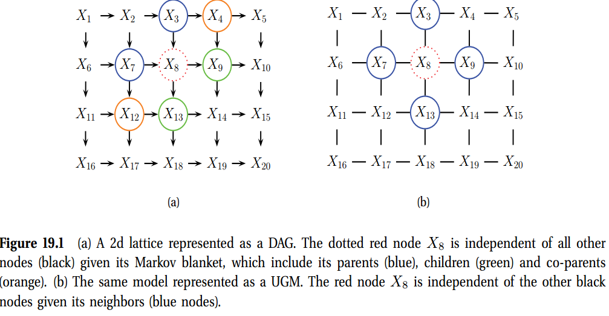
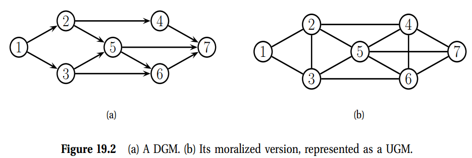
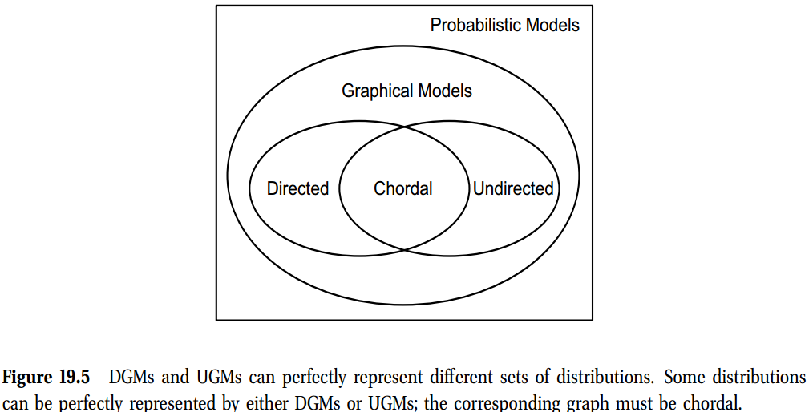
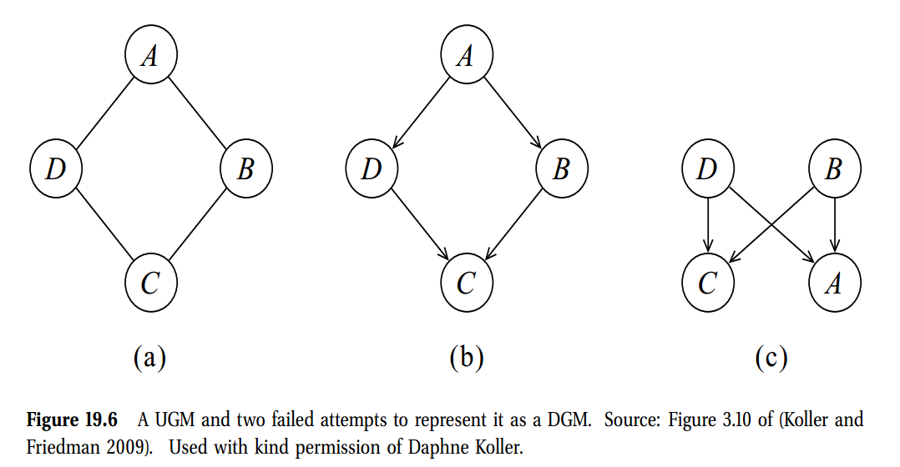
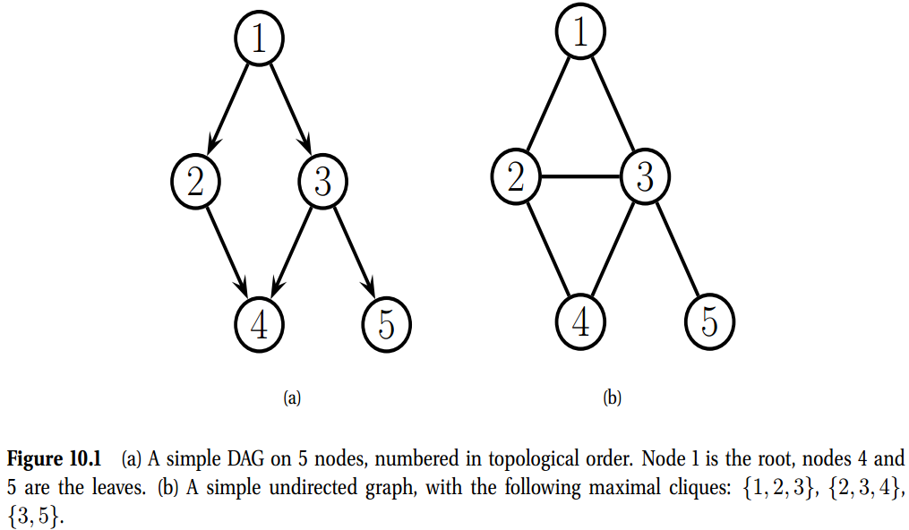
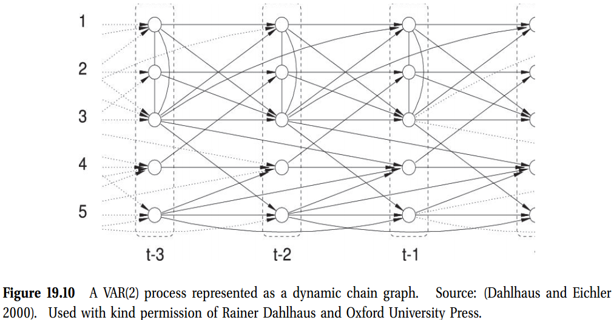
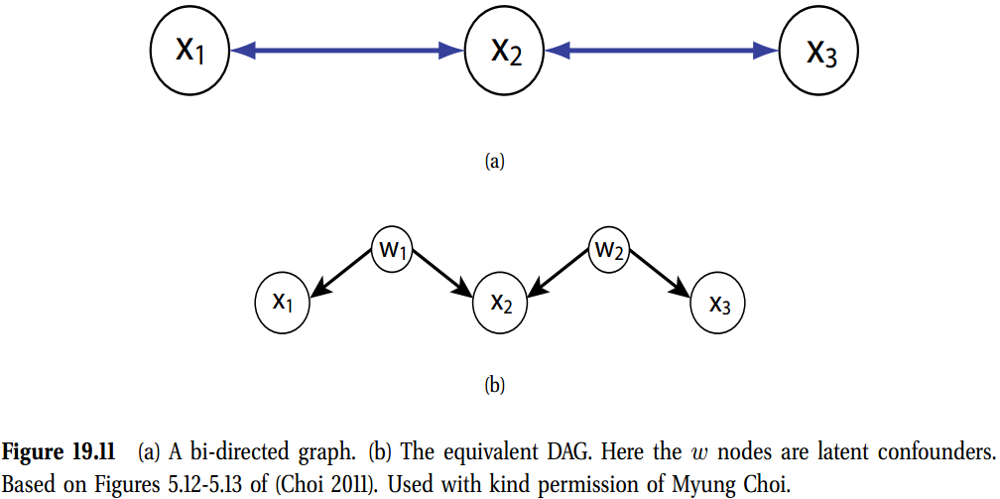
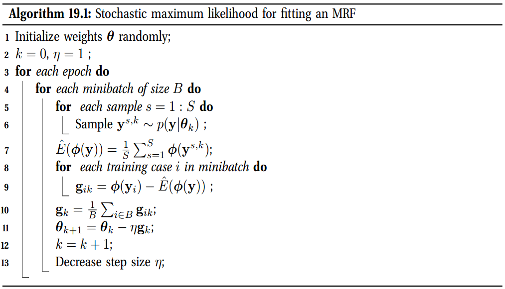
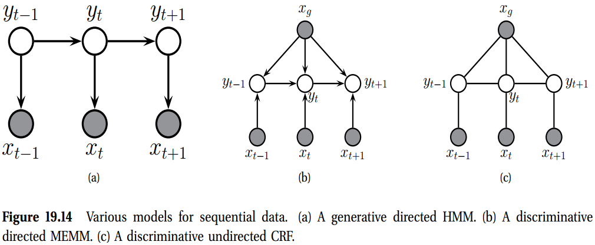

[[toc]]

# 19 无向图模型-马科夫随机场(Undirected graphical models-Markov random fields)

在第10章中，我们讨论了有向图模型($DGMs$)，通常称为Bayes网。然而，对于某些领域，根据$\text{DGM}$的要求，被迫为边缘选择一个方向是相当困难的。例如，考虑为图像建模。我们可以假设相邻像素的强度值是相关的。我们可以创建一个具有2d晶格拓扑的$\text{DGMs}$模型，如图19.1(a)所示。这被称为因果MRF或Markov网格(Abend等人，1965)。然而，它的条件独立性是相当不自然的。特别是，中间的节点X8的Markov毯子(定义见第10.5节)是其他彩色节点(3、4、7、9、12和13)，而不仅仅是它的4个最近的邻居。

另一种选择是使用无向图模型($\text{UGMs}$)，也称为马尔可夫随机场($MRF$)或马尔可夫网络。这不需要我们指定边缘方向，对于一些问题，如图像分析和空间统计，这是更自然的。例如，图19.1(b)中显示了一个无向二维晶格；现在每个节点的马尔可夫包层就是其最近的邻居，如我们在19.2节中所示。

粗略地说，$\text{UGMs}$相对于$\text{DGMs}$的主要优点是:(1)它们是对称的，因此对于某些领域(如空间或关系数据)来说更“自然”；以及(2)区分级UGMs(又称条件随机场，或CRF)定义了$p(y\vert x)$形式的条件密度，因此比判别性的$\text{DGMs}$工作得更好我们在第19.6.1节中解释。与$\text{UGMs}$相比，$\text{UGMs}$的主要缺点是:(1)由于我们在第19.3节中解释的原因，参数的可解释性和模块化程度较低;(2)由于我们在第19.5节中解释的原因，参数估计在计算上更为昂贵。参见(Domke et al.2008)中关于图像处理任务的两种方法的经验比较。

## 19.1 引言(Introduction)

## 19.2 UGMs的条件独立性质(Conditional independence properties of UGMs)

### 19.2.1. 关键性质(Key properties)

$\text{UGMs}$通过图分割定义了CI关系，也就是：对于点集合$A,B$以及$C$，我们说当且仅当在图$G$中$C$分割$A$与$B$时，$\mathbf{x}\bot_{G}\mathbf{x}_B\mathbf{x}_C$。这意味着当我们移除C中所有的点时，没有任何一条路径可以联系$A$中的点与$B$中的点，那么CI性质继续保持。这称为$\text{UGMs}$的全局马尔科夫性质。例如，图19.2(b)中，我们有$\{1,2\} \bot \{6,7\}\vert \{3,4,5\}$

图中所有独立于其他结点的结点的集合称为$t$的马尔科夫毛毯；我们记为$mb(t)$。正式的，马尔科夫毛毯满足如下性质：
$$
t\bot \mathcal{V} \backslash  \text{cl}(t)\vert\text{mb}(t)   \tag{19.1}
$$
其中$\text{cl}(t)\triangleq \text{mb}(t) \cup \{t\}$是结点$t$的闭包。可以证明，在UGM中，一个结点的马尔科夫毯是它的间接邻点。这个称为**无向局部马可夫性质**。

根据局部马可夫性质，我们可以轻易的看到，如果两个结点之间没有直接的边，则两个节点是条件独立的。这个称为逐对马可夫性质。符号方面，可以写为
$$
s\bot t\vert\mathcal{V}\backslash\{s,t\} \Leftrightarrow G_{st}=0 \tag{19.2}
$$
使用我们讨论的3个马可夫性质，我们可以从图19.2(b)中的UGM得到如下的CI性质
- **Pairwise** $1\bot7\vert\text{rest}$.
- **Local** $1\bot\text{rest}\vert2,3$.
- **Global** $1,2\vert6,7\vert3,4,5$

很明显的是，全局马可夫意味着局部马可夫，局部马可夫意味着配对马可夫。不是很明显，但是至少为真的是，配对意味着全局，因此所有的马可夫性质是一样的。

## 19.2.2 d-分离的无方向替代(An undirected alternative to d-separation)

我们看到在UGMs中决定CI关系比在DGMs中更容易，因为我们不用担心边之间的关系。本节中，我们将证明如何使用一个UGM来为一个DGM决定CI关系。

通过简单的丢弃边的方向将DGM转换为一个UGM，但是很明显这是不对的，因为一个v结构$A\rightarrow B \leftarrow C$相比对应的无方向链$A-B-C$有完全不同的CI性质。后一张图错误的指出$A\bot C\vert B$。为了避免不正确的CI状态，我可以在"没有联合"的父母A与C之间添加边，然后丢掉边之间的方向，组成一个完全的连接无向图。这个过程称为**道德化**。图19.2(b)给出了道德化一个更大的例子：我们互连2和3，因为它们有一个公共子级5，而我们互连4、5和6，因为它们有一个公共子级7。

不幸的是，道德化丢失了一些CI信息，因此我们不能使用道德化来决定DGM的CI性质。例如，在图19.2(a)中，使用d-分割，我们看到$4\bot5\vert2$。添加一个道德弧$4-5$将会丢失这个性质。然而，注意到4-5道德边，由于共同的子7，如果我们不观测7或是它的后代，我就不需要它。如果$A\bot B\vert C$，建议使用如下方法来决定。首先，我们相对$U=A\cup B\cup C$形成一个DAG的祖先图。这意味着我们将从G中移除所有不在U中或是不是U的祖先的结点。然后，我们道德化这个图，并对UGMs应用最简单的图分割。例如，在图19.4(a)中，我们使用$\{2,4,5\}$显示图19.2(a)的祖先图。在图19.4(b)中，我们证明了该图的道德化版本。很明显，我们现在正确的得出$4\bot5\vert2$。

## 19.2.3 比较有向图与无向图(Comparing directed and undirected graphical models)

哪个模型更具“表达力”呢，DGM还是UGM？为了描述这个问题，回忆我们说$I(G)\subseteq I(p)$，那么G是一个分布的I-映射。现在定义如果$I(G)= I(p)$，$G$是$p$的一个完美映射，换而言之，图可以表示为分布的所有的CI性质。可以证明，GDMs与UGMs是不同分布集合的完美映射。这种意义下，双方在作为表达语言都没有比对方好到哪里去。

作为CI关系可以被一个DGM完美建模但是不能被一个UGM建模的例子，我们考虑一个v-结构$A\rightarrow C \leftarrow B$。这证明$A\bot B$，且$A \not\perp B\vert C$。如果我们丢弃箭头，我们得到$A-C-B$，证明$A\perp B\vert C$与$A\not\perp B$不是正确的。事实上，UGM无法准确表达所有，只有两个CI描述由一个v-结构编码。总之，在如下情况中，UGMs中的CI性质是渐近的：如果$A\perp B\vert C$，那么$A\perp B\vert (C\cup D)$。但在DGMs中，CI性质可以不是渐进的，因为在额外变量上的条件可以消除条件独立。

作为一个一些CI性质可以被一个UGM完美建模，但是不能被DGM建模的情况，考虑图19.6(a)中的4个圆。尝试使用一个DGM建模这个在图19.6(b)中有所显示。

有些分布可以用DGM或UGM完美地建模；得到的图称为**可分解图**或**弦图**。粗略地说，这意味着如下：如果我们将每个最大集团中的所有变量折叠在一起，形成“巨变量”，则得到的图将是一棵树。当然，如果图已经是树（其中包括链作为特例），它将是弦的。详见第20.4.1节。 

## 19.3 MRFs的参数化(Parameterization of MRFs)

尽管UGM的CI性质是简单的，比DGMs更加自然，展示UGM的联合分布相比DGM就不那么自然了。

### 19.3.1 Hammersley-Cliffordl理论(The Hammersley-Clifford theorem)
因为无向图没有拓扑排序，我们无法使用链式规则来展示$p(\mathbf{y})$。因此，我们没有将CPDs与每个节点相关联，而是将**势函数**或**因子**与图中的每个最大团相关联。我们将团体$c$的势函数记为$\psi_c(\mathbf{y}_c\vert\boldsymbol{\theta_c})$。一个势函数可以是其参数的任意非负函数。联合分布被定义为集体势的乘积。令人惊讶的是，我们可以证明，**任何CI属性可以用UGM表示的正分布都可以用这种方式表示**。我们在下面更正式地陈述这个结果。 

**理论19.3.1(Hammersley-Clifford)** 当且仅当p可以表达为因子乘积时，一个无向图G的一个正分布$p(\mathbf{y})\gt0$满足CI性质，

$$
p(\mathbf{y}\vert\boldsymbol{\theta})=\frac{1}{Z(\boldsymbol{\theta})}\prod_{c\in\mathcal{C}} \psi_c (\mathbf{y}_c\vert \boldsymbol{\theta}_c)       \tag{19.3}
$$
其中$\mathcal{C}$是G中所有的团体的集合，且$Z(\boldsymbol{\theta})$是配分函数，给定
$$
Z(\boldsymbol{\theta})\triangleq \sum_{\mathbf{x}}\prod_{c\in\mathcal{C}}\psi_{c}(\mathbf{y}_c\vert\boldsymbol{\theta}_c)       \tag{19.4}
$$
注意到配分函数保证总体分布加和为1。

例如，考虑图10.1(b)中的MRF。如果p满足这个图的CI性质，那么我们将p写为如下形式
$$
p(\mathbf{y}\vert\boldsymbol{\theta}) = \frac{1}{Z(\boldsymbol{\theta})}  \psi_{123}(y_1,y_2,y_3)  \psi_{234}(y_2,y_3,y_4)  \psi_{35}(y_3,y_5)
$$
其中
$$
Z=\sum_{\mathbf{y}}  \psi_{123}(y_1,y_2,y_3)  \psi_{234}(y_2,y_3,y_4)  \psi_{35}(y_3,y_5)
$$

在UGMs与统计物理之间是有深度联系的。尤其是，有一个模型成为Gibbs采样，可以写为如下形式
$$
p(\mathbf{y}\vert\boldsymbol{\theta}) =\frac{1}{Z(\boldsymbol{\theta})} \exp\left(-\sum_c E(\mathbf{y}_c\vert\boldsymbol{\theta}_c)  \right)     \tag{19.8}
$$
其中$E(\mathbf{y}_c)\gt0$是与团体$c$中的变量相关的能量。我们可以通过定义
$$
\psi_{c}(\mathbf{y}_c\vert\boldsymbol{\theta}_c) = \exp(- E \left(\mathbf{y}_c\vert\boldsymbol{\theta}_c)  \right)     \tag{19.9}
$$
将这个转换为一个UGM。

我们看到高概率描述了对应的低能量结构。这种形式的模型称为基于能量的模型，且在物理与生物化学中经常使用，以及一些机器学习的一些分支中使用。

注意到，我们不需要限制图的边的参数，而是最大的团体。这个称为一个配对RMF。在图10.1(b)中，我们得到
$$
\begin{aligned}
    p(\mathbf{y}\vert\boldsymbol{\theta}) &\propto \psi_{12}(y_1,y_2)\psi_{13}(y_1,y_3)\psi_{23}(y_3,y_2)\psi_{24}(y_4,y_2)\psi_{34}(y_3,y_4)\psi_{35}(y_3,y_5) \\
    & \propto \prod_{s\sim t}\psi_{st}(y_s,y_t)     \tag{19.9-19.10}
\end{aligned}
$$
这个形式经常广泛使用，尽管它不是很通用。

### 19.3.2 表示势能函数(Representing potential functions)

如果变量是离散的，我们可以将势能或能量函数表示为数字的表格，就像我们用cpt一样。然而，这些可能性并不是概率。相反，它们代表了对潜力的不同分配之间的相对“兼容性”。我们将在下面看到一些例子。

一个更加泛型的方法是将对数势能定义为参数的线性函数
$$
\log\psi_c(\mathbf{y}_c) \triangleq \boldsymbol{\phi}_c(\mathbf{y}_c)^T\boldsymbol{\theta}_c            \tag{19.11}
$$
其中$\boldsymbol{\theta}_c(\mathbf{x}_c)$是一个来自变量值$\mathbf{y}_c$得出的一个特征向量$\boldsymbol{\phi}_c(\mathbf{x}_c)$。得到的对数概率的形式
$$
\log p(\mathbf{y}\vert\boldsymbol{\theta}) = \sum_c \boldsymbol{\theta}_c(\mathbf{y}_c)^T\boldsymbol{\theta}_c - Z(\boldsymbol{\theta})     \tag{19.12}
$$
这个称为一个**最大熵**或**对数线性**模型。

例如，考虑一个配对MRF，对于每个边，我们将长度为$K^2$的特征向量关联如下：
$$
\phi_{st}(y_s, y_t) = [\cdots, \mathbb{I}(y_s=j, y_t=k),\cdots] \tag{19.13}
$$
如果对每个特征我们都有一个权重，我们可以将其转化为一个$K\times K$的势能函数，如下
$$
\psi_{st}(y_s=j,y_t=k)=\exp([\boldsymbol{\theta}_{st}^T\boldsymbol{\phi}_{st}]_{jk}) = \exp(\theta_{st}(j,k))        \tag{19.14}
$$
因此，我们看到我们可以使用对数线性形式轻松表示表格势。但是对数线性形式更为通用。

为了了解为什么这样做有用，假设我们对建立英语拼写概率模型感兴趣。由于某些字母组合经常一起出现(例如“ ing”)，因此我们将需要更高阶的因子来捕获这一点。假设我们将自己限制为字母三字母组。表格电位中仍有263 = 17、576个参数。但是，大多数这些三元组将永远不会发生。

另一种方法是定义寻找特点“特定”三元组的指示函数，例如"ing","qu-"等等。那么，我们可以定义每个trigram的势能如下：
$$
\psi(y_{t-1},y_t, y_{t+1}) = \exp\left(\sum_{k} \theta_k \phi_k (y_{t-1},y_t, y_{t+1}) \right)      \tag{19.15}
$$
其中$k$索引了不同的特征，对应于"ing","qu-"等等，且$\phi$是对应的二元**特征函数**。

## 19.4 MRFs的例子(Examples of MRFs)

本节中，我们展示几个常用的概率图模型，可以非常方便的转换为UGMs。

### 19.4.4 高斯MRFs(Gaussian MRFs)

一个无向GGM，也称为一个**GaussianMRF**，是一个配对MRF，形式如下：
$$
\begin{aligned}
    p(\mathbf{y}\vert \boldsymbol{\theta}) & \propto \prod_{s\sim t} \psi_{st}(y_s, y_t)\prod_t \psi_{t}(y_t)  \\
    \psi_{st}(y_s, y_t) &= \exp \left( -\frac{1}{2}y_s \Lambda_{st} y_t  \right) \\
    \psi_{t}(y_t) &= \exp \left( -\frac{1}{2} \Lambda_{tt} y_t^2 + \eta_t y_t \right)
\end{aligned}
$$
联合分布可以写为如下:
$$
 p(\mathbf{y}\vert \boldsymbol{\theta})  \propto \exp[\boldsymbol{\eta}^T\mathbf{y} - \frac{1}{2}\mathbf{y}^T\mathbf{\Lambda}\mathbf{y}]        \tag{19.27}
$$
我们认识到这是一个**信息形式**(information form)的多元高斯，其中$\mathbf{\Lambda=\Sigma^{-1}}$与$\boldsymbol{\eta}=\mathbf{\Lambda}\boldsymbol{\mu}$。

如果$\Lambda_{st}=0$，那么没有联结$s$与$t$的配对项，所以根据分解理论，我得到
$$
y_s \perp y_t \vert \mathbf{y}_{-(st)} \Leftrightarrow  \Lambda_{st}=0  \tag{19.28}
$$

$\mathbf{\Lambda}$中的零元素称为结构化零，因为它们代表了图中的绝对边界。那么，无向GGMs对应稀疏决策矩阵。

#### 19.4.4.1 Comparing Gaussian DGMs and UGMs *
在10.2.5节中，我们看到有向GGMs对应与稀疏回归矩阵，因此协方差矩阵的稀疏Cholesky分解，无向图GGMs对应于稀疏决策矩阵。DAG公式的优势是我们可以使得回归权重$\mathbf{W}$因此$\mathbf{\Sigma}$以协变量信息为条件，而不用担心正定约束。DAG的缺点是其对于顺序的依赖，尽管在某些领域(例如时间序列)中，变量已经具有自然顺序。

实际上，可以组合两种表示，得到一个高斯链图。例如，考虑一个离散、二阶马科夫链，其中状态是连续的$\mathbf{y}_t\in\mathbb{R}^D$。转移函数可以表示为一个线性高斯CPD:
$$
p(\mathbf{y}_t \vert \mathbf{y}_{t-1}, \mathbf{y}_{t-2}, \boldsymbol{\theta}) = \mathcal{N}(\mathbf{y}_t \vert \mathbf{A}_1\mathbf{y}_{t-1} + \mathbf{A}_2 \mathbf{y}_{t-2}, \mathbf{\Sigma} )      \tag{19.29}
$$
称为二阶的**向量自回归**(vector auto-regressive或AVR)过程。这种模型在计量经济学中的时间预测中经常使用。

时间序列方面最常用的模型是使用DGM。然而，如果$\mathbf{\Sigma}^{-1}$是稀疏的，那么在一个时间缩放内的成分之间的相关性自然可以使用UGM建模。例如，假设我们有
$$
\begin{aligned}
    \mathbf{A}_1 = \begin{pmatrix}
        \frac{3}{5} & 0 & \frac{1}{5} & 0 & 0 \\
        0 & \frac{3}{5} & 0 & -\frac{1}{5} & 0 \\
        \frac{2}{5} & \frac{1}{3} & \frac{3}{5} & 0 & 0 \\
        0 & 0 & 0 & -\frac{1}{2} & \frac{1}{5}  \\
        0 & 0 & \frac{1}{5} & 0 & \frac{2}{5}
    \end{pmatrix}, 
    \mathbf{A}_2 = \begin{pmatrix}
        0 & 0 & -\frac{1}{5} & 0 & 0 \\
        0 & 0 & 0 & 0 & 0 \\
        0 & 0 & 0 & 0 & 0 \\
        0 & 0 & \frac{1}{5} & 0 & \frac{1}{3}  \\
        0 & 0 & 0 & 0 & -\frac{1}{5}
    \end{pmatrix}
\end{aligned} \tag{19.30}
$$
且
$$
\begin{aligned}
    \mathbf{\Sigma} = \begin{pmatrix}
        1 & \frac{1}{2} & \frac{1}{3} & 0 & 0 \\
        \frac{1}{2} & 1 & -\frac{1}{3} & 0 & 0 \\
        \frac{1}{3} & -\frac{1}{3} & 1 & 0 & 0 \\
        0 & 0 & 0 & 1 & 0  \\
        0 & 0 & 0 & 0 & 1
    \end{pmatrix}, 
    \mathbf{\Sigma}^{-1} = \begin{pmatrix}
        2.13 & -1.47 & -1.2 & 0 & 0 \\
        -1.47 & 2.13 & 1.2 & 0 & 0 \\
        -1.2 & 1.2 & 1.8 & 0 & 0 \\
        0 & 0 & 0 & 1 & 0  \\
        0 & 0 & 0 & 0 & 1
    \end{pmatrix}
\end{aligned} \tag{19.31}
$$

得到的图模型解释在图19.10。转移矩阵$\mathbf{A}_1$与$\mathbf{A}_2$中的零元素对应于从$\mathbf{y}_{t-1}$与$\mathbf{y}_{t-2}$到$\mathbf{y}_t$的不存在的有向弧。决策矩阵$\mathbf{\Sigma}^{-1}$中的零元素对应与$\mathbf{y}_t$中的节点之间不存在无向弧。

有时，我们有一个稀疏协方差矩阵，而不是一个稀疏决策矩阵。这个可以使用一个双向图展示，其中每个边在双边都有箭头，如图19.11(a)中所展示的。这里没有联结的点是无条件独立的。例如在19.11(a)中我们看到$Y_1\perp Y_3$。在高斯情况中，这意味着$\Sigma_{1,2} = \Sigma_{3,1}=0$。一个图表示一个稀疏协方差矩阵，称为一个协方差图。相反，如果这是一个无向模型，我们将有$Y_1\perp Y_3\vert Y_2$，且$\Lambda_{1,3}=\Lambda_{3,1}=0$，其中$\mathbf{\Lambda}=\mathbf{\Sigma}^{-1}$。

一个双向图可以转换为一个有隐变量的DAG，其中每个双向边界用一个隐变量替换，代表一个隐藏的常见原因或混杂因素，如图19.11（b）所示。相关的CI性质可以使用d-分离确定。

我们可以组合双向与有向边界得到一个**方向混合图模型**。该模型对于表示大量模型是很有用的，例如**ARMA模型**，结构化方程模型，等等。

## 19.5 学习(Learning)

本节中，我们将讨论如何为MRFs执行一个ML或一个MAP参数估计。我们将看到该方法的计算成本是非常高的。出于这个原因，很少为MRFs的参数执行贝叶斯推断。

### 19.5.1 使用梯度方法训练maxnet模型(Training maxent models using gradient methods)

考虑一个对数线性形式的MRF:
$$
p(\mathbf{y}\vert \boldsymbol{\theta}) = \frac{1}{Z(\boldsymbol{\theta})} \exp \left(  \sum_{c} \boldsymbol{\theta}_c^T \boldsymbol{\phi}_c(\mathbf{y})  \right)        \tag{19.37}
$$
其中$c$索引团(cliques)。缩放的对数似然给定为
$$
\ell(\boldsymbol{\theta}) \triangleq \frac{1}{N} \sum_{i} \log p(\mathbf{y}_i \vert \boldsymbol{\theta}) = \frac{1}{N}  \sum_i \left[ \sum_c \boldsymbol{\theta}_c^T \boldsymbol{\phi}_c(\mathbf{y}_i) - \log Z(\boldsymbol{\theta})    \right]\tag{19.38}
$$
因为MRFs属于指数族，我们知道这个函数关于$\boldsymbol{\theta}$是凸的，所以我们可以使用基于梯度优化器找到唯一的全局最大值。特殊的是，一个特定团$c$的权重的导数给定为
$$
\frac{\partial \ell}{\partial \boldsymbol{\theta}_c} = \frac{1}{N}\sum_{i} \left[ \boldsymbol{\phi}_c(\mathbf{y}_i) - \frac{\partial}{\partial \boldsymbol{\theta}_c} \log Z(\boldsymbol{\theta})   \right]   \tag{19.39}
$$
对数分割函数相对$\boldsymbol{\theta}_c$的导数是模型下第$c$个特征的期望
$$
 \frac{\partial \log Z(\boldsymbol{\theta})}{\partial \boldsymbol{\theta}_c} = \mathbb{E}[\boldsymbol{\phi}_c(\mathbf{y}) \vert \boldsymbol{\theta}] = \sum_{\mathbf{y}} \boldsymbol{\phi}_c (\mathbf{y}) p(\mathbf{y}\vert \boldsymbol{\theta}) \tag{19.40}
$$
因此，对数似然的梯度为
$$
\frac{\partial \ell}{\partial \boldsymbol{\theta}_c} = \left[ \frac{1}{N} \boldsymbol{\phi}_c(\mathbf{y}_i) \right] - \mathbb{E}[\boldsymbol{\phi}_c(\mathbf{y}) ] \tag{19.41} 
$$
在第一项中，我们将$\mathbf{y}$拟合到其观测值；有时称为**钳制项**。第二项，$\mathbf{y}$是自由的；有时称为**松散项**或**对比项**。注意到，计算松散项需要模型中的推断，且在梯度步之前完成。这使得UGM训练比DGM训练更加缓慢。

根据经验分布减去模型的特征向量期望，对数似然的梯度可以重写为期望特征向量：
$$
\frac{\partial \ell}{\partial \boldsymbol{\theta}_c} =  \mathbb{E}_{p_{\text{emp}}}[\boldsymbol{\phi}_c(\mathbf{y})] - \mathbb{E}_{p(\cdot\vert\boldsymbol{\theta})}[\boldsymbol{\phi}_c(\mathbf{y})] \tag{19.42} 
$$
在最优点处，梯度为0，所以特征的经验分布将会匹配模型的预测：
$$
\mathbb{E}_{p_{\text{emp}}}[\boldsymbol{\phi}_c(\mathbf{y})] = \mathbb{E}_{p(\cdot\vert\boldsymbol{\theta})}[\boldsymbol{\phi}_c(\mathbf{y})] \tag{19.42} 
$$
这称为**阶矩匹配**。这一观察结果激发了我们在第19.5.7节中讨论的不同优化算法。

### 19.5.2 训练部分可观测的maxnet模型(Training partially observed maxent models)

假设我们的模型中有确实或/以及隐变量。总之，我们可以将模型表示为如下：
$$
p(\mathbf{y,h}\vert \boldsymbol{\theta}) = \frac{1}{Z(\boldsymbol{\theta})}\exp
 \left( \sum_c \boldsymbol{\theta}_c^T \boldsymbol{\phi}_c (\mathbf{h,y}) \right)
 \tag{19.44}
$$
对数似然形式为
$$
\ell(\boldsymbol{\theta}) = \frac{1}{N}\sum_i \log \left(\sum_{\mathbf{h}_i}p(\mathbf{y}_i, \mathbf{h}_i\vert \boldsymbol{\theta})   \right) = \frac{1}{N} \sum_{i} \log \left( \frac{1}{Z(\boldsymbol{\theta})} \sum_{\mathbf{h}_i}\tilde{p}(\mathbf{y}_i, \mathbf{h}_i\vert \boldsymbol{\theta})   \right)  \tag{19.45}
$$
其中
$$
\tilde{p}(\mathbf{y}, \mathbf{h}\vert \boldsymbol{\theta}) \triangleq \exp \left( \sum_c \boldsymbol{\theta}_c^T \boldsymbol{\phi}_c (\mathbf{h,y}) \right)  \tag{19.46}
$$
是未归一化的分布。对于整个模型，$\sum_{\mathbf{h}_i}\tilde{p}(\mathbf{y}_i, \mathbf{h}_i\vert \boldsymbol{\theta})$项与分割函数一样，除了$\mathbf{y}$固定在$\mathbf{y}_i$。因此，梯度指示期望特征，其中我们固定$\mathbf{y}_i$，但是在$\mathbf{h}$之上求平均：
$$
\frac{\partial}{\partial \boldsymbol{\theta}_c}\log \left( \sum_{\mathbf{h}_i}\tilde{p}(\mathbf{y}_i, \mathbf{h}_i\vert \boldsymbol{\theta})   \right) = \mathbb{E}[\boldsymbol{\phi}_c (\mathbf{h}, \mathbf{y}_i\vert\boldsymbol{\theta})]     \tag{19.47}
$$ 
所以总体梯度为
$$
\frac{\partial\ell}{\partial \boldsymbol{\theta}_c} = \frac{1}{N}\sum_i \left\{ \mathbb{E}[\boldsymbol{\phi}_c (\mathbf{h}, \mathbf{y}_i\vert\boldsymbol{\theta})] - \mathbb{E}[\boldsymbol{\phi}_c (\mathbf{h}, \mathbf{y} \vert\boldsymbol{\theta})]       \right\}  \tag{19.48}
$$
第一组期望值是通过将可见节点“钳制”到它们的观测值来计算的，第二组期望值是通过让可见节点自由来计算的。两种情况下，我们边缘化$\mathbf{h}_i$。

另一种方法是使用广义EM，其中我们在M步使用梯度方法。

### 19.5.3 计算MRFs的MLEs的近似方法(Approximate methods for computing the MLEs of MRFs)
当拟合一个UGM时，对于参数的ML与MAP估计并没有闭形解，所以需要使用基于梯度的优化器。这个梯度需要推断。在推理困难的模型中，学习也变得困难。这激发了各种计算速度更快的替代ML/MAP估计的方法，我们在表19.1中列出了这些方法。我们将在下面讨论其中一些备选方案，并将其他方案推迟到后面的章节。
### 19.5.4 伪似然(Pseudo likelihood)
MLE的另一种替代是最大化伪似然，定义如下：
$$
\ell_{PL}(\boldsymbol{\theta}) \triangleq \sum_{\mathbf{y}} \sum_{d=1}^D p_{\text{emp}}(\mathbf{y} \log p(y_d\vert \mathbf{y}_{-d})) = \frac{1}{N} \sum_{i=1}^N \sum_{y=1}^D  \log p(y_{id}\vert \mathbf{y}_{i,-d},\boldsymbol{\theta})        \tag{19.49}
$$
我们优化完全条件的乘积，也称为复合似然，对比这个与最大似然的目标：
$$
\ell_{ML}(\boldsymbol{\theta})  = \sum_{\mathbf{y,x}}p_{\text{emp}} (\mathbf{y} \log p(\mathbf{y}\vert \boldsymbol{\theta})) = \sum_{i=1}^N \log  p(\mathbf{y}_i \vert \boldsymbol{\theta})   \tag{19.50}
$$

| Method                      | Restriction                   | Exact MLE?             | Section                      |
| --------------------------- | ----------------------------- | ---------------------- | ---------------------------- |
| Closed form                 | Only Chordal MRF              | Exact                  | Section 19.5.7.4             |
| IPF                         | Only Tabular / Gaussian MRF   | Exact                  | Section 19.5.7               |
| Gradient-based optimization | Low tree width                | Exact                  | Section 19.5.1               |
| Max-margin training         | Only CRFs                     | N/A                    | Section 19.7                 |
| Pseudo-likelihood           | No hidden variables           | Approximate            | Section 19.5.4               |
| Stochastic ML               | -                             | Exact (up to MC error) | Section 19.5.5               |
| Contrastive divergence      | -                             | Approximate            | Section 27.7.2.4             |
| Minimum probability flow    | Can integrate out the hiddens | Approximate            | Sohl-Dickstein et al. (2011) |

就高斯MRF而言，PL与ML等效(Besag 1975)，但一般情况并非如此。

### 19.5.5 随机最大似然(Stochastic maximum likelihood)

回忆一个完全观测的MRF的对数似然的梯度给定为
$$
\nabla_{\boldsymbol{\theta}} \ell(\boldsymbol{\theta}) = \frac{1}{N}\sum_i [\boldsymbol{\phi}(\mathbf{y}_i) - \mathbb{E}[\boldsymbol{\phi}(\mathbf{y})]]        \tag{19.51}
$$
对于部分可观测的MRF梯度也是一样的。两种情况下，我们可以使用蒙特卡洛采样近似模型期望。我们可以将这个与随机梯度下降组合，从经验分布进行采样。伪代码如下：

一般，我们使用MCMC产生采样。当然，在内部循环的每个步骤上运行MCMC进行收敛都将非常慢。幸运的是，在(Younes1989)中证明了，我们可以按其先前的值启动MCMC链，只需采取一些步骤即可。换而言之，我们可以在$\mathbf{y}_{s,k-1}$通过初始化MCMC链采样$\mathbf{y}_{s,k}$，如何运行少量迭代。因为$p(\mathbf{y}\vert \boldsymbol{\theta}^k)$接近$p(\mathbf{y}\vert \boldsymbol{\theta}^{k-1})$，因为我们只更改了少量参数。我们称这种算法是随机最大似然。

## 19.6 条件随机场(Conditional random fields(CRFs))
一个**条件随机场(CRF)**，有时一个判别随机场只是一个MRF的版本，其中所有的团势均取决于输入要素：
$$
p(\mathbf{y}\vert \mathbf{x,w}) = \frac{1}{Z(\mathbf{x,w})} \prod_{c} \psi_c (\mathbf{y}_c \vert \mathbf{x,w})  \tag{19.63}
$$

**CRF**可以被看作是一个logistic回归的**结构化输出**版本的。我们通常假设一个势能的线性对数为
$$
\psi_c (\mathbf{y}_c \vert \mathbf{x, w}) = \exp (\mathbf{w}_c \phi(\mathbf{x}, \mathbf{y}_c ))     \tag{19.64}
$$
其中$\boldsymbol{\phi}(\mathbf{x,y}_c)$是一个来源于全局输入$\mathbf{x}$与标签的局部集合$\mathbf{y}_c$的特征向量。我们将给出一些例子，使得这个符号更加清晰。

CRF优于MRF的优势类似于判别式分类器优于生成式分类器的优势，也就是，我们不需要“浪费资源”来建模我们经常观察的事物。相反，我们可以将注意力集中在对我们关心的事情建模上，即给定数据的标签分布。

CRF的另一个重要优势是，我们可以使模型潜力(或因子)称为数据依赖。例如，在图像处理过程中，如果在像素$s$和$t$之间观察到图像强度不连续，我们可以“关闭”两个相邻节点$s$和$t$之间的标签平滑处理。类似的，在自然语言处理中，我们可以使隐变量依赖于语句的全局性质，例如写入的语句。**很难将全局性质插入生成模型**。

CRF相对MRF的缺点是其需要标注全局训练数据，且它们训练很慢，如我们在19.6.3中解释的。**这类似于第8.6节中讨论的逻辑回归与朴素贝叶斯的优缺点**。

### 19.6.1 链式结构的CRFs, MEMMs以及标签偏差问题(Chain-structured CRFs, MEMMs and the label-bias problem)
最常用的CRF类型是使用一个链式结构化图来建模临近标签之间的相关性。这种模型对于许多序列标签任务很有用。

传统上，HHMs已经用于此任务。这些是形式如下的联合密度模型：
$$
p(\mathbf{x,y}\vert\mathbf{w}) = \prod_{t=1}^T p(y_t \vert y_{t-1}, \mathbf{w})      p(\mathbf{x}_t \vert y_{t-1}, \mathbf{w})  \tag{19.65}
$$
出于简化，我们已经丢弃了初始值$p(y_1)$项。看图19.14(a)。如果，我们对所有的$t$观测到$\mathbf{x}_t,y_t$，很容易训练这种模型，技术在17.5.1节中有所描述。

HHM需要具体化一个生成观测模型$p(\mathbf{x}_t\vert y_t ,\mathbf{w})$，其是可以不同的。而且，每个$\mathbf{x}_t$需要是局部的，因为其很难对于整个观测流$\mathbf{x}=\mathbf{x}_{1:T}$定义一个生成模型。

生成HHM的一个判别版本的明显方式是翻转从$\mathbf{x}_t$到$y_t$的箭头，如图19.14(b)。定义了一个有向判别模型
$$
p(\mathbf{x,y}\vert\mathbf{w}) = \prod_{t=1}^T p(y_t \vert y_{t-1}, \mathbf{w})  \tag{19.66}
$$
其中$\mathbf{x} = (\mathbf{x}_{1:T}, \mathbf{x}_g)$是全局特征，且$\mathbf{x}_t$是具体节点$t$的特征。(不必将此分区分为本地和全局，但与HMM相比有帮助。)这个称为一个**最大熵马科夫模型(maximum entrpy Markov model-MEMM)**。

一个MEMM是一个简单的马科夫链，其中**状态转移概率是以输入特征为条件**。(因此，这是输入输出HMM的特例，如第17.6.3节所述。)这似乎是逻辑回归到结构化输出设置的自然概括，但是它遭受了一个微妙的问题(而不是模糊地)，称为标签偏差问题(Lafferty等人，2001)。问题在于，时间$t$的局部特征不会影响时间$t$之前的状态。接下来是检查DAG，它显示$x_t$被$y_t$的v-结构与$y_{t-1}$(以及所有更早的时间点)d分离，这是一个隐藏的子级，从而阻止了信息流。

为了了解实际中这个意思，考虑语音部分(POS)标记任务。假设我们看到“银行”一词；这可以是动词(如“他在BoA的河岸”)或名词(如“河岸满溢”)。在本地，该单词的POS标签不明确。但是，假设在句子的后面，我们看到“钓鱼”一词；这为我们提供了足够的背景来推断“banks”是“河岸”。但是，在MEMM中(不同于HMM和CRF)，“捕鱼”证据不会倒退，因此我们将无法消除“银行”的歧义。

我们性质考虑一个链式结构CRF。模型形式为：
$$
p(\mathbf{x,y}\vert\mathbf{w}) = \frac{1}{Z(\mathbf{x,w})} \prod_{t=1}^T \psi(y_t \vert \mathbf{x}, \mathbf{w})   \prod_{t=1}^{T-1} \psi(y_t,y_{t+1}  \vert \mathbf{x}, \mathbf{w})   \tag{19.67}
$$
从图19.14(c)中，我们可以看到标签偏差问题不再存在，因为$y_t$不再阻止从$\mathbf{x}_t$到其他点$y_{t^{\prime}}$的信息。

之所以会发生MEMM中的标签偏差问题，是因为有向模型是**局部归一化**的，这意味着每个CPD的总和为1。相比之下，MRF和CRF都是**全局归一化**的，这意味着局部因子不需要求和为1，因为partition函数$Z$对所有节点结构求和，将确保模型定义有效的分布。但是，这种解决方案需要付出一定的代价:在看到整个句子之前，我们无法获得$\mathbf{y}$上的有效概率分布，因为只有那样我们才能对所有配置进行归一化。因此，CRF对于在线或实时推理不如DGM(区分或生成)有用。此外，$Z$依赖于所有节点以及所有参数，**这一事实使得CRF的训练要比DGM慢得多**，正如我们在19.6.3节中所看到的。

### 19.6.3 CRF训练(CRF training)

我们可以直接将19.5.1节中描述的基于梯度的MRF优化修改为CRF情况。尤其是，缩放对数似然变为
$$
\ell(\mathbf{x}) \triangleq \frac{1}{N}\sum_i \log p(\mathbf{y}_i\vert \mathbf{x}_i, \mathbf{w}) = \frac{1}{N} \sum_i \left[ \sum_c \mathbf{w}_c^T\boldsymbol{\phi}_c(\mathbf{y}_i, \mathbf{x}_i) - \log Z(\mathbf{w,x}_i) \right]     \tag{19.71}
$$
梯度为
$$
\begin{aligned}
    \frac{\partial\ell}{\partial \mathbf{w}_i}  &= \frac{1}{N} \left[  \boldsymbol{\phi}_c(\mathbf{y}_i, \mathbf{x}_i) - \frac{\partial}{\partial \mathbf{w}_i} \log Z(\mathbf{w,x}_i) \right] \\
    &= \frac{1}{N} \left[  \boldsymbol{\phi}_c(\mathbf{y}_i, \mathbf{x}_i) - \mathbb{E}[\boldsymbol{\phi}_c(\mathbf{y}_i, \mathbf{x}_i)] \right]  
\end{aligned}\tag{19.72-73}
$$
注意到，我们现在在每个梯度步内为每个单个训练情况执行推断，其时间比MRF情况慢$O(N)$。这是因为partition函数依赖于输入$\mathbf{x}_i$。

在多达数CRFs的应用中，图结构的大小会变化。因此，我们需要使用**参数绑定**来确保我们可以定义任意大小的分布。在配对情况下，我们可以将模型写为如下：
$$
p(\mathbf{y}\vert \mathbf{x}, \mathbf{w}) = \frac{1}{Z(\mathbf{w}, \mathbf{x})} \exp(\mathbf{w}^T\boldsymbol{\phi}(\mathbf{y}, \mathbf{x}) )        \tag{19.74}
$$
其中$\mathbf{w}=[\mathbf{w}_n, \mathbf{w}_e]$是节点与边参数，且
$$
\boldsymbol{\phi}(\mathbf{y}, \mathbf{x}) \triangleq \left[  \sum_t \boldsymbol{\phi}_t (y_t, \mathbf{x}), \sum_{s\sim t}\boldsymbol{\phi}_{st} (y_t, y_s, \mathbf{x})   \right]            \tag{19.75}
$$
是加和点与边特征(这是充分统计)。可以轻松修改渐变表达式以处理这种情况。

实际中，使用一个先验/正则化来阻止拟合是很重要的。如果我们使用一个高斯先验，新的目标函数变为
$$
\ell^{\prime}(\mathbf{w}) \triangleq  \frac{1}{N} \sum_i \log p (\mathbf{y}_i \vert \mathbf{x}_i , \mathbf{w}) - \lambda \lVert \mathbf{w} \rVert^2_2   \tag{19.76}
$$
很容易修改梯度表达式。

另外，我们可以使用$\ell_1$正则化。例如，我们可以为每个边权重$\mathbf{w}_e$使用$\ell_1$正则化来学习一个稀疏图结构，为每个节点权重$\mathbf{w}_n$使用$\ell_2$。换而言之，目标变为
$$
\ell^{\prime}(\mathbf{w}) \triangleq  \frac{1}{N} \sum_i \log p (\mathbf{y}_i \vert \mathbf{x}_i , \mathbf{w}) - \lambda_1 \lVert \mathbf{w}_e \rVert_1  - \lambda_2 \lVert \mathbf{w}_n \rVert^2_2   \tag{19.77}
$$
不幸的是，当使用$\ell_1$时，虽然问题仍然是凸的，但是优化问题会更加问题。

为了处理大量数据集，我们可以使用随机梯度下降，如8.5.2中所示。

可以(并且有用)用隐藏变量定义CRFs，例如允许在**可见特征-visible features**和**隐藏标签-hidden labels**之间进行未知对齐(例如参见(Schnitzspan et al. 2010))。**在这种情况下，目标函数不再是凸的。但是，我们可以使用EM和/或梯度方法找到局部最优的ML或MAP参数估计。**