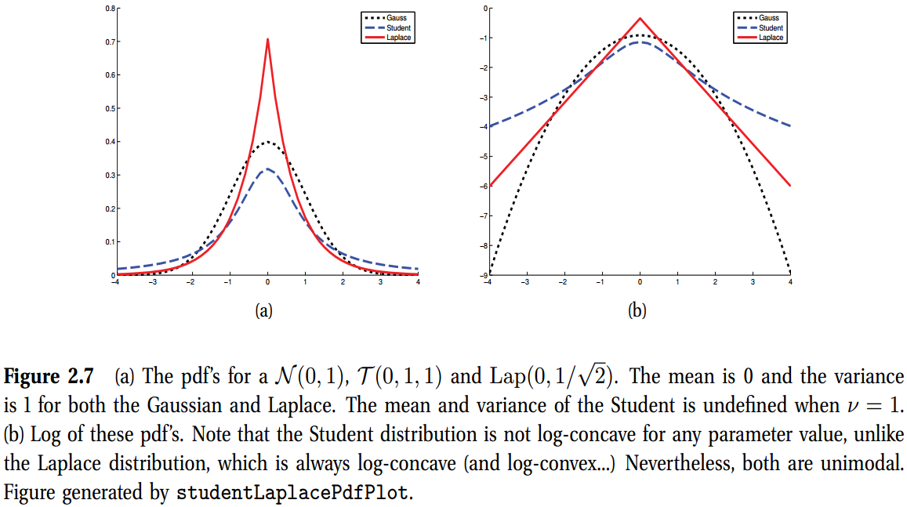
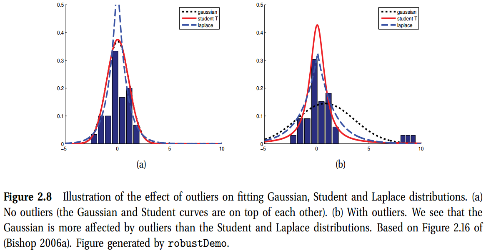
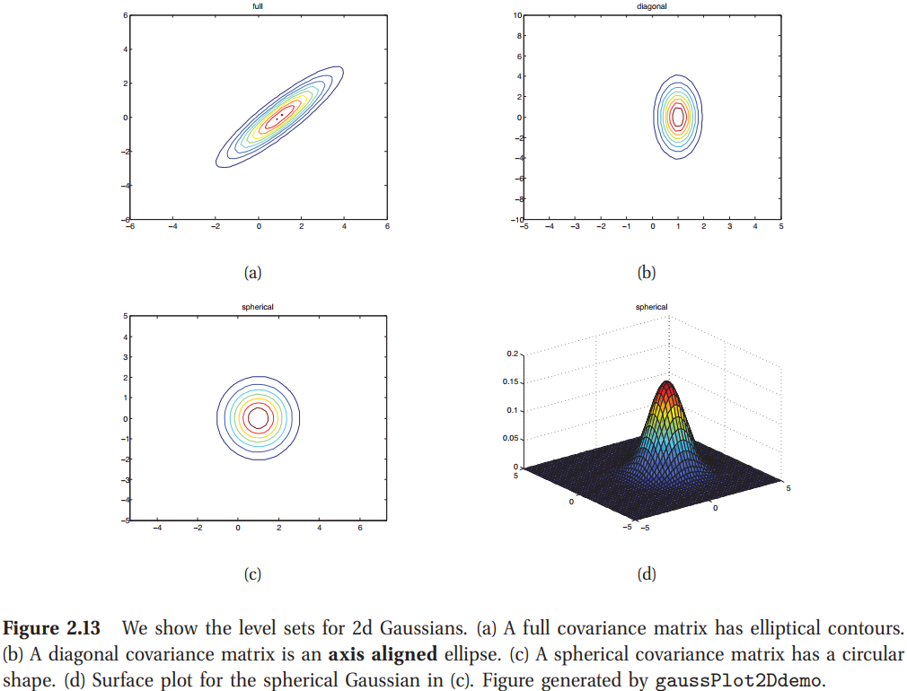
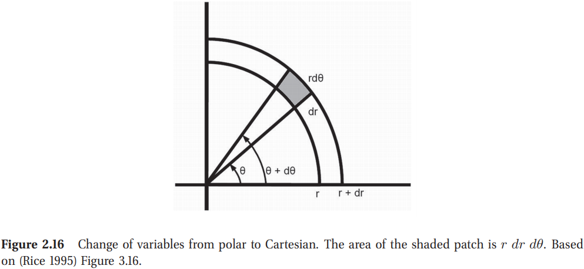
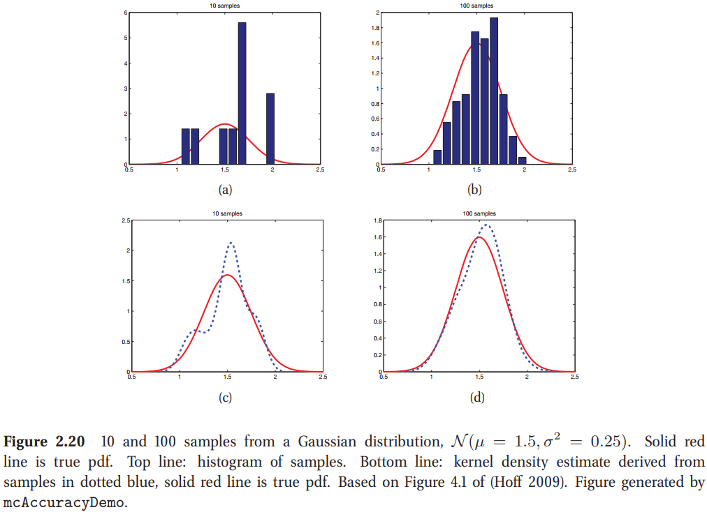
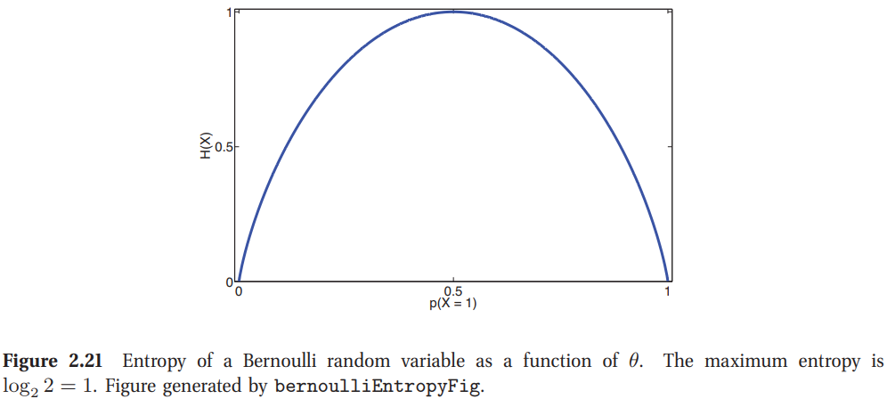

<!-- TOC -->

- [Chap 2 概率(Probability)](#chap-2-概率probability)
  - [2.4 Some common continuous distributions(一些常见的连续分布)](#24-some-common-continuous-distributions一些常见的连续分布)
    - [2.4.1 Gaussian (normal) distribution](#241-gaussian-normal-distribution)
    - [2.4.2 Degenerate pdf](#242-degenerate-pdf)
    - [2.4.3 The Laplace distribution](#243-the-laplace-distribution)
    - [2.4.4 The gamma distribution](#244-the-gamma-distribution)
    - [2.4.5 The beta distribution](#245-the-beta-distribution)
    - [2.4.4 The gamma distribution](#244-the-gamma-distribution-1)
  - [2.5 联合概率分布(Joint probability distributions)](#25-联合概率分布joint-probability-distributions)
    - [2.5.1 协方差与相关性(Covariance and correlation)](#251-协方差与相关性covariance-and-correlation)
    - [2.5.2 多元高斯(The multivariate Gaussian)](#252-多元高斯the-multivariate-gaussian)
    - [2.5.3 多元学生t分布(Multivariate Student t distribution)](#253-多元学生t分布multivariate-student-t-distribution)
    - [2.5.4 Dirichlet distribution](#254-dirichlet-distribution)
  - [2.6 随机变量的转换(Transformations of random variables)](#26-随机变量的转换transformations-of-random-variables)
    - [2.6.1 线性变换(Linear transformations)](#261-线性变换linear-transformations)
    - [2.6.2 广义变换(General transformations)](#262-广义变换general-transformations)
    - [2.6.2.1 变量的多元变换(Multivariate change of variables*)](#2621-变量的多元变换multivariate-change-of-variables)
  - [2.7 蒙特卡洛近似(Monte Carlo approximation)](#27-蒙特卡洛近似monte-carlo-approximation)
    - [2.7.3 Accuracy of Monte Carlo approximation](#273-accuracy-of-monte-carlo-approximation)
  - [2.8 Information theory](#28-information-theory)
    - [2.8.1 Entropy](#281-entropy)
    - [2.8.2 KL divergence](#282-kl-divergence)

<!-- /TOC -->

# Chap 2 概率(Probability)

## 2.4 Some common continuous distributions(一些常见的连续分布)

本节中，我们展示一些常见的单元连续概率分布。

### 2.4.1 Gaussian (normal) distribution

统计学与机器学习中最常用的分布是高斯或正态分布。其pdf给定为
$$
\mathcal{N}(x\vert\mu,\sigma^2) \triangleq \frac{1}{\sqrt{2\pi\sigma^2}}e ^{-\frac{1}{2\sigma^2}(x-\mu)^2}      \tag{2.43}
$$
因此$\mu=\mathbb{E}[X]$是均值(以及众数)，$\sigma^2=\text{var}[X]$是方差。$\sqrt{2\pi\sigma^2}$是归一化常数，保证密度积分为1。

我们用$X\sim\mathcal{N}(\mu,\sigma^2)$表示$p(X=x)=\mathcal{N}(x\vert\mu,\sigma^2)$。如果$X\sim\mathcal{N}(0,1)$，我们说$X$服从标准正态分布。

我们经常说到高斯的精确度，意味着方差的逆：$\lambda=1/\sigma^2$。一个高精度意味着以$\mu$为中心更窄的分布。

注意到，因为这是一个pdf，我们可以有$p(x)\gt1$。为了了解这个，我们考虑评估在其中心$x=\mu$的密度。我们有$\mathcal{N}(\mu\vert\mu,\sigma^2)=(\sigma\sqrt{2\pi})^{-1}e^0$，所以如果$\sigma\lt 1/\sqrt{2\pi}$，我们有$p(x)\gt1$。

高斯的累积分布函数或cdf定义为
$$
\Phi(x;\mu,\sigma^2)\triangleq\int_{-\infty}^x \mathcal{N}(z\vert\mu,\sigma^2)dz     \tag{2.44}
$$

特别是，我们可以根据**误差函数(erf)** 进行计算：
$$
\Phi(x;\mu,\sigma)=\frac{1}{2}[1+\text{erf}(z/\sqrt{2})]        \tag{2.45}
$$
其中$z(x-\mu)/\sigma$且
$$
\text{erf}(x)\triangleq\frac{2}{\sqrt{\pi}}\int_0^xe^{-t^2}dt
$$
高斯分布是统计中使用最广泛的分布。有几个原因。首先，它有两个易于解释的参数，可捕获分布的一些最基本属性，即均值和方差。**其次，中心极限定理(第2.6.3节)告诉我们，独立随机变量的总和具有近似高斯分布，这使其成为建模残留误差或“噪声”的理想选择**。第三，高斯分布的假设最少(**具有最大熵**)，但要受指定的均值和方差约束，如第9.2.6节所示。在许多情况下，这使其成为一个很好的默认选择。最后，它具有简单的数学形式，这将导致易于实现但通常非常有效的方法，如我们所见。参见(Jaynes 2003，第7章)对为什么如此广泛使用澳大利亚人进行了更广泛的讨论。

### 2.4.2 Degenerate pdf

当$\sigma^2\rightarrow0$，高斯变为无限高且无限瘦的一个“尖”，中心在$\mu$
$$
\lim_{\sigma^2\rightarrow0}\mathcal{N}(x\vert\mu,\sigma^2)=\delta(x-\mu)    \tag{2.47}
$$
其中$\delta$称为一个**Dirac delta函数**，定义为
$$
\delta(x)=\begin{cases}
    \infty & \text{if}\;x=0 \\
    0 &\text{if}\;x\not=0 
\end{cases}\tag{2.48}
$$
使得
$$
\int_{-\infty}^{\infty}\delta(x)dx=1    \tag{2.49}
$$
delta函数一个有用的性质是**筛分性质**，可以从一个加和或积分中筛选处单个项：
$$
\int_{-\infty}^{\infty}f(x)\delta(x-\mu)dx = f(\mu) \tag{2.50}
$$
因为如果$x − \mu = 0$，则被积仅为非零。

高斯分布的一个问题是它对异常值敏感，因为对数概率仅随距中心的距离呈二次方衰减。一个更可靠的分布是**Student t分布**。它的pdf如下
$$
\mathcal{T} (x\vert \mu, \sigma^2, \nu) \propto \left[1+\frac{1}{\nu}\left( \frac{x-\mu}{\sigma} \right)^2 \right]^{-\frac{\nu+1}{2}}        \tag{2.51}
$$
其中$\mu$是均值，$\sigma^2\gt0$是缩放参数，$\nu\gt0$称为自由度。分布有如下性质
$$
\text{mean}=\mu,\text{mode}=\mu,\text{var}=\frac{\nu\sigma^2}{(\nu-2)}  \tag{2.52}
$$

仅在$ν> 2$时定义方差。仅在$ν> 1$时定义均值。

### 2.4.3 The Laplace distribution

另一个带有重尾的分布是拉普拉斯分布，也称为双边指数分布。其pdf如下
$$
\text{Lap}(x\vert\mu,b) \triangleq \frac{1}{2b}\exp\left ( -\frac{\lvert x-\mu \rvert}{b}  \right)      \tag{2.53}
$$
这里$\mu$是局部参数，$b\gt0$是缩放参数。该分布有如下性质
$$
\text{mean}=\mu,\text{mode}=\mu,\text{var}=2b^2  \tag{2.52}
$$
在图2.8中的解释了对异常的鲁棒性。其比在高斯在0处有更多的概率密度。

### 2.4.4 The gamma distribution

**gamma**分布是一种灵活的分布，

### 2.4.5 The beta distribution

### 2.4.4 The gamma distribution

## 2.5 联合概率分布(Joint probability distributions)

到目前为止，我们注意集中于建模单元概率分布。本节中，我们开始讨论更加具有挑战性的问题，在多个相关的随机变量的联合分布；这个将会是本书的中心。

对一个具有$D\gt1$个变量的集合，联合概率分布有形式$p(x_1,\cdots,x_D)$，且建模变量之间的随机关系。如果所有的变量是离散的，我们可以将联合分布展示为一个大的多维数组，每个维度一个变量。然而，定义这样一个模型所需的参数数量是$O(K^D)$，其中$K$是每个变量的状态数。

我们可以通过做条件独立假设，使用更少的参数定义高维联合分布，正如我们在第10章解释的那样。在连续分布的情况下，另一种方法是将pdf的形式限制为某些函数形式，我们将在下面讨论其中一些函数形式。

### 2.5.1 协方差与相关性(Covariance and correlation)

两个相关变量$X$与$Y$之间的**协方差**测量的是$X$与$Y$之间的(线性)相关的程度。协方差定义为
$$
\text{cov}[X,Y] \triangleq \mathbb{E}[(X-\mathbb{E}(X))(Y-\mathbb{E}(Y))] = \mathbb{E}[(XY)] - \mathbb{E}[X]\mathbb{E}[Y]
$$
如果$\mathbf{x}$是一个$d-$维的随机变量，它的**协方差矩阵**定义为如下对称正定矩阵
$$
\begin{aligned}
    \text{cov}[\mathbf{x}] &= \mathbb{E}\left[(\mathbf{x}-\mathbb{E}[x])(X-\mathbb{E}[\mathbf{x}])^T \right] \\
    &= \begin{pmatrix}
        \text{var}[X_1] & \text{cov}[X_1,X_2] & \cdots & \text{cov}[X_1,X_d] \\
        \text{cov}[X_2, X_1] & \text{var}[X_2] & \cdots & \text{cov}[X_2,X_d] \\
        \vdots & \vdots & \cdots & \vdots \\
        \text{cov}[X_d, X_1] & \text{cov}[X_d, X_2] & \cdots & \text{vat}[X_d]
    \end{pmatrix} \tag{2.66-2.67}
\end{aligned}
$$
协方差矩阵可以是0到$\infty$之间。有时，用一个具有上界的归一化度量值更方便。$X$与$Y$之间的(Pearson)相关性矩阵定义为
$$
\text{corr}[X,Y]\triangleq \frac{\text{cov}[X,Y]}{\sqrt{\text{var}[X]\text{var}[Y]}}        \tag{2.68}
$$
相关性矩阵的形式如下
$$
\begin{aligned}
    \mathbf{R}= \begin{pmatrix}
        \text{corr}[X_1,X_1] & \text{corr}[X_1,X_2] & \cdots & \text{corr}[X_1,X_d] \\
        \vdots & \vdots & \cdots & \vdots \\
        \text{corr}[X_d, X_1] & \text{corr}[X_d, X_2] & \cdots & \text{corr}[X_d,X_d]
    \end{pmatrix} \tag{2.69}
\end{aligned}
$$
可以证明$-1\leq\text{corr}[X,Y]\leq1$。因此，在一个相关性矩阵中，每个对角线上的元素都是$1$，其他元素位于$-1$与$1$之间。

可以证明当且仅当对一些参数$a$与$b$有$Y=aX+b$成立时$\text{corr}[X,Y]=1$；也就是，如果$X$与$Y$之间存在一个线性关系。直觉上，人们可能期望系数与回归的斜率有关系；也就是说表达式$Y=aX+b$中系数$a$的值。然而，正如我们在随后的等式7.99中证明的那样，回归系数实质上是给定为$a=\text{cov}[X,Y]/\text{var}[X]$。更好的方式是将相关性系数看作一个线性度。

如果$X$与$Y$是独立的，意味着$p(X,Y)=p(X)p(Y)$，那么$\text{cov}[X,Y]=0$。然而，相反则不成立：*不相关不意味着独立*。例如，设$X\sim U(−1，1)$和$Y=X^2$。很明显$Y$依赖于$X$(事实上，$Y$是由$X$唯一确定的)，但是我们可以证明(练习4.1)$\text{corr}[X，Y]=0$。图2.12显示了这一事实的一些显著例子。这显示了几个数据集，其中$X$和$Y$之间存在明显的依赖关系，但相关系数为$0$。随机变量之间相关性的一个更一般的度量是互信息，在第$2.8.3$节中讨论。如果变量真的是独立的，这个值只有零。

### 2.5.2 多元高斯(The multivariate Gaussian)

**多元高斯**或**多元正态(MVN)**是最常用的连续变量的联合概率密度函数。我们将在第4章详细讨论MVNs；这里我们给出一些函数的与画图。

D维空间中MVN的pdf定义为如下
$$
\mathcal{N}(\mathbf{x}\vert \boldsymbol{\mu}, \mathbf{\Sigma}) \triangleq \frac{1}{(2\pi)^{D/2}\lvert\mathbf{\Sigma}\rvert^{1/2}}\exp \left[ -\frac{1}{2}(\mathbf{x}-\boldsymbol{\mu})^T\mathbf{\Sigma}^{-1} (\mathbf{x}-\boldsymbol{\mu}) \right]      \tag{2.70}
$$
其中$\boldsymbol{\mu}=\mathbb{E}[\mathbf{x}]\in\mathbb{R}^n$是均值向量，且$\mathbf{\Sigma} = \text{cov}[\mathbf{x}]$是一个$D\times D$的协方差矩阵。有时我们会用**精度矩阵**或**浓度矩阵**来代替。这个只是协方差矩阵的逆矩阵，$\mathbf{\Lambda}=\mathbf{\Sigma}^{-1}$。归一化常数$(2\pi)^{-D/2}\lvert\mathbf{\Sigma}\rvert$只是用来保证pdf的积分为$1$。

图2.13画出了2维空间中3种不同类型的协方差的MVN密度。一个完整的协方差矩阵有$D(D+1)/2$个参数(我们除以2是因为$\mathbf{\Sigma}$是对称的)。一个对角协方差矩阵有$D$个参数，有0个非对角项。一个**球面**或**各向同性**协方差$\mathbf{\Sigma}=\sigma^2\mathbf{I}_D$有1一个自由参数。

### 2.5.3 多元学生t分布(Multivariate Student t distribution)

MVN一个更加鲁棒的替代是多元学生t分布，其pdf给定为
$$
\begin{aligned}
    \mathcal{T}(\mathbf{x}\vert\boldsymbol{\mu},\mathbf{\Sigma},\nu) 
&= \frac{\Gamma(\nu/2+D/2)}{\Gamma(\nu/2)} \frac{\lvert\mathbf{\Sigma}\rvert^{-1/2}}{(\nu\pi)^{D/2}} \times \left[ 1+\frac{1}{\nu}(\mathbf{x}-\boldsymbol{\nu})^T\mathbf{\Sigma}(\mathbf{x}-\boldsymbol{\nu})) \right]^{-\frac{\nu+D}{2}} \\
&= \frac{\Gamma(\nu/2+D/2)}{\Gamma(\nu/2)} \lvert\mathbf{\pi\mathbf{V}}\rvert^{-1/2}\times\left[1+ (\mathbf{x}-\boldsymbol{\nu})^T\mathbf{V}^{-1}(\mathbf{x}-\boldsymbol{\nu})) \right]^{-\frac{\nu+D}{2}}
\end{aligned}
$$
其中$\mathbf{\Sigma}$是比例矩阵，$\mathbf{V}=\nu\mathbf{\Sigma}$。这个分布比高斯有严重的肥尾现象。$\nu$更小，肥尾更严重。随着$\nu\rightarrow\infty$，分布趋向于一个高斯。分布有如下的性质
$$
\text{mean}=\boldsymbol{\mu}\quad,\text{mode}=\boldsymbol{\mu}\quad,\text{Cov}=\frac{\nu}{\nu-2}\mathbf{\Sigma}     \tag{2.73}
$$

### 2.5.4 Dirichlet distribution

beta分布的一个多元泛化是**Dirichlet分布**，支持概率单纯形，定义如下
$$
S_K = \left\{ \mathbf{x} : 0 \leq x_k \leq 1, \sum_{k=1}^{K} x_k=1  \right \} \tag{2.74}
$$
其pdf如下
$$
\text{Dir}(\mathbf{x}\vert\boldsymbol{\alpha})\triangleq \frac{1}{B(\alpha)} \prod_{k=1}^{K}x_{k}^{\alpha_k-1}\mathbb{I}(\mathbf{x}\in S_K) \tag{2.75}
$$

## 2.6 随机变量的转换(Transformations of random variables)

如果$x\sim p()$是随机变量，且$\mathbf{y}=f(\mathbf{x})$，那么$\mathbf{y}$的概率分布是什么呢？

### 2.6.1 线性变换(Linear transformations)

假设$f$是一个线性函数
$$
\mathbf{y}=f(\mathbf{x})=\mathbf{Ax+b}  \tag{2.78}
$$
这种情况下，我们可以轻易的得出$\mathbf{y}$的均值与方差如下。首先，对于均值我们有
$$
\mathbb{E}[\mathbf{y}]=\mathbb{E}[\mathbf{Ax+b}] = \mathbf{A\boldsymbol{\mu}+b}     \tag{2.79}
$$
其中$\boldsymbol{\mu}=\mathbb{E}[\mathbf{x}]$。这个称为期望的线性化。如果$f()$是标量函数，$f(\mathbf{x})=\mathbf{a^Tx}+b$，对应的结果为
$$
\mathbb{E}[\mathbf{A}^T\mathbf{x+b}] = \mathbf{A}^T\boldsymbol{\mu}+b     \tag{2.80}
$$
对于协方差，我们有
$$
\text{cov}[\mathbf{y}]=\text{cov}[\mathbf{Ax+b}]=\mathbf{A\Sigma A}^T \tag{2.81}
$$
其中$\mathbf{\Sigma}=\text{cov}[\mathbf{x}]$。如果$f()$是标量函数，对应的结果为
$$
\text{var}[y]=\text{var}[\mathbf{a}^T\mathbf{x}]=\mathbf{a}^T\mathbf{\Sigma a} \tag{2.82}
$$
我们将在后面的章节中广泛使用这两个结果。但是请注意，如果$\mathbf{x}$是高斯分布，则平均值和协方差只能完全定义$\mathbf{y}$的分布。一般来说，我们必须使用下面描述的技术来推导$\mathbf{y}$的完整分布，而不是仅仅是它的前两个阶矩。

### 2.6.2 广义变换(General transformations)

如果$X$是一个随机变量，我们可以通过简单的相加所有的$x$的概率质量函数得到$y$的pmf，使得$f(x)=y$:
$$
p_y(x)=\sum_{x:f(x)=y}p_x(x)    \tag{2.83}
$$
例如，如果$X$是偶数$f(X)=1$，其他则为$f(X)=0$，且$p_x(X)$在集合$\{1,\cdots,10\}$上是均匀的，那么$p_y(1)=\sum_{x\in\{2,4,6,8,10\}}p_{x}(x)=0.5$，类似的$p_y(0)=0.5$。注意到，在这个例子中，$f$是多对一的函数。

如果$X$是连续的，我们无法使用方程2.83，因为$p_x(x)$是一个密度函数，而不是一个pmf，而我们无法加和密度函数。相反的，我们使用cdf，写作
$$
P_y(y)\triangleq P(Y\leq y)=P(f(X)\leq y) = P(X\in \{x\vert f(x)\leq y\}) \tag{2.84}
$$
我们可以通过求导cdf得到$y$的pdf。

在单独且可逆的函数的情况中，我们可以写作
$$
P_y(y)=P(f(X)\leq y) = P(X\leq f^{-1}(y)) = P_x(f^{-1}(y)) \tag{2.85}
$$
取导数，我们得到
$$
p_y(y)\triangleq\frac{d}{dy}P_y(y)=\frac{d}{dy}P_x(f^{-1}(y))=\frac{dx}{dy}\frac{d}{dx}P_x(x)=\frac{dx}{dy}p_x(x)  \tag{2.86}
$$
其中$x=f^{-1}(y)$。我们可以考虑$dx$作为$x-空间$中体积的一个测度；类似的，$dy$是$y-空间$中体积的一个测度。那么$\frac{dx}{dy}$测量了体积的变化。因为这个变换的符号不是很重要，我们取绝对值来获得通用表达
$$
p_y(y)=p_x(x)\lvert\frac{dx}{dy}\rvert      \tag{2.87}
$$
这个称为变量变换的表达。我们可以更直观的理解这个结果。落在区间$(x,x+\delta x)$中的观测将会变为$(y,y+\delta y)$，其中$p_x(x)\delta x\approx p_y(y)\delta_y$。因此$p_y(y)\approx p_x(x)\lvert\frac{\delta x}{\delta y}\rvert$。例如，假设$X\sim U(-1,1)$，且$Y=X^2$。那么$p_y(y)=\frac{1}{2}y^{-\frac{1}{2}}$。

### 2.6.2.1 变量的多元变换(Multivariate change of variables*)

我们可以将结果扩展到多元分布。令$f:\mathbb{R}^n\rightarrow\mathbb{R}^n$，且令$\mathbf{y}=f(\mathbf{x})$。那么雅克比矩阵J给定为
$$
\mathbf{J}_{\mathbf{x}\rightarrow\mathbf{y}}\triangleq \frac{\partial(y_1,\cdots,y_n)}{\partial(x_1,\cdots,x_n)}\triangleq \begin{pmatrix}
    \frac{\partial y_1}{\partial x_1} & \cdots & \frac{\partial y_1}{\partial x_n} \\
    \vdots & \ddots & \vdots \\
    \frac{\partial y_n}{\partial x_1} & \cdots & \frac{\partial y_n}{\partial x_n}  \tag{2.88}
\end{pmatrix}
$$
$\lvert\text{det}\mathbf{J}\rvert$测量了当我们应用$f$时，单位立方体的体积变化是多少。

如果$f$是一个可逆映射，我们可以使用逆映射$\mathbf{y}\rightarrow\mathbf{x}$的雅克比矩阵来定义转换变量的pdf：
$$
p_y(\mathbf{y})=p_x(\mathbf{x})\left\lvert \text{det}\left(\frac{\partial\mathbf{x}}{\partial\mathbf{y}}\right) \right\rvert = p_x(\mathbf{x})\lvert\text{det}\mathbf{J}_{\mathbf{y}\rightarrow\mathbf{x}}\rvert \tag{2.89}
$$
作为一个简单例子，考虑一个从Cartesian坐标$\mathbf{x}=(x_1,x_2)$到极坐标$\mathbf{y}=(r,\theta)$的密度转换，其中$x_1=r\cos\theta$与$x_2=r\sin\theta$。那么
$$
\mathbf{J}_{\mathbf{x}\rightarrow\mathbf{y}} = \begin{pmatrix}
    \frac{\partial x_1}{\partial r} & \frac{\partial x_1}{\partial \theta} \\
     \frac{\partial x_2}{\partial r} & \frac{\partial x_2}{\partial \theta}
     \end{pmatrix} = \begin{pmatrix}
         \cos\theta & -r\sin\theta \\
         \sin\theta & r\cos\theta
\end{pmatrix}
$$
且
$$
\lvert\text{det}\mathbf{J}\rvert=\lvert r\cos^2\theta+r\sin^2\theta \rvert = \lvert r\rvert \tag{2.91}
$$
因此，
$$
\begin{aligned}
    p_{\mathbf{y}}(\mathbf{y})&=p_{\mathbf{x}}(\mathbf{x}) \lvert\text{det}\mathbf{J}\rvert \\
    p_{r,\theta}(r,\theta) &= p_{x_1,x_2}(x_1,x_2)r = p_{x_1,x_2}(r\cos\theta,r\sin\theta)r
\end{aligned}
$$
几何表示，图2.16中的阴影面积给定为
$$
P(r\leq R\leq r+dr,\theta\leq\Theta\leq\theta+d\theta)=p_{r,\theta}(r,\theta)drd\theta      \tag{2.94}
$$

在极限下，这等于斑块中心的密度$p(r,\theta)$乘以斑块的大小$rdrd\theta$。因此
$$
p_{r,\theta}(r,\theta)drd\theta = p_{x_1,x_2}(r\cos\theta,r\sin\theta)rdrd\theta \tag{2.95}
$$

## 2.7 蒙特卡洛近似(Monte Carlo approximation)

一般，使用变量公式改变计算一个随机变量函数的分布是很难的。一个简单但是强有力的方式如下。首先，我们从分布产生$S$个采样，称它们为$x_1,\cdots,x_S$。(产生这种采样的方式很多；其中高维分布下一个很流行的方法是马尔科夫蒙特卡洛或MCMC)。给定采样，我们可以使用$\{f(x_S)\}_{s=1}^S$的经验分布近似函数$f(X)$的分布。这被称为蒙特卡罗近似法，以欧洲一个以豪华赌博赌场闻名的城市命名。蒙特卡罗技术最早是在统计物理学领域发展起来的，尤其是，
在原子弹的研制过程中-但现在广泛应用于统计学和机器学习。

我们可以使用蒙特卡洛近似一个随机变量的任意函数的期望值。我们简单的采样，然后计算应用到采样的算术平均。这个可以写为如下
$$
\mathbb{E}[f(X)]\approx \int f(x)p(x)dx\approx \frac{1}{S}\sum_{s=1}^S f(x_s)       \tag{2.98}
$$
其中$x_s\sim p(X)$。这被称为蒙特卡罗积分，它比数值积分(基于在固定的点网格上计算函数)有优势，即只在概率不可忽略的地方计算函数。

通过变化函数$f()$，我们可以近似一些有趣的量，例如
- $\bar{x}=\frac{1}{S}\sum_{s=1}^S x_s\rightarrow\mathbb{E}[X]$ 
- $\frac{1}{S}\sum_{s=1}^S (x_s-\bar{x})\rightarrow\text{var}[X]$
- $\frac{1}{S}\sharp\{x_s\leq c\}\rightarrow P(X\leq c)$
- $\text{median}\{x_1,\cdots,x_S\}\rightarrow\text{median}(X)$

### 2.7.3 Accuracy of Monte Carlo approximation

一个MC近似的精度随着采样规模提升。在图2.20中有解释。图中第一层的柱图采样来自高斯分布。底层图，画出了这些采样平滑曲线，使用一个核密度估计创建。这个平滑分布在点的密度图上计算。注意到这个平滑只是用于画图，而不是用来蒙特卡洛估计。

如果我们记准确的均值为$\mu=\mathbb{E}[f(X)]$，MC近似记为$\hat{\mu}$，可以证明，使用独立采样
$$
(\hat{\mu}-\mu)\rightarrow\mathcal{N}(0,\frac{\sigma^2}{S})\tag{2.103}
$$
其中
$$
\sigma^2=\text{var}[f(X)]=\mathbb{E}[f(X)^2]-\mathbb{E}[f(X)]^2 \tag{2.104}
$$
这是中心极限定理的结论。当然，上述表达式中$\sigma^2$是未知的，但是也可以使用MC来估计
$$
\hat{\sigma}^2=\frac{1}{S}\sum_{s=1}^S(f(x_s)-\hat{\mu})^2   \tag{2.105}
$$
我们有
$$
P\left\{ \mu-1.96\frac{\hat{\sigma}}{\sqrt{S}} \leq \hat{\mu}\leq \mu+1.96\frac{\hat{\sigma}}{\sqrt{S}} \right\} \approx 0.95           \tag{2.106}
$$
其实$\frac{\hat{\sigma}}{\sqrt{S}}$称为标准差，是对$\mu$的估计的不确定性的估计。

## 2.8 Information theory

信息理论涉及以紧凑的方式表示数据(一项称为**数据压缩**或**源编码的任务**)，以及以对错误具有鲁棒性的方式传输和存储数据(一项称为纠错或信道编码的任务)。起初，这似乎与概率论和机器学习的关注相去甚远，但实际上存在着密切的联系。要看到这一点，请注意，紧凑地表示数据需要将短代码字分配给高可能性的位字符串，而将较长的代码字保留给不太可能的位字符串。这与自然语言中的情况类似，在自然语言中，常见词（例如“ a”，“ the”，“ and”）通常比稀有词短得多。同样，对通过嘈杂信道发送的消息进行解码需要对人们倾向于发送的消息类型具有良好的概率模型。在这两种情况下，我们都需要一个模型，该模型可以预测哪些数据可能出现，哪些数据不太可能发生，这也是机器学习中的核心问题（有关信息理论与机器学习之间联系的更多详细信息，请参阅（MacKay 2003））。

显然，我们无法在此处详细介绍信息理论（如果您想了解更多信息，请参阅例如（Cover and Thomas 2006）。但是，我们将介绍本书稍后将需要的一些基本概念。

### 2.8.1 Entropy

一个分布为$p$的随机变量$X$的熵定义为$\mathbb{H}(X)$有时是$\mathbb{H}(p)$，这是一个不确定的测度。尤其是，对于有$K$的状态的离散变量，其定义为
$$
\mathbb{H}(X)\triangleq -\sum_{k=1}^K p(X=k)\log_2 p(X=k)       \tag{2.107}
$$

对于二进制随机变量的特殊情况，$X\in\{0,1\}$，我们有$p(X=1)=\theta, p(X=0)=1-\theta$。因此熵变为
$$
\begin{aligned}
    \mathbb{H}(X)&=-[p(X=1)\log_2p(X=1) + p(X=0)\log_2p(X=0)] \\
    & = [\theta\log_2\theta + (1-\theta)\log_2(1-\theta)]       \tag{2.109}
\end{aligned}
$$
这称为二元熵函数，也写作$\mathbb{H}(\theta)$。我们将这个画在图2.21中。我们看到最大值1发生在分布是均匀分布时，也就是$\theta=0.5$。

### 2.8.2 KL divergence

一种测量两个概率分布$p$和$q$的相异性的方法称为**Kullback-Leibler散度(KL散度)**或**相对熵**。定义为如下
$$
\mathbb{KL}(p\Vert q)\triangleq \sum_{k=1}^K p_k\log\frac{p_k}{q_k}     \tag{2.110}
$$
其中我们可以将和替代为pdfs的一个积分。我们可以将这个重写为
$$
\mathbb{KL}(p\Vert q)\triangleq \sum_{k} p_k\log p_k - \sum_{k} p_k\log q_k = -\mathbb{H}(p)+\mathbb{H}(p,q)   \tag{2.111}
$$
其中$\mathbb{H}(p,q)$是交叉熵，
$$
\mathbb{H}(p,q) \triangleq -\sum_{k} p_k\log q_k  \tag{2.112}
$$
可以证明交叉熵是使用模型$q$定义码本时，对来自具有分布p的源的数据进行编码所需的平均位数。 因此，"常规"熵