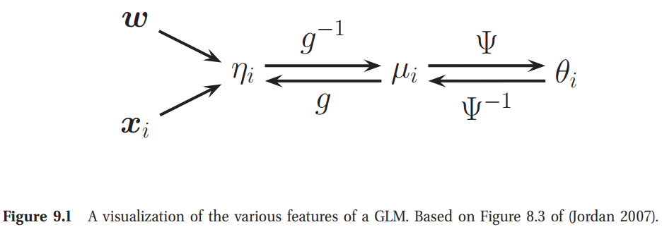

<!-- TOC -->

- [9 广义线性模型与指数族(Generalized linear models and the exponential family)](#9-广义线性模型与指数族generalized-linear-models-and-the-exponential-family)
  - [9.1 引言(Introduction)](#91-引言introduction)
  - [9.2 指数族(The exponential family)](#92-指数族the-exponential-family)
    - [9.2.1 定义(Definition)](#921-定义definition)
    - [9.2.2 例子(Examples)](#922-例子examples)
      - [9.2.2.1 伯努利(Bernoulli)](#9221-伯努利bernoulli)
      - [9.2.2.2 Multinoulli](#9222-multinoulli)
      - [9.2.2.3 单元高斯(Univariate Gaussian)](#9223-单元高斯univariate-gaussian)
    - [9.2.4 指数族的MLE(MLE for the exponential family)](#924-指数族的mlemle-for-the-exponential-family)
    - [9.2.5 指数家族的贝叶斯(Bayes for the exponential family *)](#925-指数家族的贝叶斯bayes-for-the-exponential-family-)
      - [9.2.5.1 似然(Likelihood)](#9251-似然likelihood)
      - [9.2.5.2 先验(Prior)](#9252-先验prior)
      - [9.2.5.3 后验(Posterior)](#9253-后验posterior)
      - [9.2.5.4 后验预测密度(Posterior predictive density)](#9254-后验预测密度posterior-predictive-density)
    - [9.2.6 指数家族的最大熵推导(Maximum entropy derivation of the exponential family*)](#926-指数家族的最大熵推导maximum-entropy-derivation-of-the-exponential-family)
  - [9.3 广义线性模型(Generalized linear models)(GLMs)](#93-广义线性模型generalized-linear-modelsglms)
    - [9.3.1 Basics](#931-basics)
    - [9.3.2 ML and MAP estimation](#932-ml-and-map-estimation)
    - [9.3.3 Bayesian inference](#933-bayesian-inference)
  - [9.4 Probit regression](#94-probit-regression)
    - [9.4.1 ML/MAP estimation using gradient-based optimization](#941-mlmap-estimation-using-gradient-based-optimization)

<!-- /TOC -->

# 9 广义线性模型与指数族(Generalized linear models and the exponential family)

## 9.1 引言(Introduction)

我们现在已经遇到很多概率分布：高斯，伯努利，学生t，均匀以及gamma分布等等。已经证明大多数这些分布是一类广泛分布的成员，称为**指数族**。在本章中，我们讨论这个家族的各种性质。

我们将看到我们如何轻易的使用指数族中的任意一个成员作为一个类条件密度来获生成一个生成分类器。另外，我们将讨论如何使用，其中响应变量有一个指数族分布，其均值是一个输入的线性函数；这称为一个广义线性模型，并将logistics会给的思想推广到其他类型的响应变量。

## 9.2 指数族(The exponential family)

在定义指数家族之前，我们着重讲几个为什么其重要的原因：
- 结果表明，在一定的正则条件下，指数族是唯一具有有限大小充分统计量的分布族，这意味着我们可以在不丢失信息的情况下将数据压缩成固定大小的总结。这对于在线学习特别有用，我们将在后面看到。
- 指数族是唯一存在共轭先验的分布族，它简化了后验概率的计算(见第9.2.5节)。
- 指数族可以被证明是一个分布族，它使最少的一组假设服从用户选择的约束。
- 如第9.3节所述，指数族是广义线性模型的核心。
- 如第21.2节所述，指数族是变分推理的核心。

### 9.2.1 定义(Definition)

对于$\mathbf{x} = (x_1, \cdots, x_m)\in\mathcal{X}^m$，一个pdf或pmf如果有如下形式，则说其位于指数家族中
$$\begin{aligned}
    p(\mathbf{x}|\boldsymbol{\theta}) &= \frac{1}{Z(\boldsymbol{\theta})}h(\mathbf{x})\exp [\boldsymbol{\theta}^T\boldsymbol{\phi}(\boldsymbol{\theta})]\\
    &= h(\mathbf{x})\exp[\boldsymbol{\theta}^T\boldsymbol{\phi}(\mathbf{x}) - A(\boldsymbol{\theta})]   \tag{9.2}
\end{aligned}$$

其中

$$
\begin{aligned}
    Z(\boldsymbol{\theta}) &= \int_{\mathcal{X}^m} h(\mathbf{x})\exp[\boldsymbol{\theta}^T\boldsymbol{\phi}(\mathbf{x})]d\mathbf{x}  \tag{9.3-9.4} \\
    A(\boldsymbol{\theta}) &= \log Z(\boldsymbol{\theta})   
\end{aligned}$$

这里$\boldsymbol{\theta}$称为**自然参数**或**正则参数**，$\phi(\mathbf{x})\in \mathbb{R}^d$称为充分统计的向量，$Z(\boldsymbol{\theta})$称为一个分配函数，$A(\boldsymbol{\theta})$称为对数配分函数或累积量函数，且$h(\mathbf{x})$是缩放常量，通常是1。如果$\phi(\mathbf{x})=\mathbf{x}$是自然指数家族。

方程9.2可以被推广为
$$
p(\mathbf{x}|\boldsymbol{\theta}) = h(\mathbf{x})\exp[\eta(\boldsymbol{\theta})^T\phi(\mathbf{x})-A(\eta(\theta))]  \tag{9.5}
$$

其中$\eta$是一个函数，将参数$\boldsymbol{\theta}$映射到标准参数$\boldsymbol{\eta}$。如果$\text{dim}(\boldsymbol{\theta})\lt\text{dim}(\eta(\boldsymbol{\theta}))$，称为一个曲线指数家族，其中意味着我们有比参数更多的充分统计。如果$\eta(\boldsymbol{\theta}) = \boldsymbol{\theta}$，模型称为标准形式。我们将假设模型是在一种标准形式，除非我们描述其他。

### 9.2.2 例子(Examples)
#### 9.2.2.1 伯努利(Bernoulli)

对于$x\in\{0,1\}$的伯努利，可以写成指数家族的形式，如下：
$$
\begin{aligned}
    \text{Ber}(x|\mu) &= \mu^x(1-\mu)^{1-x}\\&=\exp[x\log(\mu) + (1-x)\log(1-\mu)]\\&=\exp[\boldsymbol{\phi}(x)^T\boldsymbol{\theta}]    \tag{9.6}
\end{aligned}$$

其中$\boldsymbol{\phi}(x)=[\mathbb{I}(x=0),\mathbb{I}(x=1)]$且$\boldsymbol{\theta}=[\log(\mu), \log(1-\mu)]$。然而，由于在特征之间有严重的线性依赖性，这个表述不是很完整：
$$
\mathbf{1}^T\boldsymbol{\theta}(x) = \mathbb{I}(x=0)+\mathbb{I}(x=1)=1      \tag{9.7}
$$

因此$\boldsymbol{\theta}$不是唯一可识别的。通常要求表示是最小的，这意味着存在与分布相关联的唯一$\boldsymbol{\theta}$。这种情况下，我们只是定义
$$
\text{Ber}(x|\mu) = (1-\mu)\exp\left[ x\log\left(\frac{\mu}{1-\mu}\right) \right]           \tag{9.8}
$$

现在我们有$\phi(x)=x, \theta = \log(\frac{\mu}{1-\mu})$，这是对数几率比例，且$Z = 1/(1-\mu)$。我们可以使用
$$
\mu = \text{sigm}(\theta) = \frac{1}{1+e^{-\theta}} \tag{9.9}
$$

从标准参数中得到均值参数$\mu$。

#### 9.2.2.2 Multinoulli

我们可以将multinoulli表达为一个最小指数家族(其中$x_k=\mathbb{I}(x = k)$)
$$
\begin{aligned}
    \text{Cat}(x|\boldsymbol{\mu}) &= \prod_{k=1}^K \mu_{k}^{x_k} = \exp\left[\sum_{k=1}^{K}x_k\log\mu_k \right] \\
    &= \exp\left[\sum_{k=1}^{K-1}x_k\log\mu_k + \left(1-\sum_{k=1}^{K-1}x_k\right)\log\left(1-\sum_{k=1}^{K-1}\mu_k   \right)   \right] \\
    &= \exp\left[\sum_{k=1}^{K-1}x_k\log\left(\frac{\mu_k}{1-\sum_{j=1}^{K-1}\mu_j}\right) +\log\left(1-\sum_{k=1}^{K-1}\mu_k\right)  \right] \\
    &=\exp\left[\sum_{k=1}^{K-1}x_k\log\left( \frac{\mu_k}{\mu_K}\right) + \log\mu_K\right]     \tag{9.10-9.13}
\end{aligned}
$$

其中$\mu_K = 1 -\sum_{k=1}^{K-1}\mu_k$。我们可以将这个指数家族写成如下形式
$$
\begin{aligned}
    \text{Cat}(x|\boldsymbol{\theta}) &= \exp(\boldsymbol{\theta}^T\boldsymbol{\phi}(\mathbf{x}) - A(\boldsymbol{\theta})) \\
    \boldsymbol{\theta} &= [\log\frac{\mu_1}{\mu_K}, \cdots, \log\frac{\mu_K-1}{\mu_k}]\\
    \boldsymbol{\phi}(x) &= [\mathbb{I}(x=1), \cdots, \mathbb{I}(x=K-1)]
\end{aligned}
$$

我们可以使用如下标准参数获得均值参数
$$
\mu_k = \frac{e^{\theta_k}}{1+\sum_{j=1}^{K-1}e^{\theta_j}} \tag{9.17}
$$

从这个我们可以发现
$$
\mu_K = 1- \frac{\sum_{j=1}^{K-1}e^{\theta_j}}{1+\sum_{j=1}^{K-1}e^{\theta_j}} =\frac{1}{1-\sum_{j=1}^{K-1}e^{\theta_j}}  \tag{9.18}
$$

因此有$A(\boldsymbol{\theta}) = \log \left( 1+ \sum_{k=1}^{K-1}e^{\theta_k}  \right)$

#### 9.2.2.3 单元高斯(Univariate Gaussian)

单元高斯可以写成指数家族的形式
$$
\begin{aligned}
    \mathcal{N}(x|\mu,\sigma^2) &= \frac{1}{(2\pi\sigma^2)^{\frac{1}{2}}}\exp\left[-\frac{1}{2\sigma^2}(x-\mu)^2\right]\\
    &= \frac{1}{(2\pi\sigma^2)^{\frac{1}{2}}} \exp\left[-\frac{1}{2\sigma^2}x^2 + \frac{\mu}{\sigma^2}-\frac{1}{2\sigma^2}\mu^2\right] \\
    &= \frac{1}{Z(\boldsymbol{\theta})}\exp(\boldsymbol{\theta}^T\boldsymbol{\phi}(x))  \tag{9.20-9.22}
\end{aligned}
$$

其中
$$\begin{aligned}
    \boldsymbol{\theta} &= \begin{pmatrix}
        \mu/\sigma^2 \\
        \frac{-1}{2\sigma^2}
    \end{pmatrix} \\
     \boldsymbol{\phi}(x) &= \begin{pmatrix}
        x \\ x^2
    \end{pmatrix} \\
    Z(\mu, \sigma^2) &= \sqrt{2\pi}\sigma \exp\left[ \frac{\mu^2}{2\sigma^2}  \right] \\
    A(\boldsymbol{\theta}) &= \frac{-\theta_1^2}{4\theta_2}-\frac{1}{2}\log (-2\theta_2)-\frac{1}{2}\log(2\pi)   \tag{9.23-9.26}
\end{aligned}$$

### 9.2.4 指数族的MLE(MLE for the exponential family)

一个指数家族模型的似然的形式为
$$
p(\mathcal{D}|\boldsymbol{\theta}) = \left[ \prod_{i=1}^{N} h(\mathbf{x}_i)  \right]g(\boldsymbol{\theta})^N \exp\left( \boldsymbol{\eta}(\boldsymbol{\theta})^T\left[ \sum_{i=1}^{N}\boldsymbol{\phi}(\mathbf{x}_i)    \right]   \right)           \tag{9.41}
$$

我们看到充分统计是$N$，且
$$
\boldsymbol{\phi}(\mathcal{D}) = \left[\sum_{i=1}^{N}\phi_1(\mathbf{x}_i), \cdots, \sum_{i=1}^{N}\phi_{K}(\mathbf{x}_i)     \right]
$$

例如，对于伯努利分布，我们有$\boldsymbol{\phi}=\left[\sum_i\mathbb{I}(x_i=1) \right]$，对于单元高斯，我们有$\boldsymbol{\theta}=\left[\sum_i x_i, \sum_i x_i^2  \right]$。

**Pitman-Koopman-Darmois**定理指出，**在一定的正则性条件下，指数族是唯一具有有限充分统计量的分布族**。(这里是与数据集大小无关的有限平均值。)

这个理论中要求的一个条件是分布的支撑不依赖于参数。这种分布的一个简单例子是均匀分布
$$
p(x|\theta) = U(x|\theta) = \frac{1}{\theta}\mathbb{I}(0\leq x \leq \theta)  \tag{9.43}
$$

似然给定为
$$
p(\mathcal{D}|\boldsymbol{\theta}) = \theta^{-N}\mathbb{I}(0\leq \max\{x_i\} \leq \theta)   \tag{9.44}
$$

充分统计为$N$与$s\mathcal{D}=\max_i x_i$。这是一个有限的规模，但是均匀分布不是指数族，因为它的支持集$\mathcal{X}$，依赖于参数。

我们现在讨论如何计算一个标准指数族模型的MLE。给定$N$个独立同分布(iid)的数据点$\mathcal{D} = (x_1, \cdots, x_N)$，似然为
$$
\log p(\mathcal{D}|\boldsymbol{\theta}) = \boldsymbol{\theta}^T\boldsymbol{\phi}(\mathcal{D})-NA(\boldsymbol{\theta})   \tag{9.45}
$$

因为$-A(\boldsymbol{\theta})$关于$\boldsymbol{\theta}$是凹的，且$\boldsymbol{\theta}^T\boldsymbol{\phi}(\mathcal{D})$是关于$\boldsymbol{\theta}$线性的。为了获得最大值，我们使用一个事实，即对数分割函数的导数产生了成分统计向量的期望值：
$$
\nabla_{\boldsymbol{\theta}} \log p(\mathcal{D}|\boldsymbol{\theta}) = \boldsymbol{\phi}(\mathcal{D}) - N\mathbb{E}[\boldsymbol{\phi}(\mathbf{X})]  \tag{9.46}
$$

设定梯度为0，我们看到在MLE，成分统计的经验平均必须等于模型的理论期望充分统计；也就是$\hat{\boldsymbol{\theta}}$必须满足
$$
\mathbb{E}[\boldsymbol{\phi}(\mathbf{X})] = \frac{1}{N}\sum_{i=1}^{N}\boldsymbol{\phi}(\mathbf{x}_i)        \tag{9.47}
$$

这称为**阶距匹配**。例如，在伯努利分布中，我们有$\phi(X)=\mathbb{I}(X=1)$，所以MLE满足
$$
\mathbb{E}[\phi(X)] = p(X=1) = \hat{\mu}=\frac{1}{N}\sum_{i=1}^{N}\mathbb{I}(x_i=1) \tag{9.48}
$$

### 9.2.5 指数家族的贝叶斯(Bayes for the exponential family *)

我们已经看到，如果先验是与似然共轭的，那么准确的Bayesian分析是非常简单的。非正式的是，这意味着先验$p(\boldsymbol{\theta}|\boldsymbol{\tau})$与似然$p(\mathcal{D}|\boldsymbol{\theta})$有相同的形式。为了使得这个有意义，我们需要似然有有限的充分统计，所以我们可以写为$p(\mathcal{D}|\boldsymbol{\theta}) = p(\mathbf{s}(\mathcal{D})|\boldsymbol{\theta})$。这个证明只有那些共轭先验存在的分布族才是指数族。我们将得出如下先验与后验形式。

#### 9.2.5.1 似然(Likelihood)

指数族的似然给定为
$$
p(\mathcal{D}|\boldsymbol{\theta}) \propto g(\boldsymbol{\theta})^N\exp(\boldsymbol{\eta}(\boldsymbol{\theta})^T \mathbf{s}_N)      \tag{9.49}
$$

其中$\mathbf{s}_N=\sum_{i=1}^{N}\mathbf{s}(\mathbf{x}_i)$。根据标准参数项，这变为了
$$
p(\mathcal{D}|\boldsymbol{\eta}) \propto \exp(N\boldsymbol{\eta}^T\bar{\mathbf{s}}-NA(\boldsymbol{\eta}))   \tag{9.50}
$$

其中$\bar{\mathbf{s}} = \frac{1}{N}\mathbf{s}_N$。

#### 9.2.5.2 先验(Prior)

自然共轭先验的形式为
$$
p(\boldsymbol{\theta}|v_0, \boldsymbol{\tau}_0) \propto g(\boldsymbol{\theta})^{\nu_0}\exp(\boldsymbol{\eta}^T\boldsymbol{\tau}_0)    \tag{9.51}
$$
为了将先验伪数据$\nu_0$从这个伪数据$\bar{\boldsymbol{\tau}}_0$上的充分统计的均值中分离出来，我们写$\boldsymbol{\tau}_0 = \nu_0\bar{\boldsymbol{\tau}}_0$。在标准形式中，先验变为
$$
p(\boldsymbol{\eta}\vert\nu_0,\bar{\boldsymbol{\tau}}_0)\propto\exp(\nu_0\boldsymbol{\eta}^T\bar{\boldsymbol{\tau}}_0-\nu_0A(\boldsymbol{\eta}))       \tag{9.52}
$$

#### 9.2.5.3 后验(Posterior)

后验给定为
$$
p(\boldsymbol{\theta}\vert\mathcal{D}) = p(\boldsymbol{\theta}\vert\nu_N,\boldsymbol{\tau}_N) = p(\boldsymbol{\theta}\vert\nu_0+N,\boldsymbol{\tau}_0+\mathbf{s}_N) \tag{9.53}
$$
所以我们看到，我们通过添加来更新超参。在标准形式中，这个变为
$$
\begin{aligned}
    p(\boldsymbol{\theta}\vert\mathcal{D}) &\propto\exp(\boldsymbol{\eta}^T(\nu_0\bar{\boldsymbol{\tau}}_0-N\bar{\mathbf{s}})-(\nu_0+N)A(\boldsymbol{\eta}))  \\
    &= p(\boldsymbol{\eta}\vert\nu_0+N,\frac{\nu_0\bar{\boldsymbol{\tau}}_0-N\bar{\mathbf{s}}}{\nu_0+N})
\end{aligned}
$$
所以，我们看到后验超参是先验均值超参与充分统计的平均的凸组合。

#### 9.2.5.4 后验预测密度(Posterior predictive density)

在给定过去的数据集$\mathcal{D}=(\mathbf{x}_1, \cdots,\mathbf{x}_N)$，我们得出未来观测的$\mathcal{D}^{\prime}=(\tilde{\mathbf{x}}_1, \cdots,\tilde{\mathbf{x}}_{N^{\prime}})$。为了符号简化，我们将数据的规模与充分统计，得到$\tilde{\boldsymbol{\tau}}_0=(\nu_0,\boldsymbol{\tau}0)$，

### 9.2.6 指数家族的最大熵推导(Maximum entropy derivation of the exponential family*)

虽然指数族很方便，但它的使用是否有更深层的理由？事实证明，这是存在的：正是这种分布使得对数据的假设次数最少，并受一组特定的用户指定约束的约束，正如我们下面解释的那样。特别是，假设我们只知道某些特性或函数的期望值：
$$
\sum_{\mathbf{x}}f_k(\mathbf{x})p(\mathbf{x})=F_k\tag{9.71}
$$
其中$F_k$是已知的常数，且$f_k(\mathbf{x})$是一个人任意函数。最大熵原理(maxent)说，我们应该选择最大熵的分布(最接近均匀分布)，并受**分布矩**与指定函数的**经验矩**相匹配的约束。

为了最大化受方程9.71约束的熵，且约束$p(\mathbf{x})\geq0$与$\sum_{\mathbf{x}}=p(\mathbf{x})=1$，我们需要使用拉格朗日乘子。拉格朗日给定为
$$
\begin{aligned}
    J(p,\boldsymbol{\lambda})&=-\sum_{\mathbf{x}}p(\mathbf{x})\log p(\mathbf{x})+\lambda_0(1-\sum_{\mathbf{x}}p(\mathbf{x}))\\
    &+\sum_{k}(F_k-\sum_{\mathbf{x}}p(\mathbf{x}f_k(\mathbf{x}))) \tag{9.72}
\end{aligned}
$$

我们可以使用积分变分来求函数相对$p$的导数，但是我们将采用一种更简单的方法且将$p$看作一个固定长度的向量。那么我们有
$$
\frac{\partial J}{\partial p(\mathbf{x})} = -1 - \log p(\mathbf{x}) - \lambda_0 - \sum_{k}\lambda_k f_k(\mathbf{x}) \tag{9.73}
$$
令其为0，得到
$$
p(\mathbf{x}) = \frac{1}{Z}\exp(-\sum_{k}\lambda_k f_k(\mathbf{x})) \tag{9.74}
$$
其中$Z=e^{1+\lambda_0}$。使用和为1的约束，我们有
$$
1=\sum_{\mathbf{x}}p(\mathbf{x}) = \frac{1}{Z}\sum_{\mathbf{x}}\exp(-\sum_{\mathbf{x}}\lambda_kf_k(\mathbf{x})) \tag{9.75}
$$
因此归一化约束给定为
$$
Z=\sum_{\mathbf{x}}\exp(-\sum_{\mathbf{x}}\lambda_kf_k(\mathbf{x})) \tag{9.76}
$$

## 9.3 广义线性模型(Generalized linear models)(GLMs)

线性与对数几率回归是广义线性模型的例子。这些模型的输出密度是指数族，均值参数是输入的线性组合，最后传入如对数几率函数这样的非线性函数。

### 9.3.1 Basics

为了理解GLMs，我们首先考虑一个标量响应的一个非条件分布的情况，
$$
p(y_i\vert\theta,\sigma^2)=\exp\left[ \frac{y_i\theta-A(\theta)}{\sigma^2} + c(y_i,\sigma^2)  \right]       \tag{9.77}
$$
其中$\sigma^2$是离散参数，$\theta$是自然参数，$A$是分割参数，$c$是归一化常量。例如，在logistics回归情况中，$\theta$是对数几率比例，$\theta=\log\left(\frac{\mu}{1-\mu}\right)$，其中$\mu=\mathbb{E}[y]=p(y=1)$是均值参数。为了将均值参数转换到自然参数，我们使用一个函数$\psi$，所以$\theta=\Psi(\mu)$。这个函数由指数族分布的形式唯一确定。事实上，这是一个可逆映射，所以我们有$\mu=\Psi^{-1}(\theta)$。而且，我们知道从9.2.3节，均值给定为分割函数的导数，有$\mu=\Psi^{-1}(\theta)=A^{\prime}(\theta)$。

Distribution | Link$g(\mu)$ | $\theta=\psi(\mu)$ | $\mu=\psi^{-1}(\theta)=\mathbb{E}[y]$ 
-|-|-|- 
$\mathcal{N}(\mu,\sigma^2)$ | 恒等变换 | $\theta=\mu$  | $\mu=\theta$
$\text{Bin}(N,\mu)$ | 对数几率变换 | $\log\left(\frac{\mu}{1-\mu}\right)$  | $\mu=\text{sigm}(\theta)$
$\text{Poi}(\mu)$ | 对数变换 | $\log\left(\mu\right)$  | $\mu=e^\theta$

我们现在添加输入与协变量。首先定义一个输入的线性函数
$$
\eta_i=\mathbf{w}^T\mathbf{x}_i     \tag{9.78}
$$
我们现在取分布的均值为这个线性组合的一些可逆单调函数。这个函数称为均值函数，记为$g^{-1}$，所以
$$
\mu_i=g^{-1}(\eta_i)=g^{-1}(\mathbf{w}^T\mathbf{x}_i)
$$

均值函数的逆为链接函数，也就是$g()$。

链接函数的一个特殊简单的形式是使用$g=\psi$;这个称为标准链接函数。这种情况下，$\theta_i=\eta_i=\mathbf{w}^T\mathbf{x}$，所以模型称为
$$
p(y_i\vert\mathbf{x}_i, \mathbf{w}, \sigma^2)=\exp\left[ \frac{y_i\mathbf{w}^T\mathbf{x}_i-A(\mathbf{w}^T\mathbf{x}_i)}{\sigma^2} + c(y_i,\sigma^2)  \right]       \tag{9.80}
$$
表中，我们列了一些分布对应的标准链接函数。我们看到对于Bernoulli/binomial分布，标准链接函数是logit函数，$g(\mu)=\log(\eta/(1-\eta))$，其逆为logistics函数$\mu=\text{sigm}(\eta)$。

- 对于线性回归，我们有
  $$
    \log p(y_i\vert\mathbf{x}_i, \mathbf{w}, \sigma^2) = \frac{y_i\mu_i-\frac{\mu_i}{2}}{\sigma^2} - \frac{1}{2}\left(\frac{y_i^2}{\sigma^2}+\log(2\pi\sigma^2)\right) \tag{9.83}
  $$
  其中$y_i\in\mathbb{R}$，$\theta_i=\mu_i=\mathbf{w}^T\mathbf{x}$。这里$A(\theta)=\theta^2/2$。所以，$\mathbb{E}[y_i]=\mu_i$且$\text{var}[y_i]=\sigma^2$
- 对于binomial回归，我们有
  $$
    \log p(y_i\vert\mathbf{x}_i, \mathbf{w}) = y_i\log\left( \frac{\pi_i}{1-\pi_i}+N_i\log(1-\pi_i)+\log\begin{pmatrix}
        N_i \\ y_i
    \end{pmatrix} \right) \tag{9.84}
  $$
  其中$y_i\in\{0,1,2,\cdots\}$，$\mu_i=\mathbf{w}^T\mathbf{x}_i,\theta_i=\log(\mu_i)=\mathbf{w}^T\mathbf{x},\sigma^2=1$。这里$A(\theta)=e^\theta$，所以$\mathbb{E}[y_i]=\text{var}[y_i]=\mu_i$。

### 9.3.2 ML and MAP estimation

GLM的吸引人的特性之一是，可以使用与用于拟合逻辑回归的方法完全相同的方法来拟合它们。对数函数为
$$
\begin{aligned}
  \ell(\mathbf{w}) =\log p(\mathcal{D}\vert\mathbf{w})  &= \frac{1}{\sigma^2}\sum_{i=1}^N\ell_i \\
  \ell_i &\triangleq \theta_iy_i-A(\theta_i)\tag{9.87}
\end{aligned}
$$
我们可以使用链式法则计算梯度向量
$$
\begin{aligned}
  \frac{d\ell_i}{dw_j} &= \frac{d\ell_i}{d\theta_i}\frac{d\theta_i}{d\mu_i}\frac{d\mu_i}{d\eta_i}\frac{d\eta_i}{dw_j} \\
  &= (y_i-A^{\prime}(\theta_i))\frac{d\theta_i}{d\mu_i}\frac{d\mu_i}{d\eta_i}x_{ij} \\
  &= (y_i-\mu_i)\frac{d\theta_i}{d\mu_i}\frac{d\mu_i}{d\eta_i}x_{ij}  \tag{9.90}
\end{aligned}
$$
如果使用一个标准链接$\theta_i=\eta_i$，简化为
$$
\nabla_{\mathbf{w}}\ell(\mathbf{w}) = \frac{1}{\sigma^2}\left[ \sum_{i=1}^N(y_i-\mu_i)\mathbf{x}_i \right]  \tag{9.91}
$$
这是输入向量的一个和，权重为误差。这个可以在一个随机梯度下降过程中使用。然而，为了提高效率，我们应该使用一种二阶方法。如果我们使用一个标准链接，Hessian给定为
$$
\mathbf{H}=-\frac{1}{\sigma^2}\sum_{i=1}^N\frac{d\theta_i}{d\mu_i}\mathbf{x}_i\mathbf{x}_i^T=-\frac{1}{\sigma^2}\mathbf{X}^T\mathbf{SX}\tag{9.92}
$$
其中$\mathbf{X}=\text{diag}(\frac{d\theta_1}{d\mu_1},\cdots,\frac{d\theta_N}{d\mu_N})$是一个对角权重矩阵。具体的，我们有如下的牛顿更新
$$
\begin{aligned}
  \mathbf{w}_{t+1} &= (\mathbf{X}^T\mathbf{S_tX})^{-1}\mathbf{X}^T\mathbf{S}_t\mathbf{z}_t \\
  \mathbf{z}_t &= \boldsymbol{\theta}_t+\mathbf{S}_t^{-1}(\mathbf{y}-\boldsymbol{\mu}_t)  \tag{9.94}
\end{aligned}
$$
其中$\boldsymbol{\theta}_t=\mathbf{Xw}_t,\boldsymbol{\mu}_t=g^{-1}(\boldsymbol{\eta}_t)$

如果我们将推导扩展到处理非规范连接，我们会发现Hessian还有另一个项。然而，结果表明，期望的Hessian与等式9.92中的相同；使用期望的Hessian（称为Fisher信息矩阵）而不是实际的Hessian被称为Fisher评分法。

修改上述程序以使用高斯先验进行MAP估计很简单：我们只需修改目标、梯度和黑森函数，就像我们在第8.3.6节中为logistic回归添加了 2正则化一样。

### 9.3.3 Bayesian inference

GLMs的贝叶斯推理通常使用MCMC进行（第24章）。可能的方法包括基于IRLS的方法的Metropolis-Hastings（Gamerman 1997），每个完整条件下使用自适应拒绝抽样（ARS）的Gibbs抽样（Dellaportas和Smith 1993）等。参见例如（Dey等人2000年）。也可以使用高斯近似（第8.4.1节）或变分推断（第21.8.1.1节）。

## 9.4 Probit regression

### 9.4.1 ML/MAP estimation using gradient-based optimization
我们可以使用标准梯度方法来寻找probit回归的MLE。令$\mu_i=\mathbf{w}^T\mathbf{x}_i,\tilde{y}_i\in\{-1,+1\}$。那么具体情况的对数似然的梯度给定为
$$
\mathbf{g}_i \triangleq \frac{d}{d\mathbf{w}}\log p(\tilde{y}_i\vert \mathbf{w}^T\mathbf{x}_i)=\frac{d\mu_i}{d\mathbf{w}}\frac{d}{d\mu_i}\log p(\tilde{y}_i\vert \mathbf{w}^T\mathbf{x}_i) = \mathbf{x}_i \frac{\tilde{y}_i\phi(\mu_i)}{\Phi(\tilde{y}_i\mu_i)}   \tag{9.95}
$$
其中$\phi$是标准的正态pdf，$\Phi$是他的cdf。类似的，单个情况的Hessian给定为
$$
\mathbf{H}_i = \frac{d}{d\mathbf{w}^2}\log p(\tilde{y}_i\vert \mathbf{w}^T\mathbf{x}_i) = -\mathbf{x}_i \left(\frac{\phi(\mu_i)^2}{\Phi(\tilde{y}_i\mu_i)^2}+\frac{\tilde{y}_i\mu_i\phi(\mu_i)}{\Phi(\tilde{y}_i\mu_i)}\right)\mathbf{x}_i^T \tag{9.96}
$$